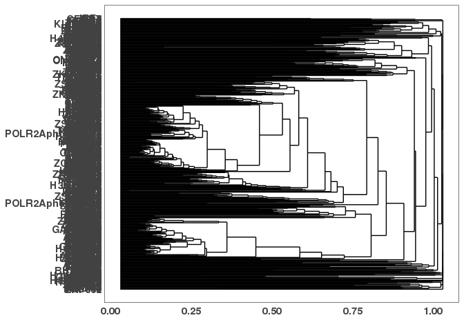

final\_class\_project
================
Jessica Song
4/25/2023

\#Set up your environment

\#Setting things up for analysis \#\#Create consensus peaks from
ChIP-Seq data

``` r
# Import files and get a list of peaks (peak_list)
broadpeakfilepath <- "/scratch/Shares/rinnclass/CLASS_2023/data/data/peaks"
peak_list <- import_peaks(consensus_file_path = broadpeakfilepath)
# Print out a table of the number of peaks in each file (peak_num and num_peaks_df - dbp, replicate, number of peaks)
peak_num <- sapply(peak_list, length) %>% as.data.frame(row.names = T)
```

    ## Warning in as.data.frame.integer(., row.names = T): 'row.names' is not a
    ## character vector of length 1064 -- omitting it. Will be an error!

``` r
names(peak_num) <- c("number_of_peaks")
peak_num <- peak_num %>%
  rownames_to_column(var = "dbp") %>%
  separate(col = dbp,  into = c('dbp', 'replicate'), sep = "_")
write_csv(peak_num, "analysis/01_consensus_peaks/results/num_peaks_df.csv")
# Create a list of number of consensus peaks for each protein (peak_num)
dbps <- unique(sapply(names(peak_list), function(x) {
   unlist(strsplit(x, "_"))[1]
}))
consensus_list <- lapply(dbps, consensus_from_reduced, peak_list)
names(consensus_list) <- dbps
sapply(consensus_list, length)
```

    ##            ADNP            AFF4           AHDC1             AHR           AKAP8 
    ##            6110           16581           13416           25233           35576 
    ##            AKNA          ARID3A          ARID4A          ARID4B          ARID5B 
    ##             600           23119           23712           53026           82378 
    ##           ARNTL           ASH2L          ATAD3A            ATF2            ATF3 
    ##           24991            5675           27820           35051            2807 
    ##            ATF5            ATF6            ATF7            ATRX            BCL3 
    ##           11227           18550           22283             476           37417 
    ##            BCL6         BHLHE40           BRCA1            BRD4          CAMTA2 
    ##           63350            1132            1002             370            2030 
    ##            CBFB            CBX5           CEBPA           CEBPB           CEBPD 
    ##           25969           50983           81114           12195           42745 
    ##           CEBPG           CEBPZ           CERS6            CHD2           CREB3 
    ##           70414             172            1167            8296            4382 
    ##            CREM            CTCF             DBP           DDIT3            DLX6 
    ##            1694           28702            1787            2344           19392 
    ##           DMAP1           DMTF1           DNMT1            DPF2           DRAP1 
    ##           25584            4305           37871           21979           33644 
    ##           DZIP1            E2F1            E2F2            E2F4            E2F5 
    ##            7663            7011            1791           17516           16606 
    ##            EEA1             EED            EGR1            ELF1            ELF3 
    ##            9316           13742           56227           11831           60538 
    ##            ELF4            ELK1           EP300             ERF           ESRRA 
    ##            2270            7935             563           50738           26762 
    ##            ETS1            ETV5            ETV6            EZH2           FOSL2 
    ##            3528           42629           27358            9043           23001 
    ##           FOXA1           FOXA2           FOXA3           FOXJ3           FOXK1 
    ##           14965           14470           68309            5472           24205 
    ##           FOXM1           FOXO1           FOXP1           FOXP4           FUBP1 
    ##            2555           55014           28230           38380            6738 
    ##           FUBP3           GABPA          GABPB1           GATA2          GATAD1 
    ##            9789            4843           39495           19752           44794 
    ##         GATAD2A            GLI4           GMEB1           GMEB2         GPBP1L1 
    ##           82689           18785           18600            4847               2 
    ##            GPN1          GTF2F1           GTF3A            GZF1           H2AFZ 
    ##            8778            1650            4180           16615           12498 
    ##         H3K27ac        H3K27me3        H3K36me3         H3K4me1         H3K4me2 
    ##           29002             140            2577           85576           56196 
    ##         H3K4me3        H3K79me2          H3K9ac         H3K9me3        H4K20me1 
    ##           13088           73525           23816           39052            7454 
    ##           HCFC1           HDAC1           HDAC2           HINFP          HIVEP1 
    ##            5456           31327           25288           21671           88850 
    ##          HMG20A          HMG20B           HMGA1          HMGXB3          HMGXB4 
    ##           37968           29737               4           34763           21719 
    ##           HNF1A           HNF1B           HNF4A           HNF4G           HOMEZ 
    ##           23842           43457           30380            6909           51414 
    ##           HOXA3           HOXA5           HOXD1            HSF2           IKZF4 
    ##           43971           23468           14208            2075           21403 
    ##           IKZF5            IRF1            IRF2            IRF3            IRF5 
    ##           33989            4606           55630             188           12618 
    ##            ISL2             ISX             JUN            JUND           KAT2B 
    ##           29421            2063            3504           14653             761 
    ##            KAT7            KAT8           KDM1A           KDM2A           KDM3A 
    ##           27325           47884            2149           64435           27470 
    ##           KDM4B           KDM5B           KDM6A        KIAA2018           KLF11 
    ##           34154           21951           14475             391           30009 
    ##           KLF12           KLF13           KLF16            KLF6            KLF9 
    ##           11881           35101           45400           32043           14599 
    ##           KMT2A           KMT2B            LBX2            LCOR           LCORL 
    ##           36860           34534           16734           38234           45502 
    ##           LIN54         LRRFIP1            MAF1            MAFF            MAFG 
    ##           27805            4984            5178           52902            1553 
    ##            MAFK           MATR3             MAX             MAZ            MBD4 
    ##           47481           13451           10191           10086             343 
    ##            MED1           MED13           MEF2A           MEF2D           MIER2 
    ##            8725            9096           15531           34782           43316 
    ##           MIER3           MIXL1          MLLT10             MLX            MNX1 
    ##           30745           52140             175           20181           38320 
    ##            MTA1            MTA3            MTF1            MTF2            MXD1 
    ##           15075             652             644            2565           17500 
    ##            MXD3            MXD4            MXI1           MYBL2            MYNN 
    ##           32084           35153            4072             119           22979 
    ##            MYRF           NAIF1           NCOA5           NFAT5          NFATC3 
    ##           21151            2066             178           17353           12762 
    ##            NFE2          NFE2L1          NFE2L2            NFIA            NFIC 
    ##             333           10019            5548           45414            3391 
    ##           NFIL3           NFKB2          NFKBIZ            NFYA            NFYB 
    ##           58708           12190           30221           13936           22098 
    ##            NFYC          NKX3-1           NR0B2           NR2C2           NR2F1 
    ##           19688            9511           26906           23388           15919 
    ##           NR2F6           NR3C1           NR5A1            NRF1             NRL 
    ##           47323             472           21713            1258           95129 
    ##         ONECUT1         ONECUT2            PAF1           PATZ1            PAWR 
    ##           41587            8393           29649           54876            1408 
    ##          PAXIP1           PHF20          PHF21A           PHF5A            PHF8 
    ##           49678           11538           15927           65682           28806 
    ##           PITX1          PLSCR1            POGZ          POLR2A POLR2AphosphoS2 
    ##           42484             534           34690            4566           34250 
    ## POLR2AphosphoS5           PPARG          PRDM10          PRDM15            PREB 
    ##           49841           45897           37662            7616            1372 
    ##           RAD21            RARA            RARG            RBAK            RBPJ 
    ##           29774           65965            1883           14179           37596 
    ##           RCOR1           RCOR2            RELA            RERE            REST 
    ##            8964           42459           21680           16218            3845 
    ##            RFX3            RFX5          RFXANK           RFXAP          RNF219 
    ##            6807            7880           17877           10387             233 
    ##            RORA           RREB1            RXRA            RXRB           SAFB2 
    ##              62           35592           12628           50713           18185 
    ##          SAP130           SATB2          SETDB1            SFPQ           SIN3A 
    ##           63458            5187             438           23291            9538 
    ##           SIN3B            SIX1            SIX4           SMAD1           SMAD3 
    ##            5346           16821           22163            6175           40049 
    ##           SMAD4           SMAD9            SMC3           SNAI1          SNAPC4 
    ##           61730           19639           23419            4309            5829 
    ##           SOX13           SOX18            SOX6             SP1          SP140L 
    ##           64098           19232           45980             956           14713 
    ##             SP2             SP5            SPEN             SRF           STAG1 
    ##             614           27540           28755            3522           57792 
    ##          STAT5B           STAT6           SUZ12            TAF1         TBL1XR1 
    ##            9399            4306            1190           13708           12142 
    ##             TBP            TBX2           TCF12            TCF3          TCF7L2 
    ##            7982           26600             266            6463            1523 
    ##           TEAD1           TEAD3           TEAD4             TEF           TFAP4 
    ##           57726           53534             762            4151           62296 
    ##           TFDP1           TFDP2            TFE3          THAP11           THAP8 
    ##           15219           25977           38436           53173            1133 
    ##           THAP9            THRA            THRB           TIGD3           TIGD6 
    ##           55784           44535           12293            3692           29702 
    ##            TOE1            TP53          TRAFD1         TSC22D2            UBTF 
    ##           14823            2996            7577           19838           31495 
    ##            USF1            USF2             WIZ            XBP1          YEATS2 
    ##            8576            3060           11969            1045           16156 
    ##          YEATS4             YY1           ZBED4           ZBED5           ZBTB1 
    ##           15890           10094           29769           28817            1804 
    ##          ZBTB10          ZBTB14          ZBTB21          ZBTB24          ZBTB25 
    ##            4459            6897           18270            3726           39504 
    ##          ZBTB26           ZBTB3          ZBTB33          ZBTB38          ZBTB39 
    ##           64028             114             733           96052            4661 
    ##           ZBTB4          ZBTB42          ZBTB43          ZBTB44          ZBTB46 
    ##            1138            6747           17264           10937            2516 
    ##          ZBTB49          ZBTB7A          ZBTB7B          ZBTB8A           ZC3H4 
    ##            7698           10377           40280             775           11862 
    ##           ZC3H8         ZCCHC11            ZFP1           ZFP14           ZFP36 
    ##            6082           28375            2042            2251             275 
    ##         ZFP36L2           ZFP37           ZFP41           ZFP62           ZFP64 
    ##            8628            8882           15224             202           23260 
    ##           ZFP82             ZFY           ZGPAT            ZHX3            ZIK1 
    ##            1552           24482           47576            7698           19444 
    ##         ZKSCAN1         ZKSCAN5         ZKSCAN8           ZMAT5           ZMYM3 
    ##            7953           10274           24861              79           11254 
    ##           ZNF10          ZNF101           ZNF12          ZNF124          ZNF138 
    ##              64             478           15373           32792            7507 
    ##          ZNF142          ZNF143           ZNF17          ZNF180           ZNF20 
    ##           13954           11765             226             266             988 
    ##          ZNF205          ZNF217          ZNF224          ZNF225          ZNF230 
    ##           40983           39937            3190           64991           15397 
    ##          ZNF232          ZNF234           ZNF25          ZNF256          ZNF260 
    ##            6306            1420            4499            5278             146 
    ##          ZNF263          ZNF264          ZNF274          ZNF276         ZNF280B 
    ##           33508           16786           34668           31362          144678 
    ##         ZNF280D          ZNF281          ZNF296           ZNF30          ZNF317 
    ##           20359           15086           18684            1998           19838 
    ##          ZNF318          ZNF326          ZNF331          ZNF333          ZNF335 
    ##           51465            8699           55938            8260           40633 
    ##          ZNF337          ZNF33A          ZNF33B           ZNF34          ZNF343 
    ##            1880             315           25290            9127           13384 
    ##          ZNF350          ZNF362          ZNF367          ZNF382          ZNF383 
    ##           59481           13083             527              19            2110 
    ##          ZNF384          ZNF407          ZNF414          ZNF432           ZNF44 
    ##           19881          104405           17931             261            4258 
    ##          ZNF446          ZNF451          ZNF460           ZNF48          ZNF483 
    ##            4654           23811           12048             155           21739 
    ##          ZNF484          ZNF485          ZNF490          ZNF501          ZNF503 
    ##             189            7377            2320           57231           11361 
    ##          ZNF510          ZNF511          ZNF512         ZNF512B          ZNF513 
    ##            9838           33878            3869            9923            1903 
    ##          ZNF526          ZNF530          ZNF543          ZNF547          ZNF548 
    ##            7940             862           19932           31668           14006 
    ##          ZNF549          ZNF550          ZNF556          ZNF557          ZNF569 
    ##             593           35410           24882            6299             321 
    ##          ZNF570          ZNF572          ZNF574          ZNF576          ZNF577 
    ##             954           50416           45718            6638             238 
    ##          ZNF580          ZNF597          ZNF598          ZNF607          ZNF608 
    ##           35919             222           25518           18555            8489 
    ##          ZNF609          ZNF614          ZNF615          ZNF616          ZNF619 
    ##           14589           38740             407           15953           38671 
    ##          ZNF629          ZNF639          ZNF644          ZNF652          ZNF660 
    ##           36028           21764           44254           16866            3980 
    ##          ZNF674          ZNF678          ZNF687          ZNF691          ZNF697 
    ##            2305            6339           91307           27687           20240 
    ##            ZNF7          ZNF703          ZNF707          ZNF709          ZNF710 
    ##              49             571             565           10586           19660 
    ##          ZNF713          ZNF720          ZNF737          ZNF740          ZNF761 
    ##            7029           11912           12215            8712           18373 
    ##          ZNF766          ZNF768          ZNF772          ZNF773          ZNF775 
    ##            5208           49676           15364            2027            3324 
    ##          ZNF776          ZNF777          ZNF778          ZNF781          ZNF782 
    ##            8674           15341             599           25603           21534 
    ##          ZNF784          ZNF786          ZNF788          ZNF792          ZNF800 
    ##           29366           33504           11452           36305           17502 
    ##           ZNF83          ZNF839          ZNF883          ZNF891         ZSCAN20 
    ##            5452            5770           35180           62647            8212 
    ##         ZSCAN22         ZSCAN29         ZSCAN31          ZSCAN9            ZXDC 
    ##            4248           19398           15581           38233            2239 
    ##            ZZZ3 
    ##            9305

``` r
num_consensus_peaks <- sapply(consensus_list, length) %>% 
  as.data.frame() %>%
  rownames_to_column( var = "dbp") %>%
  dplyr::rename(num_consensus_peaks = ".")
peak_num <- left_join(peak_num, num_consensus_peaks)
```

    ## Joining with `by = join_by(dbp)`

``` r
write_csv(peak_num, "analysis/01_consensus_peaks/results/num_peaks_df.csv")
# Export consensus peaks to results folder
basepath <- "/scratch/Shares/rinnclass/CLASS_2023/jeso3380"
consensus_path <- "CLASS_2023/CLASSES/07_final_class_project/analysis/01_consensus_peaks/results/consensus_peak_files/"
exportpath <- file.path(basepath, consensus_path)
for(i in 1:length(consensus_list)) {
rtracklayer::export(consensus_list[[i]], paste0(exportpath, names(consensus_list)[i], "_consensus_peaks.bed") )}
```

\#\#How do the consensus peaks from ChIP-Seq overlap with features of
the genome?

``` r
# Set up
peak_path <- "/CLASS_2023/CLASSES/07_final_class_project/analysis/01_consensus_peaks/results/consensus_peak_files"
consensusPeakPath <- file.path(basepath, peak_path)

# Create the file list (set up)
consensus_peak_files <- list.files(consensusPeakPath, 
                                             pattern = "*.bed",
                                             full.names = TRUE)
# Make Granges, add DBP names, clean up the file names
consensus_peaks <- lapply(consensus_peak_files, rtracklayer::import)
names(consensus_peaks) <- gsub("/scratch/Shares/rinnclass/CLASS_2023/jeso3380//CLASS_2023/CLASSES/07_final_class_project/analysis/01_consensus_peaks/results/consensus_peak_files/|_consensus_peaks.bed","", consensus_peak_files)

# Load in gencode and get a list of mRNA and lncRNA genes
gencode_gr <- rtracklayer::import("/scratch/Shares/rinnclass/CLASS_2023/data/data/genomes/gencode.v32.annotation.gtf")
gencode_genes <- gencode_gr[gencode_gr$type == "gene"] 
## List of genes
rtracklayer::export(gencode_genes, "/scratch/Shares/rinnclass/CLASS_2023/jeso3380/CLASS_2023/CLASSES/07_final_class_project/analysis/02_peak_features/gene_annotations/gencode_genes.gtf")
## List of mRNA/protein coding genes
mrna_genes <- gencode_genes[gencode_genes$gene_type %in% "protein_coding"] 
rtracklayer::export(mrna_genes, "/scratch/Shares/rinnclass/CLASS_2023/jeso3380/CLASS_2023/CLASSES/07_final_class_project/analysis/02_peak_features/gene_annotations/mrna_genes.gtf")
## List of lncRNA genes
lncrna_genes <- gencode_genes[gencode_genes$gene_type %in% "lncRNA"] 
rtracklayer::export(lncrna_genes, "/scratch/Shares/rinnclass/CLASS_2023/jeso3380/CLASS_2023/CLASSES/07_final_class_project/analysis/02_peak_features/gene_annotations/lncrna_genes.gtf")
## Combined list of mRNA and lncRNA genes
mrna_lncrna_genes <- gencode_genes[gencode_genes$gene_type %in% c("protein_coding","lncRNA")]
rtracklayer::export(mrna_lncrna_genes, "/scratch/Shares/rinnclass/CLASS_2023/jeso3380/CLASS_2023/CLASSES/07_final_class_project/analysis/02_peak_features/gene_annotations/mrna_lncrna_genes.gtf")
# Create an annotation file for mRNA and lncRNA genes and set it up as a data frame
lncrna_mrna_genes <- rtracklayer::import("/scratch/Shares/rinnclass/CLASS_2023/jeso3380/CLASS_2023/CLASSES/07_final_class_project/analysis/02_peak_features/gene_annotations/mrna_lncrna_genes.gtf")
lncrna_mrna_genes_df <- lncrna_mrna_genes %>% as.data.frame()
# Create an annotation file for promoters of mRNA and lncRNA genes. Here I'll define promoters as 1kb upstream and downstream from the TSS. 
lncrna_mrna_promoters <- promoters(lncrna_mrna_genes, upstream = 1000, downstream = 1000)
rtracklayer::export(lncrna_mrna_promoters, "/scratch/Shares/rinnclass/CLASS_2023/jeso3380/CLASS_2023/CLASSES/07_final_class_project/analysis/02_peak_features/gene_annotations/lncrna_mrna_promoters.gtf")
lncrna_gene_ids <- mrna_lncrna_genes$gene_id[mrna_lncrna_genes$gene_type == "lncRNA"]
table(mrna_lncrna_genes$gene_type)
```

    ## 
    ##         lncRNA protein_coding 
    ##          16849          19965

``` r
mrna_gene_ids <-mrna_lncrna_genes$gene_id[mrna_lncrna_genes$gene_type == "protein_coding"]
```

\#\#How many proteins bind a specific promoter?

``` r
# Create a data frame that shows the number of proteins bound to a specific promoter
promoter_peak_occurence <- count_peaks_per_feature(lncrna_mrna_promoters, consensus_peaks, 
                                               type = "occurrence")
stopifnot(all(colnames(promoter_peak_occurence) == lncrna_mrna_promoters$gene_id))
write.table(promoter_peak_occurence, "analysis/02_peak_features/results/lncrna_mrna_promoter_peak_occurence_matrix.tsv")
peak_occurence_df <- data.frame("gene_id" = colnames(promoter_peak_occurence),
                                "gene_name" = lncrna_mrna_promoters$gene_name,
                                "gene_type" = lncrna_mrna_promoters$gene_type,
                                "chr" = lncrna_mrna_promoters@seqnames,   
                                "1kb_up_tss_start" = lncrna_mrna_promoters@ranges@start,
                                "strand" = lncrna_mrna_promoters@strand,
                                "number_of_dbp" = colSums(promoter_peak_occurence))
write_csv(peak_occurence_df, "analysis/02_peak_features/results/peak_occurence_df.csv")
```

\#Looking at the data…

``` r
# How many consensus peaks are there per DBP?
num_peaks_df <- read_csv("analysis/01_consensus_peaks/results/num_peaks_df.csv")
```

    ## Rows: 1064 Columns: 4
    ## ── Column specification ────────────────────────────────────────────────────────
    ## Delimiter: ","
    ## chr (2): dbp, replicate
    ## dbl (2): number_of_peaks, num_consensus_peaks
    ## 
    ## ℹ Use `spec()` to retrieve the full column specification for this data.
    ## ℹ Specify the column types or set `show_col_types = FALSE` to quiet this message.

``` r
ggplot(num_peaks_df, aes(x = number_of_peaks)) + 
  geom_histogram(bins = 1000) +
  labs(y = "Count") +
  labs(x = "Number of peaks") +
  labs(title = "Consensus peaks per DBP")
```

<!-- -->

``` r
ggsave("analysis/03_plotting_consensus_peaks/figures/peaks_per_dbp.pdf")
```

    ## Saving 7 x 5 in image

``` r
# Result: It looks like the number of consensus peaks per DBP range from 13 to 47,3526 peaks, with most of the peaks occurring between 13-10,000.

# I want to filter out any ChIP-Seq data that has less than 1,000 peaks (filtered_consensus_peaks and filtered_consensus_list)
## Setting the threshold to 1000
num_peaks_threshold <- 1000
## Making num_consensus_peaks from peak_num
num_consensus_peaks <- sapply(consensus_peaks, length)
## Creating the filtered list of DBPs with more than 1000 peaks (filtered_consensus_peaks; peaks > 1000)
filtered_consensus_peaks <- num_consensus_peaks[num_consensus_peaks > num_peaks_threshold]
filtered_consensus_peaks <- data.frame(filtered_consensus_peaks)
filtered_consensus_list <- consensus_list[sapply(consensus_list, length) >1000]

## Creating the filtered list of DBPs with less than 1000 peaks(filtered_dbps; peaks < 1000)
filtered_out_dbps <- num_consensus_peaks[num_consensus_peaks < num_peaks_threshold]
names(filtered_out_dbps)
```

    ##  [1] "AKNA"     "ATRX"     "BRD4"     "CEBPZ"    "EP300"    "GPBP1L1" 
    ##  [7] "H3K27me3" "HMGA1"    "IRF3"     "KAT2B"    "KIAA2018" "MBD4"    
    ## [13] "MLLT10"   "MTA3"     "MTF1"     "MYBL2"    "NCOA5"    "NFE2"    
    ## [19] "NR3C1"    "PLSCR1"   "RNF219"   "RORA"     "SETDB1"   "SP1"     
    ## [25] "SP2"      "TCF12"    "TEAD4"    "ZBTB3"    "ZBTB33"   "ZBTB8A"  
    ## [31] "ZFP36"    "ZFP62"    "ZMAT5"    "ZNF10"    "ZNF101"   "ZNF17"   
    ## [37] "ZNF180"   "ZNF20"    "ZNF260"   "ZNF33A"   "ZNF367"   "ZNF382"  
    ## [43] "ZNF432"   "ZNF48"    "ZNF484"   "ZNF530"   "ZNF549"   "ZNF569"  
    ## [49] "ZNF570"   "ZNF577"   "ZNF597"   "ZNF615"   "ZNF7"     "ZNF703"  
    ## [55] "ZNF707"   "ZNF778"

``` r
## We have this many remaining DBPs
length(filtered_consensus_peaks)
```

    ## [1] 1

``` r
## We have this many DBPs filtered out
length(filtered_out_dbps)
```

    ## [1] 56

``` r
# Result: 430 DBPs have more than 1000 peaks and 56 DBPs have less than 1000 peaks.

# How do number of peaks and genome coverage compare?
## Load in the number of peaks each DBP has -- using length.
num_peaks_df <- data.frame("dbp" = names(consensus_peaks),
                           "num_peaks" = sapply(consensus_peaks, length))
## Plot for total amount of the genome covered (aka total peak length) by number of peaks for a given DBP:
num_peaks_df$total_peak_length <- sapply(consensus_peaks, function(x) sum(width(x)))
ggplot(num_peaks_df, aes(x = num_peaks, y = total_peak_length)) +
  geom_point() + 
  geom_smooth(method = "gam", se = TRUE, color = "black", lty = 2)+
         
  ylab("Bases covered") +
  xlab("Number of peaks") +
  ggtitle("Peak count vs. genome coverage")
```

    ## `geom_smooth()` using formula = 'y ~ s(x, bs = "cs")'

<!-- -->

``` r
ggsave("analysis/03_plotting_consensus_peaks/figures/peak_count_vs_genome_coverage.pdf")
```

    ## Saving 7 x 5 in image
    ## `geom_smooth()` using formula = 'y ~ s(x, bs = "cs")'

``` r
# Result: There is mostly a linear relationship between number of peaks and genome coverage. The more peaks a DBP has, the more bases of the genome are covered within those peaks. 

# What is the distribution of promoter overlaps versus gene-bodies?
## Count promoter overlaps
promoter_peak_counts <- count_peaks_per_feature(lncrna_mrna_promoters, consensus_peaks, type = "counts")
num_peaks_df$peaks_overlapping_promoters <- rowSums(promoter_peak_counts)
num_peaks_df$peaks_overlapping_lncrna_promoters <- rowSums(promoter_peak_counts[,lncrna_gene_ids])
num_peaks_df$peaks_overlapping_mrna_promoters <- rowSums(promoter_peak_counts[,mrna_gene_ids])
write_csv(num_peaks_df, "analysis/03_plotting_consensus_peaks/results/num_peaks_df.csv")

## Extracting gene_body_peak_counts data 
genebody_peak_counts <- count_peaks_per_feature(mrna_lncrna_genes, 
                                                consensus_peaks, 
                                                type = "counts")
num_peaks_df$peaks_overlapping_genebody <- 
  rowSums(genebody_peak_counts)
num_peaks_df$peaks_overlapping_mrna_genebody <- 
  rowSums(genebody_peak_counts[,mrna_gene_ids])
write_csv(num_peaks_df, "analysis/03_plotting_consensus_peaks/results/num_peaks_df.csv")

## Histogram of peaks overlapping with promoters
ggplot(num_peaks_df, aes(x = peaks_overlapping_promoters)) +
  geom_histogram() +
  ylab("Counts") +
  xlab("Number of peaks") +
  ggtitle("Peak overlapping promoters")
```

    ## `stat_bin()` using `bins = 30`. Pick better value with `binwidth`.

<!-- -->

``` r
ggsave("analysis/03_plotting_consensus_peaks/figures/peaks_overlapping_promoters.pdf")
```

    ## Saving 7 x 5 in image
    ## `stat_bin()` using `bins = 30`. Pick better value with `binwidth`.

``` r
# Histogram of peaks overlapping gene bodies
ggplot(num_peaks_df, aes(x = peaks_overlapping_genebody)) +
  geom_histogram() +
  ylab("Counts") +
  xlab("Number of peaks") +
  ggtitle("Peak overlapping gene bodies")
```

    ## `stat_bin()` using `bins = 30`. Pick better value with `binwidth`.

<!-- -->

``` r
ggsave("analysis/03_plotting_consensus_peaks/figures/peaks_overlapping_genebody.pdf")
```

    ## Saving 7 x 5 in image
    ## `stat_bin()` using `bins = 30`. Pick better value with `binwidth`.

# Super binders: How many DBPs are bound to promoters?

``` r
# Density plot of number of DBPs bound per promoter
ggplot(peak_occurence_df, aes(x = number_of_dbp)) +
geom_density(alpha = 0.2, color = "#424242", fill = "#424242") +
  
  theme_paperwhite() +
  xlab(expression("Number of DBPs")) +
  ylab(expression("Density")) +
  ggtitle("Promoter binding events",
          subtitle = "mRNA and lncRNA genes") 
```

\[\](final\_class\_project\_files/figure-gfm/Make a list of genes that
are “super binders”-1.png)<!-- -->

``` r
ggsave("analysis/03_plotting_consensus_peaks/figures/num_binding_events_per_promoter.pdf")
```

    ## Saving 7 x 5 in image

``` r
# Results: There are two distributions of number of DBPs bound to a single promoter: one with 1 to 50 DBPs bound or 200 to 400 DBPs bound. I am going to define a super binding promoter as having more than 200 DBPs bound.

# What promoters make up these super binders?
super_binders <- peak_occurence_df %>% 
  filter(peak_occurence_df$number_of_dbp > 200)
write_csv(super_binders, "/scratch/Shares/rinnclass/CLASS_2023/jeso3380/CLASS_2023/CLASSES/07_final_class_project/analysis/03_plotting_consensus_peaks/results/super_binders.csv")
super_binders_promoters <- super_binders$gene_id

# What promoters have less than 200 dbps bound?
not_super_binders <- peak_occurence_df %>% 
  filter(peak_occurence_df$number_of_dbp < 200)
write_csv(not_super_binders, "/scratch/Shares/rinnclass/CLASS_2023/jeso3380/CLASS_2023/CLASSES/07_final_class_project/analysis/03_plotting_consensus_peaks/results/not_super_binders.csv")
not_super_binders_promoters <- not_super_binders$gene_id

# How many super binding promoters are there?
nrow(super_binders)
```

    ## [1] 11696

``` r
# Results: There are 11,696 super binding promoters which is 32% of all promoters. 

# How many not super binding promoters are there?
nrow(not_super_binders)
```

    ## [1] 25082

``` r
# Results: There are 25,082 not super binding promoters which is 68% of all promoters. 

# Is there a type of gene ontology associated with them versus the others?
## Getting a list of the super binder promoters
cat(super_binders$gene_id, "\n")
```

    ## ENSG00000225880.5 ENSG00000272438.1 ENSG00000188976.11 ENSG00000187961.14 ENSG00000187583.11 ENSG00000188290.10 ENSG00000187608.10 ENSG00000224969.1 ENSG00000273443.1 ENSG00000131591.17 ENSG00000078808.17 ENSG00000176022.7 ENSG00000160087.20 ENSG00000230415.1 ENSG00000131584.19 ENSG00000169972.12 ENSG00000127054.20 ENSG00000224051.7 ENSG00000107404.20 ENSG00000175756.13 ENSG00000221978.12 ENSG00000224870.7 ENSG00000242485.6 ENSG00000272455.1 ENSG00000235098.8 ENSG00000225905.1 ENSG00000205116.3 ENSG00000225285.1 ENSG00000179403.12 ENSG00000160072.20 ENSG00000197785.14 ENSG00000160075.12 ENSG00000215014.5 ENSG00000272106.1 ENSG00000197530.12 ENSG00000248333.8 ENSG00000272004.1 ENSG00000008128.23 ENSG00000215790.7 ENSG00000008130.15 ENSG00000078369.18 ENSG00000231050.1 ENSG00000178821.13 ENSG00000226969.1 ENSG00000067606.17 ENSG00000157933.10 ENSG00000287356.1 ENSG00000116151.14 ENSG00000157916.20 ENSG00000157911.10 ENSG00000287828.1 ENSG00000130762.15 ENSG00000238260.1 ENSG00000158109.15 ENSG00000227589.1 ENSG00000235169.8 ENSG00000130764.10 ENSG00000116198.13 ENSG00000169598.15 ENSG00000198912.11 ENSG00000236423.6 ENSG00000131697.18 ENSG00000226944.1 ENSG00000158286.13 ENSG00000173673.8 ENSG00000097021.19 ENSG00000271746.1 ENSG00000231868.1 ENSG00000162408.11 ENSG00000173662.21 ENSG00000204859.13 ENSG00000162413.16 ENSG00000116273.6 ENSG00000041988.15 ENSG00000007923.16 ENSG00000237436.1 ENSG00000171735.19 ENSG00000049245.13 ENSG00000116288.13 ENSG00000116285.13 ENSG00000238290.1 ENSG00000227634.3 ENSG00000142599.19 ENSG00000232912.6 ENSG00000074800.16 ENSG00000230679.1 ENSG00000180758.12 ENSG00000234546.4 ENSG00000049239.12 ENSG00000171612.7 ENSG00000171603.17 ENSG00000178585.15 ENSG00000162441.12 ENSG00000228150.1 ENSG00000173614.14 ENSG00000130939.20 ENSG00000054523.17 ENSG00000142657.21 ENSG00000271989.1 ENSG00000251503.8 ENSG00000175279.22 ENSG00000160049.12 ENSG00000142655.13 ENSG00000120948.17 ENSG00000277726.4 ENSG00000009724.17 ENSG00000116649.10 ENSG00000171824.14 ENSG00000230337.1 ENSG00000198793.13 ENSG00000120942.13 ENSG00000204624.8 ENSG00000116661.11 ENSG00000132879.14 ENSG00000116663.11 ENSG00000177674.16 ENSG00000177000.12 ENSG00000011021.23 ENSG00000120937.9 ENSG00000285646.2 ENSG00000116685.16 ENSG00000083444.17 ENSG00000287384.1 ENSG00000116688.16 ENSG00000116691.11 ENSG00000048707.15 ENSG00000229484.1 ENSG00000162496.9 ENSG00000272482.1 ENSG00000175147.13 ENSG00000171729.14 ENSG00000132906.18 ENSG00000116138.13 ENSG00000116771.6 ENSG00000237301.1 ENSG00000197312.12 ENSG00000179743.4 ENSG00000065526.11 ENSG00000116809.11 ENSG00000183888.4 ENSG00000142627.13 ENSG00000227959.1 ENSG00000132881.12 ENSG00000037637.11 ENSG00000055070.17 ENSG00000157191.20 ENSG00000261135.1 ENSG00000285853.1 ENSG00000233421.4 ENSG00000219481.10 ENSG00000272426.1 ENSG00000159363.18 ENSG00000117118.9 ENSG00000159423.17 ENSG00000169991.11 ENSG00000127481.15 ENSG00000230424.1 ENSG00000127463.15 ENSG00000053372.5 ENSG00000053371.12 ENSG00000040487.13 ENSG00000077549.18 ENSG00000173436.15 ENSG00000235185.1 ENSG00000158747.14 ENSG00000270136.6 ENSG00000162542.13 ENSG00000169914.6 ENSG00000284641.1 ENSG00000284743.1 ENSG00000162545.6 ENSG00000090432.7 ENSG00000183114.8 ENSG00000158828.8 ENSG00000244038.9 ENSG00000189410.12 ENSG00000233069.1 ENSG00000127483.18 ENSG00000075151.20 ENSG00000287192.1 ENSG00000117298.16 ENSG00000142794.18 ENSG00000076864.19 ENSG00000090686.16 ENSG00000228397.3 ENSG00000218510.8 ENSG00000070831.17 ENSG00000285752.1 ENSG00000004487.16 ENSG00000169641.13 ENSG00000142676.14 ENSG00000236810.6 ENSG00000011007.12 ENSG00000057757.10 ENSG00000117308.15 ENSG00000179163.11 ENSG00000188529.15 ENSG00000185436.12 ENSG00000001461.17 ENSG00000117602.12 ENSG00000284699.1 ENSG00000169504.15 ENSG00000117614.10 ENSG00000284602.1 ENSG00000284657.1 ENSG00000117616.18 ENSG00000272432.1 ENSG00000183726.11 ENSG00000188672.18 ENSG00000204178.11 ENSG00000228172.5 ENSG00000117640.18 ENSG00000127423.10 ENSG00000236528.1 ENSG00000117632.23 ENSG00000158006.14 ENSG00000158008.10 ENSG00000175087.10 ENSG00000142684.9 ENSG00000130695.15 ENSG00000142669.15 ENSG00000117682.17 ENSG00000198830.11 ENSG00000260063.1 ENSG00000117713.20 ENSG00000060642.10 ENSG00000142751.15 ENSG00000198746.13 ENSG00000090273.14 ENSG00000131910.5 ENSG00000175707.9 ENSG00000253368.4 ENSG00000158246.8 ENSG00000224311.1 ENSG00000142784.16 ENSG00000186501.14 ENSG00000142765.18 ENSG00000181773.7 ENSG00000158195.11 ENSG00000287244.1 ENSG00000009780.15 ENSG00000117758.14 ENSG00000269971.1 ENSG00000286433.1 ENSG00000117751.18 ENSG00000117748.10 ENSG00000158161.16 ENSG00000204138.13 ENSG00000180198.16 ENSG00000242125.3 ENSG00000180098.9 ENSG00000197989.14 ENSG00000120656.11 ENSG00000188060.7 ENSG00000229388.1 ENSG00000270103.3 ENSG00000162419.12 ENSG00000198492.16 ENSG00000159023.21 ENSG00000253304.2 ENSG00000116350.17 ENSG00000116353.16 ENSG00000060656.20 ENSG00000186056.10 ENSG00000134644.15 ENSG00000060688.13 ENSG00000121766.15 ENSG00000142910.16 ENSG00000162517.13 ENSG00000235790.7 ENSG00000264078.1 ENSG00000121774.18 ENSG00000203325.3 ENSG00000121775.18 ENSG00000025800.14 ENSG00000084652.16 ENSG00000160055.19 ENSG00000084623.11 ENSG00000182866.17 ENSG00000116478.12 ENSG00000175130.7 ENSG00000233775.1 ENSG00000162526.7 ENSG00000160058.18 ENSG00000176261.15 ENSG00000162521.19 ENSG00000162522.11 ENSG00000134684.10 ENSG00000116497.18 ENSG00000121905.10 ENSG00000116514.16 ENSG00000004455.17 ENSG00000142920.17 ENSG00000116525.14 ENSG00000160094.15 ENSG00000233246.1 ENSG00000163866.9 ENSG00000284773.1 ENSG00000271741.1 ENSG00000243749.1 ENSG00000163867.17 ENSG00000197056.11 ENSG00000116560.11 ENSG00000146463.12 ENSG00000142687.18 ENSG00000020129.16 ENSG00000126067.12 ENSG00000092853.14 ENSG00000271914.1 ENSG00000126070.20 ENSG00000116863.11 ENSG00000054116.12 ENSG00000116871.15 ENSG00000054118.15 ENSG00000214193.11 ENSG00000142694.6 ENSG00000196182.10 ENSG00000181817.6 ENSG00000116885.18 ENSG00000116898.12 ENSG00000233621.2 ENSG00000163874.11 ENSG00000163875.15 ENSG00000163877.11 ENSG00000134697.13 ENSG00000284748.1 ENSG00000116922.14 ENSG00000134690.11 ENSG00000183317.17 ENSG00000185090.14 ENSG00000196449.4 ENSG00000197982.14 ENSG00000188786.10 ENSG00000230955.1 ENSG00000183431.12 ENSG00000116954.8 ENSG00000273637.1 ENSG00000228436.3 ENSG00000214114.9 ENSG00000174574.16 ENSG00000168653.11 ENSG00000090621.14 ENSG00000043514.17 ENSG00000116990.11 ENSG00000131236.17 ENSG00000131238.17 ENSG00000117000.9 ENSG00000259943.1 ENSG00000084073.9 ENSG00000049089.15 ENSG00000284677.1 ENSG00000187801.15 ENSG00000187815.10 ENSG00000238287.1 ENSG00000164002.11 ENSG00000117010.17 ENSG00000272145.1 ENSG00000066136.20 ENSG00000179862.7 ENSG00000286668.1 ENSG00000171793.16 ENSG00000010803.16 ENSG00000287400.1 ENSG00000235358.2 ENSG00000198815.9 ENSG00000177181.15 ENSG00000066185.13 ENSG00000127125.9 ENSG00000171960.11 ENSG00000285728.2 ENSG00000065978.19 ENSG00000117385.15 ENSG00000164008.16 ENSG00000283580.3 ENSG00000177868.12 ENSG00000164010.15 ENSG00000228192.8 ENSG00000164011.18 ENSG00000117394.23 ENSG00000227533.6 ENSG00000243710.7 ENSG00000287113.1 ENSG00000234694.1 ENSG00000117399.14 ENSG00000066322.15 ENSG00000159479.17 ENSG00000198198.17 ENSG00000066135.13 ENSG00000284989.1 ENSG00000236200.6 ENSG00000237950.2 ENSG00000117408.11 ENSG00000285649.1 ENSG00000117410.14 ENSG00000117411.16 ENSG00000159214.13 ENSG00000196517.11 ENSG00000230615.7 ENSG00000178028.14 ENSG00000187147.18 ENSG00000126106.14 ENSG00000198520.12 ENSG00000142945.13 ENSG00000225721.5 ENSG00000142937.12 ENSG00000173846.13 ENSG00000188396.3 ENSG00000222009.8 ENSG00000070785.17 ENSG00000126107.15 ENSG00000126088.14 ENSG00000281912.1 ENSG00000132781.18 ENSG00000288208.1 ENSG00000132773.12 ENSG00000070759.17 ENSG00000280670.3 ENSG00000132763.15 ENSG00000117450.14 ENSG00000117448.13 ENSG00000132780.17 ENSG00000159592.11 ENSG00000159596.7 ENSG00000197429.11 ENSG00000117461.15 ENSG00000085999.13 ENSG00000132128.16 ENSG00000173660.12 ENSG00000117481.10 ENSG00000117480.16 ENSG00000079277.21 ENSG00000142961.14 ENSG00000186118.9 ENSG00000159658.12 ENSG00000225506.2 ENSG00000224805.2 ENSG00000123473.15 ENSG00000162368.13 ENSG00000186564.5 ENSG00000117834.12 ENSG00000185104.20 ENSG00000123080.12 ENSG00000203356.2 ENSG00000123091.5 ENSG00000085832.17 ENSG00000227070.1 ENSG00000078618.21 ENSG00000117862.12 ENSG00000285839.1 ENSG00000198841.4 ENSG00000223390.1 ENSG00000134717.18 ENSG00000157077.14 ENSG00000154222.14 ENSG00000287078.1 ENSG00000085840.13 ENSG00000134748.13 ENSG00000134744.14 ENSG00000272371.1 ENSG00000162377.6 ENSG00000121310.17 ENSG00000116171.18 ENSG00000157184.7 ENSG00000162384.14 ENSG00000259818.1 ENSG00000162385.11 ENSG00000226754.2 ENSG00000058804.12 ENSG00000058799.15 ENSG00000081870.11 ENSG00000116212.15 ENSG00000116209.12 ENSG00000116205.14 ENSG00000256407.2 ENSG00000215883.10 ENSG00000162390.17 ENSG00000243725.7 ENSG00000162396.6 ENSG00000116133.13 ENSG00000242396.1 ENSG00000233203.6 ENSG00000169174.10 ENSG00000162402.14 ENSG00000260971.4 ENSG00000223956.3 ENSG00000162407.9 ENSG00000162409.11 ENSG00000187889.13 ENSG00000173406.15 ENSG00000162600.12 ENSG00000286918.1 ENSG00000162601.11 ENSG00000177606.7 ENSG00000234807.7 ENSG00000224609.8 ENSG00000172456.17 ENSG00000134709.11 ENSG00000134716.11 ENSG00000237928.6 ENSG00000162604.12 ENSG00000271200.1 ENSG00000132849.20 ENSG00000132854.19 ENSG00000162607.13 ENSG00000116641.18 ENSG00000235545.1 ENSG00000125703.15 ENSG00000088035.18 ENSG00000142856.16 ENSG00000203965.13 ENSG00000079739.17 ENSG00000185483.12 ENSG00000162437.14 ENSG00000162433.15 ENSG00000213625.9 ENSG00000116678.19 ENSG00000152763.17 ENSG00000198160.14 ENSG00000116704.8 ENSG00000142864.14 ENSG00000116717.13 ENSG00000024526.17 ENSG00000234264.1 ENSG00000066557.6 ENSG00000116754.13 ENSG00000228988.1 ENSG00000118454.13 ENSG00000197568.14 ENSG00000116761.12 ENSG00000132485.14 ENSG00000229956.11 ENSG00000162620.16 ENSG00000254685.6 ENSG00000259030.7 ENSG00000116791.14 ENSG00000162623.16 ENSG00000117054.13 ENSG00000137955.16 ENSG00000142892.15 ENSG00000036549.13 ENSG00000077254.14 ENSG00000180488.15 ENSG00000235927.4 ENSG00000162614.18 ENSG00000162613.16 ENSG00000162616.9 ENSG00000137960.6 ENSG00000271576.1 ENSG00000142875.19 ENSG00000117133.11 ENSG00000174021.11 ENSG00000122432.17 ENSG00000117151.13 ENSG00000284882.1 ENSG00000117155.16 ENSG00000097096.9 ENSG00000162642.14 ENSG00000142867.14 ENSG00000223653.6 ENSG00000142871.17 ENSG00000117174.11 ENSG00000261737.1 ENSG00000097033.14 ENSG00000183291.17 ENSG00000153936.17 ENSG00000143013.13 ENSG00000237505.8 ENSG00000065243.20 ENSG00000137947.12 ENSG00000137944.18 ENSG00000213516.10 ENSG00000286548.1 ENSG00000197147.13 ENSG00000272931.1 ENSG00000171492.14 ENSG00000162664.17 ENSG00000233593.10 ENSG00000225446.3 ENSG00000122482.21 ENSG00000097046.13 ENSG00000174842.17 ENSG00000122484.9 ENSG00000162676.12 ENSG00000122406.14 ENSG00000154511.12 ENSG00000143033.18 ENSG00000117500.13 ENSG00000122483.17 ENSG00000223745.8 ENSG00000117505.13 ENSG00000137942.16 ENSG00000137936.18 ENSG00000224093.5 ENSG00000260464.1 ENSG00000067334.14 ENSG00000023909.10 ENSG00000226835.3 ENSG00000286692.1 ENSG00000117528.14 ENSG00000117525.14 ENSG00000143036.17 ENSG00000117519.16 ENSG00000235501.6 ENSG00000172339.10 ENSG00000152078.10 ENSG00000271092.5 ENSG00000226026.6 ENSG00000122481.17 ENSG00000117569.18 ENSG00000162627.17 ENSG00000162688.17 ENSG00000228084.1 ENSG00000117620.15 ENSG00000283761.1 ENSG00000156875.14 ENSG00000156876.10 ENSG00000122435.10 ENSG00000137992.14 ENSG00000224616.3 ENSG00000137996.12 ENSG00000162694.14 ENSG00000273204.1 ENSG00000162695.12 ENSG00000117543.21 ENSG00000233184.7 ENSG00000224613.7 ENSG00000185946.16 ENSG00000198890.9 ENSG00000134186.12 ENSG00000116266.11 ENSG00000162641.20 ENSG00000121940.15 ENSG00000085433.15 ENSG00000197780.10 ENSG00000273382.1 ENSG00000215717.6 ENSG00000270066.3 ENSG00000031698.13 ENSG00000134222.16 ENSG00000134243.12 ENSG00000143106.13 ENSG00000162650.16 ENSG00000174151.14 ENSG00000065135.11 ENSG00000134183.12 ENSG00000168765.17 ENSG00000134202.11 ENSG00000198758.10 ENSG00000168710.18 ENSG00000227963.1 ENSG00000162775.16 ENSG00000134248.13 ENSG00000121931.16 ENSG00000273010.1 ENSG00000156171.14 ENSG00000134255.14 ENSG00000116455.14 ENSG00000116459.11 ENSG00000197852.12 ENSG00000227811.3 ENSG00000284830.1 ENSG00000064703.12 ENSG00000143079.15 ENSG00000007341.19 ENSG00000116489.13 ENSG00000155366.16 ENSG00000238198.2 ENSG00000198799.12 ENSG00000081026.19 ENSG00000116793.16 ENSG00000081019.13 ENSG00000231128.6 ENSG00000134262.13 ENSG00000118655.7 ENSG00000235527.7 ENSG00000163349.22 ENSG00000197323.12 ENSG00000116752.6 ENSG00000213281.5 ENSG00000009307.16 ENSG00000052723.11 ENSG00000173218.15 ENSG00000163399.16 ENSG00000203865.10 ENSG00000116815.16 ENSG00000236137.1 ENSG00000116830.12 ENSG00000198162.12 ENSG00000196505.11 ENSG00000065183.16 ENSG00000116874.11 ENSG00000231365.6 ENSG00000227712.2 ENSG00000232650.6 ENSG00000143067.5 ENSG00000092621.12 ENSG00000265808.4 ENSG00000287979.1 ENSG00000272583.1 ENSG00000276216.1 ENSG00000236140.1 ENSG00000117262.19 ENSG00000174827.13 ENSG00000265491.5 ENSG00000186141.9 ENSG00000186364.12 ENSG00000131788.16 ENSG00000244619.2 ENSG00000131779.11 ENSG00000265241.6 ENSG00000234222.6 ENSG00000280778.1 ENSG00000271601.4 ENSG00000272031.3 ENSG00000278431.1 ENSG00000121851.13 ENSG00000265972.6 ENSG00000168509.20 ENSG00000287190.1 ENSG00000233396.8 ENSG00000287978.1 ENSG00000268043.7 ENSG00000131791.8 ENSG00000237188.5 ENSG00000131781.13 ENSG00000131778.19 ENSG00000162836.12 ENSG00000188092.15 ENSG00000263956.6 ENSG00000184678.10 ENSG00000184260.5 ENSG00000184270.5 ENSG00000178096.9 ENSG00000143368.10 ENSG00000264522.6 ENSG00000285184.3 ENSG00000136631.15 ENSG00000143401.15 ENSG00000117362.13 ENSG00000118292.9 ENSG00000266472.5 ENSG00000117360.13 ENSG00000163125.15 ENSG00000143374.17 ENSG00000228126.1 ENSG00000143382.14 ENSG00000143384.13 ENSG00000143420.18 ENSG00000143437.21 ENSG00000143379.12 ENSG00000143418.19 ENSG00000231073.1 ENSG00000143412.10 ENSG00000143409.15 ENSG00000143363.17 ENSG00000143443.10 ENSG00000143434.15 ENSG00000163155.12 ENSG00000143398.20 ENSG00000159352.15 ENSG00000232671.6 ENSG00000143373.18 ENSG00000143393.16 ENSG00000273481.1 ENSG00000159377.11 ENSG00000143442.22 ENSG00000143375.15 ENSG00000143367.16 ENSG00000232536.1 ENSG00000143376.14 ENSG00000250734.2 ENSG00000143436.11 ENSG00000143450.16 ENSG00000182134.16 ENSG00000203288.4 ENSG00000143365.19 ENSG00000159445.13 ENSG00000197747.9 ENSG00000229021.2 ENSG00000271853.5 ENSG00000160678.11 ENSG00000272030.1 ENSG00000160679.13 ENSG00000143553.11 ENSG00000143621.17 ENSG00000143614.10 ENSG00000284738.1 ENSG00000198837.10 ENSG00000160741.17 ENSG00000143570.18 ENSG00000282386.1 ENSG00000273026.1 ENSG00000143578.16 ENSG00000143543.15 ENSG00000272654.1 ENSG00000177954.14 ENSG00000143612.20 ENSG00000143569.19 ENSG00000143575.14 ENSG00000143515.18 ENSG00000228013.1 ENSG00000160712.13 ENSG00000160714.10 ENSG00000286391.1 ENSG00000160716.6 ENSG00000160710.17 ENSG00000163344.6 ENSG00000270361.1 ENSG00000271380.1 ENSG00000160691.18 ENSG00000173207.13 ENSG00000160688.19 ENSG00000160685.13 ENSG00000143537.13 ENSG00000243364.8 ENSG00000251246.1 ENSG00000169242.12 ENSG00000169241.19 ENSG00000179085.7 ENSG00000163463.11 ENSG00000163462.18 ENSG00000169231.13 ENSG00000173171.14 ENSG00000160752.14 ENSG00000225855.7 ENSG00000116539.13 ENSG00000235919.4 ENSG00000232519.2 ENSG00000125459.15 ENSG00000163374.19 ENSG00000132676.16 ENSG00000143622.11 ENSG00000132680.11 ENSG00000173080.5 ENSG00000273002.1 ENSG00000160803.8 ENSG00000116586.11 ENSG00000254726.3 ENSG00000160789.20 ENSG00000160785.13 ENSG00000260238.6 ENSG00000160783.19 ENSG00000198952.8 ENSG00000163472.19 ENSG00000163468.15 ENSG00000163467.11 ENSG00000132677.13 ENSG00000125462.18 ENSG00000116604.18 ENSG00000163382.12 ENSG00000160818.16 ENSG00000229953.1 ENSG00000143319.16 ENSG00000143303.12 ENSG00000143314.12 ENSG00000143321.19 ENSG00000143294.15 ENSG00000132694.18 ENSG00000117036.12 ENSG00000143315.8 ENSG00000132716.18 ENSG00000228606.3 ENSG00000122218.16 ENSG00000162736.17 ENSG00000158769.18 ENSG00000158773.14 ENSG00000143256.5 ENSG00000158793.14 ENSG00000158796.17 ENSG00000224985.1 ENSG00000143258.16 ENSG00000143224.18 ENSG00000158850.15 ENSG00000158874.11 ENSG00000158882.15 ENSG00000143252.14 ENSG00000283696.1 ENSG00000288093.1 ENSG00000173110.8 ENSG00000081721.12 ENSG00000226889.3 ENSG00000118217.6 ENSG00000198929.13 ENSG00000152332.16 ENSG00000259788.1 ENSG00000117143.13 ENSG00000132196.14 ENSG00000143248.13 ENSG00000232995.7 ENSG00000143198.13 ENSG00000143149.12 ENSG00000143183.16 ENSG00000224358.1 ENSG00000143179.16 ENSG00000143157.11 ENSG00000152382.6 ENSG00000272205.1 ENSG00000143190.23 ENSG00000143162.9 ENSG00000197965.12 ENSG00000143158.11 ENSG00000143164.15 ENSG00000143155.13 ENSG00000213064.10 ENSG00000143153.13 ENSG00000117479.15 ENSG00000213062.5 ENSG00000198734.11 ENSG00000171806.12 ENSG00000000457.14 ENSG00000231407.6 ENSG00000120370.12 ENSG00000117523.16 ENSG00000117533.15 ENSG00000010165.20 ENSG00000135845.10 ENSG00000094975.14 ENSG00000117592.9 ENSG00000076321.11 ENSG00000120334.15 ENSG00000117593.12 ENSG00000234741.8 ENSG00000185278.15 ENSG00000135870.11 ENSG00000224977.1 ENSG00000227373.6 ENSG00000152061.23 ENSG00000287697.1 ENSG00000116161.18 ENSG00000120333.4 ENSG00000143207.21 ENSG00000236021.2 ENSG00000254154.8 ENSG00000224687.2 ENSG00000075391.16 ENSG00000213057.5 ENSG00000273062.1 ENSG00000116191.17 ENSG00000116199.12 ENSG00000186283.14 ENSG00000143322.21 ENSG00000057252.13 ENSG00000162779.22 ENSG00000169905.12 ENSG00000272906.1 ENSG00000143337.18 ENSG00000260360.1 ENSG00000135837.16 ENSG00000116260.17 ENSG00000230124.8 ENSG00000143324.14 ENSG00000135823.14 ENSG00000162783.11 ENSG00000135821.18 ENSG00000135838.13 ENSG00000287808.1 ENSG00000135829.17 ENSG00000135862.6 ENSG00000232860.8 ENSG00000116698.21 ENSG00000162704.16 ENSG00000143344.15 ENSG00000198756.12 ENSG00000198860.12 ENSG00000116406.19 ENSG00000121481.11 ENSG00000121486.12 ENSG00000116668.13 ENSG00000116679.16 ENSG00000273004.1 ENSG00000047410.14 ENSG00000157181.16 ENSG00000116741.8 ENSG00000116750.13 ENSG00000116747.12 ENSG00000023572.9 ENSG00000134371.13 ENSG00000177888.7 ENSG00000213047.13 ENSG00000203724.11 ENSG00000151414.15 ENSG00000162702.8 ENSG00000118193.12 ENSG00000118197.14 ENSG00000260088.1 ENSG00000118200.14 ENSG00000163362.11 ENSG00000116857.17 ENSG00000159166.15 ENSG00000282221.1 ENSG00000174307.7 ENSG00000224536.2 ENSG00000231871.5 ENSG00000198700.10 ENSG00000134375.11 ENSG00000176393.11 ENSG00000234678.2 ENSG00000249007.1 ENSG00000077157.22 ENSG00000117139.17 ENSG00000260021.1 ENSG00000228288.7 ENSG00000183155.5 ENSG00000159346.13 ENSG00000163444.12 ENSG00000233791.5 ENSG00000159388.6 ENSG00000058673.16 ENSG00000257315.2 ENSG00000182004.13 ENSG00000286572.1 ENSG00000143842.15 ENSG00000174567.8 ENSG00000143850.16 ENSG00000226330.1 ENSG00000158615.9 ENSG00000133056.13 ENSG00000198625.13 ENSG00000117222.14 ENSG00000133059.17 ENSG00000163545.10 ENSG00000117266.15 ENSG00000158711.13 ENSG00000069275.13 ENSG00000263961.8 ENSG00000143486.16 ENSG00000237605.2 ENSG00000143479.17 ENSG00000180667.10 ENSG00000123843.13 ENSG00000196352.15 ENSG00000117335.19 ENSG00000162757.4 ENSG00000117597.18 ENSG00000143473.13 ENSG00000284299.1 ENSG00000234233.1 ENSG00000117625.13 ENSG00000287033.1 ENSG00000153363.13 ENSG00000170385.10 ENSG00000228792.3 ENSG00000117650.13 ENSG00000231057.4 ENSG00000123684.13 ENSG00000229258.6 ENSG00000143493.13 ENSG00000143476.18 ENSG00000066027.12 ENSG00000065600.12 ENSG00000260805.2 ENSG00000288007.1 ENSG00000123685.9 ENSG00000117697.15 ENSG00000203705.11 ENSG00000198468.9 ENSG00000162769.13 ENSG00000174606.14 ENSG00000136643.12 ENSG00000230461.9 ENSG00000143499.14 ENSG00000152104.12 ENSG00000117724.13 ENSG00000136636.13 ENSG00000092978.11 ENSG00000162814.11 ENSG00000067533.6 ENSG00000228063.2 ENSG00000143353.12 ENSG00000136628.18 ENSG00000162813.18 ENSG00000067704.10 ENSG00000118873.16 ENSG00000162817.7 ENSG00000117791.16 ENSG00000186205.13 ENSG00000286231.1 ENSG00000143507.18 ENSG00000143498.18 ENSG00000225265.2 ENSG00000154305.18 ENSG00000186063.13 ENSG00000162819.12 ENSG00000228106.6 ENSG00000278610.1 ENSG00000143514.17 ENSG00000278467.1 ENSG00000143756.12 ENSG00000143748.18 ENSG00000143771.12 ENSG00000143786.8 ENSG00000143815.15 ENSG00000154380.17 ENSG00000143742.13 ENSG00000143819.12 ENSG00000196187.12 ENSG00000255835.1 ENSG00000143811.19 ENSG00000143751.10 ENSG00000272562.2 ENSG00000163041.11 ENSG00000225518.3 ENSG00000182827.9 ENSG00000185155.11 ENSG00000183814.15 ENSG00000143799.13 ENSG00000143801.17 ENSG00000143776.18 ENSG00000181450.18 ENSG00000143740.14 ENSG00000081692.12 ENSG00000143761.16 ENSG00000162910.19 ENSG00000143774.16 ENSG00000198835.4 ENSG00000203684.5 ENSG00000181873.13 ENSG00000154370.16 ENSG00000231563.2 ENSG00000177788.6 ENSG00000168118.12 ENSG00000154429.11 ENSG00000069248.12 ENSG00000223635.2 ENSG00000135776.5 ENSG00000135801.9 ENSG00000135763.10 ENSG00000177614.11 ENSG00000282564.1 ENSG00000135775.14 ENSG00000135744.8 ENSG00000119280.16 ENSG00000223393.2 ENSG00000143643.13 ENSG00000173409.14 ENSG00000119283.15 ENSG00000143633.13 ENSG00000116906.13 ENSG00000116903.7 ENSG00000010072.16 ENSG00000135766.9 ENSG00000287856.1 ENSG00000233461.6 ENSG00000116918.15 ENSG00000270106.6 ENSG00000162946.22 ENSG00000273367.1 ENSG00000231663.1 ENSG00000168275.15 ENSG00000059588.10 ENSG00000168264.10 ENSG00000228830.1 ENSG00000227630.4 ENSG00000237520.1 ENSG00000258082.1 ENSG00000280587.1 ENSG00000173726.11 ENSG00000188739.15 ENSG00000054267.22 ENSG00000152904.11 ENSG00000285053.1 ENSG00000168243.11 ENSG00000116962.15 ENSG00000086619.14 ENSG00000223776.5 ENSG00000119285.11 ENSG00000116984.13 ENSG00000091483.6 ENSG00000203668.2 ENSG00000287513.1 ENSG00000174371.17 ENSG00000179456.10 ENSG00000035687.10 ENSG00000121644.19 ENSG00000287601.1 ENSG00000203667.10 ENSG00000153187.20 ENSG00000273175.1 ENSG00000272195.1 ENSG00000203666.12 ENSG00000185420.19 ENSG00000162851.8 ENSG00000162852.14 ENSG00000143653.10 ENSG00000153207.15 ENSG00000197472.15 ENSG00000135747.11 ENSG00000277462.2 ENSG00000188295.14 ENSG00000286747.1 ENSG00000221953.5 ENSG00000162714.12 ENSG00000175137.11 ENSG00000171161.13 ENSG00000171163.15 ENSG00000227237.1 ENSG00000185220.12 ENSG00000143727.16 ENSG00000151353.15 ENSG00000233296.2 ENSG00000032389.12 ENSG00000171853.16 ENSG00000182551.14 ENSG00000235078.1 ENSG00000242282.6 ENSG00000286905.1 ENSG00000171865.10 ENSG00000234171.3 ENSG00000287126.1 ENSG00000171863.15 ENSG00000237370.1 ENSG00000134326.11 ENSG00000134321.12 ENSG00000229740.3 ENSG00000235092.6 ENSG00000115738.10 ENSG00000134313.15 ENSG00000240980.1 ENSG00000151693.11 ENSG00000119185.12 ENSG00000119203.14 ENSG00000151694.14 ENSG00000271855.1 ENSG00000134308.14 ENSG00000115750.17 ENSG00000287305.1 ENSG00000134317.18 ENSG00000172059.11 ENSG00000171848.15 ENSG00000285872.1 ENSG00000115756.13 ENSG00000115758.13 ENSG00000257135.7 ENSG00000115761.16 ENSG00000243819.4 ENSG00000145063.15 ENSG00000150873.11 ENSG00000162976.13 ENSG00000230952.1 ENSG00000169016.17 ENSG00000196208.14 ENSG00000169006.7 ENSG00000230790.2 ENSG00000151779.13 ENSG00000079785.15 ENSG00000163032.12 ENSG00000178295.15 ENSG00000240857.2 ENSG00000236204.6 ENSG00000183891.6 ENSG00000271991.1 ENSG00000118965.14 ENSG00000227210.2 ENSG00000132031.13 ENSG00000068697.7 ENSG00000223734.2 ENSG00000115884.11 ENSG00000055917.15 ENSG00000143878.10 ENSG00000228950.1 ENSG00000118960.13 ENSG00000269976.1 ENSG00000231948.2 ENSG00000143869.7 ENSG00000118961.15 ENSG00000084674.14 ENSG00000119778.15 ENSG00000173960.14 ENSG00000163026.12 ENSG00000119782.14 ENSG00000115128.7 ENSG00000219626.9 ENSG00000115129.14 ENSG00000176732.7 ENSG00000276087.2 ENSG00000198399.14 ENSG00000084676.15 ENSG00000184924.5 ENSG00000138092.11 ENSG00000115137.12 ENSG00000224165.6 ENSG00000119772.16 ENSG00000138101.18 ENSG00000143970.17 ENSG00000084731.15 ENSG00000084733.11 ENSG00000084754.12 ENSG00000138029.14 ENSG00000173567.15 ENSG00000213699.9 ENSG00000115163.15 ENSG00000119777.20 ENSG00000231636.1 ENSG00000228474.6 ENSG00000138030.13 ENSG00000143994.14 ENSG00000138073.14 ENSG00000138074.15 ENSG00000138085.16 ENSG00000084774.14 ENSG00000115207.13 ENSG00000234072.1 ENSG00000115211.15 ENSG00000115234.11 ENSG00000115241.11 ENSG00000115216.14 ENSG00000138002.15 ENSG00000115226.10 ENSG00000084734.9 ENSG00000243943.10 ENSG00000259080.1 ENSG00000176714.9 ENSG00000198522.14 ENSG00000119760.16 ENSG00000163798.13 ENSG00000243147.8 ENSG00000171174.15 ENSG00000158019.20 ENSG00000229951.5 ENSG00000075426.12 ENSG00000270640.1 ENSG00000226833.6 ENSG00000213639.10 ENSG00000171103.11 ENSG00000163811.12 ENSG00000119801.13 ENSG00000172954.13 ENSG00000162959.13 ENSG00000162961.14 ENSG00000021574.12 ENSG00000272716.1 ENSG00000152683.14 ENSG00000091106.19 ENSG00000119820.11 ENSG00000115760.14 ENSG00000018699.13 ENSG00000119812.19 ENSG00000286415.1 ENSG00000115808.12 ENSG00000008869.12 ENSG00000152133.14 ENSG00000055332.18 ENSG00000138068.10 ENSG00000218739.10 ENSG00000115816.15 ENSG00000003509.16 ENSG00000115825.10 ENSG00000232028.1 ENSG00000119787.14 ENSG00000143889.16 ENSG00000235586.1 ENSG00000143891.17 ENSG00000115875.19 ENSG00000152147.11 ENSG00000163214.21 ENSG00000188010.14 ENSG00000115904.12 ENSG00000011566.15 ENSG00000231312.7 ENSG00000138050.15 ENSG00000162878.13 ENSG00000224875.2 ENSG00000143924.19 ENSG00000171126.8 ENSG00000057935.13 ENSG00000162882.15 ENSG00000224739.2 ENSG00000230587.2 ENSG00000287387.1 ENSG00000152518.8 ENSG00000279873.2 ENSG00000115970.18 ENSG00000138075.14 ENSG00000138095.19 ENSG00000273106.1 ENSG00000138032.21 ENSG00000285542.1 ENSG00000138078.15 ENSG00000143919.15 ENSG00000068784.13 ENSG00000171132.14 ENSG00000250565.7 ENSG00000119729.12 ENSG00000151665.13 ENSG00000119878.6 ENSG00000222005.9 ENSG00000171150.9 ENSG00000180398.12 ENSG00000068724.17 ENSG00000273269.3 ENSG00000143933.18 ENSG00000234690.7 ENSG00000226087.2 ENSG00000119888.10 ENSG00000095002.14 ENSG00000184261.4 ENSG00000138081.20 ENSG00000233230.1 ENSG00000230773.9 ENSG00000170802.16 ENSG00000272663.1 ENSG00000162869.16 ENSG00000143942.5 ENSG00000068912.14 ENSG00000068878.15 ENSG00000170634.13 ENSG00000177994.16 ENSG00000115306.16 ENSG00000214595.11 ENSG00000162994.16 ENSG00000143947.13 ENSG00000085760.15 ENSG00000240401.9 ENSG00000115355.17 ENSG00000163001.11 ENSG00000275052.5 ENSG00000272606.1 ENSG00000138035.15 ENSG00000287875.1 ENSG00000115392.11 ENSG00000273063.1 ENSG00000115421.13 ENSG00000228414.7 ENSG00000162924.14 ENSG00000162927.14 ENSG00000162928.9 ENSG00000162929.14 ENSG00000115464.15 ENSG00000270820.6 ENSG00000082898.17 ENSG00000170264.13 ENSG00000115484.15 ENSG00000173163.10 ENSG00000170340.11 ENSG00000115507.10 ENSG00000014641.19 ENSG00000169764.15 ENSG00000143952.20 ENSG00000197329.12 ENSG00000225889.8 ENSG00000223935.3 ENSG00000119862.13 ENSG00000260101.1 ENSG00000119844.15 ENSG00000179833.4 ENSG00000237638.2 ENSG00000115902.11 ENSG00000011523.14 ENSG00000138069.18 ENSG00000138071.13 ENSG00000198369.10 ENSG00000204929.13 ENSG00000226819.1 ENSG00000143995.20 ENSG00000236780.7 ENSG00000143971.9 ENSG00000243667.7 ENSG00000115946.8 ENSG00000273064.1 ENSG00000204923.4 ENSG00000169621.10 ENSG00000198380.12 ENSG00000169599.12 ENSG00000196975.16 ENSG00000087338.5 ENSG00000124380.11 ENSG00000169564.7 ENSG00000115998.7 ENSG00000116001.16 ENSG00000116005.12 ENSG00000143977.14 ENSG00000035141.8 ENSG00000233849.1 ENSG00000163235.16 ENSG00000116035.4 ENSG00000258881.6 ENSG00000144043.12 ENSG00000228384.4 ENSG00000272735.1 ENSG00000124370.11 ENSG00000124383.9 ENSG00000075292.19 ENSG00000144036.15 ENSG00000116096.6 ENSG00000135638.14 ENSG00000272702.1 ENSG00000135632.12 ENSG00000135617.4 ENSG00000135624.16 ENSG00000163013.11 ENSG00000285068.1 ENSG00000116127.18 ENSG00000144035.4 ENSG00000144034.15 ENSG00000144048.10 ENSG00000124356.16 ENSG00000114956.20 ENSG00000235499.1 ENSG00000163170.12 ENSG00000225439.3 ENSG00000114978.18 ENSG00000279070.2 ENSG00000065911.12 ENSG00000204843.12 ENSG00000159239.13 ENSG00000284308.1 ENSG00000005448.16 ENSG00000114993.17 ENSG00000115274.15 ENSG00000274049.4 ENSG00000239779.7 ENSG00000115275.13 ENSG00000286883.1 ENSG00000204822.7 ENSG00000135637.14 ENSG00000115282.20 ENSG00000179528.16 ENSG00000272183.1 ENSG00000257702.3 ENSG00000115289.14 ENSG00000144045.14 ENSG00000115307.17 ENSG00000115317.11 ENSG00000135622.13 ENSG00000272711.1 ENSG00000159399.9 ENSG00000115350.12 ENSG00000231172.2 ENSG00000115364.14 ENSG00000005436.14 ENSG00000286045.1 ENSG00000163541.12 ENSG00000186854.11 ENSG00000034510.6 ENSG00000287625.1 ENSG00000176407.18 ENSG00000152291.14 ENSG00000042445.14 ENSG00000115459.18 ENSG00000042493.16 ENSG00000286011.1 ENSG00000152292.17 ENSG00000286532.1 ENSG00000168906.13 ENSG00000115486.12 ENSG00000118640.11 ENSG00000168899.5 ENSG00000168894.10 ENSG00000168890.14 ENSG00000168883.20 ENSG00000168887.11 ENSG00000232504.5 ENSG00000068654.16 ENSG00000132300.19 ENSG00000132305.20 ENSG00000273080.1 ENSG00000132313.15 ENSG00000115548.17 ENSG00000115561.16 ENSG00000249884.8 ENSG00000228363.2 ENSG00000239305.7 ENSG00000153561.13 ENSG00000153563.15 ENSG00000287670.1 ENSG00000163586.10 ENSG00000172071.14 ENSG00000234028.3 ENSG00000287686.1 ENSG00000153574.9 ENSG00000287362.1 ENSG00000144026.12 ENSG00000275111.5 ENSG00000115042.10 ENSG00000084090.13 ENSG00000204685.7 ENSG00000135956.8 ENSG00000144021.3 ENSG00000198885.9 ENSG00000121152.10 ENSG00000196843.16 ENSG00000114988.11 ENSG00000158158.12 ENSG00000168763.16 ENSG00000163126.15 ENSG00000213337.9 ENSG00000168758.11 ENSG00000135940.7 ENSG00000115073.8 ENSG00000228486.10 ENSG00000075568.17 ENSG00000040933.15 ENSG00000183513.9 ENSG00000115446.11 ENSG00000071073.13 ENSG00000135951.15 ENSG00000273045.6 ENSG00000241962.9 ENSG00000144182.17 ENSG00000273155.1 ENSG00000158411.11 ENSG00000185414.20 ENSG00000158417.11 ENSG00000135945.10 ENSG00000115526.11 ENSG00000204640.1 ENSG00000115539.14 ENSG00000170485.17 ENSG00000223947.1 ENSG00000071082.11 ENSG00000204634.12 ENSG00000272902.2 ENSG00000158435.8 ENSG00000163162.9 ENSG00000286101.1 ENSG00000071054.16 ENSG00000281162.2 ENSG00000115594.12 ENSG00000135953.11 ENSG00000170417.16 ENSG00000224509.2 ENSG00000135972.9 ENSG00000135966.13 ENSG00000272994.1 ENSG00000135974.10 ENSG00000115652.14 ENSG00000135968.20 ENSG00000214184.3 ENSG00000169756.16 ENSG00000153201.16 ENSG00000163006.12 ENSG00000186522.15 ENSG00000198142.5 ENSG00000144061.12 ENSG00000169679.15 ENSG00000153094.23 ENSG00000285016.1 ENSG00000153107.13 ENSG00000153208.17 ENSG00000286904.1 ENSG00000153214.11 ENSG00000144152.13 ENSG00000144161.13 ENSG00000188177.14 ENSG00000114999.8 ENSG00000125630.15 ENSG00000125611.15 ENSG00000237753.2 ENSG00000144136.11 ENSG00000169607.13 ENSG00000125637.16 ENSG00000115084.14 ENSG00000270019.1 ENSG00000115091.12 ENSG00000243179.1 ENSG00000088205.13 ENSG00000125633.11 ENSG00000125629.15 ENSG00000115107.20 ENSG00000186132.15 ENSG00000155368.16 ENSG00000144120.13 ENSG00000088179.9 ENSG00000115109.14 ENSG00000226479.4 ENSG00000237614.3 ENSG00000074054.18 ENSG00000265451.1 ENSG00000236859.7 ENSG00000155438.12 ENSG00000211460.12 ENSG00000163161.13 ENSG00000286145.2 ENSG00000169967.16 ENSG00000236682.2 ENSG00000287742.1 ENSG00000115718.17 ENSG00000163166.15 ENSG00000231731.7 ENSG00000136709.12 ENSG00000173349.6 ENSG00000144231.11 ENSG00000144233.9 ENSG00000272667.1 ENSG00000136715.18 ENSG00000136731.13 ENSG00000136720.7 ENSG00000136699.19 ENSG00000152082.14 ENSG00000136710.10 ENSG00000136718.9 ENSG00000072135.13 ENSG00000152102.18 ENSG00000115762.16 ENSG00000173272.16 ENSG00000272769.1 ENSG00000286833.1 ENSG00000183840.7 ENSG00000152127.9 ENSG00000224043.8 ENSG00000082258.13 ENSG00000115839.17 ENSG00000121988.18 ENSG00000048991.16 ENSG00000144224.17 ENSG00000076003.5 ENSG00000115866.11 ENSG00000231890.8 ENSG00000150540.14 ENSG00000228043.5 ENSG00000144228.9 ENSG00000121964.14 ENSG00000121989.15 ENSG00000115947.13 ENSG00000204406.13 ENSG00000135999.12 ENSG00000168288.13 ENSG00000231969.2 ENSG00000184898.7 ENSG00000123609.11 ENSG00000080345.18 ENSG00000162980.17 ENSG00000115145.10 ENSG00000286234.1 ENSG00000157827.20 ENSG00000196504.16 ENSG00000177917.10 ENSG00000123612.16 ENSG00000115170.14 ENSG00000007001.12 ENSG00000237327.1 ENSG00000153237.18 ENSG00000144283.21 ENSG00000115183.15 ENSG00000196151.10 ENSG00000123636.18 ENSG00000224152.1 ENSG00000226266.6 ENSG00000136536.15 ENSG00000241399.7 ENSG00000287091.1 ENSG00000153250.20 ENSG00000224467.1 ENSG00000235724.10 ENSG00000115233.12 ENSG00000197635.10 ENSG00000230918.2 ENSG00000115267.8 ENSG00000115271.11 ENSG00000182263.14 ENSG00000115290.10 ENSG00000236283.5 ENSG00000123607.15 ENSG00000169432.16 ENSG00000198648.11 ENSG00000172292.14 ENSG00000163093.12 ENSG00000251569.1 ENSG00000138399.18 ENSG00000138398.16 ENSG00000154479.13 ENSG00000144362.12 ENSG00000213160.10 ENSG00000138382.15 ENSG00000144357.16 ENSG00000222033.1 ENSG00000204335.4 ENSG00000115806.13 ENSG00000123600.19 ENSG00000115827.14 ENSG00000077380.15 ENSG00000115840.14 ENSG00000128708.13 ENSG00000172878.14 ENSG00000144355.15 ENSG00000115844.11 ENSG00000236651.1 ENSG00000091409.15 ENSG00000226963.1 ENSG00000225205.5 ENSG00000152256.13 ENSG00000091436.17 ENSG00000144354.14 ENSG00000172845.15 ENSG00000138430.16 ENSG00000138433.16 ENSG00000144306.15 ENSG00000163328.13 ENSG00000226853.3 ENSG00000128656.14 ENSG00000115966.17 ENSG00000229750.1 ENSG00000144320.14 ENSG00000224189.8 ENSG00000128645.15 ENSG00000128654.14 ENSG00000229337.2 ENSG00000170144.20 ENSG00000116044.16 ENSG00000222043.2 ENSG00000213963.6 ENSG00000018510.16 ENSG00000196659.10 ENSG00000197557.7 ENSG00000128655.18 ENSG00000155636.15 ENSG00000079156.17 ENSG00000180228.13 ENSG00000204311.14 ENSG00000079150.18 ENSG00000116095.11 ENSG00000187231.14 ENSG00000163510.14 ENSG00000236153.1 ENSG00000260742.1 ENSG00000138434.17 ENSG00000077232.18 ENSG00000061676.15 ENSG00000065548.18 ENSG00000138448.12 ENSG00000115368.10 ENSG00000138381.10 ENSG00000286053.1 ENSG00000286165.1 ENSG00000151687.14 ENSG00000128694.12 ENSG00000253559.1 ENSG00000128699.14 ENSG00000064933.17 ENSG00000198130.16 ENSG00000151689.13 ENSG00000189362.12 ENSG00000233654.2 ENSG00000284052.1 ENSG00000235852.1 ENSG00000115419.12 ENSG00000115415.18 ENSG00000231858.5 ENSG00000227542.1 ENSG00000128641.19 ENSG00000173559.13 ENSG00000168497.5 ENSG00000233766.7 ENSG00000118997.14 ENSG00000282836.1 ENSG00000144395.18 ENSG00000119041.11 ENSG00000197121.15 ENSG00000115524.16 ENSG00000115520.8 ENSG00000144381.17 ENSG00000115541.11 ENSG00000270757.1 ENSG00000115540.15 ENSG00000247626.5 ENSG00000225953.3 ENSG00000226124.7 ENSG00000232732.11 ENSG00000178074.6 ENSG00000162971.11 ENSG00000162972.10 ENSG00000196141.14 ENSG00000163535.18 ENSG00000138356.14 ENSG00000230408.3 ENSG00000082153.18 ENSG00000013441.16 ENSG00000240344.9 ENSG00000196290.15 ENSG00000115942.9 ENSG00000183308.6 ENSG00000155744.9 ENSG00000119013.9 ENSG00000003402.20 ENSG00000003400.14 ENSG00000064012.21 ENSG00000115993.13 ENSG00000155755.19 ENSG00000287133.1 ENSG00000003393.15 ENSG00000116030.16 ENSG00000055044.11 ENSG00000273456.1 ENSG00000204217.15 ENSG00000138439.12 ENSG00000163596.16 ENSG00000138442.9 ENSG00000138380.18 ENSG00000144426.18 ENSG00000119004.15 ENSG00000138443.16 ENSG00000256458.1 ENSG00000173166.18 ENSG00000138400.13 ENSG00000118246.14 ENSG00000118263.15 ENSG00000229647.2 ENSG00000223725.6 ENSG00000118260.15 ENSG00000144401.14 ENSG00000163249.12 ENSG00000163251.4 ENSG00000225111.1 ENSG00000138413.13 ENSG00000231908.1 ENSG00000115020.17 ENSG00000144406.18 ENSG00000197713.15 ENSG00000144445.17 ENSG00000279317.2 ENSG00000115365.12 ENSG00000021826.16 ENSG00000030419.16 ENSG00000270659.1 ENSG00000196096.3 ENSG00000144451.19 ENSG00000174453.10 ENSG00000138376.11 ENSG00000229267.3 ENSG00000286836.1 ENSG00000138363.15 ENSG00000115414.19 ENSG00000230695.1 ENSG00000115425.14 ENSG00000163449.11 ENSG00000144583.5 ENSG00000235042.1 ENSG00000138375.12 ENSG00000232485.3 ENSG00000197756.10 ENSG00000163466.16 ENSG00000127837.9 ENSG00000127838.14 ENSG00000135926.15 ENSG00000144579.7 ENSG00000273361.1 ENSG00000127831.11 ENSG00000135913.11 ENSG00000144580.13 ENSG00000115568.15 ENSG00000074582.14 ENSG00000163481.8 ENSG00000163482.12 ENSG00000135912.11 ENSG00000135929.9 ENSG00000235024.1 ENSG00000224090.1 ENSG00000187736.12 ENSG00000115649.16 ENSG00000144567.11 ENSG00000115657.14 ENSG00000198925.12 ENSG00000163516.14 ENSG00000163521.16 ENSG00000115661.14 ENSG00000127824.14 ENSG00000243910.8 ENSG00000135924.15 ENSG00000229525.1 ENSG00000268603.1 ENSG00000144591.18 ENSG00000123989.14 ENSG00000188760.10 ENSG00000124006.15 ENSG00000144589.22 ENSG00000116120.11 ENSG00000124003.13 ENSG00000123983.14 ENSG00000152056.17 ENSG00000286239.1 ENSG00000085449.15 ENSG00000135900.4 ENSG00000036257.13 ENSG00000169047.5 ENSG00000272622.2 ENSG00000144468.17 ENSG00000236432.8 ENSG00000168958.19 ENSG00000173744.17 ENSG00000187957.8 ENSG00000153827.13 ENSG00000153832.12 ENSG00000185404.16 ENSG00000067066.17 ENSG00000135932.11 ENSG00000135916.16 ENSG00000204128.6 ENSG00000261829.1 ENSG00000173692.13 ENSG00000135931.17 ENSG00000187514.16 ENSG00000156973.14 ENSG00000144524.17 ENSG00000163273.4 ENSG00000144535.19 ENSG00000221944.8 ENSG00000135930.14 ENSG00000115468.12 ENSG00000204120.14 ENSG00000182600.9 ENSG00000066248.15 ENSG00000222001.2 ENSG00000085982.13 ENSG00000123485.12 ENSG00000157985.19 ENSG00000235529.1 ENSG00000227252.2 ENSG00000198612.11 ENSG00000124839.13 ENSG00000234949.2 ENSG00000184182.18 ENSG00000258984.5 ENSG00000132330.18 ENSG00000132323.9 ENSG00000144485.11 ENSG00000132326.12 ENSG00000283635.1 ENSG00000204104.12 ENSG00000065802.12 ENSG00000229915.1 ENSG00000068024.16 ENSG00000222020.3 ENSG00000130414.12 ENSG00000172428.11 ENSG00000227479.1 ENSG00000188542.9 ENSG00000142327.13 ENSG00000260942.1 ENSG00000142330.20 ENSG00000178623.12 ENSG00000172482.5 ENSG00000122085.17 ENSG00000115687.13 ENSG00000115685.15 ENSG00000115677.17 ENSG00000168385.18 ENSG00000006607.14 ENSG00000115694.15 ENSG00000234235.1 ENSG00000176720.6 ENSG00000176946.12 ENSG00000168397.17 ENSG00000168393.13 ENSG00000168395.15 ENSG00000180902.18 ENSG00000215692.2 ENSG00000091181.19 ENSG00000072756.17 ENSG00000113851.14 ENSG00000144455.14 ENSG00000170364.12 ENSG00000231249.1 ENSG00000150995.19 ENSG00000235947.1 ENSG00000235831.7 ENSG00000134107.5 ENSG00000134108.13 ENSG00000233912.1 ENSG00000268509.2 ENSG00000134109.11 ENSG00000071282.12 ENSG00000070950.10 ENSG00000196220.16 ENSG00000254485.5 ENSG00000206573.9 ENSG00000134077.16 ENSG00000168137.16 ENSG00000163719.19 ENSG00000144550.13 ENSG00000156983.16 ENSG00000114026.21 ENSG00000134072.11 ENSG00000171148.13 ENSG00000241553.12 ENSG00000250151.9 ENSG00000156990.14 ENSG00000171135.15 ENSG00000163701.19 ENSG00000163702.20 ENSG00000163703.17 ENSG00000230082.1 ENSG00000144554.10 ENSG00000254999.4 ENSG00000134086.7 ENSG00000134070.5 ENSG00000157014.11 ENSG00000272410.5 ENSG00000157020.18 ENSG00000197548.12 ENSG00000132170.21 ENSG00000154743.18 ENSG00000075975.16 ENSG00000132155.11 ENSG00000144713.13 ENSG00000144711.16 ENSG00000132182.12 ENSG00000244502.2 ENSG00000163517.15 ENSG00000163528.13 ENSG00000170876.7 ENSG00000154767.14 ENSG00000170860.4 ENSG00000131389.17 ENSG00000154781.16 ENSG00000225733.6 ENSG00000177463.15 ENSG00000131368.8 ENSG00000131381.12 ENSG00000144597.14 ENSG00000206560.11 ENSG00000287042.1 ENSG00000154813.10 ENSG00000154814.14 ENSG00000286352.1 ENSG00000163576.18 ENSG00000144566.11 ENSG00000114166.8 ENSG00000129810.15 ENSG00000197885.10 ENSG00000174748.21 ENSG00000174738.13 ENSG00000151090.19 ENSG00000228791.8 ENSG00000077097.15 ENSG00000151092.17 ENSG00000151093.8 ENSG00000033867.16 ENSG00000187118.14 ENSG00000163512.14 ENSG00000206559.8 ENSG00000283563.1 ENSG00000163513.18 ENSG00000163527.10 ENSG00000197385.6 ENSG00000152642.10 ENSG00000261572.1 ENSG00000170293.9 ENSG00000153551.14 ENSG00000091317.8 ENSG00000144635.9 ENSG00000182973.18 ENSG00000206557.6 ENSG00000170266.16 ENSG00000188167.9 ENSG00000170275.14 ENSG00000153560.12 ENSG00000163539.17 ENSG00000271643.2 ENSG00000170248.15 ENSG00000271653.1 ENSG00000270194.1 ENSG00000144674.16 ENSG00000235257.9 ENSG00000144677.15 ENSG00000060971.18 ENSG00000172936.14 ENSG00000172939.9 ENSG00000093217.11 ENSG00000229589.1 ENSG00000114739.14 ENSG00000157036.13 ENSG00000168356.12 ENSG00000114742.14 ENSG00000114745.13 ENSG00000168026.18 ENSG00000144655.15 ENSG00000283849.1 ENSG00000168028.14 ENSG00000280739.3 ENSG00000114784.4 ENSG00000223797.6 ENSG00000188846.14 ENSG00000172888.12 ENSG00000168038.11 ENSG00000182606.16 ENSG00000093183.14 ENSG00000008324.11 ENSG00000114857.18 ENSG00000230084.6 ENSG00000285539.1 ENSG00000230970.4 ENSG00000280571.2 ENSG00000173811.11 ENSG00000181061.13 ENSG00000144648.16 ENSG00000180432.6 ENSG00000144647.6 ENSG00000163788.14 ENSG00000160746.13 ENSG00000011198.10 ENSG00000271937.1 ENSG00000179152.20 ENSG00000163812.15 ENSG00000075914.13 ENSG00000011376.12 ENSG00000230530.2 ENSG00000211456.12 ENSG00000285788.1 ENSG00000163820.15 ENSG00000160796.17 ENSG00000181555.20 ENSG00000227398.4 ENSG00000088727.12 ENSG00000114648.12 ENSG00000260236.1 ENSG00000076201.15 ENSG00000114650.20 ENSG00000163832.16 ENSG00000173473.11 ENSG00000132153.15 ENSG00000047849.21 ENSG00000164045.12 ENSG00000164048.14 ENSG00000172113.9 ENSG00000164050.13 ENSG00000164051.14 ENSG00000232112.3 ENSG00000244380.1 ENSG00000164053.21 ENSG00000225697.13 ENSG00000008300.17 ENSG00000228350.1 ENSG00000213672.8 ENSG00000068745.15 ENSG00000114302.16 ENSG00000224424.8 ENSG00000178537.10 ENSG00000221883.3 ENSG00000177479.19 ENSG00000178252.18 ENSG00000178149.17 ENSG00000178057.15 ENSG00000178035.12 ENSG00000272434.1 ENSG00000198218.11 ENSG00000172053.18 ENSG00000172046.19 ENSG00000172037.14 ENSG00000177352.10 ENSG00000185909.15 ENSG00000114316.13 ENSG00000067560.12 ENSG00000145022.4 ENSG00000145020.15 ENSG00000283189.2 ENSG00000145029.13 ENSG00000173402.11 ENSG00000226913.2 ENSG00000164061.5 ENSG00000173540.12 ENSG00000176095.12 ENSG00000185614.6 ENSG00000183763.9 ENSG00000164077.14 ENSG00000004534.15 ENSG00000003756.17 ENSG00000188338.15 ENSG00000114353.17 ENSG00000230454.1 ENSG00000214706.10 ENSG00000186792.17 ENSG00000243477.5 ENSG00000068001.14 ENSG00000114383.10 ENSG00000281358.1 ENSG00000114388.14 ENSG00000114395.10 ENSG00000272104.1 ENSG00000126062.4 ENSG00000114735.9 ENSG00000280382.1 ENSG00000114737.15 ENSG00000114738.11 ENSG00000145050.18 ENSG00000259956.2 ENSG00000145041.15 ENSG00000288063.1 ENSG00000164082.15 ENSG00000114767.7 ENSG00000041880.14 ENSG00000090097.21 ENSG00000272762.5 ENSG00000114779.19 ENSG00000114786.16 ENSG00000243989.9 ENSG00000162244.12 ENSG00000164086.10 ENSG00000164087.8 ENSG00000023330.15 ENSG00000247596.9 ENSG00000243224.1 ENSG00000164088.18 ENSG00000164091.12 ENSG00000168237.18 ENSG00000163930.10 ENSG00000010318.21 ENSG00000010319.7 ENSG00000010322.16 ENSG00000168268.11 ENSG00000168273.8 ENSG00000163939.18 ENSG00000016864.18 ENSG00000114902.14 ENSG00000114904.13 ENSG00000162267.12 ENSG00000163933.10 ENSG00000163931.16 ENSG00000272886.6 ENSG00000016391.11 ENSG00000056736.10 ENSG00000113812.14 ENSG00000113811.11 ENSG00000180376.17 ENSG00000163946.13 ENSG00000163947.11 ENSG00000272202.1 ENSG00000163666.10 ENSG00000157500.12 ENSG00000287502.1 ENSG00000174840.9 ENSG00000168374.11 ENSG00000272146.6 ENSG00000174839.13 ENSG00000241933.1 ENSG00000163681.15 ENSG00000136068.14 ENSG00000163686.15 ENSG00000163684.11 ENSG00000255154.7 ENSG00000168297.16 ENSG00000168291.13 ENSG00000272360.1 ENSG00000168301.13 ENSG00000168306.13 ENSG00000189283.10 ENSG00000144724.20 ENSG00000163634.12 ENSG00000285399.2 ENSG00000285258.1 ENSG00000280620.1 ENSG00000163636.10 ENSG00000144749.13 ENSG00000287873.1 ENSG00000163376.11 ENSG00000172340.14 ENSG00000241316.8 ENSG00000163378.14 ENSG00000244513.7 ENSG00000144744.17 ENSG00000144746.7 ENSG00000114861.20 ENSG00000277855.1 ENSG00000270562.1 ENSG00000243083.7 ENSG00000163605.15 ENSG00000114480.13 ENSG00000239440.6 ENSG00000083937.9 ENSG00000163320.11 ENSG00000175105.7 ENSG00000179021.10 ENSG00000184500.15 ENSG00000169379.16 ENSG00000178700.8 ENSG00000178694.10 ENSG00000113966.10 ENSG00000282527.1 ENSG00000080200.10 ENSG00000170854.18 ENSG00000285614.1 ENSG00000080822.17 ENSG00000248839.1 ENSG00000080819.9 ENSG00000239445.6 ENSG00000064225.12 ENSG00000057019.16 ENSG00000239462.1 ENSG00000184220.12 ENSG00000287378.1 ENSG00000036054.13 ENSG00000114021.12 ENSG00000154174.8 ENSG00000206535.8 ENSG00000181458.10 ENSG00000114354.14 ENSG00000138468.16 ENSG00000174173.7 ENSG00000081154.12 ENSG00000144815.16 ENSG00000170017.12 ENSG00000114423.22 ENSG00000114439.19 ENSG00000163507.14 ENSG00000198919.13 ENSG00000242242.6 ENSG00000177707.11 ENSG00000240891.8 ENSG00000286492.1 ENSG00000144827.9 ENSG00000114529.12 ENSG00000144848.11 ENSG00000138459.9 ENSG00000272844.1 ENSG00000163607.16 ENSG00000163608.15 ENSG00000240057.6 ENSG00000285943.1 ENSG00000163611.11 ENSG00000176542.10 ENSG00000121579.13 ENSG00000242659.1 ENSG00000114573.10 ENSG00000163617.11 ENSG00000181722.16 ENSG00000242880.2 ENSG00000121578.13 ENSG00000241155.1 ENSG00000176142.13 ENSG00000163389.12 ENSG00000272662.1 ENSG00000113845.10 ENSG00000138495.6 ENSG00000082701.15 ENSG00000242622.2 ENSG00000163428.4 ENSG00000065518.8 ENSG00000113924.12 ENSG00000144840.9 ENSG00000153767.10 ENSG00000286827.1 ENSG00000145087.12 ENSG00000051341.14 ENSG00000173230.15 ENSG00000173226.17 ENSG00000145088.9 ENSG00000160124.9 ENSG00000114023.15 ENSG00000114030.13 ENSG00000287207.1 ENSG00000138496.16 ENSG00000163840.10 ENSG00000173193.15 ENSG00000065485.20 ENSG00000121542.12 ENSG00000206527.10 ENSG00000239523.6 ENSG00000175455.15 ENSG00000114491.14 ENSG00000163848.19 ENSG00000114520.11 ENSG00000144909.8 ENSG00000241288.8 ENSG00000248787.2 ENSG00000250012.2 ENSG00000246022.3 ENSG00000250934.2 ENSG00000163884.4 ENSG00000070476.15 ENSG00000159650.9 ENSG00000180767.10 ENSG00000197763.17 ENSG00000159685.11 ENSG00000163870.16 ENSG00000073111.14 ENSG00000285600.1 ENSG00000114631.11 ENSG00000114626.18 ENSG00000074416.14 ENSG00000058262.10 ENSG00000244300.3 ENSG00000163902.12 ENSG00000075785.12 ENSG00000177646.19 ENSG00000172780.16 ENSG00000261796.1 ENSG00000273174.1 ENSG00000240682.9 ENSG00000169714.16 ENSG00000181789.14 ENSG00000286729.1 ENSG00000183624.14 ENSG00000184897.6 ENSG00000206417.8 ENSG00000129071.9 ENSG00000163913.11 ENSG00000004399.12 ENSG00000172765.17 ENSG00000271270.7 ENSG00000249846.7 ENSG00000034533.11 ENSG00000114670.14 ENSG00000250608.2 ENSG00000198585.11 ENSG00000114686.9 ENSG00000248468.2 ENSG00000138246.17 ENSG00000240303.8 ENSG00000274810.4 ENSG00000113971.20 ENSG00000248724.6 ENSG00000163781.14 ENSG00000091513.16 ENSG00000285908.1 ENSG00000163785.12 ENSG00000114019.14 ENSG00000129055.12 ENSG00000182923.17 ENSG00000174579.4 ENSG00000114054.14 ENSG00000118007.13 ENSG00000261758.1 ENSG00000168917.9 ENSG00000239213.6 ENSG00000158092.7 ENSG00000138231.13 ENSG00000114098.18 ENSG00000158186.13 ENSG00000158220.14 ENSG00000158234.12 ENSG00000051382.8 ENSG00000184432.10 ENSG00000248932.6 ENSG00000163864.17 ENSG00000114120.13 ENSG00000249417.1 ENSG00000155903.12 ENSG00000114125.14 ENSG00000285558.1 ENSG00000069849.11 ENSG00000114126.17 ENSG00000175066.16 ENSG00000114127.10 ENSG00000175054.16 ENSG00000120756.13 ENSG00000287045.1 ENSG00000144935.15 ENSG00000163710.9 ENSG00000188582.9 ENSG00000163714.18 ENSG00000268129.1 ENSG00000181744.8 ENSG00000188313.13 ENSG00000163754.17 ENSG00000071794.16 ENSG00000239718.1 ENSG00000163755.9 ENSG00000286714.1 ENSG00000169908.12 ENSG00000240541.3 ENSG00000243885.1 ENSG00000241313.3 ENSG00000114744.9 ENSG00000082996.19 ENSG00000196428.12 ENSG00000120742.11 ENSG00000144895.12 ENSG00000198843.13 ENSG00000163645.15 ENSG00000240137.6 ENSG00000181788.4 ENSG00000244265.2 ENSG00000144893.12 ENSG00000229619.4 ENSG00000244268.1 ENSG00000181467.5 ENSG00000174953.14 ENSG00000114805.17 ENSG00000174928.16 ENSG00000284952.1 ENSG00000169359.16 ENSG00000286585.1 ENSG00000163655.16 ENSG00000114850.6 ENSG00000243926.2 ENSG00000163659.13 ENSG00000197980.13 ENSG00000163660.11 ENSG00000243176.6 ENSG00000168827.14 ENSG00000272247.1 ENSG00000244040.7 ENSG00000180044.5 ENSG00000068885.15 ENSG00000113810.16 ENSG00000186432.9 ENSG00000260572.1 ENSG00000163590.14 ENSG00000114209.15 ENSG00000163536.12 ENSG00000173905.9 ENSG00000286994.1 ENSG00000270141.3 ENSG00000085274.15 ENSG00000239219.2 ENSG00000008952.17 ENSG00000173890.17 ENSG00000173889.16 ENSG00000163558.13 ENSG00000136603.14 ENSG00000163577.8 ENSG00000286856.1 ENSG00000075651.16 ENSG00000075420.13 ENSG00000144959.10 ENSG00000287012.1 ENSG00000114346.13 ENSG00000172667.11 ENSG00000229102.1 ENSG00000121879.5 ENSG00000121864.10 ENSG00000171109.19 ENSG00000136518.17 ENSG00000136522.14 ENSG00000136521.13 ENSG00000058056.9 ENSG00000239774.1 ENSG00000163728.11 ENSG00000205981.8 ENSG00000242808.9 ENSG00000240063.1 ENSG00000058063.16 ENSG00000114796.16 ENSG00000163872.16 ENSG00000283765.1 ENSG00000175193.13 ENSG00000114770.17 ENSG00000273181.1 ENSG00000272721.5 ENSG00000145191.15 ENSG00000161202.20 ENSG00000161203.13 ENSG00000161204.11 ENSG00000214160.10 ENSG00000284753.1 ENSG00000284917.1 ENSG00000175166.17 ENSG00000114867.20 ENSG00000175182.15 ENSG00000114859.16 ENSG00000163882.9 ENSG00000177383.5 ENSG00000272970.2 ENSG00000156931.15 ENSG00000113790.11 ENSG00000073803.14 ENSG00000163900.11 ENSG00000286086.1 ENSG00000073792.15 ENSG00000136527.18 ENSG00000244405.8 ENSG00000113838.13 ENSG00000090520.11 ENSG00000145192.13 ENSG00000263826.1 ENSG00000156976.17 ENSG00000163918.10 ENSG00000231724.1 ENSG00000073849.15 ENSG00000157005.4 ENSG00000113916.18 ENSG00000225058.1 ENSG00000236412.1 ENSG00000270959.1 ENSG00000145012.13 ENSG00000163347.6 ENSG00000113946.3 ENSG00000196083.10 ENSG00000188958.9 ENSG00000152492.15 ENSG00000127249.15 ENSG00000198836.10 ENSG00000230102.8 ENSG00000276407.5 ENSG00000232874.1 ENSG00000114315.4 ENSG00000178772.7 ENSG00000233058.2 ENSG00000231770.6 ENSG00000145014.17 ENSG00000229334.1 ENSG00000041802.11 ENSG00000185112.6 ENSG00000173950.16 ENSG00000287005.1 ENSG00000114331.15 ENSG00000184203.8 ENSG00000223711.1 ENSG00000072274.13 ENSG00000161217.12 ENSG00000272741.1 ENSG00000213123.11 ENSG00000235897.1 ENSG00000163960.12 ENSG00000225822.4 ENSG00000163961.4 ENSG00000185798.8 ENSG00000174013.8 ENSG00000232065.1 ENSG00000174007.8 ENSG00000180370.10 ENSG00000119231.11 ENSG00000114503.11 ENSG00000270170.2 ENSG00000119227.8 ENSG00000163975.12 ENSG00000075711.21 ENSG00000227375.6 ENSG00000161267.12 ENSG00000145016.16 ENSG00000122068.13 ENSG00000186001.14 ENSG00000114473.14 ENSG00000182899.17 ENSG00000185621.11 ENSG00000182903.16 ENSG00000174227.16 ENSG00000169020.10 ENSG00000215375.6 ENSG00000185619.18 ENSG00000249592.6 ENSG00000178950.17 ENSG00000127419.17 ENSG00000145214.14 ENSG00000145217.14 ENSG00000127415.13 ENSG00000127418.15 ENSG00000159692.15 ENSG00000196810.5 ENSG00000090316.16 ENSG00000163945.17 ENSG00000163950.13 ENSG00000270195.2 ENSG00000013810.19 ENSG00000168936.11 ENSG00000068078.18 ENSG00000168924.15 ENSG00000109685.18 ENSG00000130997.16 ENSG00000214367.8 ENSG00000123933.17 ENSG00000159733.13 ENSG00000206113.10 ENSG00000063978.16 ENSG00000248399.1 ENSG00000125386.15 ENSG00000168884.15 ENSG00000087266.17 ENSG00000087274.17 ENSG00000109736.15 ENSG00000249673.7 ENSG00000087269.16 ENSG00000125388.20 ENSG00000251075.2 ENSG00000159788.19 ENSG00000109758.8 ENSG00000163956.13 ENSG00000253917.4 ENSG00000132406.12 ENSG00000145220.14 ENSG00000168826.16 ENSG00000168818.10 ENSG00000247708.8 ENSG00000163132.8 ENSG00000109501.13 ENSG00000286176.2 ENSG00000013288.9 ENSG00000179010.14 ENSG00000251580.3 ENSG00000246526.2 ENSG00000163993.7 ENSG00000178988.11 ENSG00000186222.5 ENSG00000170871.12 ENSG00000132405.19 ENSG00000287104.1 ENSG00000173013.6 ENSG00000173011.12 ENSG00000109519.13 ENSG00000245468.4 ENSG00000087008.16 ENSG00000071127.17 ENSG00000157869.15 ENSG00000038219.13 ENSG00000118564.15 ENSG00000237765.7 ENSG00000151552.12 ENSG00000002549.12 ENSG00000249502.3 ENSG00000118579.13 ENSG00000163257.11 ENSG00000109805.10 ENSG00000178177.15 ENSG00000152990.14 ENSG00000109606.13 ENSG00000109618.12 ENSG00000281501.1 ENSG00000038210.14 ENSG00000168228.15 ENSG00000053900.10 ENSG00000109689.16 ENSG00000240005.6 ENSG00000154274.15 ENSG00000181826.10 ENSG00000169299.14 ENSG00000231160.10 ENSG00000109787.13 ENSG00000197712.12 ENSG00000109790.16 ENSG00000035928.16 ENSG00000163682.16 ENSG00000121897.15 ENSG00000109814.12 ENSG00000249348.1 ENSG00000163683.12 ENSG00000255458.7 ENSG00000078140.14 ENSG00000121892.15 ENSG00000078177.14 ENSG00000163697.17 ENSG00000249771.2 ENSG00000109133.13 ENSG00000014824.14 ENSG00000124406.16 ENSG00000260519.1 ENSG00000177752.14 ENSG00000151806.14 ENSG00000163281.12 ENSG00000169019.11 ENSG00000282904.2 ENSG00000286294.1 ENSG00000145246.14 ENSG00000170448.12 ENSG00000163293.12 ENSG00000198515.13 ENSG00000109171.15 ENSG00000075539.14 ENSG00000109184.15 ENSG00000163071.11 ENSG00000109189.13 ENSG00000248866.1 ENSG00000250302.3 ENSG00000226950.7 ENSG00000184178.16 ENSG00000145216.16 ENSG00000282278.1 ENSG00000109220.11 ENSG00000287534.1 ENSG00000128039.11 ENSG00000249700.9 ENSG00000134851.13 ENSG00000134852.15 ENSG00000272969.1 ENSG00000090989.18 ENSG00000287382.1 ENSG00000174799.11 ENSG00000157426.14 ENSG00000269921.1 ENSG00000128059.8 ENSG00000128050.8 ENSG00000174780.17 ENSG00000084093.17 ENSG00000084092.7 ENSG00000047315.16 ENSG00000145241.11 ENSG00000033178.13 ENSG00000248049.7 ENSG00000132467.4 ENSG00000272986.1 ENSG00000018189.13 ENSG00000132463.14 ENSG00000173542.8 ENSG00000156136.10 ENSG00000163626.16 ENSG00000132466.19 ENSG00000250220.1 ENSG00000269559.2 ENSG00000163743.13 ENSG00000174796.12 ENSG00000138757.14 ENSG00000138768.14 ENSG00000138744.16 ENSG00000198301.12 ENSG00000138750.15 ENSG00000286074.1 ENSG00000189157.14 ENSG00000272414.6 ENSG00000118804.8 ENSG00000138758.11 ENSG00000118816.10 ENSG00000138764.15 ENSG00000138767.13 ENSG00000169288.18 ENSG00000138759.19 ENSG00000260278.1 ENSG00000138756.17 ENSG00000138668.19 ENSG00000272677.1 ENSG00000152795.17 ENSG00000145293.16 ENSG00000138674.17 ENSG00000251022.6 ENSG00000168152.13 ENSG00000189308.11 ENSG00000138663.9 ENSG00000173085.14 ENSG00000163312.11 ENSG00000163319.11 ENSG00000138678.11 ENSG00000163624.6 ENSG00000163625.15 ENSG00000180769.10 ENSG00000285458.1 ENSG00000284968.1 ENSG00000172493.20 ENSG00000198189.11 ENSG00000170502.13 ENSG00000163644.15 ENSG00000246375.3 ENSG00000138642.14 ENSG00000138646.9 ENSG00000145337.5 ENSG00000287542.1 ENSG00000285122.1 ENSG00000138641.18 ENSG00000138640.15 ENSG00000180346.3 ENSG00000246541.2 ENSG00000163104.17 ENSG00000163110.15 ENSG00000163116.10 ENSG00000214559.3 ENSG00000138698.14 ENSG00000151247.12 ENSG00000263923.1 ENSG00000164024.12 ENSG00000197894.11 ENSG00000246090.7 ENSG00000145331.14 ENSG00000138823.13 ENSG00000109270.13 ENSG00000164031.17 ENSG00000164032.12 ENSG00000245322.7 ENSG00000138814.17 ENSG00000254531.1 ENSG00000260651.1 ENSG00000109320.13 ENSG00000109323.11 ENSG00000109332.20 ENSG00000246560.2 ENSG00000145354.12 ENSG00000164037.17 ENSG00000138778.12 ENSG00000168769.13 ENSG00000138777.20 ENSG00000138780.14 ENSG00000164022.17 ENSG00000138801.9 ENSG00000245293.3 ENSG00000138796.16 ENSG00000234492.4 ENSG00000109475.16 ENSG00000198856.13 ENSG00000164089.9 ENSG00000247950.7 ENSG00000138802.11 ENSG00000005059.16 ENSG00000138794.10 ENSG00000123739.11 ENSG00000272795.1 ENSG00000109534.17 ENSG00000170522.9 ENSG00000174749.6 ENSG00000260526.1 ENSG00000138660.12 ENSG00000145365.11 ENSG00000073331.18 ENSG00000138658.15 ENSG00000174720.16 ENSG00000145349.17 ENSG00000269893.8 ENSG00000281731.3 ENSG00000145388.15 ENSG00000145390.11 ENSG00000164109.14 ENSG00000250938.6 ENSG00000164111.15 ENSG00000123737.12 ENSG00000145386.10 ENSG00000138686.10 ENSG00000261501.1 ENSG00000138688.15 ENSG00000170917.14 ENSG00000145375.8 ENSG00000164056.11 ENSG00000251526.1 ENSG00000151458.12 ENSG00000196159.11 ENSG00000164070.12 ENSG00000142731.11 ENSG00000164073.10 ENSG00000164074.15 ENSG00000138709.19 ENSG00000164040.18 ENSG00000077684.16 ENSG00000151466.12 ENSG00000151470.13 ENSG00000151012.13 ENSG00000151014.6 ENSG00000109381.19 ENSG00000109390.12 ENSG00000164134.13 ENSG00000273247.5 ENSG00000172007.7 ENSG00000085871.9 ENSG00000196782.12 ENSG00000196951.11 ENSG00000153132.13 ENSG00000179387.10 ENSG00000109436.8 ENSG00000273472.1 ENSG00000109445.11 ENSG00000250326.2 ENSG00000170185.10 ENSG00000109458.8 ENSG00000245112.2 ENSG00000153147.6 ENSG00000285713.1 ENSG00000164162.14 ENSG00000164163.11 ENSG00000164164.17 ENSG00000170365.10 ENSG00000151612.18 ENSG00000164167.12 ENSG00000120519.14 ENSG00000251298.1 ENSG00000164168.8 ENSG00000164169.13 ENSG00000198589.13 ENSG00000145425.10 ENSG00000109686.18 ENSG00000251611.1 ENSG00000164142.16 ENSG00000059691.12 ENSG00000109670.16 ENSG00000268471.6 ENSG00000169989.3 ENSG00000164144.16 ENSG00000121211.8 ENSG00000121210.16 ENSG00000171560.16 ENSG00000171557.17 ENSG00000145431.11 ENSG00000205208.5 ENSG00000171503.12 ENSG00000171497.5 ENSG00000052795.13 ENSG00000109756.9 ENSG00000145414.9 ENSG00000198498.10 ENSG00000052802.13 ENSG00000145439.12 ENSG00000251445.1 ENSG00000154447.15 ENSG00000137601.16 ENSG00000109572.14 ENSG00000056050.7 ENSG00000164104.12 ENSG00000272870.3 ENSG00000164105.4 ENSG00000164117.13 ENSG00000164118.13 ENSG00000248980.1 ENSG00000129128.13 ENSG00000109674.4 ENSG00000038002.9 ENSG00000250131.2 ENSG00000272646.1 ENSG00000129187.14 ENSG00000251359.4 ENSG00000151718.16 ENSG00000168564.6 ENSG00000232648.4 ENSG00000168556.7 ENSG00000182552.15 ENSG00000168538.16 ENSG00000168310.11 ENSG00000270426.1 ENSG00000271646.1 ENSG00000271538.6 ENSG00000254233.1 ENSG00000164305.19 ENSG00000164306.11 ENSG00000151725.12 ENSG00000151729.11 ENSG00000164323.14 ENSG00000109762.16 ENSG00000109771.15 ENSG00000186352.9 ENSG00000109775.11 ENSG00000205129.8 ENSG00000145476.16 ENSG00000083857.14 ENSG00000164366.4 ENSG00000260774.1 ENSG00000073578.17 ENSG00000286001.1 ENSG00000248925.1 ENSG00000249915.8 ENSG00000286169.1 ENSG00000221990.4 ENSG00000180104.16 ENSG00000188242.4 ENSG00000225138.8 ENSG00000206077.11 ENSG00000028310.18 ENSG00000071539.14 ENSG00000153395.10 ENSG00000271119.1 ENSG00000171421.13 ENSG00000145494.11 ENSG00000286753.1 ENSG00000133398.4 ENSG00000287031.1 ENSG00000037474.15 ENSG00000145545.12 ENSG00000112941.14 ENSG00000124279.12 ENSG00000245729.2 ENSG00000249159.6 ENSG00000150756.14 ENSG00000150753.12 ENSG00000164237.9 ENSG00000259802.1 ENSG00000145495.16 ENSG00000112977.15 ENSG00000272324.5 ENSG00000038382.20 ENSG00000261360.1 ENSG00000154124.5 ENSG00000286970.1 ENSG00000173545.5 ENSG00000113360.16 ENSG00000082213.18 ENSG00000113384.14 ENSG00000272086.1 ENSG00000150712.11 ENSG00000056097.16 ENSG00000113387.12 ENSG00000249572.1 ENSG00000113407.13 ENSG00000242110.8 ENSG00000039560.14 ENSG00000250234.1 ENSG00000272323.1 ENSG00000205838.14 ENSG00000113460.13 ENSG00000168724.17 ENSG00000113494.17 ENSG00000164187.7 ENSG00000145604.16 ENSG00000152620.13 ENSG00000285967.1 ENSG00000164190.19 ENSG00000197603.14 ENSG00000286193.2 ENSG00000113569.16 ENSG00000082068.9 ENSG00000244968.7 ENSG00000249740.3 ENSG00000145623.13 ENSG00000164327.13 ENSG00000113600.11 ENSG00000113638.14 ENSG00000132356.11 ENSG00000145592.14 ENSG00000205765.9 ENSG00000151876.13 ENSG00000287263.1 ENSG00000271788.1 ENSG00000177738.4 ENSG00000251131.2 ENSG00000177721.4 ENSG00000215068.8 ENSG00000172262.11 ENSG00000112972.15 ENSG00000151881.14 ENSG00000249492.2 ENSG00000172244.9 ENSG00000248240.1 ENSG00000172239.14 ENSG00000248092.8 ENSG00000112992.18 ENSG00000251141.6 ENSG00000112996.11 ENSG00000152684.11 ENSG00000213949.10 ENSG00000249899.6 ENSG00000164171.11 ENSG00000164172.19 ENSG00000247796.3 ENSG00000134363.12 ENSG00000164258.12 ENSG00000185305.11 ENSG00000178996.14 ENSG00000067248.10 ENSG00000039123.16 ENSG00000067113.17 ENSG00000134352.20 ENSG00000227908.3 ENSG00000248727.6 ENSG00000095015.6 ENSG00000225230.1 ENSG00000155542.12 ENSG00000062194.16 ENSG00000145632.15 ENSG00000152932.8 ENSG00000247345.2 ENSG00000035499.13 ENSG00000287434.1 ENSG00000164181.14 ENSG00000049167.14 ENSG00000164182.11 ENSG00000188725.8 ENSG00000251279.1 ENSG00000130449.6 ENSG00000068796.16 ENSG00000086189.10 ENSG00000086200.16 ENSG00000153006.16 ENSG00000153015.16 ENSG00000123219.13 ENSG00000113593.12 ENSG00000113595.15 ENSG00000253251.2 ENSG00000113597.18 ENSG00000197860.10 ENSG00000123213.23 ENSG00000269961.1 ENSG00000112851.14 ENSG00000253744.1 ENSG00000229666.1 ENSG00000145675.15 ENSG00000145740.19 ENSG00000134057.15 ENSG00000153044.10 ENSG00000113048.16 ENSG00000049883.15 ENSG00000249085.1 ENSG00000083312.17 ENSG00000272081.1 ENSG00000157107.14 ENSG00000272525.1 ENSG00000145741.15 ENSG00000164331.10 ENSG00000164338.10 ENSG00000214944.9 ENSG00000171617.14 ENSG00000049860.14 ENSG00000164347.18 ENSG00000164346.10 ENSG00000198780.12 ENSG00000271714.1 ENSG00000176928.6 ENSG00000145700.9 ENSG00000247372.2 ENSG00000113161.16 ENSG00000113163.16 ENSG00000122008.15 ENSG00000152359.15 ENSG00000145703.16 ENSG00000225407.3 ENSG00000181104.7 ENSG00000164251.5 ENSG00000164252.13 ENSG00000285000.1 ENSG00000132846.6 ENSG00000250802.7 ENSG00000284762.1 ENSG00000132842.13 ENSG00000245556.3 ENSG00000085365.18 ENSG00000113273.17 ENSG00000132837.15 ENSG00000132840.10 ENSG00000152409.9 ENSG00000152413.15 ENSG00000164329.13 ENSG00000177034.16 ENSG00000113296.14 ENSG00000164300.17 ENSG00000039319.17 ENSG00000249042.6 ENSG00000152380.10 ENSG00000228716.7 ENSG00000113318.11 ENSG00000251450.2 ENSG00000113319.13 ENSG00000247572.8 ENSG00000131732.12 ENSG00000145687.16 ENSG00000152348.16 ENSG00000186468.13 ENSG00000205464.12 ENSG00000174695.10 ENSG00000152422.15 ENSG00000127184.13 ENSG00000145715.15 ENSG00000134480.15 ENSG00000285190.1 ENSG00000164180.13 ENSG00000247828.8 ENSG00000153140.8 ENSG00000255647.3 ENSG00000176055.10 ENSG00000176018.13 ENSG00000164199.18 ENSG00000234292.3 ENSG00000286638.1 ENSG00000113369.9 ENSG00000281357.3 ENSG00000175745.14 ENSG00000113391.19 ENSG00000287180.1 ENSG00000286577.1 ENSG00000185261.14 ENSG00000270133.1 ENSG00000133302.13 ENSG00000198677.11 ENSG00000164291.17 ENSG00000178015.5 ENSG00000175449.14 ENSG00000250240.6 ENSG00000173221.14 ENSG00000250362.1 ENSG00000118985.16 ENSG00000251314.2 ENSG00000250955.1 ENSG00000175426.11 ENSG00000164307.13 ENSG00000247121.7 ENSG00000113441.16 ENSG00000058729.11 ENSG00000286828.1 ENSG00000246763.7 ENSG00000153922.10 ENSG00000248489.2 ENSG00000247877.7 ENSG00000174132.9 ENSG00000173930.9 ENSG00000145730.20 ENSG00000145723.17 ENSG00000145725.19 ENSG00000181751.10 ENSG00000145743.15 ENSG00000286503.1 ENSG00000272523.1 ENSG00000151422.13 ENSG00000198961.10 ENSG00000271849.1 ENSG00000112893.9 ENSG00000186952.15 ENSG00000164209.17 ENSG00000253613.2 ENSG00000134987.11 ENSG00000164211.13 ENSG00000224032.7 ENSG00000134982.17 ENSG00000153037.15 ENSG00000129625.13 ENSG00000172795.16 ENSG00000171444.18 ENSG00000047188.16 ENSG00000164219.10 ENSG00000271797.1 ENSG00000164221.13 ENSG00000145780.8 ENSG00000251201.8 ENSG00000145782.13 ENSG00000177879.16 ENSG00000271918.1 ENSG00000145781.9 ENSG00000092421.16 ENSG00000249167.2 ENSG00000169570.10 ENSG00000249494.6 ENSG00000145779.8 ENSG00000133835.16 ENSG00000151304.6 ENSG00000113083.14 ENSG00000205302.7 ENSG00000168938.6 ENSG00000249996.1 ENSG00000168944.15 ENSG00000151292.17 ENSG00000164904.18 ENSG00000164902.14 ENSG00000251072.2 ENSG00000113368.12 ENSG00000173926.6 ENSG00000164241.13 ENSG00000164244.20 ENSG00000245937.8 ENSG00000064651.14 ENSG00000066583.12 ENSG00000186687.16 ENSG00000158987.21 ENSG00000273217.1 ENSG00000217128.12 ENSG00000281938.2 ENSG00000164398.14 ENSG00000223548.1 ENSG00000072682.18 ENSG00000197208.6 ENSG00000233006.8 ENSG00000197375.12 ENSG00000197536.11 ENSG00000283782.2 ENSG00000125347.14 ENSG00000113525.10 ENSG00000113522.14 ENSG00000164402.14 ENSG00000164403.14 ENSG00000164404.8 ENSG00000164405.11 ENSG00000164406.8 ENSG00000072364.13 ENSG00000272023.1 ENSG00000155329.12 ENSG00000287054.1 ENSG00000286408.1 ENSG00000170606.15 ENSG00000113583.8 ENSG00000213585.11 ENSG00000271737.1 ENSG00000113558.18 ENSG00000272772.1 ENSG00000113575.10 ENSG00000273345.5 ENSG00000270177.1 ENSG00000006837.12 ENSG00000119048.8 ENSG00000237190.4 ENSG00000251169.2 ENSG00000043143.20 ENSG00000152700.14 ENSG00000113615.13 ENSG00000164615.5 ENSG00000145833.16 ENSG00000181904.9 ENSG00000113621.14 ENSG00000132570.14 ENSG00000069011.16 ENSG00000224186.8 ENSG00000277619.1 ENSG00000113648.16 ENSG00000270021.1 ENSG00000120708.17 ENSG00000113658.18 ENSG00000177733.7 ENSG00000246323.2 ENSG00000112983.17 ENSG00000112984.12 ENSG00000094880.11 ENSG00000158402.20 ENSG00000120733.14 ENSG00000120738.8 ENSG00000120705.13 ENSG00000113013.15 ENSG00000253404.1 ENSG00000120725.13 ENSG00000280987.4 ENSG00000281398.4 ENSG00000015479.19 ENSG00000120727.13 ENSG00000170482.17 ENSG00000170469.10 ENSG00000286403.1 ENSG00000131508.16 ENSG00000171604.12 ENSG00000250635.1 ENSG00000249131.2 ENSG00000245146.7 ENSG00000185129.7 ENSG00000120306.11 ENSG00000113070.8 ENSG00000249637.2 ENSG00000131503.21 ENSG00000254996.5 ENSG00000213523.10 ENSG00000243056.2 ENSG00000131495.8 ENSG00000113119.12 ENSG00000113141.18 ENSG00000120314.18 ENSG00000170445.15 ENSG00000112855.17 ENSG00000178913.8 ENSG00000288095.1 ENSG00000131504.17 ENSG00000228737.2 ENSG00000171720.10 ENSG00000164620.9 ENSG00000081791.9 ENSG00000113555.5 ENSG00000113552.16 ENSG00000131507.11 ENSG00000187678.9 ENSG00000231185.7 ENSG00000145819.18 ENSG00000145817.17 ENSG00000183775.11 ENSG00000186314.11 ENSG00000204928.2 ENSG00000156463.18 ENSG00000133706.18 ENSG00000275740.1 ENSG00000091009.8 ENSG00000113649.11 ENSG00000247199.5 ENSG00000145868.16 ENSG00000173210.19 ENSG00000285736.1 ENSG00000164284.15 ENSG00000113712.18 ENSG00000183111.12 ENSG00000155846.17 ENSG00000155850.7 ENSG00000164296.7 ENSG00000113716.13 ENSG00000070814.20 ENSG00000019582.15 ENSG00000286331.1 ENSG00000164587.13 ENSG00000254333.1 ENSG00000070614.15 ENSG00000086589.12 ENSG00000132912.12 ENSG00000256235.2 ENSG00000145908.12 ENSG00000211445.12 ENSG00000197043.14 ENSG00000254298.1 ENSG00000198624.13 ENSG00000177556.12 ENSG00000275765.5 ENSG00000145907.15 ENSG00000145888.10 ENSG00000055147.19 ENSG00000037749.12 ENSG00000164574.16 ENSG00000245275.8 ENSG00000164576.12 ENSG00000170271.11 ENSG00000155508.13 ENSG00000082516.9 ENSG00000082515.18 ENSG00000135077.9 ENSG00000113263.12 ENSG00000113272.14 ENSG00000155858.6 ENSG00000113282.13 ENSG00000145860.11 ENSG00000253256.1 ENSG00000164332.8 ENSG00000170234.13 ENSG00000221886.4 ENSG00000254186.3 ENSG00000113328.19 ENSG00000170584.11 ENSG00000072571.20 ENSG00000113645.14 ENSG00000113643.9 ENSG00000120137.7 ENSG00000040275.17 ENSG00000181163.13 ENSG00000072803.17 ENSG00000072786.13 ENSG00000168246.6 ENSG00000120129.6 ENSG00000113719.16 ENSG00000204758.8 ENSG00000037241.7 ENSG00000113732.9 ENSG00000164463.12 ENSG00000253172.1 ENSG00000113734.17 ENSG00000113739.10 ENSG00000145919.11 ENSG00000113742.14 ENSG00000145920.15 ENSG00000122203.15 ENSG00000048162.20 ENSG00000146066.3 ENSG00000175416.13 ENSG00000113194.13 ENSG00000146083.12 ENSG00000048140.18 ENSG00000087206.17 ENSG00000113761.12 ENSG00000160867.15 ENSG00000169228.14 ENSG00000213347.10 ENSG00000169230.10 ENSG00000169223.15 ENSG00000131183.11 ENSG00000246334.2 ENSG00000131188.12 ENSG00000196923.14 ENSG00000183258.12 ENSG00000146067.16 ENSG00000272459.1 ENSG00000184840.12 ENSG00000027847.14 ENSG00000145916.19 ENSG00000145912.8 ENSG00000197451.12 ENSG00000175309.15 ENSG00000169131.13 ENSG00000178338.11 ENSG00000198939.8 ENSG00000234284.7 ENSG00000197226.12 ENSG00000113269.14 ENSG00000050748.17 ENSG00000248367.1 ENSG00000113300.13 ENSG00000196670.13 ENSG00000112685.14 ENSG00000271727.2 ENSG00000164379.7 ENSG00000281809.1 ENSG00000054598.9 ENSG00000112699.11 ENSG00000250903.9 ENSG00000164385.9 ENSG00000124535.16 ENSG00000021355.13 ENSG00000170542.6 ENSG00000124570.20 ENSG00000244041.7 ENSG00000124588.20 ENSG00000224846.3 ENSG00000137275.14 ENSG00000272277.1 ENSG00000137274.13 ENSG00000137267.6 ENSG00000230269.7 ENSG00000137285.10 ENSG00000180822.11 ENSG00000137266.14 ENSG00000168994.13 ENSG00000270504.1 ENSG00000272248.1 ENSG00000230648.1 ENSG00000112739.17 ENSG00000198721.12 ENSG00000254821.1 ENSG00000234817.2 ENSG00000236336.1 ENSG00000124787.14 ENSG00000272142.3 ENSG00000219607.3 ENSG00000214113.10 ENSG00000145982.12 ENSG00000124782.20 ENSG00000285771.1 ENSG00000164304.16 ENSG00000124784.9 ENSG00000261189.1 ENSG00000096696.14 ENSG00000168566.13 ENSG00000239264.9 ENSG00000259040.5 ENSG00000188428.20 ENSG00000265818.1 ENSG00000124802.12 ENSG00000232234.4 ENSG00000124786.11 ENSG00000285219.2 ENSG00000272097.2 ENSG00000137210.14 ENSG00000272162.1 ENSG00000111837.11 ENSG00000197977.4 ENSG00000230314.7 ENSG00000224531.6 ENSG00000205269.6 ENSG00000229896.2 ENSG00000095951.17 ENSG00000145979.18 ENSG00000145990.11 ENSG00000237786.1 ENSG00000124523.16 ENSG00000261071.1 ENSG00000225921.7 ENSG00000010017.13 ENSG00000050393.11 ENSG00000285639.1 ENSG00000286281.1 ENSG00000271888.1 ENSG00000008083.14 ENSG00000235488.1 ENSG00000047579.19 ENSG00000007944.15 ENSG00000124788.18 ENSG00000229931.1 ENSG00000287559.1 ENSG00000112183.15 ENSG00000112186.12 ENSG00000286885.1 ENSG00000137414.6 ENSG00000124789.11 ENSG00000272269.1 ENSG00000137177.20 ENSG00000187566.6 ENSG00000137364.5 ENSG00000165097.16 ENSG00000124795.17 ENSG00000137393.9 ENSG00000228412.9 ENSG00000112242.15 ENSG00000145996.11 ENSG00000283480.1 ENSG00000124766.7 ENSG00000152954.12 ENSG00000146038.12 ENSG00000146049.2 ENSG00000124532.14 ENSG00000112293.15 ENSG00000112294.13 ENSG00000111802.14 ENSG00000112304.11 ENSG00000112308.13 ENSG00000224164.2 ENSG00000112312.10 ENSG00000079691.18 ENSG00000079689.14 ENSG00000272462.3 ENSG00000278705.1 ENSG00000286522.1 ENSG00000278463.1 ENSG00000276410.3 ENSG00000287080.1 ENSG00000187837.3 ENSG00000010704.18 ENSG00000197061.4 ENSG00000180596.7 ENSG00000180573.9 ENSG00000168298.6 ENSG00000158373.8 ENSG00000277157.1 ENSG00000282988.2 ENSG00000197409.7 ENSG00000196866.2 ENSG00000277224.2 ENSG00000276966.2 ENSG00000273802.2 ENSG00000277075.2 ENSG00000277775.1 ENSG00000278588.1 ENSG00000158406.4 ENSG00000112763.17 ENSG00000228223.3 ENSG00000182952.5 ENSG00000284607.1 ENSG00000146109.5 ENSG00000181315.11 ENSG00000224843.8 ENSG00000124635.8 ENSG00000196787.3 ENSG00000096654.15 ENSG00000286652.1 ENSG00000285703.1 ENSG00000281706.3 ENSG00000185130.5 ENSG00000196747.4 ENSG00000278828.1 ENSG00000276368.1 ENSG00000273703.1 ENSG00000197238.4 ENSG00000273542.1 ENSG00000233822.4 ENSG00000275221.1 ENSG00000197153.4 ENSG00000278677.1 ENSG00000274641.1 ENSG00000269293.3 ENSG00000272009.1 ENSG00000197279.4 ENSG00000196812.5 ENSG00000261839.1 ENSG00000198315.11 ENSG00000137185.12 ENSG00000187626.9 ENSG00000197062.11 ENSG00000276302.1 ENSG00000137338.5 ENSG00000189298.14 ENSG00000158691.14 ENSG00000030110.13 ENSG00000137288.10 ENSG00000161904.12 ENSG00000137309.19 ENSG00000186577.14 ENSG00000225339.4 ENSG00000272325.2 ENSG00000270800.3 ENSG00000124614.16 ENSG00000196821.10 ENSG00000272288.6 ENSG00000124562.10 ENSG00000065060.17 ENSG00000064995.18 ENSG00000064999.15 ENSG00000065029.15 ENSG00000023892.11 ENSG00000112033.14 ENSG00000112039.4 ENSG00000198755.11 ENSG00000007866.21 ENSG00000096060.14 ENSG00000096063.16 ENSG00000112062.10 ENSG00000246982.7 ENSG00000096070.19 ENSG00000179165.11 ENSG00000112078.14 ENSG00000112079.9 ENSG00000112081.17 ENSG00000124762.13 ENSG00000285244.1 ENSG00000137168.8 ENSG00000137409.19 ENSG00000137193.14 ENSG00000172738.12 ENSG00000286105.1 ENSG00000065491.8 ENSG00000112130.17 ENSG00000137200.13 ENSG00000225945.1 ENSG00000156639.12 ENSG00000183826.18 ENSG00000124767.7 ENSG00000112167.10 ENSG00000124615.20 ENSG00000001167.14 ENSG00000234753.5 ENSG00000137166.15 ENSG00000112561.18 ENSG00000137218.10 ENSG00000124593.16 ENSG00000278224.6 ENSG00000214736.7 ENSG00000164663.14 ENSG00000124641.16 ENSG00000112578.10 ENSG00000112576.12 ENSG00000137413.16 ENSG00000048544.6 ENSG00000024048.10 ENSG00000124659.7 ENSG00000112624.12 ENSG00000146223.15 ENSG00000221821.4 ENSG00000287825.1 ENSG00000137161.17 ENSG00000231113.2 ENSG00000124713.6 ENSG00000124587.14 ENSG00000112640.15 ENSG00000124702.18 ENSG00000124541.7 ENSG00000044090.8 ENSG00000112651.12 ENSG00000112655.16 ENSG00000112658.8 ENSG00000112659.14 ENSG00000112667.12 ENSG00000171467.16 ENSG00000287055.1 ENSG00000124574.15 ENSG00000137221.14 ENSG00000204052.4 ENSG00000171453.20 ENSG00000137207.12 ENSG00000124571.18 ENSG00000170734.11 ENSG00000172432.19 ENSG00000124688.13 ENSG00000096080.11 ENSG00000112715.22 ENSG00000272114.1 ENSG00000287562.1 ENSG00000180992.7 ENSG00000137216.19 ENSG00000112759.18 ENSG00000096384.20 ENSG00000157593.19 ENSG00000146232.16 ENSG00000124608.5 ENSG00000096401.8 ENSG00000196284.16 ENSG00000146072.6 ENSG00000270761.1 ENSG00000198087.7 ENSG00000146085.8 ENSG00000031691.7 ENSG00000112118.20 ENSG00000170915.9 ENSG00000096093.16 ENSG00000065308.5 ENSG00000225791.7 ENSG00000096092.6 ENSG00000170899.11 ENSG00000112144.15 ENSG00000012660.14 ENSG00000271367.1 ENSG00000001084.13 ENSG00000235899.2 ENSG00000227885.3 ENSG00000137269.15 ENSG00000151914.20 ENSG00000151917.18 ENSG00000168116.14 ENSG00000112208.11 ENSG00000112210.12 ENSG00000283352.1 ENSG00000225096.3 ENSG00000266680.1 ENSG00000285976.2 ENSG00000118482.11 ENSG00000224349.2 ENSG00000082269.16 ENSG00000154079.6 ENSG00000112305.15 ENSG00000112309.11 ENSG00000135297.15 ENSG00000156508.18 ENSG00000229862.5 ENSG00000119899.13 ENSG00000112697.16 ENSG00000225793.3 ENSG00000112701.18 ENSG00000196586.16 ENSG00000146243.14 ENSG00000146247.14 ENSG00000286340.1 ENSG00000118418.14 ENSG00000270362.1 ENSG00000135338.14 ENSG00000287811.1 ENSG00000198478.8 ENSG00000112742.10 ENSG00000083123.15 ENSG00000112773.16 ENSG00000118420.17 ENSG00000083097.14 ENSG00000013375.16 ENSG00000013392.8 ENSG00000065615.14 ENSG00000135315.12 ENSG00000135318.12 ENSG00000135317.13 ENSG00000135316.18 ENSG00000203875.12 ENSG00000272008.1 ENSG00000111850.11 ENSG00000146282.18 ENSG00000135336.14 ENSG00000135334.9 ENSG00000111880.16 ENSG00000271931.1 ENSG00000146278.11 ENSG00000288009.1 ENSG00000146281.6 ENSG00000198833.7 ENSG00000083099.11 ENSG00000135341.18 ENSG00000261366.1 ENSG00000172469.16 ENSG00000233797.2 ENSG00000014123.10 ENSG00000123545.6 ENSG00000186231.17 ENSG00000146263.11 ENSG00000271860.7 ENSG00000112234.9 ENSG00000132423.12 ENSG00000132424.16 ENSG00000228506.2 ENSG00000123552.17 ENSG00000279170.2 ENSG00000112237.13 ENSG00000112249.14 ENSG00000260000.2 ENSG00000085382.12 ENSG00000203809.7 ENSG00000286084.2 ENSG00000057663.16 ENSG00000130347.13 ENSG00000130348.11 ENSG00000130349.10 ENSG00000178409.13 ENSG00000164494.12 ENSG00000112320.12 ENSG00000025796.14 ENSG00000272476.1 ENSG00000112335.15 ENSG00000286562.1 ENSG00000135537.17 ENSG00000287044.1 ENSG00000118689.15 ENSG00000118690.13 ENSG00000080546.13 ENSG00000183137.14 ENSG00000135535.17 ENSG00000260273.1 ENSG00000185250.15 ENSG00000135587.9 ENSG00000112365.4 ENSG00000223537.3 ENSG00000155085.15 ENSG00000112367.10 ENSG00000146360.8 ENSG00000112290.13 ENSG00000168438.15 ENSG00000155111.15 ENSG00000123505.17 ENSG00000155115.7 ENSG00000197498.13 ENSG00000112394.17 ENSG00000231046.1 ENSG00000173214.6 ENSG00000009413.15 ENSG00000231889.7 ENSG00000074935.14 ENSG00000203778.8 ENSG00000277443.3 ENSG00000228624.7 ENSG00000249853.7 ENSG00000178425.14 ENSG00000187189.11 ENSG00000111817.17 ENSG00000189241.7 ENSG00000111832.13 ENSG00000153975.10 ENSG00000196911.11 ENSG00000047932.14 ENSG00000153989.8 ENSG00000111877.17 ENSG00000111875.8 ENSG00000253194.2 ENSG00000111885.7 ENSG00000287100.1 ENSG00000146350.14 ENSG00000025156.13 ENSG00000111897.7 ENSG00000135549.15 ENSG00000172594.13 ENSG00000111906.18 ENSG00000237742.7 ENSG00000111912.20 ENSG00000111911.7 ENSG00000066651.20 ENSG00000203760.8 ENSG00000118518.15 ENSG00000093144.19 ENSG00000146376.11 ENSG00000256162.2 ENSG00000079819.19 ENSG00000118507.17 ENSG00000112282.18 ENSG00000154269.15 ENSG00000197594.13 ENSG00000118523.6 ENSG00000227220.1 ENSG00000079950.14 ENSG00000146409.12 ENSG00000112306.8 ENSG00000028839.10 ENSG00000232876.1 ENSG00000135541.21 ENSG00000231028.9 ENSG00000146410.12 ENSG00000029363.17 ENSG00000027697.14 ENSG00000237499.7 ENSG00000118503.15 ENSG00000112378.12 ENSG00000112379.9 ENSG00000051620.11 ENSG00000135540.11 ENSG00000225177.6 ENSG00000279968.2 ENSG00000024862.17 ENSG00000135597.18 ENSG00000112406.5 ENSG00000164442.10 ENSG00000009844.16 ENSG00000112414.15 ENSG00000232618.2 ENSG00000229017.7 ENSG00000146416.19 ENSG00000189007.16 ENSG00000034693.15 ENSG00000001036.14 ENSG00000135521.9 ENSG00000118495.19 ENSG00000169976.7 ENSG00000152818.18 ENSG00000112425.15 ENSG00000270638.1 ENSG00000118496.5 ENSG00000146414.16 ENSG00000152822.14 ENSG00000118508.5 ENSG00000233452.7 ENSG00000164506.14 ENSG00000178199.14 ENSG00000131013.4 ENSG00000055211.14 ENSG00000186625.14 ENSG00000131023.13 ENSG00000278899.1 ENSG00000120253.14 ENSG00000120265.17 ENSG00000120256.11 ENSG00000268592.3 ENSG00000120254.15 ENSG00000181472.5 ENSG00000155906.19 ENSG00000146476.11 ENSG00000120262.10 ENSG00000112029.10 ENSG00000227627.3 ENSG00000112031.16 ENSG00000288520.1 ENSG00000153721.19 ENSG00000287260.1 ENSG00000213079.9 ENSG00000029639.11 ENSG00000049618.23 ENSG00000271551.2 ENSG00000270487.1 ENSG00000286482.1 ENSG00000175048.17 ENSG00000078269.15 ENSG00000122335.17 ENSG00000272047.2 ENSG00000130338.13 ENSG00000146433.8 ENSG00000146425.11 ENSG00000092820.18 ENSG00000233893.2 ENSG00000130363.11 ENSG00000285441.1 ENSG00000146457.16 ENSG00000285427.1 ENSG00000120437.9 ENSG00000120438.12 ENSG00000112110.10 ENSG00000197081.14 ENSG00000146477.6 ENSG00000272841.1 ENSG00000085511.20 ENSG00000185345.21 ENSG00000112530.11 ENSG00000270419.1 ENSG00000112531.17 ENSG00000198818.10 ENSG00000286760.1 ENSG00000060762.19 ENSG00000261420.1 ENSG00000249141.1 ENSG00000026297.15 ENSG00000227598.1 ENSG00000285730.1 ENSG00000213066.13 ENSG00000272980.4 ENSG00000284914.1 ENSG00000231720.1 ENSG00000198221.10 ENSG00000130396.20 ENSG00000224417.2 ENSG00000285733.1 ENSG00000184465.16 ENSG00000185127.6 ENSG00000130024.15 ENSG00000232640.1 ENSG00000227704.1 ENSG00000008018.9 ENSG00000112592.14 ENSG00000071994.11 ENSG00000287342.1 ENSG00000188191.15 ENSG00000164818.16 ENSG00000239857.7 ENSG00000240230.6 ENSG00000073067.14 ENSG00000146540.15 ENSG00000225146.1 ENSG00000164849.10 ENSG00000178381.11 ENSG00000229043.3 ENSG00000164877.19 ENSG00000225981.1 ENSG00000273230.1 ENSG00000164880.16 ENSG00000198517.10 ENSG00000157778.9 ENSG00000230487.8 ENSG00000002822.15 ENSG00000286192.1 ENSG00000122687.18 ENSG00000106268.15 ENSG00000106266.11 ENSG00000106263.18 ENSG00000136213.10 ENSG00000106009.16 ENSG00000106012.18 ENSG00000136295.15 ENSG00000146535.14 ENSG00000146555.19 ENSG00000286874.1 ENSG00000164916.11 ENSG00000242802.9 ENSG00000146587.18 ENSG00000157954.15 ENSG00000182095.14 ENSG00000241269.1 ENSG00000188365.3 ENSG00000272953.1 ENSG00000234432.4 ENSG00000273084.1 ENSG00000155034.19 ENSG00000075624.16 ENSG00000272719.1 ENSG00000075618.18 ENSG00000011275.18 ENSG00000122512.16 ENSG00000106305.10 ENSG00000086232.13 ENSG00000231704.6 ENSG00000106346.11 ENSG00000178397.13 ENSG00000286075.1 ENSG00000136238.18 ENSG00000164535.15 ENSG00000136240.10 ENSG00000136247.14 ENSG00000232581.1 ENSG00000146576.13 ENSG00000236609.4 ENSG00000205903.7 ENSG00000164631.19 ENSG00000146574.15 ENSG00000272894.5 ENSG00000164654.16 ENSG00000219545.11 ENSG00000283549.1 ENSG00000233108.1 ENSG00000106415.13 ENSG00000189043.10 ENSG00000271185.1 ENSG00000106443.16 ENSG00000106460.19 ENSG00000122644.13 ENSG00000214960.10 ENSG00000106524.9 ENSG00000136261.15 ENSG00000106537.8 ENSG00000237773.7 ENSG00000283321.1 ENSG00000071189.21 ENSG00000105849.6 ENSG00000105866.15 ENSG00000136237.19 ENSG00000196683.10 ENSG00000286703.1 ENSG00000228649.9 ENSG00000122591.12 ENSG00000230658.2 ENSG00000122550.18 ENSG00000136243.17 ENSG00000156928.5 ENSG00000136231.14 ENSG00000164548.11 ENSG00000169193.12 ENSG00000105928.16 ENSG00000070882.13 ENSG00000172115.8 ENSG00000153790.12 ENSG00000122566.21 ENSG00000122565.19 ENSG00000086300.15 ENSG00000225792.2 ENSG00000197576.14 ENSG00000254369.6 ENSG00000106006.6 ENSG00000106049.9 ENSG00000229893.2 ENSG00000106052.13 ENSG00000228421.2 ENSG00000106066.15 ENSG00000106069.22 ENSG00000285081.1 ENSG00000223813.3 ENSG00000176532.4 ENSG00000136193.17 ENSG00000227014.6 ENSG00000106080.10 ENSG00000106086.20 ENSG00000286847.1 ENSG00000180354.16 ENSG00000180233.11 ENSG00000106100.11 ENSG00000006625.18 ENSG00000196295.12 ENSG00000106105.14 ENSG00000154678.18 ENSG00000284839.1 ENSG00000106355.10 ENSG00000105778.19 ENSG00000122642.11 ENSG00000122643.21 ENSG00000164610.9 ENSG00000122507.21 ENSG00000173852.14 ENSG00000287249.1 ENSG00000122557.10 ENSG00000271122.1 ENSG00000228878.8 ENSG00000122545.20 ENSG00000122547.11 ENSG00000164542.12 ENSG00000011426.11 ENSG00000010270.13 ENSG00000227172.2 ENSG00000241127.8 ENSG00000287584.1 ENSG00000006451.8 ENSG00000259826.1 ENSG00000065883.16 ENSG00000168303.9 ENSG00000175600.15 ENSG00000136197.12 ENSG00000256646.7 ENSG00000106588.11 ENSG00000106591.4 ENSG00000164543.7 ENSG00000106603.18 ENSG00000106605.11 ENSG00000062582.14 ENSG00000270617.1 ENSG00000106608.16 ENSG00000078967.13 ENSG00000214783.9 ENSG00000273432.1 ENSG00000136279.20 ENSG00000122678.17 ENSG00000106628.10 ENSG00000106636.8 ENSG00000015676.18 ENSG00000015520.14 ENSG00000136271.10 ENSG00000158604.15 ENSG00000287574.1 ENSG00000105953.15 ENSG00000196262.14 ENSG00000105968.18 ENSG00000234183.1 ENSG00000146676.10 ENSG00000272768.1 ENSG00000136280.16 ENSG00000136270.14 ENSG00000146678.10 ENSG00000136205.17 ENSG00000136273.13 ENSG00000183696.14 ENSG00000106078.19 ENSG00000132432.14 ENSG00000234707.3 ENSG00000224057.1 ENSG00000280890.1 ENSG00000132434.9 ENSG00000154978.13 ENSG00000223475.1 ENSG00000146729.10 ENSG00000239789.6 ENSG00000146733.14 ENSG00000146731.11 ENSG00000129103.18 ENSG00000106153.13 ENSG00000173041.12 ENSG00000196247.11 ENSG00000152926.15 ENSG00000213462.5 ENSG00000146757.13 ENSG00000196715.7 ENSG00000169919.17 ENSG00000126522.17 ENSG00000241258.7 ENSG00000169902.15 ENSG00000179406.8 ENSG00000237310.2 ENSG00000243335.9 ENSG00000284461.2 ENSG00000226824.7 ENSG00000154710.17 ENSG00000272831.1 ENSG00000106609.16 ENSG00000126524.10 ENSG00000198874.13 ENSG00000277149.5 ENSG00000196313.11 ENSG00000272843.1 ENSG00000130305.17 ENSG00000188763.5 ENSG00000009954.11 ENSG00000106635.8 ENSG00000106638.17 ENSG00000009950.16 ENSG00000176428.6 ENSG00000176410.8 ENSG00000071462.11 ENSG00000106077.18 ENSG00000106682.14 ENSG00000049541.11 ENSG00000006704.10 ENSG00000274523.5 ENSG00000174428.18 ENSG00000272391.6 ENSG00000127946.17 ENSG00000189077.11 ENSG00000127952.17 ENSG00000146701.12 ENSG00000177679.16 ENSG00000106211.9 ENSG00000170027.7 ENSG00000135205.15 ENSG00000186088.16 ENSG00000273341.2 ENSG00000127947.16 ENSG00000214293.9 ENSG00000187257.16 ENSG00000135211.6 ENSG00000006576.16 ENSG00000187391.21 ENSG00000234456.8 ENSG00000186472.20 ENSG00000224046.2 ENSG00000135164.18 ENSG00000135185.12 ENSG00000182165.18 ENSG00000005469.11 ENSG00000105784.15 ENSG00000075303.13 ENSG00000006634.8 ENSG00000008277.14 ENSG00000227646.7 ENSG00000164647.9 ENSG00000105792.19 ENSG00000273299.1 ENSG00000157240.4 ENSG00000127989.14 ENSG00000287672.1 ENSG00000127914.16 ENSG00000001630.17 ENSG00000285772.1 ENSG00000285953.1 ENSG00000188693.8 ENSG00000240720.8 ENSG00000001631.15 ENSG00000001629.10 ENSG00000157259.8 ENSG00000127980.16 ENSG00000127993.16 ENSG00000234545.8 ENSG00000105810.9 ENSG00000237819.5 ENSG00000004766.17 ENSG00000105829.13 ENSG00000127995.17 ENSG00000127990.19 ENSG00000242265.5 ENSG00000158528.12 ENSG00000105852.11 ENSG00000105854.13 ENSG00000004864.13 ENSG00000127922.9 ENSG00000006377.11 ENSG00000196636.7 ENSG00000070669.17 ENSG00000284707.2 ENSG00000164715.6 ENSG00000180535.3 ENSG00000205356.10 ENSG00000164713.10 ENSG00000006453.14 ENSG00000196367.13 ENSG00000284523.2 ENSG00000284292.1 ENSG00000241685.10 ENSG00000130429.15 ENSG00000106244.13 ENSG00000106245.11 ENSG00000106246.17 ENSG00000248919.7 ENSG00000160917.15 ENSG00000241468.7 ENSG00000198556.14 ENSG00000160908.15 ENSG00000196652.11 ENSG00000221909.3 ENSG00000197343.11 ENSG00000272647.3 ENSG00000197037.11 ENSG00000146833.15 ENSG00000286923.1 ENSG00000106261.17 ENSG00000166529.15 ENSG00000166526.17 ENSG00000168090.10 ENSG00000166508.17 ENSG00000221838.10 ENSG00000106290.15 ENSG00000242798.1 ENSG00000166997.8 ENSG00000214309.5 ENSG00000188186.10 ENSG00000146826.17 ENSG00000239521.8 ENSG00000272752.6 ENSG00000078487.17 ENSG00000146834.14 ENSG00000241357.1 ENSG00000160813.7 ENSG00000240211.1 ENSG00000166925.9 ENSG00000286938.1 ENSG00000166924.9 ENSG00000106351.13 ENSG00000077454.16 ENSG00000106330.12 ENSG00000106327.13 ENSG00000077080.10 ENSG00000172354.10 ENSG00000146830.10 ENSG00000172336.5 ENSG00000130427.3 ENSG00000196411.10 ENSG00000146828.18 ENSG00000236305.1 ENSG00000087087.20 ENSG00000176125.6 ENSG00000169871.13 ENSG00000106366.8 ENSG00000128564.7 ENSG00000106384.12 ENSG00000106397.12 ENSG00000106400.12 ENSG00000214253.9 ENSG00000232445.2 ENSG00000128581.17 ENSG00000160963.14 ENSG00000257923.11 ENSG00000261535.1 ENSG00000128563.13 ENSG00000160993.4 ENSG00000161036.13 ENSG00000286830.1 ENSG00000222011.9 ENSG00000161040.16 ENSG00000170632.14 ENSG00000105819.14 ENSG00000105821.15 ENSG00000161057.12 ENSG00000189056.14 ENSG00000164815.11 ENSG00000228393.4 ENSG00000239569.3 ENSG00000005483.21 ENSG00000091127.14 ENSG00000135249.8 ENSG00000146776.14 ENSG00000128536.16 ENSG00000008282.8 ENSG00000105835.12 ENSG00000273320.1 ENSG00000241764.4 ENSG00000105879.12 ENSG00000091140.14 ENSG00000091136.14 ENSG00000135241.17 ENSG00000177683.14 ENSG00000128590.5 ENSG00000184903.9 ENSG00000128512.22 ENSG00000198839.10 ENSG00000146802.13 ENSG00000164603.12 ENSG00000105976.15 ENSG00000227199.1 ENSG00000004866.20 ENSG00000214188.9 ENSG00000128534.8 ENSG00000071243.16 ENSG00000196937.11 ENSG00000008311.15 ENSG00000234418.2 ENSG00000081803.16 ENSG00000128609.15 ENSG00000106299.8 ENSG00000272686.1 ENSG00000128513.16 ENSG00000224897.8 ENSG00000004059.11 ENSG00000240790.1 ENSG00000197157.11 ENSG00000106344.8 ENSG00000273184.1 ENSG00000135245.10 ENSG00000240758.2 ENSG00000165055.15 ENSG00000273270.1 ENSG00000128595.17 ENSG00000064419.13 ENSG00000128602.11 ENSG00000158467.16 ENSG00000128578.10 ENSG00000273329.1 ENSG00000106459.15 ENSG00000186591.13 ENSG00000244036.3 ENSG00000091732.16 ENSG00000128607.14 ENSG00000165120.5 ENSG00000106484.16 ENSG00000158623.14 ENSG00000287547.1 ENSG00000285106.2 ENSG00000231721.7 ENSG00000128585.18 ENSG00000236753.7 ENSG00000106554.13 ENSG00000205060.11 ENSG00000085662.14 ENSG00000172331.12 ENSG00000146856.14 ENSG00000122783.16 ENSG00000146859.6 ENSG00000287733.1 ENSG00000105875.14 ENSG00000080802.18 ENSG00000155561.15 ENSG00000243317.8 ENSG00000105887.11 ENSG00000182158.15 ENSG00000122787.15 ENSG00000122779.18 ENSG00000146858.8 ENSG00000105939.13 ENSG00000105948.13 ENSG00000157741.15 ENSG00000164898.13 ENSG00000146963.18 ENSG00000269955.2 ENSG00000273391.1 ENSG00000064393.16 ENSG00000059378.12 ENSG00000006459.11 ENSG00000260231.2 ENSG00000133606.11 ENSG00000240889.1 ENSG00000157764.13 ENSG00000090263.16 ENSG00000261570.2 ENSG00000006530.18 ENSG00000231840.2 ENSG00000106144.20 ENSG00000196511.14 ENSG00000273314.1 ENSG00000055130.17 ENSG00000106462.10 ENSG00000286180.1 ENSG00000286171.1 ENSG00000155660.11 ENSG00000197362.15 ENSG00000204947.9 ENSG00000197024.9 ENSG00000170265.12 ENSG00000170260.9 ENSG00000204946.10 ENSG00000196453.8 ENSG00000106479.11 ENSG00000171130.18 ENSG00000106526.10 ENSG00000188707.6 ENSG00000127399.15 ENSG00000106538.10 ENSG00000214022.11 ENSG00000196456.13 ENSG00000284048.2 ENSG00000239377.1 ENSG00000197150.12 ENSG00000243433.1 ENSG00000164885.13 ENSG00000164889.14 ENSG00000164896.20 ENSG00000164897.14 ENSG00000133612.19 ENSG00000285292.1 ENSG00000033050.9 ENSG00000033100.16 ENSG00000013374.16 ENSG00000106615.10 ENSG00000178234.13 ENSG00000055609.18 ENSG00000261455.1 ENSG00000196584.3 ENSG00000133627.18 ENSG00000157212.19 ENSG00000273344.1 ENSG00000157219.5 ENSG00000283128.2 ENSG00000216895.9 ENSG00000184863.11 ENSG00000105983.22 ENSG00000146909.8 ENSG00000130675.15 ENSG00000243479.3 ENSG00000009335.18 ENSG00000232715.1 ENSG00000146918.20 ENSG00000117868.17 ENSG00000126870.16 ENSG00000172748.14 ENSG00000272812.1 ENSG00000147364.16 ENSG00000180190.11 ENSG00000246089.3 ENSG00000147316.13 ENSG00000155970.12 ENSG00000104219.13 ENSG00000198791.12 ENSG00000155975.10 ENSG00000003989.17 ENSG00000104213.12 ENSG00000129422.14 ENSG00000253944.1 ENSG00000078674.17 ENSG00000104763.19 ENSG00000245281.8 ENSG00000104611.12 ENSG00000104613.12 ENSG00000147416.11 ENSG00000130227.17 ENSG00000158806.14 ENSG00000158863.22 ENSG00000275074.2 ENSG00000168476.12 ENSG00000168487.19 ENSG00000168495.13 ENSG00000104635.14 ENSG00000120910.14 ENSG00000251034.2 ENSG00000248235.6 ENSG00000158941.16 ENSG00000147439.13 ENSG00000120889.13 ENSG00000246130.1 ENSG00000253616.5 ENSG00000284948.1 ENSG00000284956.1 ENSG00000173530.6 ENSG00000104689.10 ENSG00000246582.3 ENSG00000197217.13 ENSG00000253390.1 ENSG00000147454.14 ENSG00000167034.10 ENSG00000287185.1 ENSG00000147459.18 ENSG00000104756.16 ENSG00000184661.14 ENSG00000221914.11 ENSG00000104765.16 ENSG00000104228.13 ENSG00000120899.18 ENSG00000120915.14 ENSG00000120885.22 ENSG00000147419.18 ENSG00000171320.15 ENSG00000168078.10 ENSG00000186918.14 ENSG00000104290.11 ENSG00000246339.6 ENSG00000104299.15 ENSG00000147421.18 ENSG00000197892.13 ENSG00000133872.14 ENSG00000272256.1 ENSG00000104660.19 ENSG00000271869.1 ENSG00000104671.8 ENSG00000254109.6 ENSG00000157110.16 ENSG00000197265.9 ENSG00000104687.14 ENSG00000172733.11 ENSG00000165392.10 ENSG00000172728.16 ENSG00000129696.12 ENSG00000198042.11 ENSG00000133874.2 ENSG00000254290.1 ENSG00000183779.7 ENSG00000183154.1 ENSG00000147475.17 ENSG00000147471.12 ENSG00000104221.13 ENSG00000156675.16 ENSG00000187840.5 ENSG00000129691.16 ENSG00000175324.10 ENSG00000156735.11 ENSG00000285632.1 ENSG00000147535.17 ENSG00000147548.17 ENSG00000272092.1 ENSG00000165046.12 ENSG00000077782.20 ENSG00000169499.15 ENSG00000169490.17 ENSG00000168615.12 ENSG00000176907.5 ENSG00000147533.17 ENSG00000253133.2 ENSG00000147536.12 ENSG00000158669.11 ENSG00000029534.20 ENSG00000083168.11 ENSG00000271938.1 ENSG00000261449.1 ENSG00000070718.12 ENSG00000070501.12 ENSG00000078668.14 ENSG00000168575.10 ENSG00000176209.11 ENSG00000131931.8 ENSG00000286837.1 ENSG00000120925.16 ENSG00000168172.9 ENSG00000185900.10 ENSG00000165102.15 ENSG00000164808.17 ENSG00000221869.5 ENSG00000253729.7 ENSG00000104738.18 ENSG00000169139.12 ENSG00000168300.14 ENSG00000228801.6 ENSG00000047249.18 ENSG00000187735.14 ENSG00000120992.18 ENSG00000137547.9 ENSG00000206579.9 ENSG00000167904.15 ENSG00000137574.11 ENSG00000254087.8 ENSG00000008988.9 ENSG00000253603.1 ENSG00000181690.8 ENSG00000170791.18 ENSG00000104331.9 ENSG00000215114.9 ENSG00000137575.12 ENSG00000035681.9 ENSG00000251396.7 ENSG00000104388.15 ENSG00000228862.4 ENSG00000198363.18 ENSG00000137563.12 ENSG00000270673.1 ENSG00000185728.17 ENSG00000104442.10 ENSG00000066855.16 ENSG00000205268.10 ENSG00000272192.1 ENSG00000253190.4 ENSG00000147571.5 ENSG00000287127.1 ENSG00000246145.1 ENSG00000179041.4 ENSG00000285655.1 ENSG00000285791.1 ENSG00000147576.17 ENSG00000185697.16 ENSG00000175073.8 ENSG00000104205.15 ENSG00000245910.8 ENSG00000104218.14 ENSG00000066777.9 ENSG00000271966.1 ENSG00000140396.13 ENSG00000067167.8 ENSG00000246366.6 ENSG00000147592.9 ENSG00000221947.8 ENSG00000285579.1 ENSG00000147601.14 ENSG00000147604.14 ENSG00000121039.10 ENSG00000040341.18 ENSG00000258677.2 ENSG00000104343.21 ENSG00000286113.1 ENSG00000154582.16 ENSG00000175606.11 ENSG00000253596.1 ENSG00000164749.12 ENSG00000164751.15 ENSG00000286675.1 ENSG00000104427.12 ENSG00000104432.14 ENSG00000285744.1 ENSG00000164683.17 ENSG00000272138.2 ENSG00000147586.10 ENSG00000251867.4 ENSG00000205189.12 ENSG00000164684.13 ENSG00000254027.1 ENSG00000164687.11 ENSG00000133731.10 ENSG00000104231.11 ENSG00000164695.5 ENSG00000133739.16 ENSG00000260493.1 ENSG00000133740.11 ENSG00000254208.1 ENSG00000176731.12 ENSG00000185015.8 ENSG00000258256.1 ENSG00000254231.3 ENSG00000123124.14 ENSG00000176623.12 ENSG00000085719.13 ENSG00000251136.9 ENSG00000104312.8 ENSG00000164823.11 ENSG00000104325.7 ENSG00000246792.3 ENSG00000155099.8 ENSG00000253738.2 ENSG00000155100.11 ENSG00000246662.6 ENSG00000183808.11 ENSG00000253848.1 ENSG00000264448.5 ENSG00000197275.14 ENSG00000164944.12 ENSG00000253704.2 ENSG00000156162.16 ENSG00000175305.17 ENSG00000156170.13 ENSG00000164938.14 ENSG00000253878.5 ENSG00000175895.4 ENSG00000156172.6 ENSG00000156467.9 ENSG00000254224.2 ENSG00000156469.9 ENSG00000156471.13 ENSG00000169439.12 ENSG00000104324.16 ENSG00000287654.1 ENSG00000147649.10 ENSG00000104341.17 ENSG00000156482.11 ENSG00000132541.11 ENSG00000104356.11 ENSG00000104361.10 ENSG00000104375.17 ENSG00000271930.1 ENSG00000253948.2 ENSG00000132549.18 ENSG00000164919.11 ENSG00000287952.1 ENSG00000156509.14 ENSG00000147669.11 ENSG00000104450.12 ENSG00000253666.2 ENSG00000186106.11 ENSG00000070756.16 ENSG00000164924.18 ENSG00000120963.12 ENSG00000048392.11 ENSG00000246263.3 ENSG00000104517.13 ENSG00000155090.15 ENSG00000283959.1 ENSG00000253669.4 ENSG00000253320.7 ENSG00000254236.1 ENSG00000155097.12 ENSG00000247081.8 ENSG00000164930.12 ENSG00000164932.13 ENSG00000164933.12 ENSG00000164934.14 ENSG00000147650.11 ENSG00000254615.3 ENSG00000253582.1 ENSG00000104412.8 ENSG00000120526.11 ENSG00000120533.13 ENSG00000147654.15 ENSG00000248050.1 ENSG00000147677.11 ENSG00000147679.12 ENSG00000164754.14 ENSG00000253327.2 ENSG00000164758.7 ENSG00000182197.11 ENSG00000064313.12 ENSG00000286362.1 ENSG00000136982.6 ENSG00000245330.4 ENSG00000155792.10 ENSG00000172172.8 ENSG00000172167.8 ENSG00000172164.15 ENSG00000272502.1 ENSG00000272384.1 ENSG00000272043.1 ENSG00000178764.8 ENSG00000136986.10 ENSG00000156787.17 ENSG00000287657.1 ENSG00000189376.12 ENSG00000259305.6 ENSG00000165156.15 ENSG00000156802.13 ENSG00000156795.8 ENSG00000156804.7 ENSG00000176853.16 ENSG00000164983.7 ENSG00000245149.4 ENSG00000170881.4 ENSG00000147687.19 ENSG00000147684.9 ENSG00000170873.18 ENSG00000180938.6 ENSG00000253513.1 ENSG00000104549.12 ENSG00000164961.16 ENSG00000156831.8 ENSG00000173334.4 ENSG00000168672.4 ENSG00000249375.8 ENSG00000136997.19 ENSG00000249859.11 ENSG00000253720.2 ENSG00000153317.15 ENSG00000132294.15 ENSG00000129295.9 ENSG00000129292.20 ENSG00000008513.16 ENSG00000261220.2 ENSG00000066827.16 ENSG00000254028.1 ENSG00000254372.1 ENSG00000131773.14 ENSG00000167632.16 ENSG00000104472.10 ENSG00000123908.12 ENSG00000169398.19 ENSG00000171045.16 ENSG00000261693.1 ENSG00000167653.5 ENSG00000253741.2 ENSG00000130193.8 ENSG00000253806.1 ENSG00000126233.2 ENSG00000253196.1 ENSG00000284505.1 ENSG00000180155.20 ENSG00000181638.18 ENSG00000264668.2 ENSG00000250571.7 ENSG00000253716.6 ENSG00000185730.8 ENSG00000272172.1 ENSG00000254389.3 ENSG00000158106.14 ENSG00000182759.4 ENSG00000179950.14 ENSG00000287222.1 ENSG00000178209.15 ENSG00000255224.1 ENSG00000178896.9 ENSG00000197858.11 ENSG00000179091.5 ENSG00000179632.10 ENSG00000235173.7 ENSG00000179832.17 ENSG00000160949.17 ENSG00000187954.12 ENSG00000254578.1 ENSG00000167702.12 ENSG00000160972.9 ENSG00000167701.14 ENSG00000167700.9 ENSG00000160957.13 ENSG00000160959.8 ENSG00000213563.7 ENSG00000196378.11 ENSG00000161016.17 ENSG00000197363.9 ENSG00000147789.15 ENSG00000170619.10 ENSG00000196150.13 ENSG00000170631.15 ENSG00000255559.1 ENSG00000182307.14 ENSG00000183784.7 ENSG00000107099.15 ENSG00000107104.18 ENSG00000080608.10 ENSG00000080298.15 ENSG00000232104.3 ENSG00000205808.6 ENSG00000273061.1 ENSG00000106993.12 ENSG00000147853.17 ENSG00000287759.1 ENSG00000120158.12 ENSG00000096968.13 ENSG00000107020.10 ENSG00000120217.14 ENSG00000286162.2 ENSG00000107036.12 ENSG00000099219.14 ENSG00000183354.12 ENSG00000137040.10 ENSG00000147854.17 ENSG00000178445.9 ENSG00000236924.1 ENSG00000229611.2 ENSG00000225489.7 ENSG00000153714.6 ENSG00000175893.11 ENSG00000155158.20 ENSG00000164975.15 ENSG00000164985.15 ENSG00000164989.17 ENSG00000044459.15 ENSG00000155875.15 ENSG00000155876.6 ENSG00000147874.11 ENSG00000137145.20 ENSG00000137154.13 ENSG00000285911.1 ENSG00000177076.6 ENSG00000171843.16 ENSG00000227071.1 ENSG00000198642.7 ENSG00000099810.21 ENSG00000264545.2 ENSG00000147883.12 ENSG00000120159.13 ENSG00000137055.15 ENSG00000096872.16 ENSG00000234676.1 ENSG00000147894.16 ENSG00000122729.19 ENSG00000107201.10 ENSG00000197579.8 ENSG00000235453.10 ENSG00000165264.11 ENSG00000137074.19 ENSG00000086061.16 ENSG00000122692.9 ENSG00000086062.12 ENSG00000233554.6 ENSG00000107262.23 ENSG00000086065.14 ENSG00000086102.19 ENSG00000235481.3 ENSG00000107341.5 ENSG00000137073.21 ENSG00000198876.13 ENSG00000165006.14 ENSG00000164978.18 ENSG00000164976.9 ENSG00000164967.10 ENSG00000147955.17 ENSG00000213930.11 ENSG00000258728.1 ENSG00000165280.16 ENSG00000221829.9 ENSG00000165282.14 ENSG00000234181.1 ENSG00000165283.16 ENSG00000005238.19 ENSG00000198722.14 ENSG00000198853.12 ENSG00000107140.16 ENSG00000137101.12 ENSG00000227933.1 ENSG00000269900.3 ENSG00000159884.12 ENSG00000137076.21 ENSG00000107175.12 ENSG00000070610.14 ENSG00000107185.10 ENSG00000215183.5 ENSG00000228843.2 ENSG00000137133.11 ENSG00000137103.20 ENSG00000122705.17 ENSG00000137075.18 ENSG00000165304.8 ENSG00000260100.1 ENSG00000281649.2 ENSG00000233242.3 ENSG00000147905.17 ENSG00000137106.18 ENSG00000168795.5 ENSG00000137054.16 ENSG00000234160.1 ENSG00000147912.13 ENSG00000256966.6 ENSG00000175768.13 ENSG00000255872.3 ENSG00000107371.13 ENSG00000122741.16 ENSG00000122696.14 ENSG00000107338.10 ENSG00000137124.8 ENSG00000180071.20 ENSG00000204860.5 ENSG00000107242.19 ENSG00000187866.10 ENSG00000165060.14 ENSG00000285130.2 ENSG00000119139.20 ENSG00000107282.8 ENSG00000261447.1 ENSG00000188647.13 ENSG00000268364.2 ENSG00000198887.9 ENSG00000119138.4 ENSG00000107362.13 ENSG00000155621.15 ENSG00000107372.13 ENSG00000135045.7 ENSG00000203321.2 ENSG00000156017.13 ENSG00000106733.21 ENSG00000134996.12 ENSG00000135002.12 ENSG00000232998.3 ENSG00000197969.14 ENSG00000156052.11 ENSG00000148019.13 ENSG00000135069.14 ENSG00000196781.15 ENSG00000233926.1 ENSG00000172159.16 ENSG00000148057.16 ENSG00000135018.14 ENSG00000254473.1 ENSG00000226877.9 ENSG00000165115.15 ENSG00000165118.15 ENSG00000165119.21 ENSG00000178966.16 ENSG00000135049.15 ENSG00000230303.6 ENSG00000135040.16 ENSG00000135070.15 ENSG00000083223.18 ENSG00000196730.13 ENSG00000135047.15 ENSG00000287769.1 ENSG00000106723.17 ENSG00000123975.5 ENSG00000187742.15 ENSG00000148090.11 ENSG00000165030.4 ENSG00000090054.15 ENSG00000196305.17 ENSG00000198000.12 ENSG00000188312.14 ENSG00000127080.10 ENSG00000185963.14 ENSG00000127081.14 ENSG00000223446.2 ENSG00000165233.18 ENSG00000131669.10 ENSG00000188938.17 ENSG00000048828.17 ENSG00000158079.16 ENSG00000269929.3 ENSG00000230262.8 ENSG00000175787.17 ENSG00000148110.16 ENSG00000231806.3 ENSG00000288023.1 ENSG00000148120.16 ENSG00000158169.13 ENSG00000271155.1 ENSG00000175611.12 ENSG00000268926.3 ENSG00000130958.13 ENSG00000165244.7 ENSG00000286835.1 ENSG00000130956.14 ENSG00000081377.17 ENSG00000158122.12 ENSG00000196597.13 ENSG00000196312.14 ENSG00000203279.4 ENSG00000254876.5 ENSG00000255036.6 ENSG00000286375.1 ENSG00000196116.8 ENSG00000136925.15 ENSG00000136937.13 ENSG00000136936.10 ENSG00000136932.13 ENSG00000287070.1 ENSG00000136938.9 ENSG00000095380.11 ENSG00000106785.15 ENSG00000106789.13 ENSG00000095383.20 ENSG00000119523.10 ENSG00000106803.10 ENSG00000237461.2 ENSG00000255145.3 ENSG00000119508.18 ENSG00000136874.11 ENSG00000023318.8 ENSG00000119509.13 ENSG00000136891.14 ENSG00000066697.14 ENSG00000136897.8 ENSG00000136870.10 ENSG00000165152.9 ENSG00000155827.12 ENSG00000270332.2 ENSG00000136824.19 ENSG00000136783.10 ENSG00000165028.12 ENSG00000165029.16 ENSG00000226334.1 ENSG00000070214.16 ENSG00000106701.12 ENSG00000228317.2 ENSG00000106692.14 ENSG00000095209.12 ENSG00000119318.13 ENSG00000070061.15 ENSG00000119328.12 ENSG00000119326.15 ENSG00000106771.13 ENSG00000095203.14 ENSG00000136810.13 ENSG00000136813.14 ENSG00000059769.20 ENSG00000244115.1 ENSG00000242616.4 ENSG00000148154.10 ENSG00000106868.16 ENSG00000119314.15 ENSG00000119471.15 ENSG00000230185.5 ENSG00000165185.14 ENSG00000148153.14 ENSG00000226609.2 ENSG00000148158.17 ENSG00000136866.13 ENSG00000136867.11 ENSG00000119321.9 ENSG00000136868.11 ENSG00000176386.9 ENSG00000136875.12 ENSG00000148225.16 ENSG00000119431.9 ENSG00000148218.16 ENSG00000148229.13 ENSG00000157653.11 ENSG00000227482.1 ENSG00000106927.12 ENSG00000196739.15 ENSG00000228278.4 ENSG00000235119.1 ENSG00000136888.7 ENSG00000157693.15 ENSG00000119401.10 ENSG00000136861.18 ENSG00000106780.9 ENSG00000119402.17 ENSG00000214654.8 ENSG00000095261.14 ENSG00000056558.11 ENSG00000119397.16 ENSG00000148175.13 ENSG00000227355.3 ENSG00000175764.14 ENSG00000119421.7 ENSG00000185681.13 ENSG00000119446.14 ENSG00000148187.18 ENSG00000136940.14 ENSG00000056586.16 ENSG00000186130.5 ENSG00000171448.9 ENSG00000286718.1 ENSG00000011454.17 ENSG00000119522.16 ENSG00000119408.16 ENSG00000136930.13 ENSG00000136931.10 ENSG00000148200.17 ENSG00000236643.1 ENSG00000136918.7 ENSG00000136942.15 ENSG00000136950.13 ENSG00000173611.17 ENSG00000119414.11 ENSG00000136933.17 ENSG00000044574.8 ENSG00000239705.2 ENSG00000165219.22 ENSG00000119487.17 ENSG00000229582.3 ENSG00000167081.18 ENSG00000226078.1 ENSG00000169155.10 ENSG00000177125.5 ENSG00000136895.19 ENSG00000136856.18 ENSG00000196152.10 ENSG00000197958.13 ENSG00000148356.13 ENSG00000136830.12 ENSG00000136854.21 ENSG00000167094.16 ENSG00000160404.18 ENSG00000136807.14 ENSG00000106992.19 ENSG00000136908.17 ENSG00000167106.12 ENSG00000171169.9 ENSG00000148339.12 ENSG00000148334.15 ENSG00000232850.3 ENSG00000171159.5 ENSG00000148337.21 ENSG00000106976.20 ENSG00000167110.17 ENSG00000175854.12 ENSG00000167112.10 ENSG00000167113.11 ENSG00000167114.13 ENSG00000167118.10 ENSG00000136811.16 ENSG00000119392.14 ENSG00000228395.2 ENSG00000197694.16 ENSG00000119333.11 ENSG00000234705.2 ENSG00000119335.16 ENSG00000160447.7 ENSG00000160446.19 ENSG00000223478.1 ENSG00000160445.11 ENSG00000107021.16 ENSG00000167136.7 ENSG00000198917.13 ENSG00000286112.1 ENSG00000171097.14 ENSG00000136802.11 ENSG00000175283.7 ENSG00000095319.14 ENSG00000148341.17 ENSG00000148343.18 ENSG00000287234.1 ENSG00000167130.18 ENSG00000095321.17 ENSG00000119383.19 ENSG00000188483.8 ENSG00000268050.2 ENSG00000204055.4 ENSG00000148335.14 ENSG00000179058.7 ENSG00000148331.12 ENSG00000136816.16 ENSG00000136827.12 ENSG00000136819.15 ENSG00000136878.13 ENSG00000187239.17 ENSG00000270755.1 ENSG00000148358.19 ENSG00000130707.18 ENSG00000107164.16 ENSG00000130713.16 ENSG00000097007.19 ENSG00000126883.17 ENSG00000130723.20 ENSG00000130714.16 ENSG00000130717.13 ENSG00000283526.1 ENSG00000107290.14 ENSG00000125492.10 ENSG00000125485.17 ENSG00000125484.12 ENSG00000165695.9 ENSG00000165698.16 ENSG00000165702.14 ENSG00000148308.17 ENSG00000160271.16 ENSG00000123453.18 ENSG00000160293.17 ENSG00000235106.10 ENSG00000169925.17 ENSG00000273249.1 ENSG00000196363.9 ENSG00000160345.13 ENSG00000122140.11 ENSG00000130559.19 ENSG00000238058.2 ENSG00000130560.9 ENSG00000148411.8 ENSG00000238227.8 ENSG00000213221.5 ENSG00000187796.14 ENSG00000165684.4 ENSG00000165689.17 ENSG00000165688.12 ENSG00000148384.13 ENSG00000148396.18 ENSG00000196366.3 ENSG00000233016.7 ENSG00000244187.8 ENSG00000272896.1 ENSG00000273066.5 ENSG00000272679.1 ENSG00000228544.1 ENSG00000196642.19 ENSG00000232434.2 ENSG00000054148.17 ENSG00000177943.14 ENSG00000107223.13 ENSG00000127191.18 ENSG00000159069.14 ENSG00000176919.13 ENSG00000184925.12 ENSG00000148362.11 ENSG00000107281.10 ENSG00000054179.12 ENSG00000186193.9 ENSG00000268996.3 ENSG00000177239.15 ENSG00000176248.9 ENSG00000176101.12 ENSG00000187713.7 ENSG00000188566.13 ENSG00000284976.1 ENSG00000212864.3 ENSG00000197191.6 ENSG00000198569.9 ENSG00000188229.6 ENSG00000188986.7 ENSG00000198113.3 ENSG00000260996.1 ENSG00000288234.1 ENSG00000187609.16 ENSG00000188747.8 ENSG00000188833.9 ENSG00000165802.22 ENSG00000130653.16 ENSG00000182154.8 ENSG00000148399.13 ENSG00000203993.6 ENSG00000181090.21 ENSG00000015171.19 ENSG00000180525.12 ENSG00000107929.14 ENSG00000229869.1 ENSG00000205740.2 ENSG00000107937.19 ENSG00000067064.11 ENSG00000047056.16 ENSG00000107959.16 ENSG00000067082.15 ENSG00000287175.1 ENSG00000173848.19 ENSG00000196372.13 ENSG00000108021.20 ENSG00000272764.1 ENSG00000134461.16 ENSG00000134452.19 ENSG00000134453.16 ENSG00000213994.3 ENSG00000065675.15 ENSG00000237943.7 ENSG00000151657.12 ENSG00000165629.20 ENSG00000165632.8 ENSG00000232638.1 ENSG00000148429.14 ENSG00000271360.1 ENSG00000148426.13 ENSG00000151461.20 ENSG00000181192.12 ENSG00000065665.21 ENSG00000165609.13 ENSG00000151465.14 ENSG00000151468.11 ENSG00000123240.17 ENSG00000065328.16 ENSG00000107537.14 ENSG00000086475.15 ENSG00000165630.14 ENSG00000185267.10 ENSG00000284024.2 ENSG00000187522.16 ENSG00000272853.1 ENSG00000152455.16 ENSG00000152457.18 ENSG00000197889.10 ENSG00000176236.6 ENSG00000152464.15 ENSG00000152465.18 ENSG00000148481.14 ENSG00000148484.18 ENSG00000286958.1 ENSG00000107614.22 ENSG00000165996.14 ENSG00000260589.1 ENSG00000136738.15 ENSG00000241058.4 ENSG00000165997.5 ENSG00000204682.8 ENSG00000180592.17 ENSG00000078403.17 ENSG00000286881.1 ENSG00000136770.11 ENSG00000148444.16 ENSG00000269897.5 ENSG00000272366.1 ENSG00000148450.13 ENSG00000165312.6 ENSG00000107863.18 ENSG00000185875.13 ENSG00000151025.11 ENSG00000148459.16 ENSG00000136754.17 ENSG00000107890.16 ENSG00000136758.18 ENSG00000120539.14 ENSG00000107897.19 ENSG00000262412.1 ENSG00000099246.16 ENSG00000282996.1 ENSG00000254635.6 ENSG00000095787.23 ENSG00000095739.11 ENSG00000287402.1 ENSG00000197321.14 ENSG00000107968.10 ENSG00000183621.15 ENSG00000287564.1 ENSG00000237036.5 ENSG00000148516.21 ENSG00000165322.18 ENSG00000170759.11 ENSG00000233825.1 ENSG00000229327.1 ENSG00000286409.1 ENSG00000216937.13 ENSG00000229656.7 ENSG00000099250.18 ENSG00000148498.16 ENSG00000226386.1 ENSG00000108094.14 ENSG00000230534.6 ENSG00000095794.19 ENSG00000271335.6 ENSG00000198105.14 ENSG00000236514.1 ENSG00000175395.16 ENSG00000226447.1 ENSG00000189180.16 ENSG00000075407.18 ENSG00000283930.1 ENSG00000196693.15 ENSG00000285884.1 ENSG00000165733.8 ENSG00000273008.1 ENSG00000169826.8 ENSG00000169813.16 ENSG00000230555.2 ENSG00000243660.10 ENSG00000169740.14 ENSG00000224812.3 ENSG00000273363.1 ENSG00000107551.21 ENSG00000165507.9 ENSG00000165406.16 ENSG00000172671.20 ENSG00000172661.18 ENSG00000265354.4 ENSG00000266412.5 ENSG00000254929.6 ENSG00000107643.16 ENSG00000225830.13 ENSG00000197444.10 ENSG00000204152.11 ENSG00000178440.7 ENSG00000099290.17 ENSG00000198964.14 ENSG00000226200.7 ENSG00000287221.1 ENSG00000204147.10 ENSG00000236671.9 ENSG00000107984.10 ENSG00000151151.6 ENSG00000122873.12 ENSG00000072401.15 ENSG00000108064.11 ENSG00000165443.12 ENSG00000108091.11 ENSG00000170312.16 ENSG00000182010.11 ENSG00000238280.2 ENSG00000181915.5 ENSG00000148572.16 ENSG00000171988.19 ENSG00000272767.1 ENSG00000165476.14 ENSG00000286373.1 ENSG00000272892.1 ENSG00000096717.12 ENSG00000148634.15 ENSG00000179774.9 ENSG00000108187.16 ENSG00000096746.17 ENSG00000204130.13 ENSG00000138346.15 ENSG00000122912.15 ENSG00000138336.9 ENSG00000060339.14 ENSG00000165730.16 ENSG00000107625.13 ENSG00000165732.13 ENSG00000198954.8 ENSG00000122958.15 ENSG00000156502.14 ENSG00000099284.14 ENSG00000042286.15 ENSG00000156521.14 ENSG00000079332.15 ENSG00000180817.12 ENSG00000148730.7 ENSG00000166224.17 ENSG00000166228.9 ENSG00000198246.9 ENSG00000197746.14 ENSG00000122863.6 ENSG00000138303.18 ENSG00000166295.9 ENSG00000168209.5 ENSG00000269926.1 ENSG00000148719.15 ENSG00000107745.19 ENSG00000156026.14 ENSG00000122884.12 ENSG00000166321.14 ENSG00000122882.11 ENSG00000138286.15 ENSG00000213551.6 ENSG00000236756.4 ENSG00000182180.14 ENSG00000227540.1 ENSG00000138279.16 ENSG00000107758.15 ENSG00000221817.10 ENSG00000166348.18 ENSG00000268584.1 ENSG00000242288.9 ENSG00000271816.1 ENSG00000176986.16 ENSG00000196968.11 ENSG00000172586.8 ENSG00000214655.10 ENSG00000272916.5 ENSG00000166507.18 ENSG00000148660.20 ENSG00000185009.12 ENSG00000156110.14 ENSG00000165637.13 ENSG00000165644.11 ENSG00000270087.5 ENSG00000165655.17 ENSG00000237149.5 ENSG00000273248.1 ENSG00000272692.2 ENSG00000236842.1 ENSG00000148655.15 ENSG00000148606.13 ENSG00000138326.20 ENSG00000282952.1 ENSG00000224596.8 ENSG00000108175.17 ENSG00000108179.14 ENSG00000225484.7 ENSG00000272447.1 ENSG00000230091.6 ENSG00000133678.14 ENSG00000122359.18 ENSG00000151224.13 ENSG00000122378.14 ENSG00000108219.15 ENSG00000271933.1 ENSG00000165678.21 ENSG00000107771.17 ENSG00000287475.1 ENSG00000062650.19 ENSG00000227896.2 ENSG00000272631.1 ENSG00000107779.13 ENSG00000148672.9 ENSG00000122376.11 ENSG00000223482.8 ENSG00000287077.1 ENSG00000224914.4 ENSG00000286445.1 ENSG00000107789.16 ENSG00000138134.12 ENSG00000107796.13 ENSG00000026103.22 ENSG00000107798.18 ENSG00000152778.9 ENSG00000152782.16 ENSG00000232936.6 ENSG00000235100.4 ENSG00000138182.14 ENSG00000148688.13 ENSG00000180628.15 ENSG00000165338.16 ENSG00000119938.9 ENSG00000228701.2 ENSG00000107854.6 ENSG00000174721.10 ENSG00000272817.1 ENSG00000095564.14 ENSG00000107864.15 ENSG00000198060.10 ENSG00000119912.17 ENSG00000138160.6 ENSG00000152804.11 ENSG00000279607.1 ENSG00000138180.16 ENSG00000138207.14 ENSG00000148690.12 ENSG00000173145.11 ENSG00000108239.9 ENSG00000107438.9 ENSG00000095637.22 ENSG00000059573.9 ENSG00000119977.21 ENSG00000226688.7 ENSG00000188649.14 ENSG00000107443.16 ENSG00000287009.1 ENSG00000177853.14 ENSG00000095587.9 ENSG00000077147.16 ENSG00000196233.13 ENSG00000269891.2 ENSG00000213390.11 ENSG00000165879.9 ENSG00000181274.7 ENSG00000225850.3 ENSG00000052749.13 ENSG00000231970.1 ENSG00000171314.9 ENSG00000171311.13 ENSG00000171307.19 ENSG00000155229.21 ENSG00000165886.5 ENSG00000171160.18 ENSG00000155252.13 ENSG00000119986.7 ENSG00000155256.17 ENSG00000227356.2 ENSG00000155265.11 ENSG00000166024.13 ENSG00000138131.4 ENSG00000119943.13 ENSG00000107521.19 ENSG00000287261.1 ENSG00000119946.11 ENSG00000120053.12 ENSG00000224934.5 ENSG00000155287.11 ENSG00000260475.1 ENSG00000229278.2 ENSG00000285932.1 ENSG00000198018.7 ENSG00000014919.12 ENSG00000107554.17 ENSG00000107566.14 ENSG00000213341.11 ENSG00000227492.2 ENSG00000095485.18 ENSG00000196072.12 ENSG00000231188.1 ENSG00000099194.6 ENSG00000235823.3 ENSG00000255339.6 ENSG00000166136.16 ENSG00000166135.14 ENSG00000272572.1 ENSG00000119906.13 ENSG00000055950.16 ENSG00000095539.15 ENSG00000107815.10 ENSG00000107816.17 ENSG00000273162.1 ENSG00000107821.14 ENSG00000166167.18 ENSG00000166169.17 ENSG00000107829.15 ENSG00000286489.1 ENSG00000107833.10 ENSG00000198408.14 ENSG00000226009.2 ENSG00000120029.13 ENSG00000166189.7 ENSG00000198728.10 ENSG00000148840.11 ENSG00000166197.16 ENSG00000119915.5 ENSG00000107862.4 ENSG00000077150.20 ENSG00000059915.17 ENSG00000107872.12 ENSG00000107874.11 ENSG00000269609.6 ENSG00000120055.7 ENSG00000138111.14 ENSG00000138107.13 ENSG00000107882.11 ENSG00000171206.14 ENSG00000272933.1 ENSG00000138175.9 ENSG00000156398.13 ENSG00000282772.1 ENSG00000166275.16 ENSG00000270316.1 ENSG00000214435.8 ENSG00000286575.1 ENSG00000148842.18 ENSG00000076685.18 ENSG00000156374.16 ENSG00000148835.11 ENSG00000173915.16 ENSG00000148843.15 ENSG00000107957.16 ENSG00000107960.11 ENSG00000065613.15 ENSG00000156384.14 ENSG00000197748.12 ENSG00000148841.17 ENSG00000108039.18 ENSG00000203876.10 ENSG00000119950.21 ENSG00000228417.1 ENSG00000119953.13 ENSG00000108055.9 ENSG00000203497.2 ENSG00000150593.18 ENSG00000214413.8 ENSG00000108061.11 ENSG00000197142.10 ENSG00000023041.11 ENSG00000151532.13 ENSG00000148737.17 ENSG00000165806.20 ENSG00000198924.8 ENSG00000196865.4 ENSG00000165813.20 ENSG00000151553.15 ENSG00000165832.6 ENSG00000287655.1 ENSG00000165650.12 ENSG00000107560.12 ENSG00000177640.16 ENSG00000165669.14 ENSG00000232139.6 ENSG00000119973.6 ENSG00000151893.15 ENSG00000229272.2 ENSG00000188613.7 ENSG00000107581.13 ENSG00000119979.18 ENSG00000183605.17 ENSG00000165672.7 ENSG00000198873.12 ENSG00000228485.1 ENSG00000148908.15 ENSG00000151923.17 ENSG00000151929.9 ENSG00000198825.15 ENSG00000197771.12 ENSG00000107651.13 ENSG00000227165.9 ENSG00000120008.16 ENSG00000107669.17 ENSG00000107672.15 ENSG00000107679.14 ENSG00000286088.1 ENSG00000213185.7 ENSG00000119965.13 ENSG00000179988.14 ENSG00000095574.11 ENSG00000196177.12 ENSG00000154473.18 ENSG00000182022.18 ENSG00000065154.11 ENSG00000107902.14 ENSG00000258539.1 ENSG00000189319.14 ENSG00000203791.15 ENSG00000165660.8 ENSG00000249456.1 ENSG00000224023.10 ENSG00000234134.1 ENSG00000107938.18 ENSG00000188690.15 ENSG00000107949.17 ENSG00000089876.12 ENSG00000203780.10 ENSG00000150760.12 ENSG00000237489.5 ENSG00000108010.12 ENSG00000175470.20 ENSG00000176171.11 ENSG00000273521.1 ENSG00000165752.17 ENSG00000148814.18 ENSG00000171813.14 ENSG00000226900.2 ENSG00000068383.19 ENSG00000198546.15 ENSG00000283496.1 ENSG00000165828.15 ENSG00000148803.12 ENSG00000127884.5 ENSG00000148832.16 ENSG00000254536.2 ENSG00000148824.19 ENSG00000130649.10 ENSG00000177951.17 ENSG00000177963.14 ENSG00000142082.15 ENSG00000185627.18 ENSG00000255089.1 ENSG00000174915.12 ENSG00000177030.16 ENSG00000177106.16 ENSG00000177042.14 ENSG00000269915.1 ENSG00000177156.11 ENSG00000177225.17 ENSG00000255284.2 ENSG00000177542.11 ENSG00000274897.3 ENSG00000177595.18 ENSG00000177600.9 ENSG00000177666.17 ENSG00000177685.17 ENSG00000177700.6 ENSG00000214063.11 ENSG00000177830.18 ENSG00000183020.13 ENSG00000078902.16 ENSG00000255153.1 ENSG00000250644.3 ENSG00000117984.14 ENSG00000229512.1 ENSG00000240801.1 ENSG00000099869.8 ENSG00000184281.15 ENSG00000269821.1 ENSG00000005801.18 ENSG00000167311.14 ENSG00000110713.17 ENSG00000148985.20 ENSG00000177105.10 ENSG00000228661.1 ENSG00000167323.11 ENSG00000229368.1 ENSG00000167325.15 ENSG00000051009.10 ENSG00000132259.13 ENSG00000166311.10 ENSG00000132254.12 ENSG00000283977.1 ENSG00000132286.12 ENSG00000132275.11 ENSG00000254400.1 ENSG00000166333.13 ENSG00000166337.10 ENSG00000158042.9 ENSG00000149050.10 ENSG00000158077.4 ENSG00000251364.7 ENSG00000166387.13 ENSG00000254864.1 ENSG00000130413.15 ENSG00000166436.16 ENSG00000166441.13 ENSG00000166444.19 ENSG00000166452.12 ENSG00000175348.11 ENSG00000254860.6 ENSG00000184014.8 ENSG00000166471.11 ENSG00000205339.10 ENSG00000268403.2 ENSG00000166478.10 ENSG00000166483.11 ENSG00000133789.15 ENSG00000245522.2 ENSG00000246273.8 ENSG00000133812.15 ENSG00000254554.1 ENSG00000148926.10 ENSG00000133805.15 ENSG00000110315.7 ENSG00000177112.8 ENSG00000198730.9 ENSG00000110321.17 ENSG00000246308.2 ENSG00000236287.8 ENSG00000247271.7 ENSG00000170242.18 ENSG00000197702.14 ENSG00000187079.17 ENSG00000148925.10 ENSG00000287548.1 ENSG00000129083.12 ENSG00000256206.2 ENSG00000129084.17 ENSG00000152270.9 ENSG00000186104.10 ENSG00000110693.18 ENSG00000166689.16 ENSG00000110700.7 ENSG00000011405.13 ENSG00000070081.17 ENSG00000285545.1 ENSG00000188211.9 ENSG00000187486.5 ENSG00000129159.7 ENSG00000129158.11 ENSG00000166788.10 ENSG00000074319.13 ENSG00000151116.17 ENSG00000247595.4 ENSG00000179119.15 ENSG00000177054.14 ENSG00000129173.13 ENSG00000270607.1 ENSG00000185238.13 ENSG00000183161.5 ENSG00000148935.11 ENSG00000198168.9 ENSG00000246225.7 ENSG00000109881.17 ENSG00000205213.14 ENSG00000254862.5 ENSG00000148943.12 ENSG00000245573.9 ENSG00000121621.7 ENSG00000169519.21 ENSG00000254532.2 ENSG00000152219.5 ENSG00000170959.14 ENSG00000170946.15 ENSG00000148950.11 ENSG00000109911.19 ENSG00000049449.9 ENSG00000149100.13 ENSG00000060749.15 ENSG00000121690.11 ENSG00000176148.16 ENSG00000176102.13 ENSG00000247151.7 ENSG00000110422.12 ENSG00000205177.6 ENSG00000085063.16 ENSG00000286626.1 ENSG00000135387.21 ENSG00000135372.9 ENSG00000166016.6 ENSG00000121691.7 ENSG00000149089.13 ENSG00000110435.12 ENSG00000166326.7 ENSG00000110442.12 ENSG00000175104.15 ENSG00000166349.9 ENSG00000166181.13 ENSG00000254907.1 ENSG00000052841.15 ENSG00000149084.13 ENSG00000246250.3 ENSG00000166199.13 ENSG00000151348.14 ENSG00000181830.8 ENSG00000121671.12 ENSG00000121653.11 ENSG00000121680.16 ENSG00000165905.18 ENSG00000135365.15 ENSG00000255314.4 ENSG00000110492.15 ENSG00000110497.14 ENSG00000180423.4 ENSG00000175224.16 ENSG00000175220.12 ENSG00000175213.3 ENSG00000180210.14 ENSG00000175216.15 ENSG00000247675.7 ENSG00000149179.13 ENSG00000149182.15 ENSG00000165912.16 ENSG00000134574.11 ENSG00000134575.12 ENSG00000025434.19 ENSG00000110514.19 ENSG00000255197.6 ENSG00000165915.14 ENSG00000165916.8 ENSG00000149187.18 ENSG00000213619.10 ENSG00000110536.14 ENSG00000030066.13 ENSG00000149115.14 ENSG00000254662.1 ENSG00000149136.9 ENSG00000149150.9 ENSG00000134809.9 ENSG00000156599.11 ENSG00000156603.18 ENSG00000213593.10 ENSG00000254462.1 ENSG00000211450.10 ENSG00000254732.1 ENSG00000110031.12 ENSG00000186660.15 ENSG00000255073.8 ENSG00000189057.11 ENSG00000245571.7 ENSG00000166801.15 ENSG00000110042.8 ENSG00000255008.3 ENSG00000255139.2 ENSG00000110048.12 ENSG00000166889.14 ENSG00000255355.1 ENSG00000254477.2 ENSG00000166902.5 ENSG00000255959.1 ENSG00000110104.13 ENSG00000110107.9 ENSG00000257052.1 ENSG00000256196.2 ENSG00000006118.14 ENSG00000167987.11 ENSG00000167992.13 ENSG00000149476.15 ENSG00000162144.9 ENSG00000149483.12 ENSG00000187049.10 ENSG00000149532.15 ENSG00000256591.5 ENSG00000167985.6 ENSG00000204950.4 ENSG00000011347.9 ENSG00000124915.10 ENSG00000134825.16 ENSG00000168496.4 ENSG00000134824.14 ENSG00000149485.19 ENSG00000221968.9 ENSG00000167996.16 ENSG00000285656.1 ENSG00000149503.13 ENSG00000255118.1 ENSG00000162174.12 ENSG00000257058.1 ENSG00000254772.10 ENSG00000255508.7 ENSG00000149016.16 ENSG00000149480.7 ENSG00000149499.11 ENSG00000149489.8 ENSG00000149541.10 ENSG00000089597.18 ENSG00000185085.2 ENSG00000255432.1 ENSG00000278615.4 ENSG00000162194.12 ENSG00000214756.8 ENSG00000162191.13 ENSG00000234857.2 ENSG00000214753.4 ENSG00000162222.14 ENSG00000168002.12 ENSG00000267811.1 ENSG00000162227.8 ENSG00000168569.8 ENSG00000269176.2 ENSG00000185475.11 ENSG00000162231.14 ENSG00000162236.12 ENSG00000256690.1 ENSG00000283268.1 ENSG00000133316.15 ENSG00000255717.7 ENSG00000168003.16 ENSG00000133318.14 ENSG00000188070.9 ENSG00000168005.9 ENSG00000167771.6 ENSG00000110583.13 ENSG00000176340.4 ENSG00000256100.1 ENSG00000167770.11 ENSG00000133315.11 ENSG00000168439.16 ENSG00000149743.14 ENSG00000149761.9 ENSG00000256116.1 ENSG00000110011.13 ENSG00000173511.9 ENSG00000173486.13 ENSG00000286264.1 ENSG00000173457.11 ENSG00000256940.2 ENSG00000002330.13 ENSG00000173264.14 ENSG00000219435.6 ENSG00000173153.14 ENSG00000173113.6 ENSG00000126432.14 ENSG00000162302.13 ENSG00000168066.20 ENSG00000269038.1 ENSG00000133895.15 ENSG00000110047.18 ENSG00000229719.5 ENSG00000110046.13 ENSG00000068971.14 ENSG00000149735.7 ENSG00000168062.10 ENSG00000213465.8 ENSG00000273003.1 ENSG00000110025.13 ENSG00000168061.15 ENSG00000146670.10 ENSG00000162300.13 ENSG00000254501.1 ENSG00000149809.15 ENSG00000174276.7 ENSG00000255173.1 ENSG00000149806.11 ENSG00000162298.18 ENSG00000149792.9 ENSG00000254614.2 ENSG00000014216.15 ENSG00000287821.1 ENSG00000014138.9 ENSG00000285816.1 ENSG00000287917.1 ENSG00000149798.5 ENSG00000133884.10 ENSG00000173825.7 ENSG00000162241.12 ENSG00000126391.14 ENSG00000245532.9 ENSG00000279243.3 ENSG00000286756.1 ENSG00000251562.8 ENSG00000270117.1 ENSG00000142186.17 ENSG00000168056.16 ENSG00000260233.3 ENSG00000173465.8 ENSG00000173327.8 ENSG00000197136.4 ENSG00000213445.10 ENSG00000173039.19 ENSG00000285533.2 ENSG00000172977.13 ENSG00000172922.9 ENSG00000254470.3 ENSG00000172757.13 ENSG00000172732.12 ENSG00000172638.13 ENSG00000172500.12 ENSG00000175602.4 ENSG00000175592.9 ENSG00000175573.7 ENSG00000175550.8 ENSG00000175467.15 ENSG00000175376.9 ENSG00000175334.8 ENSG00000255038.1 ENSG00000175115.12 ENSG00000174996.11 ENSG00000254762.1 ENSG00000174903.16 ENSG00000174851.16 ENSG00000254458.1 ENSG00000174791.11 ENSG00000174744.14 ENSG00000174684.7 ENSG00000255468.7 ENSG00000174576.10 ENSG00000255517.6 ENSG00000254986.7 ENSG00000174483.20 ENSG00000174165.8 ENSG00000248746.6 ENSG00000182791.5 ENSG00000173992.9 ENSG00000239306.4 ENSG00000248643.5 ENSG00000173933.20 ENSG00000173914.12 ENSG00000173715.16 ENSG00000173653.8 ENSG00000173599.15 ENSG00000173120.15 ENSG00000173020.11 ENSG00000172932.14 ENSG00000172830.13 ENSG00000287851.1 ENSG00000172613.8 ENSG00000274251.1 ENSG00000172531.15 ENSG00000175634.15 ENSG00000172725.14 ENSG00000172663.9 ENSG00000110711.10 ENSG00000110697.13 ENSG00000167797.7 ENSG00000184224.3 ENSG00000167792.13 ENSG00000167799.10 ENSG00000110057.8 ENSG00000255306.1 ENSG00000110717.13 ENSG00000110719.10 ENSG00000110721.12 ENSG00000255236.3 ENSG00000110066.15 ENSG00000171067.11 ENSG00000286369.1 ENSG00000110075.14 ENSG00000110090.13 ENSG00000197345.13 ENSG00000132740.8 ENSG00000162341.18 ENSG00000110092.3 ENSG00000149716.12 ENSG00000168040.4 ENSG00000162105.19 ENSG00000172893.15 ENSG00000254682.1 ENSG00000172890.13 ENSG00000158483.16 ENSG00000254469.7 ENSG00000137522.18 ENSG00000137497.17 ENSG00000184154.14 ENSG00000284922.1 ENSG00000149357.10 ENSG00000110200.8 ENSG00000165458.14 ENSG00000162129.14 ENSG00000186635.14 ENSG00000214530.9 ENSG00000285693.1 ENSG00000168010.11 ENSG00000137478.15 ENSG00000256568.2 ENSG00000175591.11 ENSG00000257038.1 ENSG00000110237.5 ENSG00000054967.13 ENSG00000054965.10 ENSG00000175582.19 ENSG00000256034.1 ENSG00000175581.14 ENSG00000181924.7 ENSG00000175575.12 ENSG00000175567.10 ENSG00000287425.1 ENSG00000168014.16 ENSG00000214517.10 ENSG00000165434.8 ENSG00000255440.2 ENSG00000175536.7 ENSG00000254837.2 ENSG00000077514.9 ENSG00000166439.6 ENSG00000166435.15 ENSG00000118363.12 ENSG00000162139.10 ENSG00000137486.17 ENSG00000149273.15 ENSG00000158555.15 ENSG00000149257.14 ENSG00000247867.2 ENSG00000255507.6 ENSG00000198382.9 ENSG00000137492.8 ENSG00000179240.11 ENSG00000255135.4 ENSG00000158636.16 ENSG00000182704.8 ENSG00000255100.1 ENSG00000261578.1 ENSG00000078124.12 ENSG00000149260.18 ENSG00000137474.22 ENSG00000074201.9 ENSG00000178301.4 ENSG00000048649.13 ENSG00000087884.14 ENSG00000149262.17 ENSG00000151364.17 ENSG00000259112.2 ENSG00000254675.1 ENSG00000151366.13 ENSG00000159063.13 ENSG00000246174.8 ENSG00000188997.8 ENSG00000118369.13 ENSG00000033327.13 ENSG00000137513.10 ENSG00000165490.13 ENSG00000137502.10 ENSG00000246067.8 ENSG00000165494.11 ENSG00000247137.9 ENSG00000137494.14 ENSG00000137500.9 ENSG00000255234.6 ENSG00000150672.17 ENSG00000171204.12 ENSG00000171202.7 ENSG00000150676.12 ENSG00000073921.18 ENSG00000074266.21 ENSG00000149196.16 ENSG00000174804.4 ENSG00000246523.8 ENSG00000166575.17 ENSG00000109861.16 ENSG00000180773.15 ENSG00000166002.7 ENSG00000166004.15 ENSG00000166012.17 ENSG00000182919.14 ENSG00000284057.1 ENSG00000042429.12 ENSG00000110218.9 ENSG00000020922.12 ENSG00000168876.9 ENSG00000196371.3 ENSG00000134627.12 ENSG00000150316.12 ENSG00000186280.7 ENSG00000263465.4 ENSG00000077458.13 ENSG00000166037.11 ENSG00000087053.18 ENSG00000149231.14 ENSG00000183340.7 ENSG00000110318.15 ENSG00000277459.1 ENSG00000137693.14 ENSG00000110330.8 ENSG00000255337.1 ENSG00000137692.12 ENSG00000170903.11 ENSG00000182359.15 ENSG00000137760.14 ENSG00000288012.1 ENSG00000166266.14 ENSG00000255467.1 ENSG00000149308.17 ENSG00000149311.18 ENSG00000166323.13 ENSG00000178202.13 ENSG00000178105.11 ENSG00000137710.16 ENSG00000149289.11 ENSG00000137714.3 ENSG00000214290.8 ENSG00000170145.5 ENSG00000137713.16 ENSG00000086848.15 ENSG00000258529.5 ENSG00000137720.8 ENSG00000150764.14 ENSG00000150768.15 ENSG00000150773.10 ENSG00000150776.18 ENSG00000150779.12 ENSG00000204370.12 ENSG00000255292.8 ENSG00000150787.8 ENSG00000255129.6 ENSG00000149292.16 ENSG00000086827.9 ENSG00000048028.11 ENSG00000180425.11 ENSG00000076053.10 ENSG00000255663.1 ENSG00000076043.10 ENSG00000182985.17 ENSG00000137656.12 ENSG00000226645.1 ENSG00000109917.11 ENSG00000110243.11 ENSG00000110245.12 ENSG00000118137.9 ENSG00000235910.2 ENSG00000160584.16 ENSG00000224077.1 ENSG00000168092.14 ENSG00000149577.16 ENSG00000160613.13 ENSG00000167257.11 ENSG00000186318.16 ENSG00000250699.1 ENSG00000160588.10 ENSG00000110344.9 ENSG00000254873.1 ENSG00000285827.1 ENSG00000167283.8 ENSG00000255384.1 ENSG00000118058.22 ENSG00000255435.7 ENSG00000149582.16 ENSG00000118096.8 ENSG00000095139.14 ENSG00000110367.13 ENSG00000278376.1 ENSG00000186174.12 ENSG00000110375.3 ENSG00000188486.3 ENSG00000172269.19 ENSG00000172375.13 ENSG00000172273.13 ENSG00000110395.6 ENSG00000173456.5 ENSG00000036672.16 ENSG00000110400.11 ENSG00000254854.1 ENSG00000137699.17 ENSG00000184232.9 ENSG00000181264.8 ENSG00000196914.9 ENSG00000154114.12 ENSG00000285509.1 ENSG00000109929.10 ENSG00000246790.2 ENSG00000137642.13 ENSG00000109971.14 ENSG00000288061.1 ENSG00000166261.11 ENSG00000154144.13 ENSG00000064199.6 ENSG00000255045.1 ENSG00000250073.3 ENSG00000120458.11 ENSG00000245498.7 ENSG00000285825.2 ENSG00000149548.15 ENSG00000134955.11 ENSG00000150433.9 ENSG00000149557.14 ENSG00000149547.15 ENSG00000134910.14 ENSG00000149554.13 ENSG00000064309.14 ENSG00000165526.9 ENSG00000197798.9 ENSG00000182934.12 ENSG00000110074.11 ENSG00000150455.13 ENSG00000255062.1 ENSG00000110063.10 ENSG00000280832.1 ENSG00000110080.18 ENSG00000287426.1 ENSG00000151715.8 ENSG00000170322.14 ENSG00000170325.14 ENSG00000233220.3 ENSG00000084234.17 ENSG00000196323.14 ENSG00000175773.13 ENSG00000151503.12 ENSG00000151502.11 ENSG00000151500.15 ENSG00000151498.11 ENSG00000256020.1 ENSG00000060237.17 ENSG00000002016.18 ENSG00000250132.6 ENSG00000082805.20 ENSG00000171823.7 ENSG00000256150.2 ENSG00000004478.8 ENSG00000258325.2 ENSG00000111203.13 ENSG00000111206.12 ENSG00000171792.11 ENSG00000078246.17 ENSG00000197905.9 ENSG00000011105.14 ENSG00000287243.2 ENSG00000256969.2 ENSG00000047621.12 ENSG00000111247.14 ENSG00000111254.8 ENSG00000139180.11 ENSG00000255639.3 ENSG00000008323.15 ENSG00000067182.7 ENSG00000215039.7 ENSG00000139192.12 ENSG00000139190.16 ENSG00000111639.8 ENSG00000010292.13 ENSG00000255966.1 ENSG00000111640.15 ENSG00000010295.19 ENSG00000245667.2 ENSG00000111641.11 ENSG00000285238.2 ENSG00000111642.15 ENSG00000111653.20 ENSG00000219410.6 ENSG00000126746.17 ENSG00000270068.1 ENSG00000111652.10 ENSG00000089693.10 ENSG00000159335.16 ENSG00000110811.20 ENSG00000111665.11 ENSG00000111667.13 ENSG00000111669.15 ENSG00000010626.15 ENSG00000111674.9 ENSG00000111678.11 ENSG00000272173.1 ENSG00000111679.17 ENSG00000215021.9 ENSG00000126749.16 ENSG00000111684.11 ENSG00000173262.11 ENSG00000065970.9 ENSG00000284697.1 ENSG00000286895.1 ENSG00000003056.8 ENSG00000139187.10 ENSG00000214851.4 ENSG00000245105.4 ENSG00000175899.14 ENSG00000284634.1 ENSG00000256442.2 ENSG00000139112.11 ENSG00000111196.10 ENSG00000060138.13 ENSG00000121335.12 ENSG00000139083.10 ENSG00000111269.3 ENSG00000256658.1 ENSG00000178878.12 ENSG00000213782.7 ENSG00000013583.10 ENSG00000255621.1 ENSG00000084444.14 ENSG00000197837.3 ENSG00000084463.8 ENSG00000182993.5 ENSG00000151491.14 ENSG00000023734.11 ENSG00000023697.13 ENSG00000052126.14 ENSG00000121350.16 ENSG00000004700.16 ENSG00000111711.10 ENSG00000111726.13 ENSG00000111731.12 ENSG00000257023.1 ENSG00000139163.16 ENSG00000060982.15 ENSG00000255921.1 ENSG00000118307.19 ENSG00000205707.10 ENSG00000133703.12 ENSG00000278743.1 ENSG00000278095.1 ENSG00000123104.12 ENSG00000064102.15 ENSG00000111790.14 ENSG00000064115.11 ENSG00000152944.9 ENSG00000211455.8 ENSG00000029153.14 ENSG00000110841.14 ENSG00000256377.6 ENSG00000061794.13 ENSG00000256747.1 ENSG00000087448.11 ENSG00000247934.4 ENSG00000087502.18 ENSG00000133704.10 ENSG00000285870.1 ENSG00000110888.17 ENSG00000246331.2 ENSG00000235884.4 ENSG00000285517.1 ENSG00000245614.4 ENSG00000013573.17 ENSG00000170456.16 ENSG00000255867.1 ENSG00000151743.11 ENSG00000276900.1 ENSG00000255760.2 ENSG00000174718.12 ENSG00000257530.1 ENSG00000151746.14 ENSG00000139132.14 ENSG00000087470.18 ENSG00000139131.13 ENSG00000286950.1 ENSG00000057294.14 ENSG00000139133.7 ENSG00000175548.9 ENSG00000139117.14 ENSG00000257718.1 ENSG00000139116.18 ENSG00000151229.13 ENSG00000151233.11 ENSG00000015153.14 ENSG00000134283.18 ENSG00000139168.8 ENSG00000129317.14 ENSG00000198001.13 ENSG00000151239.13 ENSG00000139173.10 ENSG00000177119.16 ENSG00000273015.2 ENSG00000189079.17 ENSG00000139218.18 ENSG00000111371.16 ENSG00000134294.14 ENSG00000258096.1 ENSG00000257261.6 ENSG00000005175.10 ENSG00000257433.6 ENSG00000134291.12 ENSG00000079387.14 ENSG00000152556.17 ENSG00000167528.12 ENSG00000257735.1 ENSG00000139620.12 ENSG00000129315.11 ENSG00000167535.8 ENSG00000174243.10 ENSG00000172602.11 ENSG00000272822.2 ENSG00000134287.10 ENSG00000181418.8 ENSG00000257913.2 ENSG00000181929.13 ENSG00000167548.15 ENSG00000167550.11 ENSG00000139636.15 ENSG00000123416.15 ENSG00000258101.2 ENSG00000135451.13 ENSG00000178401.16 ENSG00000123352.17 ENSG00000187778.14 ENSG00000110844.13 ENSG00000161791.14 ENSG00000139644.13 ENSG00000167566.17 ENSG00000258057.6 ENSG00000186666.6 ENSG00000066117.15 ENSG00000178449.9 ENSG00000272368.2 ENSG00000139624.13 ENSG00000050405.13 ENSG00000066084.13 ENSG00000123268.9 ENSG00000050426.16 ENSG00000110925.7 ENSG00000135457.10 ENSG00000184271.17 ENSG00000183283.16 ENSG00000170545.17 ENSG00000284730.1 ENSG00000260473.2 ENSG00000123358.20 ENSG00000123395.14 ENSG00000170421.12 ENSG00000111057.11 ENSG00000063046.17 ENSG00000167778.9 ENSG00000167780.12 ENSG00000139631.18 ENSG00000139651.11 ENSG00000182544.8 ENSG00000135476.11 ENSG00000123349.14 ENSG00000257605.2 ENSG00000139637.14 ENSG00000094914.14 ENSG00000205352.11 ENSG00000257379.1 ENSG00000197111.15 ENSG00000139625.13 ENSG00000270175.1 ENSG00000139546.11 ENSG00000267281.2 ENSG00000170653.19 ENSG00000012822.16 ENSG00000094916.16 ENSG00000135486.17 ENSG00000170439.7 ENSG00000135424.16 ENSG00000258311.5 ENSG00000135441.7 ENSG00000135404.11 ENSG00000258056.2 ENSG00000205323.9 ENSG00000123353.10 ENSG00000135392.16 ENSG00000065357.20 ENSG00000273973.1 ENSG00000185664.14 ENSG00000111540.16 ENSG00000139531.13 ENSG00000123411.15 ENSG00000257449.1 ENSG00000197728.11 ENSG00000170515.14 ENSG00000229117.9 ENSG00000139641.12 ENSG00000135482.7 ENSG00000258317.1 ENSG00000257809.1 ENSG00000196465.10 ENSG00000092841.18 ENSG00000139613.12 ENSG00000258199.1 ENSG00000181852.18 ENSG00000139579.13 ENSG00000139540.12 ENSG00000139645.10 ENSG00000135469.13 ENSG00000062485.19 ENSG00000144785.8 ENSG00000257303.2 ENSG00000257727.6 ENSG00000135473.15 ENSG00000110944.9 ENSG00000170581.14 ENSG00000111602.12 ENSG00000135517.9 ENSG00000285528.1 ENSG00000176422.14 ENSG00000135423.13 ENSG00000076108.11 ENSG00000110955.9 ENSG00000110958.16 ENSG00000198056.15 ENSG00000025423.11 ENSG00000166881.10 ENSG00000166886.13 ENSG00000123384.14 ENSG00000276727.1 ENSG00000182199.11 ENSG00000179912.20 ENSG00000258001.1 ENSG00000139269.3 ENSG00000123329.19 ENSG00000175197.12 ENSG00000285133.1 ENSG00000166987.15 ENSG00000175203.15 ENSG00000166908.18 ENSG00000240771.8 ENSG00000135454.14 ENSG00000135506.16 ENSG00000135446.17 ENSG00000139266.6 ENSG00000037897.17 ENSG00000123427.17 ENSG00000257921.6 ENSG00000123297.19 ENSG00000175215.11 ENSG00000139263.11 ENSG00000257443.1 ENSG00000135655.16 ENSG00000061987.16 ENSG00000221949.5 ENSG00000257354.2 ENSG00000275180.1 ENSG00000111110.12 ENSG00000118600.12 ENSG00000196935.9 ENSG00000174206.12 ENSG00000184575.12 ENSG00000277895.1 ENSG00000183735.10 ENSG00000256670.1 ENSG00000135677.11 ENSG00000215159.3 ENSG00000174106.3 ENSG00000276853.1 ENSG00000149948.13 ENSG00000139233.7 ENSG00000228144.2 ENSG00000239335.4 ENSG00000155957.17 ENSG00000111530.13 ENSG00000127334.10 ENSG00000127314.18 ENSG00000247363.2 ENSG00000111581.10 ENSG00000175782.10 ENSG00000135679.25 ENSG00000111605.18 ENSG00000274979.1 ENSG00000090382.6 ENSG00000257764.2 ENSG00000127337.7 ENSG00000166225.8 ENSG00000166226.13 ENSG00000247131.6 ENSG00000127328.21 ENSG00000257815.6 ENSG00000111596.12 ENSG00000127324.9 ENSG00000139292.13 ENSG00000173451.7 ENSG00000139291.14 ENSG00000080371.6 ENSG00000121749.15 ENSG00000139287.13 ENSG00000253719.4 ENSG00000257386.1 ENSG00000111615.14 ENSG00000257453.1 ENSG00000257839.1 ENSG00000187109.14 ENSG00000179941.9 ENSG00000091039.17 ENSG00000186908.14 ENSG00000175183.10 ENSG00000257910.1 ENSG00000165891.16 ENSG00000177425.11 ENSG00000258048.1 ENSG00000058272.19 ENSG00000257557.2 ENSG00000111052.7 ENSG00000111058.8 ENSG00000133773.12 ENSG00000127720.8 ENSG00000198707.16 ENSG00000139324.12 ENSG00000139318.8 ENSG00000274021.1 ENSG00000286608.1 ENSG00000139323.14 ENSG00000259075.6 ENSG00000257594.4 ENSG00000270344.3 ENSG00000070961.15 ENSG00000271614.1 ENSG00000133639.5 ENSG00000245904.4 ENSG00000102189.17 ENSG00000257252.6 ENSG00000173598.14 ENSG00000177889.10 ENSG00000198015.13 ENSG00000246985.8 ENSG00000120833.14 ENSG00000169372.13 ENSG00000136040.9 ENSG00000173588.15 ENSG00000278916.1 ENSG00000184752.13 ENSG00000120798.17 ENSG00000180263.14 ENSG00000028203.18 ENSG00000111142.14 ENSG00000258343.2 ENSG00000139343.10 ENSG00000165972.13 ENSG00000139344.8 ENSG00000084110.11 ENSG00000257878.1 ENSG00000059758.8 ENSG00000139350.11 ENSG00000245017.2 ENSG00000257167.2 ENSG00000120802.13 ENSG00000075415.12 ENSG00000166130.15 ENSG00000120868.13 ENSG00000111647.13 ENSG00000257696.1 ENSG00000075089.9 ENSG00000166153.16 ENSG00000136021.19 ENSG00000139354.11 ENSG00000120805.14 ENSG00000257543.1 ENSG00000274560.1 ENSG00000111666.11 ENSG00000136048.14 ENSG00000075188.9 ENSG00000185480.11 ENSG00000258169.1 ENSG00000111696.12 ENSG00000257327.1 ENSG00000166598.15 ENSG00000204954.10 ENSG00000139372.15 ENSG00000120820.12 ENSG00000111727.12 ENSG00000120837.8 ENSG00000136052.9 ENSG00000136010.14 ENSG00000136051.14 ENSG00000136044.12 ENSG00000235162.8 ENSG00000286903.1 ENSG00000074590.13 ENSG00000136026.14 ENSG00000166046.11 ENSG00000013503.10 ENSG00000257545.5 ENSG00000111785.20 ENSG00000260329.1 ENSG00000151135.10 ENSG00000120832.10 ENSG00000008405.12 ENSG00000257548.1 ENSG00000151136.15 ENSG00000136045.12 ENSG00000110851.12 ENSG00000247213.7 ENSG00000198855.7 ENSG00000075856.12 ENSG00000136003.15 ENSG00000110880.10 ENSG00000084112.15 ENSG00000110887.8 ENSG00000166111.10 ENSG00000256262.1 ENSG00000189046.11 ENSG00000076248.10 ENSG00000256139.2 ENSG00000076555.15 ENSG00000110906.13 ENSG00000151148.14 ENSG00000139428.12 ENSG00000110921.14 ENSG00000139438.5 ENSG00000139437.18 ENSG00000139436.21 ENSG00000076513.17 ENSG00000122970.16 ENSG00000174437.17 ENSG00000196510.12 ENSG00000111229.16 ENSG00000111231.9 ENSG00000204856.12 ENSG00000111237.19 ENSG00000151164.18 ENSG00000196850.6 ENSG00000204852.16 ENSG00000186298.12 ENSG00000198324.13 ENSG00000257595.3 ENSG00000111252.10 ENSG00000204842.17 ENSG00000258099.1 ENSG00000089234.16 ENSG00000111271.14 ENSG00000111275.13 ENSG00000234608.8 ENSG00000089022.14 ENSG00000198270.13 ENSG00000089248.7 ENSG00000111300.10 ENSG00000135148.12 ENSG00000173064.13 ENSG00000089009.15 ENSG00000179295.17 ENSG00000111331.13 ENSG00000123064.12 ENSG00000139405.16 ENSG00000166578.10 ENSG00000186815.12 ENSG00000089060.11 ENSG00000151176.8 ENSG00000122965.11 ENSG00000135111.16 ENSG00000123066.8 ENSG00000111412.6 ENSG00000135119.14 ENSG00000174989.13 ENSG00000088992.18 ENSG00000258285.1 ENSG00000135108.14 ENSG00000176834.14 ENSG00000089220.5 ENSG00000135090.14 ENSG00000270482.1 ENSG00000111707.12 ENSG00000248636.7 ENSG00000111725.11 ENSG00000135127.11 ENSG00000111737.12 ENSG00000277283.1 ENSG00000089154.11 ENSG00000089157.16 ENSG00000255857.6 ENSG00000089159.16 ENSG00000111775.3 ENSG00000111780.8 ENSG00000170855.4 ENSG00000257218.6 ENSG00000111786.9 ENSG00000088986.11 ENSG00000248008.3 ENSG00000110871.15 ENSG00000022840.16 ENSG00000167272.11 ENSG00000110917.8 ENSG00000175970.11 ENSG00000122971.9 ENSG00000157837.16 ENSG00000286493.1 ENSG00000241388.5 ENSG00000135100.17 ENSG00000135124.14 ENSG00000110931.19 ENSG00000089053.13 ENSG00000170633.16 ENSG00000286586.1 ENSG00000188735.13 ENSG00000139725.8 ENSG00000212694.8 ENSG00000272849.1 ENSG00000274292.1 ENSG00000139718.10 ENSG00000287493.1 ENSG00000110801.14 ENSG00000256950.2 ENSG00000284934.1 ENSG00000184047.19 ENSG00000256861.1 ENSG00000139719.11 ENSG00000130779.20 ENSG00000033030.14 ENSG00000275265.1 ENSG00000111011.18 ENSG00000184445.12 ENSG00000139726.11 ENSG00000150967.18 ENSG00000111325.16 ENSG00000256028.2 ENSG00000182196.13 ENSG00000130921.8 ENSG00000139697.14 ENSG00000256092.2 ENSG00000183955.13 ENSG00000150977.10 ENSG00000184209.15 ENSG00000188026.13 ENSG00000247373.3 ENSG00000086598.11 ENSG00000111364.16 ENSG00000111361.13 ENSG00000111358.14 ENSG00000185344.14 ENSG00000119242.8 ENSG00000270095.1 ENSG00000179195.16 ENSG00000274874.2 ENSG00000178882.15 ENSG00000196498.13 ENSG00000150990.8 ENSG00000184992.12 ENSG00000081760.17 ENSG00000139370.12 ENSG00000111450.14 ENSG00000132341.12 ENSG00000061936.9 ENSG00000177169.10 ENSG00000255992.1 ENSG00000177192.14 ENSG00000183495.13 ENSG00000274670.1 ENSG00000177084.17 ENSG00000176894.10 ENSG00000256632.3 ENSG00000247077.7 ENSG00000176915.15 ENSG00000090615.15 ENSG00000072609.17 ENSG00000236617.2 ENSG00000196458.11 ENSG00000198393.8 ENSG00000246394.7 ENSG00000198040.10 ENSG00000196387.9 ENSG00000214029.5 ENSG00000256223.6 ENSG00000256825.4 ENSG00000090612.21 ENSG00000196199.14 ENSG00000121390.19 ENSG00000132950.19 ENSG00000275964.1 ENSG00000121741.16 ENSG00000165475.15 ENSG00000277020.4 ENSG00000032742.17 ENSG00000150456.11 ENSG00000132953.16 ENSG00000150457.9 ENSG00000150459.12 ENSG00000165480.16 ENSG00000173141.5 ENSG00000180776.15 ENSG00000165487.14 ENSG00000232977.7 ENSG00000027001.10 ENSG00000205861.12 ENSG00000102699.6 ENSG00000151849.15 ENSG00000139505.11 ENSG00000260509.2 ENSG00000139496.16 ENSG00000127870.17 ENSG00000277368.1 ENSG00000132964.12 ENSG00000283579.1 ENSG00000152484.14 ENSG00000230641.1 ENSG00000275294.4 ENSG00000234772.2 ENSG00000122026.10 ENSG00000122035.6 ENSG00000122034.15 ENSG00000122033.14 ENSG00000139517.9 ENSG00000186184.18 ENSG00000261485.1 ENSG00000152520.14 ENSG00000132963.8 ENSG00000139514.13 ENSG00000122042.10 ENSG00000102781.14 ENSG00000189403.15 ENSG00000285840.2 ENSG00000132952.12 ENSG00000120694.20 ENSG00000187676.8 ENSG00000237637.1 ENSG00000189167.11 ENSG00000139618.15 ENSG00000139597.18 ENSG00000244754.8 ENSG00000083642.19 ENSG00000287274.1 ENSG00000234535.1 ENSG00000133119.13 ENSG00000120664.11 ENSG00000133111.3 ENSG00000120697.9 ENSG00000120699.13 ENSG00000102710.20 ENSG00000120685.20 ENSG00000188811.14 ENSG00000133103.17 ENSG00000215483.11 ENSG00000150907.9 ENSG00000102738.8 ENSG00000102743.15 ENSG00000120690.16 ENSG00000120688.9 ENSG00000165572.8 ENSG00000278390.5 ENSG00000120696.9 ENSG00000172766.19 ENSG00000102760.13 ENSG00000102763.18 ENSG00000023516.9 ENSG00000120675.6 ENSG00000151773.13 ENSG00000274001.1 ENSG00000179630.11 ENSG00000102804.15 ENSG00000083635.8 ENSG00000133114.17 ENSG00000188342.12 ENSG00000133112.16 ENSG00000273149.1 ENSG00000170919.16 ENSG00000174032.17 ENSG00000251015.1 ENSG00000136152.15 ENSG00000123200.16 ENSG00000235903.9 ENSG00000136141.15 ENSG00000139684.14 ENSG00000136143.16 ENSG00000227848.1 ENSG00000136159.4 ENSG00000136146.15 ENSG00000136156.15 ENSG00000231473.3 ENSG00000139687.15 ENSG00000136161.12 ENSG00000287599.1 ENSG00000274929.1 ENSG00000275202.1 ENSG00000102531.16 ENSG00000102539.5 ENSG00000102543.14 ENSG00000102547.19 ENSG00000136169.16 ENSG00000136147.18 ENSG00000136144.12 ENSG00000123179.14 ENSG00000102753.10 ENSG00000276436.1 ENSG00000123178.15 ENSG00000231607.12 ENSG00000204977.10 ENSG00000176124.14 ENSG00000274270.1 ENSG00000233672.8 ENSG00000136104.20 ENSG00000102786.15 ENSG00000236778.8 ENSG00000139668.9 ENSG00000102796.11 ENSG00000231856.2 ENSG00000123191.14 ENSG00000253710.4 ENSG00000197168.13 ENSG00000273523.1 ENSG00000136098.17 ENSG00000136100.14 ENSG00000278238.1 ENSG00000136108.15 ENSG00000273723.1 ENSG00000165416.14 ENSG00000139734.19 ENSG00000083544.14 ENSG00000227674.3 ENSG00000184226.15 ENSG00000204899.6 ENSG00000136122.17 ENSG00000083520.15 ENSG00000083535.16 ENSG00000136111.14 ENSG00000188243.12 ENSG00000118939.17 ENSG00000261553.5 ENSG00000261105.6 ENSG00000283208.2 ENSG00000005812.11 ENSG00000236051.7 ENSG00000274898.1 ENSG00000005810.18 ENSG00000152192.8 ENSG00000152193.8 ENSG00000139746.15 ENSG00000227354.7 ENSG00000232132.1 ENSG00000102471.14 ENSG00000136158.12 ENSG00000215417.13 ENSG00000278177.1 ENSG00000183098.11 ENSG00000088451.11 ENSG00000125257.16 ENSG00000134874.17 ENSG00000247400.4 ENSG00000102580.15 ENSG00000102595.20 ENSG00000286416.1 ENSG00000125249.7 ENSG00000152767.17 ENSG00000102572.14 ENSG00000224418.1 ENSG00000228889.7 ENSG00000134882.16 ENSG00000280734.3 ENSG00000280710.3 ENSG00000203441.2 ENSG00000125246.15 ENSG00000286757.1 ENSG00000274605.2 ENSG00000175198.17 ENSG00000134864.10 ENSG00000125247.15 ENSG00000134900.12 ENSG00000134901.13 ENSG00000270181.3 ENSG00000134897.14 ENSG00000125266.8 ENSG00000134884.15 ENSG00000272274.2 ENSG00000174405.13 ENSG00000139826.6 ENSG00000139832.5 ENSG00000275880.1 ENSG00000213995.11 ENSG00000134905.17 ENSG00000153487.12 ENSG00000255874.2 ENSG00000088448.14 ENSG00000277767.1 ENSG00000285856.1 ENSG00000126216.15 ENSG00000274922.1 ENSG00000068650.18 ENSG00000126217.21 ENSG00000269356.1 ENSG00000269376.1 ENSG00000057593.13 ENSG00000126218.12 ENSG00000283828.1 ENSG00000126231.14 ENSG00000126226.22 ENSG00000139842.15 ENSG00000185896.11 ENSG00000139835.14 ENSG00000150401.15 ENSG00000150403.18 ENSG00000130177.16 ENSG00000169062.15 ENSG00000198824.7 ENSG00000136319.12 ENSG00000258459.1 ENSG00000100814.18 ENSG00000259001.3 ENSG00000129484.13 ENSG00000129566.13 ENSG00000092094.11 ENSG00000100823.12 ENSG00000165782.10 ENSG00000198805.11 ENSG00000259060.7 ENSG00000173464.14 ENSG00000214274.9 ENSG00000258818.4 ENSG00000259171.1 ENSG00000165792.17 ENSG00000165795.23 ENSG00000179636.15 ENSG00000258604.1 ENSG00000165801.10 ENSG00000165804.16 ENSG00000092199.17 ENSG00000092201.10 ENSG00000260830.1 ENSG00000100888.13 ENSG00000129472.15 ENSG00000092203.14 ENSG00000165819.12 ENSG00000259054.1 ENSG00000259003.1 ENSG00000129562.11 ENSG00000275552.1 ENSG00000100439.10 ENSG00000258458.8 ENSG00000155463.14 ENSG00000155465.18 ENSG00000172590.18 ENSG00000157227.13 ENSG00000197324.9 ENSG00000100462.16 ENSG00000257285.6 ENSG00000092036.18 ENSG00000259132.1 ENSG00000129474.16 ENSG00000258457.5 ENSG00000100802.15 ENSG00000235194.9 ENSG00000258643.5 ENSG00000100836.10 ENSG00000129460.16 ENSG00000136367.14 ENSG00000259431.6 ENSG00000213983.12 ENSG00000139899.11 ENSG00000100441.10 ENSG00000100445.17 ENSG00000258744.2 ENSG00000168952.15 ENSG00000288100.1 ENSG00000092140.16 ENSG00000092108.21 ENSG00000100473.18 ENSG00000196792.12 ENSG00000100478.15 ENSG00000092148.13 ENSG00000129493.15 ENSG00000203546.7 ENSG00000250365.7 ENSG00000129480.13 ENSG00000257155.1 ENSG00000258655.2 ENSG00000100852.13 ENSG00000286527.1 ENSG00000129521.14 ENSG00000165389.7 ENSG00000129515.20 ENSG00000165410.15 ENSG00000198604.11 ENSG00000258738.1 ENSG00000100883.12 ENSG00000151327.12 ENSG00000092020.10 ENSG00000100890.16 ENSG00000258790.1 ENSG00000100906.10 ENSG00000168348.4 ENSG00000174373.16 ENSG00000258938.1 ENSG00000100916.14 ENSG00000151332.19 ENSG00000283098.2 ENSG00000183032.12 ENSG00000258708.1 ENSG00000151338.18 ENSG00000129514.6 ENSG00000139865.16 ENSG00000258651.1 ENSG00000092208.17 ENSG00000182400.15 ENSG00000259083.1 ENSG00000100941.9 ENSG00000258940.2 ENSG00000165355.7 ENSG00000258526.7 ENSG00000258633.1 ENSG00000179476.8 ENSG00000198718.13 ENSG00000249163.3 ENSG00000185246.18 ENSG00000100442.11 ENSG00000187790.11 ENSG00000129534.14 ENSG00000213741.10 ENSG00000165501.17 ENSG00000165502.7 ENSG00000168282.6 ENSG00000165506.14 ENSG00000100479.13 ENSG00000197776.8 ENSG00000165516.11 ENSG00000165525.18 ENSG00000278002.1 ENSG00000165527.7 ENSG00000100483.14 ENSG00000100485.12 ENSG00000087299.12 ENSG00000125375.15 ENSG00000258857.1 ENSG00000198513.11 ENSG00000151748.15 ENSG00000100504.17 ENSG00000139921.13 ENSG00000273888.1 ENSG00000087302.9 ENSG00000087301.9 ENSG00000180998.12 ENSG00000197930.13 ENSG00000100519.12 ENSG00000198252.12 ENSG00000100522.10 ENSG00000285664.2 ENSG00000073712.15 ENSG00000288045.1 ENSG00000100523.14 ENSG00000258731.1 ENSG00000225680.1 ENSG00000287156.1 ENSG00000100526.20 ENSG00000100528.12 ENSG00000197045.13 ENSG00000100532.12 ENSG00000020577.13 ENSG00000131979.19 ENSG00000198554.12 ENSG00000180008.9 ENSG00000168175.15 ENSG00000258413.2 ENSG00000178974.10 ENSG00000126775.8 ENSG00000186615.11 ENSG00000070367.16 ENSG00000053770.12 ENSG00000139977.14 ENSG00000139971.15 ENSG00000131966.14 ENSG00000100567.13 ENSG00000257621.8 ENSG00000032219.19 ENSG00000258658.1 ENSG00000196860.8 ENSG00000100575.14 ENSG00000100578.17 ENSG00000100592.15 ENSG00000181619.11 ENSG00000126790.12 ENSG00000050130.18 ENSG00000261120.1 ENSG00000131951.11 ENSG00000258553.5 ENSG00000126773.13 ENSG00000254718.6 ENSG00000126778.12 ENSG00000100625.9 ENSG00000020426.11 ENSG00000126814.7 ENSG00000139974.15 ENSG00000258777.1 ENSG00000100644.17 ENSG00000023608.5 ENSG00000154001.14 ENSG00000261242.1 ENSG00000140006.11 ENSG00000274015.2 ENSG00000140009.18 ENSG00000214770.3 ENSG00000100714.17 ENSG00000089775.11 ENSG00000126804.13 ENSG00000259116.2 ENSG00000126822.17 ENSG00000258289.8 ENSG00000125954.12 ENSG00000257365.8 ENSG00000125952.20 ENSG00000276116.2 ENSG00000258561.2 ENSG00000171723.15 ENSG00000072415.9 ENSG00000100554.12 ENSG00000134001.13 ENSG00000198133.8 ENSG00000054690.14 ENSG00000100564.9 ENSG00000081181.8 ENSG00000100568.11 ENSG00000072042.13 ENSG00000072121.16 ENSG00000185650.9 ENSG00000072110.13 ENSG00000259062.2 ENSG00000139990.18 ENSG00000276063.1 ENSG00000081177.18 ENSG00000100632.11 ENSG00000029364.12 ENSG00000100647.8 ENSG00000259033.2 ENSG00000133983.16 ENSG00000258644.6 ENSG00000213463.5 ENSG00000006432.15 ENSG00000259153.2 ENSG00000274818.1 ENSG00000100731.16 ENSG00000259146.4 ENSG00000197555.9 ENSG00000119599.17 ENSG00000165861.14 ENSG00000258813.2 ENSG00000119707.14 ENSG00000080815.19 ENSG00000133961.20 ENSG00000285006.1 ENSG00000251393.4 ENSG00000170468.8 ENSG00000184227.8 ENSG00000119661.15 ENSG00000176903.5 ENSG00000259065.2 ENSG00000140043.11 ENSG00000258653.3 ENSG00000273711.2 ENSG00000119725.18 ENSG00000156050.10 ENSG00000119723.17 ENSG00000187097.12 ENSG00000119636.16 ENSG00000119711.13 ENSG00000205659.10 ENSG00000119688.21 ENSG00000133980.5 ENSG00000183379.9 ENSG00000119655.10 ENSG00000165898.14 ENSG00000119681.12 ENSG00000119596.18 ENSG00000119689.15 ENSG00000119630.14 ENSG00000119718.11 ENSG00000119684.15 ENSG00000119640.9 ENSG00000119638.13 ENSG00000259138.1 ENSG00000170348.9 ENSG00000273565.1 ENSG00000258820.5 ENSG00000170345.10 ENSG00000259687.2 ENSG00000259319.1 ENSG00000140044.13 ENSG00000119686.10 ENSG00000133935.7 ENSG00000283629.1 ENSG00000089916.18 ENSG00000119669.5 ENSG00000273729.1 ENSG00000198894.8 ENSG00000259164.1 ENSG00000009830.11 ENSG00000100577.19 ENSG00000100580.8 ENSG00000100583.4 ENSG00000151445.16 ENSG00000100591.8 ENSG00000100593.18 ENSG00000100596.6 ENSG00000100601.10 ENSG00000119705.9 ENSG00000100603.13 ENSG00000197734.9 ENSG00000063761.16 ENSG00000284959.2 ENSG00000286686.1 ENSG00000165417.12 ENSG00000273783.1 ENSG00000140022.13 ENSG00000071537.14 ENSG00000042317.17 ENSG00000100722.20 ENSG00000165533.18 ENSG00000053254.15 ENSG00000259053.1 ENSG00000258920.1 ENSG00000140025.16 ENSG00000042088.14 ENSG00000100764.14 ENSG00000119720.18 ENSG00000275198.1 ENSG00000198668.12 ENSG00000100784.12 ENSG00000133943.20 ENSG00000015133.19 ENSG00000258798.1 ENSG00000100796.17 ENSG00000100815.12 ENSG00000066427.24 ENSG00000183648.10 ENSG00000165934.13 ENSG00000100599.16 ENSG00000100600.15 ENSG00000066455.13 ENSG00000186910.4 ENSG00000288028.1 ENSG00000196136.17 ENSG00000100697.14 ENSG00000235706.8 ENSG00000258572.1 ENSG00000247092.7 ENSG00000182512.5 ENSG00000066739.12 ENSG00000100744.15 ENSG00000140057.9 ENSG00000260806.1 ENSG00000090060.18 ENSG00000100749.8 ENSG00000183576.13 ENSG00000090061.17 ENSG00000205476.9 ENSG00000247970.2 ENSG00000036530.9 ENSG00000196405.13 ENSG00000258982.1 ENSG00000100811.14 ENSG00000259052.1 ENSG00000197119.13 ENSG00000258504.2 ENSG00000140105.18 ENSG00000176473.13 ENSG00000258717.1 ENSG00000258460.2 ENSG00000258404.1 ENSG00000258512.1 ENSG00000078304.19 ENSG00000259088.1 ENSG00000271780.1 ENSG00000197102.12 ENSG00000080824.18 ENSG00000140153.17 ENSG00000080823.23 ENSG00000022976.15 ENSG00000100865.15 ENSG00000196663.16 ENSG00000156381.9 ENSG00000259230.1 ENSG00000089902.10 ENSG00000166126.10 ENSG00000198752.11 ENSG00000259444.1 ENSG00000205436.7 ENSG00000259775.1 ENSG00000100664.11 ENSG00000075413.18 ENSG00000260285.1 ENSG00000166166.13 ENSG00000166170.9 ENSG00000126214.21 ENSG00000256053.7 ENSG00000256500.5 ENSG00000126215.14 ENSG00000100711.13 ENSG00000088808.18 ENSG00000258735.1 ENSG00000258534.1 ENSG00000260792.1 ENSG00000256050.2 ENSG00000203485.13 ENSG00000185100.10 ENSG00000184990.13 ENSG00000258430.1 ENSG00000142208.16 ENSG00000179627.10 ENSG00000099814.16 ENSG00000170779.11 ENSG00000179364.13 ENSG00000226174.7 ENSG00000251602.7 ENSG00000182979.18 ENSG00000213145.10 ENSG00000257341.5 ENSG00000185347.17 ENSG00000114062.20 ENSG00000169857.8 ENSG00000134153.10 ENSG00000182405.6 ENSG00000134152.11 ENSG00000128463.13 ENSG00000140199.12 ENSG00000182117.5 ENSG00000184507.16 ENSG00000176454.14 ENSG00000175265.17 ENSG00000021776.11 ENSG00000198146.4 ENSG00000134146.12 ENSG00000248079.3 ENSG00000186073.14 ENSG00000134138.20 ENSG00000259460.1 ENSG00000236914.4 ENSG00000166068.13 ENSG00000171262.11 ENSG00000137801.11 ENSG00000150667.8 ENSG00000261136.1 ENSG00000166073.10 ENSG00000246863.2 ENSG00000128829.12 ENSG00000140319.11 ENSG00000248508.8 ENSG00000104081.14 ENSG00000259409.1 ENSG00000156970.12 ENSG00000230778.1 ENSG00000259330.3 ENSG00000140323.6 ENSG00000128944.13 ENSG00000128928.10 ENSG00000166133.18 ENSG00000137812.19 ENSG00000245849.8 ENSG00000051180.17 ENSG00000137824.16 ENSG00000137880.6 ENSG00000104129.10 ENSG00000166140.17 ENSG00000104142.11 ENSG00000251161.4 ENSG00000128908.17 ENSG00000178997.11 ENSG00000187446.12 ENSG00000247556.6 ENSG00000285920.2 ENSG00000104147.9 ENSG00000137806.9 ENSG00000137825.11 ENSG00000103932.12 ENSG00000174197.16 ENSG00000137802.14 ENSG00000250379.1 ENSG00000243789.11 ENSG00000168970.22 ENSG00000103966.11 ENSG00000246740.2 ENSG00000103978.16 ENSG00000214013.9 ENSG00000103994.17 ENSG00000092531.10 ENSG00000285942.1 ENSG00000180979.10 ENSG00000137814.11 ENSG00000159433.12 ENSG00000140326.13 ENSG00000128881.17 ENSG00000159459.12 ENSG00000285080.1 ENSG00000261687.1 ENSG00000166946.14 ENSG00000168806.8 ENSG00000168803.15 ENSG00000140265.12 ENSG00000167004.13 ENSG00000128886.12 ENSG00000140264.19 ENSG00000184716.13 ENSG00000140259.7 ENSG00000166734.20 ENSG00000259595.1 ENSG00000137770.14 ENSG00000179523.5 ENSG00000104131.13 ENSG00000104133.15 ENSG00000140263.14 ENSG00000259539.1 ENSG00000138606.19 ENSG00000259932.1 ENSG00000260035.1 ENSG00000259520.6 ENSG00000285597.1 ENSG00000171766.16 ENSG00000171763.19 ENSG00000166920.12 ENSG00000275709.1 ENSG00000104164.11 ENSG00000260170.1 ENSG00000259488.2 ENSG00000128951.14 ENSG00000103995.14 ENSG00000259700.3 ENSG00000138593.9 ENSG00000166200.15 ENSG00000156958.15 ENSG00000166262.16 ENSG00000104047.15 ENSG00000104043.14 ENSG00000140284.11 ENSG00000104064.17 ENSG00000285410.1 ENSG00000244879.8 ENSG00000138592.14 ENSG00000092439.16 ENSG00000138600.10 ENSG00000273674.5 ENSG00000081014.11 ENSG00000104093.13 ENSG00000104112.9 ENSG00000138594.14 ENSG00000166477.13 ENSG00000259438.1 ENSG00000274528.1 ENSG00000259577.2 ENSG00000128833.13 ENSG00000128989.10 ENSG00000287500.1 ENSG00000169856.9 ENSG00000137876.10 ENSG00000069974.16 ENSG00000276533.1 ENSG00000225973.4 ENSG00000069943.10 ENSG00000260916.7 ENSG00000261771.5 ENSG00000261652.3 ENSG00000166450.13 ENSG00000069869.16 ENSG00000151575.14 ENSG00000137871.20 ENSG00000285253.1 ENSG00000285331.2 ENSG00000276524.1 ENSG00000140262.17 ENSG00000128849.10 ENSG00000261489.1 ENSG00000255529.9 ENSG00000137845.15 ENSG00000286897.1 ENSG00000245975.2 ENSG00000128923.11 ENSG00000259353.1 ENSG00000157450.15 ENSG00000137776.17 ENSG00000157456.8 ENSG00000157483.9 ENSG00000157470.12 ENSG00000140307.11 ENSG00000140299.12 ENSG00000259238.1 ENSG00000182718.16 ENSG00000128915.12 ENSG00000245534.7 ENSG00000273958.1 ENSG00000129003.18 ENSG00000259251.2 ENSG00000198535.5 ENSG00000171914.16 ENSG00000259498.1 ENSG00000103642.12 ENSG00000185088.14 ENSG00000166128.13 ENSG00000276651.1 ENSG00000140455.17 ENSG00000259248.7 ENSG00000103657.14 ENSG00000166797.11 ENSG00000028528.15 ENSG00000157734.14 ENSG00000166794.4 ENSG00000169118.18 ENSG00000166803.13 ENSG00000103671.10 ENSG00000180357.9 ENSG00000180304.14 ENSG00000140451.13 ENSG00000241839.10 ENSG00000249240.2 ENSG00000090487.11 ENSG00000103707.10 ENSG00000186198.4 ENSG00000090470.15 ENSG00000166855.9 ENSG00000138617.15 ENSG00000174498.14 ENSG00000074603.19 ENSG00000074696.13 ENSG00000138614.15 ENSG00000074621.14 ENSG00000174485.15 ENSG00000261318.1 ENSG00000166938.13 ENSG00000075131.10 ENSG00000169032.9 ENSG00000174446.13 ENSG00000174442.12 ENSG00000137834.15 ENSG00000259347.7 ENSG00000166949.16 ENSG00000259202.1 ENSG00000103591.13 ENSG00000103599.20 ENSG00000259673.6 ENSG00000189227.6 ENSG00000270964.1 ENSG00000137764.20 ENSG00000245719.1 ENSG00000033800.13 ENSG00000260007.3 ENSG00000260657.2 ENSG00000169018.6 ENSG00000140350.15 ENSG00000258484.4 ENSG00000138604.10 ENSG00000259426.6 ENSG00000137807.15 ENSG00000137818.12 ENSG00000259215.1 ENSG00000245750.9 ENSG00000140332.16 ENSG00000137831.15 ENSG00000129028.9 ENSG00000066933.16 ENSG00000067225.18 ENSG00000260729.1 ENSG00000213614.9 ENSG00000260339.1 ENSG00000261423.1 ENSG00000166233.15 ENSG00000260898.6 ENSG00000067141.17 ENSG00000156642.17 ENSG00000103855.18 ENSG00000179361.17 ENSG00000179335.18 ENSG00000275527.1 ENSG00000260919.1 ENSG00000179151.13 ENSG00000140465.14 ENSG00000140474.14 ENSG00000140497.16 ENSG00000178802.18 ENSG00000178761.15 ENSG00000178741.12 ENSG00000178718.6 ENSG00000138621.12 ENSG00000140365.16 ENSG00000275645.1 ENSG00000140398.14 ENSG00000140400.17 ENSG00000260274.1 ENSG00000169375.16 ENSG00000276744.1 ENSG00000169410.10 ENSG00000169371.14 ENSG00000260235.1 ENSG00000177971.8 ENSG00000275454.1 ENSG00000173548.8 ENSG00000140367.12 ENSG00000167196.14 ENSG00000140374.16 ENSG00000159556.10 ENSG00000140386.13 ENSG00000117906.14 ENSG00000173517.10 ENSG00000140382.15 ENSG00000136425.14 ENSG00000166411.14 ENSG00000140395.9 ENSG00000277482.1 ENSG00000136381.13 ENSG00000188266.14 ENSG00000041357.16 ENSG00000177699.4 ENSG00000259234.6 ENSG00000166557.13 ENSG00000136371.10 ENSG00000259332.3 ENSG00000286813.1 ENSG00000180953.11 ENSG00000278600.1 ENSG00000259642.2 ENSG00000086666.19 ENSG00000103888.17 ENSG00000117899.11 ENSG00000277782.1 ENSG00000140406.4 ENSG00000172345.14 ENSG00000259343.7 ENSG00000183496.6 ENSG00000140598.15 ENSG00000188659.9 ENSG00000103723.15 ENSG00000286817.1 ENSG00000250988.7 ENSG00000156232.7 ENSG00000103942.13 ENSG00000169612.4 ENSG00000169609.14 ENSG00000260608.1 ENSG00000064726.10 ENSG00000275120.3 ENSG00000176371.14 ENSG00000177082.12 ENSG00000197696.10 ENSG00000140612.14 ENSG00000285667.1 ENSG00000166716.10 ENSG00000073417.15 ENSG00000170776.21 ENSG00000183655.13 ENSG00000259494.2 ENSG00000173867.10 ENSG00000181991.16 ENSG00000140543.14 ENSG00000249487.7 ENSG00000181026.15 ENSG00000261407.2 ENSG00000140526.18 ENSG00000140525.17 ENSG00000140521.15 ENSG00000261441.1 ENSG00000287717.1 ENSG00000255571.9 ENSG00000140534.14 ENSG00000166821.9 ENSG00000140527.15 ENSG00000166823.5 ENSG00000166825.14 ENSG00000157823.17 ENSG00000250021.7 ENSG00000242498.8 ENSG00000182054.9 ENSG00000259685.3 ENSG00000185043.12 ENSG00000183208.12 ENSG00000284626.1 ENSG00000213471.10 ENSG00000261147.1 ENSG00000182768.8 ENSG00000275674.1 ENSG00000140575.13 ENSG00000140577.16 ENSG00000259736.1 ENSG00000197299.12 ENSG00000196547.15 ENSG00000184508.11 ENSG00000140553.18 ENSG00000258384.1 ENSG00000166965.12 ENSG00000198901.14 ENSG00000284946.1 ENSG00000184056.14 ENSG00000214432.9 ENSG00000278514.1 ENSG00000185442.13 ENSG00000258922.1 ENSG00000274215.1 ENSG00000279765.3 ENSG00000173575.21 ENSG00000140450.9 ENSG00000259424.1 ENSG00000140443.15 ENSG00000259475.1 ENSG00000103852.13 ENSG00000168904.15 ENSG00000068305.17 ENSG00000183060.15 ENSG00000189419.8 ENSG00000140471.17 ENSG00000183475.12 ENSG00000259579.1 ENSG00000131873.7 ENSG00000131871.15 ENSG00000131876.17 ENSG00000259172.1 ENSG00000282793.1 ENSG00000184277.13 ENSG00000185418.16 ENSG00000161980.6 ENSG00000161981.10 ENSG00000007384.15 ENSG00000103152.11 ENSG00000103148.16 ENSG00000086506.3 ENSG00000007392.16 ENSG00000167930.17 ENSG00000103126.15 ENSG00000086504.17 ENSG00000103202.13 ENSG00000282907.1 ENSG00000197562.10 ENSG00000127578.7 ENSG00000130731.16 ENSG00000172366.20 ENSG00000228201.1 ENSG00000161996.19 ENSG00000140983.14 ENSG00000260394.2 ENSG00000103266.11 ENSG00000127580.17 ENSG00000103260.9 ENSG00000103254.10 ENSG00000103245.14 ENSG00000007376.8 ENSG00000127586.17 ENSG00000261713.6 ENSG00000162009.8 ENSG00000274751.1 ENSG00000103275.20 ENSG00000007520.4 ENSG00000090581.10 ENSG00000059145.18 ENSG00000174109.5 ENSG00000284395.1 ENSG00000103249.18 ENSG00000100726.15 ENSG00000187535.14 ENSG00000007545.15 ENSG00000206053.13 ENSG00000138834.12 ENSG00000275092.1 ENSG00000103024.7 ENSG00000074071.14 ENSG00000197774.13 ENSG00000162032.16 ENSG00000095906.17 ENSG00000099769.5 ENSG00000063854.13 ENSG00000180185.11 ENSG00000198736.11 ENSG00000140990.15 ENSG00000140988.16 ENSG00000255198.4 ENSG00000277602.1 ENSG00000183751.15 ENSG00000196408.11 ENSG00000127554.13 ENSG00000167962.14 ENSG00000183971.8 ENSG00000065057.9 ENSG00000103197.18 ENSG00000260260.1 ENSG00000131653.13 ENSG00000167965.18 ENSG00000184207.9 ENSG00000167967.16 ENSG00000167969.13 ENSG00000205937.12 ENSG00000260778.5 ENSG00000167972.14 ENSG00000162063.13 ENSG00000260874.5 ENSG00000162062.15 ENSG00000162065.14 ENSG00000185883.12 ENSG00000259784.1 ENSG00000162066.15 ENSG00000205923.3 ENSG00000140992.19 ENSG00000260565.7 ENSG00000167977.9 ENSG00000172382.10 ENSG00000205913.7 ENSG00000167978.17 ENSG00000103363.14 ENSG00000276791.1 ENSG00000162076.13 ENSG00000059122.16 ENSG00000127564.17 ENSG00000162073.14 ENSG00000274367.1 ENSG00000262362.1 ENSG00000272079.2 ENSG00000184697.7 ENSG00000103145.10 ENSG00000131652.14 ENSG00000261971.8 ENSG00000008517.16 ENSG00000262370.6 ENSG00000263011.1 ENSG00000263072.7 ENSG00000122386.10 ENSG00000261889.1 ENSG00000262521.1 ENSG00000262668.2 ENSG00000010539.11 ENSG00000281005.1 ENSG00000006194.10 ENSG00000140987.20 ENSG00000103343.13 ENSG00000263212.2 ENSG00000103351.13 ENSG00000188827.11 ENSG00000213918.10 ENSG00000126602.11 ENSG00000005339.14 ENSG00000162104.10 ENSG00000263105.1 ENSG00000262468.6 ENSG00000090447.12 ENSG00000089486.17 ENSG00000153443.13 ENSG00000102858.13 ENSG00000168101.14 ENSG00000168096.15 ENSG00000166246.14 ENSG00000103199.14 ENSG00000285952.1 ENSG00000067836.12 ENSG00000140632.17 ENSG00000118900.15 ENSG00000103184.12 ENSG00000103174.13 ENSG00000033011.12 ENSG00000118894.15 ENSG00000267070.1 ENSG00000067365.14 ENSG00000183044.12 ENSG00000184857.8 ENSG00000153048.11 ENSG00000261481.1 ENSG00000187555.15 ENSG00000260979.1 ENSG00000182831.12 ENSG00000213853.10 ENSG00000103274.11 ENSG00000182108.11 ENSG00000038532.16 ENSG00000185338.5 ENSG00000175646.4 ENSG00000263080.1 ENSG00000153066.12 ENSG00000262420.3 ENSG00000122299.12 ENSG00000277369.1 ENSG00000171490.13 ENSG00000263307.1 ENSG00000103342.13 ENSG00000234719.9 ENSG00000048471.14 ENSG00000260488.1 ENSG00000274834.1 ENSG00000103381.12 ENSG00000175595.14 ENSG00000186260.16 ENSG00000262454.4 ENSG00000185164.14 ENSG00000260550.2 ENSG00000134419.15 ENSG00000260342.2 ENSG00000170540.15 ENSG00000260017.1 ENSG00000157106.16 ENSG00000260352.1 ENSG00000170537.13 ENSG00000261465.7 ENSG00000167186.11 ENSG00000260430.2 ENSG00000205730.6 ENSG00000261427.6 ENSG00000006007.12 ENSG00000103540.16 ENSG00000103544.15 ENSG00000103550.14 ENSG00000263237.1 ENSG00000066654.14 ENSG00000196678.14 ENSG00000005189.19 ENSG00000188215.10 ENSG00000102897.10 ENSG00000283213.1 ENSG00000122254.7 ENSG00000103404.14 ENSG00000168434.13 ENSG00000260136.6 ENSG00000103356.15 ENSG00000103353.16 ENSG00000004779.10 ENSG00000083093.9 ENSG00000166847.10 ENSG00000166851.15 ENSG00000262155.2 ENSG00000260448.6 ENSG00000275494.1 ENSG00000205629.12 ENSG00000155592.16 ENSG00000274925.1 ENSG00000155666.11 ENSG00000169189.17 ENSG00000245888.7 ENSG00000274092.1 ENSG00000077238.14 ENSG00000077235.18 ENSG00000047578.13 ENSG00000169180.11 ENSG00000261832.6 ENSG00000176046.8 ENSG00000275441.1 ENSG00000176476.9 ENSG00000197165.11 ENSG00000260796.1 ENSG00000275807.1 ENSG00000168488.18 ENSG00000178952.11 ENSG00000178188.14 ENSG00000261766.1 ENSG00000177548.13 ENSG00000176953.12 ENSG00000169682.18 ENSG00000261067.7 ENSG00000079616.12 ENSG00000275857.1 ENSG00000103495.14 ENSG00000259952.1 ENSG00000280607.1 ENSG00000167371.21 ENSG00000280893.1 ENSG00000280789.2 ENSG00000281348.1 ENSG00000103502.14 ENSG00000278713.1 ENSG00000174938.14 ENSG00000174939.11 ENSG00000174943.11 ENSG00000247735.2 ENSG00000149930.18 ENSG00000149929.16 ENSG00000169592.15 ENSG00000149926.13 ENSG00000285043.1 ENSG00000149925.20 ENSG00000274904.1 ENSG00000149923.14 ENSG00000149922.10 ENSG00000090238.12 ENSG00000250616.2 ENSG00000102886.15 ENSG00000102882.12 ENSG00000169217.9 ENSG00000260219.2 ENSG00000169221.14 ENSG00000180209.12 ENSG00000180035.12 ENSG00000180096.12 ENSG00000179965.12 ENSG00000179958.9 ENSG00000179918.19 ENSG00000261346.1 ENSG00000169957.10 ENSG00000261459.1 ENSG00000169955.7 ENSG00000235560.4 ENSG00000169951.9 ENSG00000229809.8 ENSG00000239791.2 ENSG00000156858.11 ENSG00000156860.16 ENSG00000261840.3 ENSG00000080603.17 ENSG00000156873.16 ENSG00000196118.12 ENSG00000103549.21 ENSG00000102870.6 ENSG00000099385.11 ENSG00000260083.2 ENSG00000262721.1 ENSG00000150281.6 ENSG00000260852.1 ENSG00000099364.16 ENSG00000261487.1 ENSG00000175938.7 ENSG00000275263.1 ENSG00000099381.18 ENSG00000099377.14 ENSG00000103496.15 ENSG00000167394.13 ENSG00000167395.10 ENSG00000255439.6 ENSG00000167397.15 ENSG00000103507.14 ENSG00000262766.1 ENSG00000089280.18 ENSG00000176723.10 ENSG00000260267.1 ENSG00000140691.16 ENSG00000140688.17 ENSG00000260625.3 ENSG00000260568.1 ENSG00000197302.10 ENSG00000185947.15 ENSG00000171241.9 ENSG00000069329.18 ENSG00000091651.9 ENSG00000140795.13 ENSG00000155330.10 ENSG00000166123.14 ENSG00000069345.12 ENSG00000261173.1 ENSG00000171208.10 ENSG00000260281.6 ENSG00000102893.16 ENSG00000102910.14 ENSG00000260086.3 ENSG00000205423.11 ENSG00000259843.2 ENSG00000155393.13 ENSG00000121274.12 ENSG00000140807.7 ENSG00000261644.2 ENSG00000083799.17 ENSG00000103449.11 ENSG00000261238.1 ENSG00000285367.1 ENSG00000103460.17 ENSG00000177200.17 ENSG00000103479.16 ENSG00000166971.17 ENSG00000103494.14 ENSG00000177508.12 ENSG00000283689.1 ENSG00000159461.15 ENSG00000167005.14 ENSG00000087263.17 ENSG00000125124.12 ENSG00000125148.7 ENSG00000169715.15 ENSG00000187193.9 ENSG00000259827.1 ENSG00000261302.6 ENSG00000102900.13 ENSG00000051108.15 ENSG00000140853.15 ENSG00000260148.1 ENSG00000140848.17 ENSG00000172775.17 ENSG00000159579.14 ENSG00000102931.8 ENSG00000276663.1 ENSG00000102934.10 ENSG00000006210.7 ENSG00000005194.15 ENSG00000088682.14 ENSG00000102978.13 ENSG00000135736.6 ENSG00000182885.17 ENSG00000140854.13 ENSG00000140859.16 ENSG00000187185.4 ENSG00000166188.2 ENSG00000103005.11 ENSG00000102996.5 ENSG00000070761.8 ENSG00000260927.2 ENSG00000276131.1 ENSG00000103037.11 ENSG00000125107.18 ENSG00000103042.9 ENSG00000125166.13 ENSG00000245768.7 ENSG00000286928.1 ENSG00000260851.6 ENSG00000166548.16 ENSG00000261519.3 ENSG00000217555.12 ENSG00000254788.7 ENSG00000140931.20 ENSG00000183723.12 ENSG00000135720.13 ENSG00000246777.1 ENSG00000159593.15 ENSG00000166595.12 ENSG00000172831.13 ENSG00000067955.15 ENSG00000125149.12 ENSG00000237172.4 ENSG00000102871.16 ENSG00000135722.9 ENSG00000102878.16 ENSG00000140939.14 ENSG00000196123.13 ENSG00000205250.9 ENSG00000125122.15 ENSG00000168701.19 ENSG00000135723.14 ENSG00000168676.11 ENSG00000159708.18 ENSG00000159714.11 ENSG00000176387.7 ENSG00000261320.1 ENSG00000159720.12 ENSG00000270049.3 ENSG00000276075.1 ENSG00000261386.2 ENSG00000259804.1 ENSG00000102974.16 ENSG00000159753.14 ENSG00000102977.16 ENSG00000102981.9 ENSG00000124074.12 ENSG00000159761.15 ENSG00000141098.13 ENSG00000141084.11 ENSG00000102904.14 ENSG00000102901.13 ENSG00000168286.3 ENSG00000102898.12 ENSG00000038358.15 ENSG00000159792.10 ENSG00000261884.2 ENSG00000205220.12 ENSG00000213398.8 ENSG00000124067.17 ENSG00000182810.6 ENSG00000072736.19 ENSG00000103067.14 ENSG00000261469.1 ENSG00000103066.13 ENSG00000103064.15 ENSG00000103061.13 ENSG00000132600.16 ENSG00000103056.12 ENSG00000287760.1 ENSG00000184939.16 ENSG00000103047.8 ENSG00000286140.1 ENSG00000168802.13 ENSG00000141076.18 ENSG00000132612.16 ENSG00000213380.15 ENSG00000258429.2 ENSG00000132603.15 ENSG00000103018.16 ENSG00000102908.22 ENSG00000181019.13 ENSG00000262136.1 ENSG00000141101.13 ENSG00000198373.12 ENSG00000196696.12 ENSG00000090857.13 ENSG00000223496.3 ENSG00000090861.15 ENSG00000157349.16 ENSG00000260537.2 ENSG00000261777.6 ENSG00000168872.17 ENSG00000157350.13 ENSG00000260111.1 ENSG00000157353.17 ENSG00000103051.19 ENSG00000189091.13 ENSG00000132613.15 ENSG00000103043.15 ENSG00000260156.1 ENSG00000261348.2 ENSG00000167377.18 ENSG00000247324.2 ENSG00000157429.16 ENSG00000260886.2 ENSG00000260593.1 ENSG00000140832.9 ENSG00000040199.18 ENSG00000261513.1 ENSG00000166747.12 ENSG00000224470.8 ENSG00000182149.21 ENSG00000102984.15 ENSG00000102967.12 ENSG00000140830.9 ENSG00000261701.7 ENSG00000140829.12 ENSG00000261008.7 ENSG00000259768.6 ENSG00000261404.7 ENSG00000103035.11 ENSG00000261079.1 ENSG00000090863.11 ENSG00000168411.14 ENSG00000168404.13 ENSG00000103089.9 ENSG00000103091.15 ENSG00000186187.12 ENSG00000247033.1 ENSG00000166816.14 ENSG00000184517.12 ENSG00000153774.9 ENSG00000261717.5 ENSG00000274220.1 ENSG00000166822.13 ENSG00000205084.11 ENSG00000276408.1 ENSG00000034713.8 ENSG00000065457.10 ENSG00000065427.14 ENSG00000166848.7 ENSG00000103111.15 ENSG00000140876.11 ENSG00000186153.17 ENSG00000260733.1 ENSG00000178573.7 ENSG00000168589.15 ENSG00000286221.1 ENSG00000166451.13 ENSG00000260213.6 ENSG00000284512.1 ENSG00000166454.10 ENSG00000166455.13 ENSG00000260643.2 ENSG00000245059.2 ENSG00000140905.10 ENSG00000261609.7 ENSG00000135698.10 ENSG00000261029.1 ENSG00000260228.6 ENSG00000230989.7 ENSG00000103150.7 ENSG00000140943.17 ENSG00000260018.1 ENSG00000103160.12 ENSG00000154099.18 ENSG00000103168.16 ENSG00000103187.8 ENSG00000135686.13 ENSG00000103194.15 ENSG00000153786.12 ENSG00000135709.12 ENSG00000278214.1 ENSG00000131153.9 ENSG00000131148.9 ENSG00000131143.9 ENSG00000103248.19 ENSG00000260456.6 ENSG00000270006.2 ENSG00000103264.18 ENSG00000140941.14 ENSG00000140948.12 ENSG00000260750.6 ENSG00000104731.14 ENSG00000260498.6 ENSG00000103257.9 ENSG00000174990.7 ENSG00000172530.20 ENSG00000261273.1 ENSG00000179588.9 ENSG00000158545.15 ENSG00000051523.11 ENSG00000167508.12 ENSG00000260630.7 ENSG00000185669.6 ENSG00000158717.11 ENSG00000174177.13 ENSG00000103335.22 ENSG00000167513.9 ENSG00000198931.11 ENSG00000141012.13 ENSG00000167515.10 ENSG00000180422.3 ENSG00000205015.1 ENSG00000259803.7 ENSG00000259877.2 ENSG00000170100.13 ENSG00000167522.16 ENSG00000197912.15 ENSG00000261118.1 ENSG00000167526.13 ENSG00000131165.15 ENSG00000167523.13 ENSG00000260259.1 ENSG00000158792.16 ENSG00000075399.14 ENSG00000158805.12 ENSG00000187741.15 ENSG00000204991.11 ENSG00000141002.20 ENSG00000198211.8 ENSG00000259006.1 ENSG00000258947.7 ENSG00000140995.16 ENSG00000177946.6 ENSG00000003249.13 ENSG00000141013.17 ENSG00000167695.15 ENSG00000167699.13 ENSG00000171861.11 ENSG00000197879.17 ENSG00000132376.20 ENSG00000236618.2 ENSG00000174238.15 ENSG00000186532.12 ENSG00000132383.12 ENSG00000108963.17 ENSG00000287553.1 ENSG00000262664.3 ENSG00000177374.13 ENSG00000070366.14 ENSG00000167720.13 ENSG00000167721.10 ENSG00000141258.13 ENSG00000070444.15 ENSG00000127804.13 ENSG00000007168.13 ENSG00000132361.17 ENSG00000262050.1 ENSG00000262304.2 ENSG00000197417.8 ENSG00000040531.14 ENSG00000213977.8 ENSG00000127774.7 ENSG00000177602.5 ENSG00000074356.17 ENSG00000074755.15 ENSG00000167740.9 ENSG00000185722.18 ENSG00000132388.12 ENSG00000132382.14 ENSG00000141456.16 ENSG00000244184.1 ENSG00000141480.18 ENSG00000161920.10 ENSG00000261898.2 ENSG00000161921.15 ENSG00000141497.14 ENSG00000142484.7 ENSG00000182327.8 ENSG00000142507.10 ENSG00000262165.2 ENSG00000129219.14 ENSG00000141503.17 ENSG00000108528.14 ENSG00000108523.15 ENSG00000108518.7 ENSG00000108515.17 ENSG00000091640.8 ENSG00000108509.21 ENSG00000262429.1 ENSG00000262678.1 ENSG00000262227.1 ENSG00000196388.8 ENSG00000129250.12 ENSG00000234327.8 ENSG00000180626.10 ENSG00000261879.7 ENSG00000029725.17 ENSG00000108559.12 ENSG00000129197.14 ENSG00000005100.13 ENSG00000262099.1 ENSG00000072849.11 ENSG00000167842.15 ENSG00000129195.16 ENSG00000198920.11 ENSG00000282936.2 ENSG00000129235.11 ENSG00000108590.11 ENSG00000256806.6 ENSG00000141485.16 ENSG00000215067.10 ENSG00000219200.11 ENSG00000161939.19 ENSG00000258315.5 ENSG00000161940.11 ENSG00000174327.7 ENSG00000161944.16 ENSG00000141505.12 ENSG00000132535.19 ENSG00000004975.12 ENSG00000040633.13 ENSG00000170296.10 ENSG00000276384.1 ENSG00000161955.16 ENSG00000161956.13 ENSG00000161960.15 ENSG00000264772.6 ENSG00000129226.14 ENSG00000233223.3 ENSG00000129255.16 ENSG00000129245.12 ENSG00000129214.15 ENSG00000141504.11 ENSG00000141510.17 ENSG00000141499.16 ENSG00000183914.14 ENSG00000182224.12 ENSG00000179859.9 ENSG00000170043.12 ENSG00000170037.14 ENSG00000263427.1 ENSG00000214999.3 ENSG00000179148.9 ENSG00000179094.16 ENSG00000263620.1 ENSG00000220205.9 ENSG00000179029.15 ENSG00000266824.1 ENSG00000196544.8 ENSG00000178999.13 ENSG00000178977.3 ENSG00000178971.16 ENSG00000178921.14 ENSG00000125434.11 ENSG00000108961.14 ENSG00000184619.5 ENSG00000263809.1 ENSG00000161970.15 ENSG00000133026.12 ENSG00000161973.11 ENSG00000170310.15 ENSG00000166596.15 ENSG00000265349.1 ENSG00000154914.17 ENSG00000133028.12 ENSG00000170222.12 ENSG00000187824.8 ENSG00000263400.8 ENSG00000285220.1 ENSG00000154957.14 ENSG00000065559.15 ENSG00000006744.19 ENSG00000236088.10 ENSG00000006695.12 ENSG00000262786.1 ENSG00000125430.9 ENSG00000266709.1 ENSG00000230647.2 ENSG00000259024.6 ENSG00000175106.16 ENSG00000187607.16 ENSG00000255104.8 ENSG00000170425.3 ENSG00000214941.8 ENSG00000011295.16 ENSG00000141027.21 ENSG00000108474.17 ENSG00000166582.10 ENSG00000170315.14 ENSG00000175061.18 ENSG00000197566.10 ENSG00000264765.1 ENSG00000287114.1 ENSG00000225442.2 ENSG00000179598.6 ENSG00000264187.1 ENSG00000154803.13 ENSG00000266498.1 ENSG00000141030.13 ENSG00000205309.14 ENSG00000141026.6 ENSG00000108551.5 ENSG00000133027.18 ENSG00000264666.1 ENSG00000108557.19 ENSG00000072310.17 ENSG00000175662.17 ENSG00000171962.18 ENSG00000171953.16 ENSG00000141034.10 ENSG00000108591.10 ENSG00000266677.1 ENSG00000091542.9 ENSG00000131899.11 ENSG00000240445.4 ENSG00000171928.14 ENSG00000188522.15 ENSG00000108641.17 ENSG00000286799.1 ENSG00000166484.20 ENSG00000072210.19 ENSG00000264932.3 ENSG00000108599.15 ENSG00000261033.1 ENSG00000128487.16 ENSG00000124422.12 ENSG00000178307.9 ENSG00000235530.7 ENSG00000034152.19 ENSG00000109046.15 ENSG00000266313.2 ENSG00000141068.14 ENSG00000109084.14 ENSG00000109083.13 ENSG00000109079.10 ENSG00000004142.12 ENSG00000244045.13 ENSG00000258924.4 ENSG00000273171.1 ENSG00000076351.13 ENSG00000265254.1 ENSG00000087111.21 ENSG00000109107.14 ENSG00000076382.17 ENSG00000227543.5 ENSG00000007202.15 ENSG00000132581.10 ENSG00000109111.15 ENSG00000167525.13 ENSG00000109113.20 ENSG00000198242.14 ENSG00000160606.11 ENSG00000160602.14 ENSG00000267729.1 ENSG00000265073.1 ENSG00000076604.15 ENSG00000173065.13 ENSG00000132591.12 ENSG00000132589.16 ENSG00000266642.2 ENSG00000167536.14 ENSG00000109118.14 ENSG00000179761.12 ENSG00000063015.20 ENSG00000196535.16 ENSG00000108256.9 ENSG00000264808.1 ENSG00000160551.11 ENSG00000168792.5 ENSG00000167543.16 ENSG00000264290.1 ENSG00000108262.15 ENSG00000198720.13 ENSG00000264647.1 ENSG00000141298.19 ENSG00000263657.1 ENSG00000176927.15 ENSG00000265394.1 ENSG00000266919.3 ENSG00000108578.15 ENSG00000108582.12 ENSG00000108587.15 ENSG00000176390.12 ENSG00000176208.9 ENSG00000172171.11 ENSG00000184060.11 ENSG00000264107.1 ENSG00000196712.17 ENSG00000278546.1 ENSG00000108651.10 ENSG00000178691.11 ENSG00000185158.12 ENSG00000214708.4 ENSG00000126858.18 ENSG00000108666.10 ENSG00000010244.18 ENSG00000108671.11 ENSG00000176749.9 ENSG00000176658.17 ENSG00000226377.2 ENSG00000006042.12 ENSG00000132141.14 ENSG00000198783.6 ENSG00000005156.12 ENSG00000092871.16 ENSG00000073536.18 ENSG00000108733.10 ENSG00000006125.18 ENSG00000125691.13 ENSG00000002834.18 ENSG00000161381.14 ENSG00000067191.16 ENSG00000108298.11 ENSG00000108306.13 ENSG00000266469.2 ENSG00000125686.12 ENSG00000167258.14 ENSG00000131748.16 ENSG00000141744.4 ENSG00000161395.14 ENSG00000141736.13 ENSG00000141741.12 ENSG00000141738.14 ENSG00000161405.17 ENSG00000172057.10 ENSG00000264968.1 ENSG00000108344.15 ENSG00000126368.6 ENSG00000188895.12 ENSG00000108349.17 ENSG00000171475.14 ENSG00000094804.12 ENSG00000287644.1 ENSG00000265666.1 ENSG00000131747.15 ENSG00000141753.7 ENSG00000073584.20 ENSG00000278834.1 ENSG00000167920.10 ENSG00000171345.13 ENSG00000173812.11 ENSG00000173805.15 ENSG00000173801.17 ENSG00000141696.13 ENSG00000141756.18 ENSG00000141698.17 ENSG00000161594.7 ENSG00000178502.6 ENSG00000131473.17 ENSG00000204815.10 ENSG00000173786.17 ENSG00000267221.3 ENSG00000267261.5 ENSG00000108774.14 ENSG00000267658.1 ENSG00000089558.9 ENSG00000161610.1 ENSG00000167925.16 ENSG00000173757.9 ENSG00000278829.1 ENSG00000168610.14 ENSG00000177469.13 ENSG00000033627.16 ENSG00000108784.10 ENSG00000266929.1 ENSG00000266962.2 ENSG00000068120.15 ENSG00000108788.11 ENSG00000131470.14 ENSG00000287710.1 ENSG00000141699.11 ENSG00000131462.8 ENSG00000037042.9 ENSG00000068137.15 ENSG00000184451.5 ENSG00000108797.12 ENSG00000108799.13 ENSG00000131475.7 ENSG00000126562.17 ENSG00000183978.8 ENSG00000176563.10 ENSG00000126581.13 ENSG00000131467.11 ENSG00000131482.10 ENSG00000108825.17 ENSG00000267060.5 ENSG00000198863.7 ENSG00000131469.14 ENSG00000068079.7 ENSG00000108828.16 ENSG00000108830.10 ENSG00000012048.22 ENSG00000198496.12 ENSG00000267002.4 ENSG00000188554.14 ENSG00000184988.8 ENSG00000188825.14 ENSG00000175906.5 ENSG00000067596.12 ENSG00000108861.9 ENSG00000261514.1 ENSG00000131096.10 ENSG00000161653.11 ENSG00000161654.9 ENSG00000141349.8 ENSG00000108840.15 ENSG00000125319.14 ENSG00000267080.6 ENSG00000168591.16 ENSG00000087152.15 ENSG00000267394.1 ENSG00000108312.15 ENSG00000260793.2 ENSG00000108309.14 ENSG00000013306.16 ENSG00000030582.18 ENSG00000186566.13 ENSG00000180329.14 ENSG00000161692.18 ENSG00000108883.13 ENSG00000167131.17 ENSG00000214447.4 ENSG00000186185.14 ENSG00000267334.1 ENSG00000172992.12 ENSG00000136448.12 ENSG00000161714.12 ENSG00000181513.14 ENSG00000276728.1 ENSG00000186834.3 ENSG00000224505.2 ENSG00000168517.10 ENSG00000267288.2 ENSG00000267278.6 ENSG00000261886.1 ENSG00000108433.16 ENSG00000262633.2 ENSG00000262879.6 ENSG00000004897.12 ENSG00000263293.2 ENSG00000178852.16 ENSG00000263766.5 ENSG00000108424.10 ENSG00000159111.13 ENSG00000141294.10 ENSG00000141295.14 ENSG00000264920.2 ENSG00000167182.15 ENSG00000234494.7 ENSG00000108439.10 ENSG00000264019.1 ENSG00000005243.10 ENSG00000263412.1 ENSG00000082641.16 ENSG00000108468.15 ENSG00000136436.14 ENSG00000159199.14 ENSG00000159202.18 ENSG00000159210.10 ENSG00000250838.1 ENSG00000159217.10 ENSG00000251461.3 ENSG00000198740.8 ENSG00000248714.7 ENSG00000167085.11 ENSG00000182575.7 ENSG00000121067.19 ENSG00000121073.15 ENSG00000250751.1 ENSG00000121104.8 ENSG00000136504.12 ENSG00000248954.1 ENSG00000108813.11 ENSG00000276851.1 ENSG00000005882.12 ENSG00000108819.11 ENSG00000108821.13 ENSG00000249406.3 ENSG00000015532.10 ENSG00000108826.16 ENSG00000154920.14 ENSG00000108829.10 ENSG00000253102.1 ENSG00000167107.12 ENSG00000136444.10 ENSG00000006282.21 ENSG00000108846.16 ENSG00000154945.7 ENSG00000108848.16 ENSG00000141232.5 ENSG00000229980.5 ENSG00000262006.1 ENSG00000247011.2 ENSG00000251665.1 ENSG00000008294.21 ENSG00000239672.7 ENSG00000011052.21 ENSG00000243678.11 ENSG00000011258.16 ENSG00000011260.14 ENSG00000166260.11 ENSG00000166263.13 ENSG00000108924.14 ENSG00000263096.1 ENSG00000108960.9 ENSG00000141179.14 ENSG00000153933.10 ENSG00000121060.18 ENSG00000274213.1 ENSG00000121058.5 ENSG00000121064.12 ENSG00000263004.2 ENSG00000121057.13 ENSG00000286732.1 ENSG00000153944.11 ENSG00000181610.13 ENSG00000136451.9 ENSG00000266086.3 ENSG00000136450.13 ENSG00000266290.1 ENSG00000264364.3 ENSG00000011143.16 ENSG00000167419.11 ENSG00000287337.1 ENSG00000213246.7 ENSG00000285897.1 ENSG00000108375.12 ENSG00000108389.9 ENSG00000264672.6 ENSG00000121101.15 ENSG00000266826.2 ENSG00000108384.15 ENSG00000108395.14 ENSG00000224738.1 ENSG00000182628.13 ENSG00000068489.12 ENSG00000167447.12 ENSG00000153982.11 ENSG00000175155.10 ENSG00000108406.10 ENSG00000273702.1 ENSG00000141367.12 ENSG00000141378.14 ENSG00000062716.13 ENSG00000108423.15 ENSG00000108443.14 ENSG00000189050.16 ENSG00000267302.5 ENSG00000068097.14 ENSG00000267416.1 ENSG00000267248.3 ENSG00000286435.1 ENSG00000267095.1 ENSG00000141371.13 ENSG00000062725.10 ENSG00000259349.2 ENSG00000170836.11 ENSG00000141376.22 ENSG00000267131.1 ENSG00000267280.5 ENSG00000121068.14 ENSG00000187013.4 ENSG00000136492.8 ENSG00000108506.12 ENSG00000108510.10 ENSG00000087995.15 ENSG00000008283.16 ENSG00000173826.14 ENSG00000136485.15 ENSG00000136463.8 ENSG00000198909.7 ENSG00000266173.7 ENSG00000198231.13 ENSG00000087191.13 ENSG00000108604.16 ENSG00000178607.16 ENSG00000266402.3 ENSG00000136478.7 ENSG00000256525.8 ENSG00000108654.15 ENSG00000258890.7 ENSG00000108854.16 ENSG00000176809.10 ENSG00000120063.10 ENSG00000108370.17 ENSG00000168646.13 ENSG00000154240.17 ENSG00000154229.12 ENSG00000264630.5 ENSG00000198265.12 ENSG00000285877.1 ENSG00000266473.1 ENSG00000197170.10 ENSG00000154217.15 ENSG00000130935.10 ENSG00000171634.18 ENSG00000182481.9 ENSG00000265055.2 ENSG00000274712.1 ENSG00000265100.1 ENSG00000196704.12 ENSG00000108932.12 ENSG00000070540.13 ENSG00000108946.14 ENSG00000108950.12 ENSG00000154265.16 ENSG00000108984.15 ENSG00000125398.8 ENSG00000133195.11 ENSG00000166685.12 ENSG00000141219.15 ENSG00000187959.9 ENSG00000179604.10 ENSG00000172809.13 ENSG00000172794.20 ENSG00000266036.1 ENSG00000109062.12 ENSG00000109065.12 ENSG00000109066.13 ENSG00000161513.12 ENSG00000182040.9 ENSG00000183034.12 ENSG00000167861.16 ENSG00000167862.10 ENSG00000167863.12 ENSG00000170190.16 ENSG00000125449.7 ENSG00000125458.7 ENSG00000188612.12 ENSG00000125450.11 ENSG00000125447.17 ENSG00000125445.11 ENSG00000125457.14 ENSG00000263843.1 ENSG00000125454.12 ENSG00000177885.15 ENSG00000265342.1 ENSG00000177303.10 ENSG00000182173.13 ENSG00000073350.13 ENSG00000266714.9 ENSG00000108469.15 ENSG00000259120.3 ENSG00000161526.15 ENSG00000108479.12 ENSG00000132475.10 ENSG00000132478.10 ENSG00000092929.11 ENSG00000132471.12 ENSG00000132481.7 ENSG00000267801.1 ENSG00000141569.12 ENSG00000267342.1 ENSG00000204316.12 ENSG00000188878.19 ENSG00000161533.12 ENSG00000261408.7 ENSG00000257949.7 ENSG00000167880.7 ENSG00000167881.15 ENSG00000186919.13 ENSG00000182473.22 ENSG00000129654.8 ENSG00000267128.2 ENSG00000141576.16 ENSG00000185262.9 ENSG00000161542.17 ENSG00000176170.13 ENSG00000175931.13 ENSG00000129673.9 ENSG00000129667.12 ENSG00000161544.10 ENSG00000267546.2 ENSG00000272386.1 ENSG00000163597.15 ENSG00000070731.11 ENSG00000261335.1 ENSG00000182534.13 ENSG00000070495.14 ENSG00000181038.13 ENSG00000161547.16 ENSG00000092931.11 ENSG00000129657.16 ENSG00000078687.17 ENSG00000187997.11 ENSG00000108639.7 ENSG00000167900.12 ENSG00000183077.15 ENSG00000089685.15 ENSG00000184557.4 ENSG00000266970.1 ENSG00000087157.19 ENSG00000108669.16 ENSG00000055483.19 ENSG00000035862.12 ENSG00000108679.13 ENSG00000171302.17 ENSG00000265096.2 ENSG00000167280.16 ENSG00000182156.10 ENSG00000173894.11 ENSG00000141570.11 ENSG00000262768.2 ENSG00000141582.15 ENSG00000262585.1 ENSG00000167291.16 ENSG00000262172.1 ENSG00000261978.1 ENSG00000141519.15 ENSG00000171298.13 ENSG00000141543.12 ENSG00000181523.13 ENSG00000181045.15 ENSG00000173821.19 ENSG00000263069.6 ENSG00000173818.17 ENSG00000260369.2 ENSG00000141564.15 ENSG00000176108.9 ENSG00000226137.5 ENSG00000175866.15 ENSG00000181409.14 ENSG00000225180.8 ENSG00000141577.14 ENSG00000167302.10 ENSG00000224877.4 ENSG00000157637.13 ENSG00000185168.5 ENSG00000287431.1 ENSG00000274833.1 ENSG00000266074.8 ENSG00000229848.1 ENSG00000185504.17 ENSG00000182612.10 ENSG00000204237.5 ENSG00000185298.13 ENSG00000214087.8 ENSG00000185359.13 ENSG00000262049.1 ENSG00000262814.8 ENSG00000262660.1 ENSG00000183048.12 ENSG00000185624.15 ENSG00000262413.1 ENSG00000141522.12 ENSG00000183684.8 ENSG00000141552.17 ENSG00000185813.10 ENSG00000197063.11 ENSG00000265688.2 ENSG00000185269.12 ENSG00000264735.1 ENSG00000169696.16 ENSG00000169689.15 ENSG00000169683.8 ENSG00000169738.8 ENSG00000264569.1 ENSG00000169733.12 ENSG00000169727.12 ENSG00000169718.18 ENSG00000169710.9 ENSG00000176155.19 ENSG00000264548.1 ENSG00000141526.16 ENSG00000141551.14 ENSG00000287737.1 ENSG00000265692.1 ENSG00000260563.3 ENSG00000173762.8 ENSG00000181396.13 ENSG00000169660.16 ENSG00000178927.18 ENSG00000287193.1 ENSG00000265458.2 ENSG00000141562.18 ENSG00000141568.21 ENSG00000141580.16 ENSG00000141542.11 ENSG00000263063.1 ENSG00000141560.15 ENSG00000263321.1 ENSG00000167363.14 ENSG00000141556.21 ENSG00000175711.8 ENSG00000101557.15 ENSG00000079134.12 ENSG00000263884.1 ENSG00000079101.16 ENSG00000176912.4 ENSG00000263727.1 ENSG00000176890.16 ENSG00000132199.20 ENSG00000176105.14 ENSG00000273355.1 ENSG00000101574.15 ENSG00000080986.13 ENSG00000101596.15 ENSG00000101577.9 ENSG00000272688.1 ENSG00000101608.12 ENSG00000264235.6 ENSG00000118680.13 ENSG00000177337.8 ENSG00000231824.4 ENSG00000285575.1 ENSG00000265091.5 ENSG00000264575.1 ENSG00000263753.8 ENSG00000198081.11 ENSG00000154655.15 ENSG00000173482.16 ENSG00000266767.1 ENSG00000206418.4 ENSG00000178127.13 ENSG00000265257.5 ENSG00000266053.2 ENSG00000101745.17 ENSG00000264964.2 ENSG00000128791.12 ENSG00000287509.1 ENSG00000273335.1 ENSG00000017797.13 ENSG00000154845.15 ENSG00000263627.1 ENSG00000272799.1 ENSG00000101558.13 ENSG00000134265.13 ENSG00000154864.12 ENSG00000141404.16 ENSG00000255112.3 ENSG00000267165.1 ENSG00000154889.17 ENSG00000273141.1 ENSG00000141401.12 ENSG00000141385.9 ENSG00000134278.15 ENSG00000128789.21 ENSG00000101624.11 ENSG00000085415.16 ENSG00000266969.1 ENSG00000101639.18 ENSG00000177150.13 ENSG00000101654.17 ENSG00000067900.8 ENSG00000141446.11 ENSG00000167088.11 ENSG00000158201.10 ENSG00000101752.11 ENSG00000266010.2 ENSG00000141448.10 ENSG00000265943.1 ENSG00000134508.12 ENSG00000134490.14 ENSG00000101782.15 ENSG00000141452.10 ENSG00000141458.13 ENSG00000264745.1 ENSG00000154059.11 ENSG00000141380.14 ENSG00000141384.12 ENSG00000170558.9 ENSG00000134755.17 ENSG00000265888.2 ENSG00000266521.1 ENSG00000046604.13 ENSG00000118276.11 ENSG00000259985.1 ENSG00000263823.1 ENSG00000101695.9 ENSG00000263917.1 ENSG00000265008.1 ENSG00000134758.14 ENSG00000141441.16 ENSG00000285095.2 ENSG00000228835.1 ENSG00000166974.13 ENSG00000186812.13 ENSG00000186814.14 ENSG00000268573.1 ENSG00000172466.16 ENSG00000267140.1 ENSG00000153391.15 ENSG00000141428.17 ENSG00000141425.18 ENSG00000141424.13 ENSG00000134759.14 ENSG00000260552.1 ENSG00000075643.6 ENSG00000134779.15 ENSG00000150477.15 ENSG00000267414.1 ENSG00000152217.19 ENSG00000152223.15 ENSG00000152234.16 ENSG00000152240.13 ENSG00000152242.11 ENSG00000167216.17 ENSG00000167220.12 ENSG00000267228.7 ENSG00000134049.6 ENSG00000175387.16 ENSG00000101665.9 ENSG00000141627.13 ENSG00000177576.11 ENSG00000215472.10 ENSG00000263916.1 ENSG00000265496.5 ENSG00000265681.7 ENSG00000167315.18 ENSG00000267322.2 ENSG00000141644.17 ENSG00000154832.14 ENSG00000082212.13 ENSG00000141642.9 ENSG00000267699.2 ENSG00000134046.12 ENSG00000277324.1 ENSG00000101751.10 ENSG00000174448.8 ENSG00000166845.15 ENSG00000166510.14 ENSG00000091164.13 ENSG00000091157.13 ENSG00000119547.6 ENSG00000066926.11 ENSG00000134440.12 ENSG00000267040.6 ENSG00000049759.18 ENSG00000267396.1 ENSG00000267226.2 ENSG00000172175.15 ENSG00000166562.9 ENSG00000074695.6 ENSG00000197563.11 ENSG00000134444.14 ENSG00000141664.10 ENSG00000278017.1 ENSG00000081913.14 ENSG00000119537.18 ENSG00000267390.1 ENSG00000119541.10 ENSG00000283667.1 ENSG00000166401.15 ENSG00000166479.10 ENSG00000150636.17 ENSG00000206052.11 ENSG00000176225.14 ENSG00000287646.1 ENSG00000266258.1 ENSG00000141665.13 ENSG00000075336.12 ENSG00000166347.19 ENSG00000286529.1 ENSG00000133313.15 ENSG00000264247.2 ENSG00000215421.9 ENSG00000180011.7 ENSG00000179981.10 ENSG00000101493.11 ENSG00000265778.3 ENSG00000275763.3 ENSG00000264278.1 ENSG00000130856.16 ENSG00000197971.15 ENSG00000122490.19 ENSG00000226742.4 ENSG00000141759.15 ENSG00000267127.7 ENSG00000101546.13 ENSG00000105556.11 ENSG00000129946.10 ENSG00000099866.15 ENSG00000266933.2 ENSG00000141933.9 ENSG00000099804.9 ENSG00000267751.5 ENSG00000172270.19 ENSG00000099821.14 ENSG00000070423.18 ENSG00000267666.2 ENSG00000272473.1 ENSG00000267530.3 ENSG00000011304.20 ENSG00000175221.15 ENSG00000116014.10 ENSG00000116017.11 ENSG00000065268.10 ENSG00000182087.14 ENSG00000064666.15 ENSG00000064687.12 ENSG00000180448.10 ENSG00000099817.12 ENSG00000167468.17 ENSG00000064932.16 ENSG00000099624.8 ENSG00000167470.12 ENSG00000099622.14 ENSG00000267493.4 ENSG00000228300.14 ENSG00000099617.4 ENSG00000160953.16 ENSG00000115286.20 ENSG00000130005.13 ENSG00000071626.16 ENSG00000115268.9 ENSG00000115266.11 ENSG00000119559.16 ENSG00000115257.15 ENSG00000115255.11 ENSG00000185761.11 ENSG00000181588.16 ENSG00000071655.18 ENSG00000267059.2 ENSG00000127540.12 ENSG00000071564.16 ENSG00000130270.16 ENSG00000079313.15 ENSG00000129911.9 ENSG00000261526.2 ENSG00000267232.1 ENSG00000129968.15 ENSG00000227500.10 ENSG00000213638.6 ENSG00000133275.16 ENSG00000099875.14 ENSG00000172081.14 ENSG00000099840.13 ENSG00000065000.18 ENSG00000104885.18 ENSG00000104886.11 ENSG00000104897.10 ENSG00000167476.10 ENSG00000104904.12 ENSG00000273734.1 ENSG00000130332.15 ENSG00000005206.17 ENSG00000099800.8 ENSG00000176619.13 ENSG00000267201.1 ENSG00000099860.9 ENSG00000267412.1 ENSG00000267749.1 ENSG00000267001.1 ENSG00000141873.11 ENSG00000104969.10 ENSG00000172009.15 ENSG00000172006.12 ENSG00000186300.12 ENSG00000172000.7 ENSG00000171970.13 ENSG00000175691.9 ENSG00000104953.20 ENSG00000088256.9 ENSG00000125912.11 ENSG00000095932.7 ENSG00000129932.9 ENSG00000105325.14 ENSG00000267231.1 ENSG00000105298.14 ENSG00000011132.12 ENSG00000183617.5 ENSG00000167657.14 ENSG00000167658.16 ENSG00000105229.7 ENSG00000178951.9 ENSG00000268670.1 ENSG00000126934.13 ENSG00000077463.15 ENSG00000089847.12 ENSG00000105248.16 ENSG00000178078.11 ENSG00000008382.15 ENSG00000141985.9 ENSG00000167671.12 ENSG00000267011.5 ENSG00000167674.15 ENSG00000267385.1 ENSG00000171236.10 ENSG00000185361.9 ENSG00000074842.7 ENSG00000142002.17 ENSG00000176840.12 ENSG00000268536.1 ENSG00000141965.5 ENSG00000127666.9 ENSG00000105355.9 ENSG00000127663.15 ENSG00000105426.16 ENSG00000130254.12 ENSG00000160633.13 ENSG00000174917.8 ENSG00000167733.13 ENSG00000196365.12 ENSG00000174898.16 ENSG00000141994.16 ENSG00000156413.13 ENSG00000130383.7 ENSG00000267740.5 ENSG00000174886.13 ENSG00000267314.1 ENSG00000187650.4 ENSG00000031823.14 ENSG00000266983.1 ENSG00000087903.13 ENSG00000130382.9 ENSG00000269802.1 ENSG00000125656.11 ENSG00000125652.8 ENSG00000125651.14 ENSG00000088247.17 ENSG00000125648.15 ENSG00000130545.16 ENSG00000125730.17 ENSG00000125734.15 ENSG00000125733.18 ENSG00000269680.1 ENSG00000130544.12 ENSG00000171105.14 ENSG00000267852.1 ENSG00000104880.18 ENSG00000090674.16 ENSG00000268614.1 ENSG00000032444.16 ENSG00000076924.12 ENSG00000229833.10 ENSG00000268400.5 ENSG00000268204.1 ENSG00000076944.16 ENSG00000181029.9 ENSG00000268120.1 ENSG00000171017.11 ENSG00000214248.2 ENSG00000076984.17 ENSG00000260001.6 ENSG00000260500.1 ENSG00000104976.12 ENSG00000178531.6 ENSG00000269139.2 ENSG00000104980.8 ENSG00000286138.1 ENSG00000066044.15 ENSG00000271717.1 ENSG00000167775.11 ENSG00000167774.2 ENSG00000267855.6 ENSG00000233927.5 ENSG00000167772.12 ENSG00000269386.5 ENSG00000185236.12 ENSG00000099783.12 ENSG00000133250.14 ENSG00000268480.3 ENSG00000130803.15 ENSG00000174652.19 ENSG00000130818.12 ENSG00000278611.2 ENSG00000197961.11 ENSG00000171469.11 ENSG00000267106.7 ENSG00000171466.10 ENSG00000127452.9 ENSG00000198258.10 ENSG00000267289.1 ENSG00000127445.13 ENSG00000130813.18 ENSG00000267387.1 ENSG00000243207.6 ENSG00000130810.20 ENSG00000130811.12 ENSG00000105364.14 ENSG00000090339.9 ENSG00000267607.1 ENSG00000105371.10 ENSG00000105376.5 ENSG00000167807.15 ENSG00000267673.6 ENSG00000161847.14 ENSG00000274425.1 ENSG00000105397.14 ENSG00000065989.16 ENSG00000079999.14 ENSG00000130734.10 ENSG00000129347.21 ENSG00000129355.7 ENSG00000267100.1 ENSG00000129351.17 ENSG00000213339.9 ENSG00000079805.16 ENSG00000099203.7 ENSG00000214212.9 ENSG00000142453.11 ENSG00000130733.10 ENSG00000142444.7 ENSG00000127616.18 ENSG00000130164.13 ENSG00000197256.10 ENSG00000130173.13 ENSG00000105514.8 ENSG00000105518.14 ENSG00000183401.12 ENSG00000267277.1 ENSG00000173928.3 ENSG00000187266.14 ENSG00000198003.12 ENSG00000130175.9 ENSG00000267477.1 ENSG00000161914.10 ENSG00000130159.14 ENSG00000130165.10 ENSG00000198551.10 ENSG00000197332.9 ENSG00000197933.13 ENSG00000197044.11 ENSG00000267646.1 ENSG00000177599.13 ENSG00000171295.13 ENSG00000171291.8 ENSG00000198429.10 ENSG00000196757.8 ENSG00000267179.1 ENSG00000197647.11 ENSG00000257355.1 ENSG00000257446.4 ENSG00000132010.16 ENSG00000213297.8 ENSG00000257591.6 ENSG00000196646.12 ENSG00000197857.13 ENSG00000188868.14 ENSG00000198342.10 ENSG00000268744.1 ENSG00000196466.10 ENSG00000268870.1 ENSG00000180855.16 ENSG00000269755.1 ENSG00000196826.7 ENSG00000249709.8 ENSG00000230310.1 ENSG00000173875.14 ENSG00000269590.1 ENSG00000285589.1 ENSG00000105583.11 ENSG00000285583.1 ENSG00000095059.16 ENSG00000132004.13 ENSG00000105576.15 ENSG00000123144.11 ENSG00000198356.11 ENSG00000171223.6 ENSG00000167815.12 ENSG00000284491.2 ENSG00000104889.6 ENSG00000105607.13 ENSG00000179115.11 ENSG00000179218.13 ENSG00000179262.10 ENSG00000179271.3 ENSG00000179284.5 ENSG00000267417.1 ENSG00000104907.12 ENSG00000160877.6 ENSG00000104915.15 ENSG00000160888.7 ENSG00000287296.1 ENSG00000267598.1 ENSG00000104957.14 ENSG00000037757.14 ENSG00000267633.1 ENSG00000104979.9 ENSG00000123136.15 ENSG00000123159.16 ENSG00000132002.8 ENSG00000099797.15 ENSG00000099795.7 ENSG00000131355.15 ENSG00000160961.12 ENSG00000105137.13 ENSG00000105135.16 ENSG00000268564.1 ENSG00000141867.17 ENSG00000105127.9 ENSG00000268189.2 ENSG00000011243.18 ENSG00000186529.16 ENSG00000186204.15 ENSG00000267308.2 ENSG00000171903.16 ENSG00000167461.12 ENSG00000105058.12 ENSG00000287961.1 ENSG00000072958.8 ENSG00000127527.14 ENSG00000269058.5 ENSG00000141979.4 ENSG00000105072.9 ENSG00000085872.15 ENSG00000269399.2 ENSG00000127526.15 ENSG00000279529.1 ENSG00000105085.10 ENSG00000268790.5 ENSG00000214046.8 ENSG00000072954.7 ENSG00000131351.15 ENSG00000099331.13 ENSG00000053501.13 ENSG00000099330.9 ENSG00000160113.5 ENSG00000127220.6 ENSG00000130311.11 ENSG00000074855.11 ENSG00000130299.17 ENSG00000130303.13 ENSG00000282851.2 ENSG00000141971.13 ENSG00000269053.1 ENSG00000130304.17 ENSG00000269439.6 ENSG00000130313.7 ENSG00000130309.11 ENSG00000130477.15 ENSG00000130479.11 ENSG00000179913.11 ENSG00000105639.18 ENSG00000105640.13 ENSG00000007080.11 ENSG00000105643.10 ENSG00000269145.2 ENSG00000268173.3 ENSG00000105647.18 ENSG00000216490.4 ENSG00000254858.10 ENSG00000130518.17 ENSG00000130522.6 ENSG00000130520.10 ENSG00000130517.14 ENSG00000130513.6 ENSG00000130511.16 ENSG00000105655.19 ENSG00000105656.13 ENSG00000105700.11 ENSG00000221983.8 ENSG00000006015.17 ENSG00000105662.16 ENSG00000005007.12 ENSG00000130283.9 ENSG00000105669.14 ENSG00000105671.12 ENSG00000064607.17 ENSG00000105676.14 ENSG00000181035.14 ENSG00000064545.15 ENSG00000213999.17 ENSG00000064489.23 ENSG00000254901.8 ENSG00000064490.14 ENSG00000105705.16 ENSG00000129933.21 ENSG00000178093.14 ENSG00000186010.19 ENSG00000258674.5 ENSG00000105726.17 ENSG00000181896.12 ENSG00000105708.9 ENSG00000266904.6 ENSG00000256771.4 ENSG00000237440.9 ENSG00000160352.16 ENSG00000196705.8 ENSG00000182141.10 ENSG00000196081.9 ENSG00000283201.1 ENSG00000269107.1 ENSG00000284428.1 ENSG00000167232.14 ENSG00000197372.10 ENSG00000268362.6 ENSG00000213096.10 ENSG00000261824.7 ENSG00000267575.7 ENSG00000169021.6 ENSG00000267498.2 ENSG00000105171.10 ENSG00000131943.17 ENSG00000168813.17 ENSG00000267213.4 ENSG00000178904.19 ENSG00000105185.12 ENSG00000105186.16 ENSG00000186326.4 ENSG00000267475.1 ENSG00000213965.3 ENSG00000121289.18 ENSG00000131944.10 ENSG00000131941.8 ENSG00000076650.7 ENSG00000130881.14 ENSG00000267054.1 ENSG00000245848.3 ENSG00000267727.1 ENSG00000267296.2 ENSG00000267130.1 ENSG00000153879.9 ENSG00000124299.15 ENSG00000153885.14 ENSG00000126249.8 ENSG00000267024.1 ENSG00000126261.13 ENSG00000142279.13 ENSG00000274104.1 ENSG00000197841.15 ENSG00000153896.18 ENSG00000270876.1 ENSG00000168661.14 ENSG00000180884.10 ENSG00000089351.14 ENSG00000269303.1 ENSG00000105707.14 ENSG00000105699.16 ENSG00000105698.16 ENSG00000236144.8 ENSG00000105677.12 ENSG00000267626.1 ENSG00000249115.9 ENSG00000126254.12 ENSG00000126267.11 ENSG00000272333.5 ENSG00000267120.3 ENSG00000161265.15 ENSG00000205155.8 ENSG00000188223.9 ENSG00000267796.8 ENSG00000004776.13 ENSG00000167595.15 ENSG00000250799.10 ENSG00000205138.3 ENSG00000181392.17 ENSG00000161277.11 ENSG00000075702.18 ENSG00000105258.9 ENSG00000105254.12 ENSG00000126247.11 ENSG00000167635.11 ENSG00000142065.14 ENSG00000266973.1 ENSG00000181007.9 ENSG00000186017.14 ENSG00000267309.1 ENSG00000254004.7 ENSG00000228629.2 ENSG00000186020.13 ENSG00000233527.9 ENSG00000161298.18 ENSG00000197808.12 ENSG00000276071.1 ENSG00000225975.7 ENSG00000189042.13 ENSG00000197863.9 ENSG00000251247.11 ENSG00000267345.1 ENSG00000245680.10 ENSG00000188283.11 ENSG00000189164.15 ENSG00000196437.12 ENSG00000171827.10 ENSG00000180479.14 ENSG00000120784.16 ENSG00000196381.11 ENSG00000267552.6 ENSG00000198182.13 ENSG00000171804.11 ENSG00000105738.11 ENSG00000099338.23 ENSG00000099341.11 ENSG00000130244.12 ENSG00000130669.17 ENSG00000130755.13 ENSG00000269246.1 ENSG00000179134.15 ENSG00000006712.15 ENSG00000063322.15 ENSG00000128016.7 ENSG00000090924.15 ENSG00000105193.9 ENSG00000196235.14 ENSG00000105197.11 ENSG00000176401.6 ENSG00000269792.1 ENSG00000176396.11 ENSG00000130758.8 ENSG00000105219.10 ENSG00000105221.18 ENSG00000160392.13 ENSG00000105223.20 ENSG00000197019.5 ENSG00000277453.1 ENSG00000167565.13 ENSG00000268366.1 ENSG00000090013.11 ENSG00000160460.16 ENSG00000123815.12 ENSG00000086544.3 ENSG00000188493.15 ENSG00000077312.9 ENSG00000167578.18 ENSG00000171570.11 ENSG00000269858.6 ENSG00000105323.17 ENSG00000105329.10 ENSG00000286177.1 ENSG00000142039.4 ENSG00000077348.9 ENSG00000248098.12 ENSG00000105341.18 ENSG00000105372.8 ENSG00000076928.17 ENSG00000105404.11 ENSG00000160570.14 ENSG00000167625.11 ENSG00000105723.12 ENSG00000268643.1 ENSG00000105722.10 ENSG00000079432.7 ENSG00000079462.7 ENSG00000188368.9 ENSG00000105429.13 ENSG00000176531.10 ENSG00000105755.8 ENSG00000176472.10 ENSG00000167378.8 ENSG00000124444.16 ENSG00000226763.5 ENSG00000131116.12 ENSG00000105771.14 ENSG00000124459.12 ENSG00000159905.14 ENSG00000266921.2 ENSG00000159882.13 ENSG00000178386.13 ENSG00000186026.7 ENSG00000267680.5 ENSG00000186019.11 ENSG00000256294.8 ENSG00000263002.8 ENSG00000287035.1 ENSG00000167380.16 ENSG00000131115.16 ENSG00000167384.10 ENSG00000216588.9 ENSG00000266903.2 ENSG00000073008.15 ENSG00000069399.15 ENSG00000142273.13 ENSG00000187244.11 ENSG00000130202.10 ENSG00000267282.1 ENSG00000130204.13 ENSG00000130203.10 ENSG00000130208.9 ENSG00000234906.10 ENSG00000267114.1 ENSG00000104853.16 ENSG00000104856.14 ENSG00000104859.15 ENSG00000170684.9 ENSG00000267348.3 ENSG00000142252.11 ENSG00000007047.15 ENSG00000007255.10 ENSG00000189114.7 ENSG00000104881.16 ENSG00000117877.10 ENSG00000012061.15 ENSG00000125740.14 ENSG00000125744.12 ENSG00000125753.14 ENSG00000267757.4 ENSG00000125743.10 ENSG00000011478.12 ENSG00000177051.6 ENSG00000177045.10 ENSG00000267395.5 ENSG00000125755.19 ENSG00000170608.3 ENSG00000170604.5 ENSG00000176182.6 ENSG00000011485.15 ENSG00000230510.6 ENSG00000268423.4 ENSG00000160014.17 ENSG00000105281.12 ENSG00000275719.1 ENSG00000042753.11 ENSG00000160007.19 ENSG00000130748.7 ENSG00000130749.10 ENSG00000142230.13 ENSG00000105327.17 ENSG00000286669.1 ENSG00000105321.14 ENSG00000257704.4 ENSG00000134815.19 ENSG00000118162.14 ENSG00000268061.5 ENSG00000105402.8 ENSG00000268746.1 ENSG00000277383.1 ENSG00000063169.10 ENSG00000105373.19 ENSG00000178980.15 ENSG00000105486.14 ENSG00000185453.13 ENSG00000268583.2 ENSG00000268186.1 ENSG00000161558.11 ENSG00000105467.9 ENSG00000105438.9 ENSG00000105447.13 ENSG00000268530.6 ENSG00000105443.15 ENSG00000063177.13 ENSG00000063176.16 ENSG00000105516.11 ENSG00000176909.12 ENSG00000286024.1 ENSG00000087074.8 ENSG00000104805.16 ENSG00000087088.20 ENSG00000267898.1 ENSG00000087086.15 ENSG00000104812.15 ENSG00000183207.14 ENSG00000104852.15 ENSG00000104863.12 ENSG00000221916.4 ENSG00000177380.14 ENSG00000074219.13 ENSG00000104888.10 ENSG00000104872.11 ENSG00000161618.10 ENSG00000090554.13 ENSG00000273189.1 ENSG00000142541.17 ENSG00000142534.7 ENSG00000142546.14 ENSG00000126460.11 ENSG00000126464.14 ENSG00000126458.4 ENSG00000126461.15 ENSG00000126456.16 ENSG00000126453.9 ENSG00000126457.21 ENSG00000010361.14 ENSG00000104973.18 ENSG00000268006.1 ENSG00000104960.15 ENSG00000039650.12 ENSG00000204673.10 ENSG00000104946.13 ENSG00000104951.16 ENSG00000213024.11 ENSG00000169136.11 ENSG00000105053.11 ENSG00000142528.16 ENSG00000131398.14 ENSG00000131408.15 ENSG00000062822.14 ENSG00000167747.14 ENSG00000142544.7 ENSG00000105379.9 ENSG00000269403.1 ENSG00000268520.1 ENSG00000160318.6 ENSG00000268889.1 ENSG00000198093.11 ENSG00000176024.18 ENSG00000256683.7 ENSG00000197619.14 ENSG00000256087.7 ENSG00000275055.1 ENSG00000197608.11 ENSG00000204611.7 ENSG00000105568.18 ENSG00000196214.11 ENSG00000269102.1 ENSG00000198464.14 ENSG00000269834.6 ENSG00000167555.14 ENSG00000198482.13 ENSG00000189190.10 ENSG00000198538.11 ENSG00000213793.5 ENSG00000269646.1 ENSG00000221874.4 ENSG00000180257.13 ENSG00000170949.17 ENSG00000213799.13 ENSG00000286261.1 ENSG00000198346.11 ENSG00000228323.2 ENSG00000179820.16 ENSG00000125503.13 ENSG00000167646.13 ENSG00000129990.15 ENSG00000080031.10 ENSG00000286230.1 ENSG00000267649.1 ENSG00000180089.5 ENSG00000105063.19 ENSG00000133265.11 ENSG00000276831.1 ENSG00000133247.14 ENSG00000108107.14 ENSG00000108106.14 ENSG00000063241.8 ENSG00000269859.1 ENSG00000197483.10 ENSG00000218891.5 ENSG00000171443.7 ENSG00000261221.3 ENSG00000213015.9 ENSG00000171425.10 ENSG00000173581.7 ENSG00000063244.12 ENSG00000267523.1 ENSG00000063245.14 ENSG00000142409.6 ENSG00000131848.9 ENSG00000267549.6 ENSG00000267606.1 ENSG00000269699.6 ENSG00000198300.14 ENSG00000268654.2 ENSG00000083844.10 ENSG00000204524.7 ENSG00000267871.6 ENSG00000197714.9 ENSG00000178229.8 ENSG00000268678.1 ENSG00000131845.14 ENSG00000152433.14 ENSG00000256060.3 ENSG00000268133.1 ENSG00000188785.12 ENSG00000269533.5 ENSG00000186272.12 ENSG00000186230.7 ENSG00000268163.1 ENSG00000197128.11 ENSG00000268266.1 ENSG00000105136.20 ENSG00000268107.6 ENSG00000152439.13 ENSG00000121406.9 ENSG00000251369.8 ENSG00000083817.9 ENSG00000171649.12 ENSG00000183647.10 ENSG00000213762.12 ENSG00000204519.11 ENSG00000269026.2 ENSG00000152443.13 ENSG00000178935.5 ENSG00000268750.7 ENSG00000269343.8 ENSG00000198466.12 ENSG00000269476.1 ENSG00000173480.11 ENSG00000152454.4 ENSG00000166704.11 ENSG00000176593.8 ENSG00000181894.15 ENSG00000286632.1 ENSG00000171606.18 ENSG00000198131.14 ENSG00000283515.1 ENSG00000268516.2 ENSG00000278129.2 ENSG00000267216.1 ENSG00000142396.10 ENSG00000283103.3 ENSG00000182318.6 ENSG00000268230.5 ENSG00000174586.11 ENSG00000269054.2 ENSG00000152475.7 ENSG00000083845.9 ENSG00000268307.1 ENSG00000171574.18 ENSG00000232098.3 ENSG00000249471.8 ENSG00000083812.12 ENSG00000269106.1 ENSG00000083807.10 ENSG00000273901.1 ENSG00000272874.1 ENSG00000196476.12 ENSG00000247315.4 ENSG00000225377.6 ENSG00000177732.8 ENSG00000125841.13 ENSG00000101255.11 ENSG00000125826.20 ENSG00000125875.14 ENSG00000101266.19 ENSG00000271303.1 ENSG00000270299.1 ENSG00000215397.4 ENSG00000125898.13 ENSG00000286787.1 ENSG00000125895.5 ENSG00000274269.1 ENSG00000244588.5 ENSG00000125775.15 ENSG00000274322.1 ENSG00000234684.7 ENSG00000088832.17 ENSG00000125834.13 ENSG00000287561.1 ENSG00000226644.5 ENSG00000286022.1 ENSG00000125835.18 ENSG00000256566.1 ENSG00000088876.12 ENSG00000101361.17 ENSG00000101365.21 ENSG00000228293.1 ENSG00000088881.20 ENSG00000132635.17 ENSG00000215305.10 ENSG00000125901.6 ENSG00000185019.17 ENSG00000215251.4 ENSG00000088899.15 ENSG00000198171.13 ENSG00000125877.13 ENSG00000088836.14 ENSG00000277287.1 ENSG00000088854.12 ENSG00000088812.18 ENSG00000101220.17 ENSG00000125817.8 ENSG00000101224.17 ENSG00000274949.1 ENSG00000125843.11 ENSG00000088888.18 ENSG00000229539.1 ENSG00000125779.22 ENSG00000101236.17 ENSG00000171873.8 ENSG00000171867.17 ENSG00000278595.1 ENSG00000089063.15 ENSG00000132646.11 ENSG00000101290.14 ENSG00000125772.13 ENSG00000171984.15 ENSG00000089199.10 ENSG00000089195.15 ENSG00000125885.13 ENSG00000286235.1 ENSG00000278719.1 ENSG00000088766.12 ENSG00000101311.15 ENSG00000125827.9 ENSG00000229766.7 ENSG00000227906.8 ENSG00000132639.12 ENSG00000125863.20 ENSG00000149346.15 ENSG00000101384.12 ENSG00000270792.6 ENSG00000132640.15 ENSG00000101230.6 ENSG00000089123.16 ENSG00000089048.14 ENSG00000101247.18 ENSG00000089177.18 ENSG00000273998.1 ENSG00000228809.2 ENSG00000125870.11 ENSG00000125864.14 ENSG00000125868.16 ENSG00000125844.16 ENSG00000089006.16 ENSG00000125871.14 ENSG00000232838.4 ENSG00000149474.13 ENSG00000125846.15 ENSG00000089091.16 ENSG00000132664.12 ENSG00000089050.16 ENSG00000101310.17 ENSG00000232388.4 ENSG00000284776.1 ENSG00000125821.12 ENSG00000179935.10 ENSG00000273148.1 ENSG00000268628.2 ENSG00000132669.13 ENSG00000173418.12 ENSG00000089101.18 ENSG00000188559.15 ENSG00000088970.16 ENSG00000275457.1 ENSG00000088930.8 ENSG00000259974.3 ENSG00000125798.14 ENSG00000234832.1 ENSG00000132661.4 ENSG00000232645.5 ENSG00000125812.16 ENSG00000125814.17 ENSG00000101439.9 ENSG00000101474.12 ENSG00000286444.1 ENSG00000154930.15 ENSG00000197586.13 ENSG00000100994.12 ENSG00000100997.20 ENSG00000101003.10 ENSG00000101004.15 ENSG00000170191.5 ENSG00000213742.7 ENSG00000130684.14 ENSG00000226465.3 ENSG00000231081.1 ENSG00000287569.1 ENSG00000101294.17 ENSG00000101898.6 ENSG00000230613.1 ENSG00000125968.9 ENSG00000171552.13 ENSG00000281376.1 ENSG00000088325.16 ENSG00000088356.6 ENSG00000260903.3 ENSG00000226239.2 ENSG00000101337.16 ENSG00000126003.7 ENSG00000101346.14 ENSG00000287850.1 ENSG00000101350.8 ENSG00000171456.19 ENSG00000197183.14 ENSG00000286311.1 ENSG00000233293.1 ENSG00000228156.1 ENSG00000285382.1 ENSG00000149600.11 ENSG00000088305.18 ENSG00000101367.9 ENSG00000078898.7 ENSG00000101391.21 ENSG00000101400.5 ENSG00000078699.21 ENSG00000125967.16 ENSG00000149609.6 ENSG00000271803.1 ENSG00000101412.13 ENSG00000229188.2 ENSG00000131061.14 ENSG00000230753.6 ENSG00000101421.4 ENSG00000285230.2 ENSG00000125970.12 ENSG00000125977.7 ENSG00000101444.13 ENSG00000078747.15 ENSG00000125971.16 ENSG00000198646.14 ENSG00000078804.13 ENSG00000131067.17 ENSG00000131069.20 ENSG00000100983.12 ENSG00000100991.12 ENSG00000088298.13 ENSG00000278367.1 ENSG00000125966.10 ENSG00000242372.8 ENSG00000235214.1 ENSG00000101019.22 ENSG00000125965.9 ENSG00000126001.16 ENSG00000125991.19 ENSG00000061656.10 ENSG00000214078.12 ENSG00000244462.8 ENSG00000244005.13 ENSG00000125995.16 ENSG00000131051.24 ENSG00000025293.17 ENSG00000149646.12 ENSG00000260032.2 ENSG00000234139.4 ENSG00000277235.1 ENSG00000232406.7 ENSG00000131043.12 ENSG00000232907.8 ENSG00000118707.10 ENSG00000259399.1 ENSG00000101084.18 ENSG00000101079.21 ENSG00000149636.15 ENSG00000149639.15 ENSG00000101347.9 ENSG00000080839.12 ENSG00000269846.1 ENSG00000101353.14 ENSG00000118705.17 ENSG00000101363.12 ENSG00000286240.1 ENSG00000197122.11 ENSG00000166619.15 ENSG00000276603.1 ENSG00000132792.19 ENSG00000101407.13 ENSG00000101413.12 ENSG00000196756.13 ENSG00000174365.20 ENSG00000170471.15 ENSG00000101442.10 ENSG00000101447.15 ENSG00000261431.1 ENSG00000101452.15 ENSG00000277581.1 ENSG00000204103.4 ENSG00000198900.6 ENSG00000226648.2 ENSG00000124181.14 ENSG00000174306.21 ENSG00000132793.11 ENSG00000124177.15 ENSG00000124193.16 ENSG00000288000.1 ENSG00000101049.17 ENSG00000282876.1 ENSG00000101052.13 ENSG00000101057.16 ENSG00000132823.11 ENSG00000223891.6 ENSG00000197296.6 ENSG00000226812.2 ENSG00000101076.16 ENSG00000229005.2 ENSG00000124120.11 ENSG00000132824.14 ENSG00000168734.14 ENSG00000196839.13 ENSG00000286100.1 ENSG00000166913.13 ENSG00000101104.12 ENSG00000025772.8 ENSG00000227477.1 ENSG00000101109.12 ENSG00000124145.6 ENSG00000204070.10 ENSG00000254806.5 ENSG00000244274.7 ENSG00000124155.18 ENSG00000124116.19 ENSG00000101457.13 ENSG00000101470.10 ENSG00000124104.19 ENSG00000101473.17 ENSG00000132801.7 ENSG00000168612.4 ENSG00000124257.6 ENSG00000064601.18 ENSG00000285796.1 ENSG00000100982.12 ENSG00000198026.8 ENSG00000204044.6 ENSG00000124140.13 ENSG00000124160.12 ENSG00000080189.15 ENSG00000273828.2 ENSG00000172315.6 ENSG00000271784.1 ENSG00000197496.6 ENSG00000101040.19 ENSG00000267882.2 ENSG00000124151.19 ENSG00000196562.14 ENSG00000287443.1 ENSG00000124198.9 ENSG00000227431.6 ENSG00000124207.17 ENSG00000124214.19 ENSG00000124228.14 ENSG00000124201.15 ENSG00000177410.13 ENSG00000158445.10 ENSG00000158470.5 ENSG00000197818.11 ENSG00000158480.11 ENSG00000124226.11 ENSG00000124216.4 ENSG00000244687.11 ENSG00000124208.16 ENSG00000240849.11 ENSG00000237595.5 ENSG00000234698.1 ENSG00000231742.6 ENSG00000277449.1 ENSG00000172216.6 ENSG00000203999.9 ENSG00000233077.1 ENSG00000196396.10 ENSG00000234693.1 ENSG00000124171.9 ENSG00000124243.17 ENSG00000101126.17 ENSG00000259456.4 ENSG00000000419.12 ENSG00000124217.5 ENSG00000101096.20 ENSG00000054793.14 ENSG00000234948.2 ENSG00000197670.6 ENSG00000287886.1 ENSG00000101132.10 ENSG00000124098.10 ENSG00000087586.17 ENSG00000101138.12 ENSG00000022277.12 ENSG00000101146.13 ENSG00000132819.17 ENSG00000124253.11 ENSG00000124209.4 ENSG00000124164.15 ENSG00000124222.22 ENSG00000254995.4 ENSG00000225806.8 ENSG00000285091.1 ENSG00000101158.15 ENSG00000124172.10 ENSG00000101166.16 ENSG00000132825.7 ENSG00000130699.18 ENSG00000283078.1 ENSG00000149657.20 ENSG00000101182.15 ENSG00000184402.15 ENSG00000101181.17 ENSG00000101180.16 ENSG00000130706.13 ENSG00000130702.15 ENSG00000273619.1 ENSG00000171858.18 ENSG00000149679.11 ENSG00000275437.1 ENSG00000167046.4 ENSG00000101187.16 ENSG00000276317.1 ENSG00000232803.1 ENSG00000101189.7 ENSG00000229873.1 ENSG00000060491.16 ENSG00000101190.13 ENSG00000101191.16 ENSG00000101193.8 ENSG00000101194.18 ENSG00000272259.5 ENSG00000287324.1 ENSG00000149658.18 ENSG00000273821.1 ENSG00000101198.15 ENSG00000101199.13 ENSG00000101213.7 ENSG00000130589.16 ENSG00000101216.11 ENSG00000232442.1 ENSG00000197457.10 ENSG00000258366.8 ENSG00000026036.22 ENSG00000101246.20 ENSG00000197114.11 ENSG00000273154.3 ENSG00000203896.10 ENSG00000273047.1 ENSG00000125520.14 ENSG00000130584.11 ENSG00000268858.2 ENSG00000101150.17 ENSG00000101152.11 ENSG00000198276.16 ENSG00000196700.9 ENSG00000130590.14 ENSG00000101161.8 ENSG00000203883.7 ENSG00000171703.17 ENSG00000237371.1 ENSG00000171700.14 ENSG00000125510.17 ENSG00000171695.10 ENSG00000180530.11 ENSG00000155313.15 ENSG00000154639.19 ENSG00000154642.11 ENSG00000154719.13 ENSG00000154723.12 ENSG00000154727.10 ENSG00000142192.21 ENSG00000273492.6 ENSG00000156239.12 ENSG00000198862.14 ENSG00000156253.7 ENSG00000273254.1 ENSG00000156256.15 ENSG00000156261.13 ENSG00000234509.1 ENSG00000142168.14 ENSG00000156304.15 ENSG00000142149.9 ENSG00000159055.4 ENSG00000227256.1 ENSG00000142207.7 ENSG00000256073.3 ENSG00000265590.9 ENSG00000159079.19 ENSG00000159082.17 ENSG00000238197.6 ENSG00000159110.19 ENSG00000249624.9 ENSG00000223799.1 ENSG00000243646.10 ENSG00000142166.13 ENSG00000159128.14 ENSG00000159131.17 ENSG00000159140.20 ENSG00000159147.18 ENSG00000205726.15 ENSG00000241837.7 ENSG00000237945.7 ENSG00000243927.6 ENSG00000198743.7 ENSG00000272657.1 ENSG00000159200.18 ENSG00000236677.1 ENSG00000159228.13 ENSG00000142197.12 ENSG00000273199.1 ENSG00000159256.13 ENSG00000159267.14 ENSG00000224790.3 ENSG00000185808.13 ENSG00000182670.13 ENSG00000242553.1 ENSG00000157538.14 ENSG00000272948.2 ENSG00000287637.1 ENSG00000273210.1 ENSG00000157540.21 ENSG00000157557.13 ENSG00000183527.12 ENSG00000272991.1 ENSG00000255568.3 ENSG00000238141.2 ENSG00000205581.11 ENSG00000285815.1 ENSG00000157578.13 ENSG00000185437.13 ENSG00000227702.1 ENSG00000183421.12 ENSG00000141956.13 ENSG00000157617.17 ENSG00000173276.14 ENSG00000237232.8 ENSG00000160180.15 ENSG00000160193.12 ENSG00000160194.18 ENSG00000160199.15 ENSG00000160207.9 ENSG00000160208.13 ENSG00000160209.19 ENSG00000160213.7 ENSG00000160214.13 ENSG00000160218.13 ENSG00000141959.17 ENSG00000160226.16 ENSG00000232969.1 ENSG00000235890.2 ENSG00000184787.19 ENSG00000236519.1 ENSG00000184900.15 ENSG00000183255.12 ENSG00000183250.12 ENSG00000160256.13 ENSG00000197381.16 ENSG00000186866.16 ENSG00000223768.2 ENSG00000224574.1 ENSG00000160285.15 ENSG00000215424.10 ENSG00000160294.11 ENSG00000182362.14 ENSG00000160298.17 ENSG00000160299.17 ENSG00000286224.1 ENSG00000160305.18 ENSG00000160310.18 ENSG00000177663.13 ENSG00000131100.13 ENSG00000099968.18 ENSG00000269220.1 ENSG00000225335.3 ENSG00000215193.12 ENSG00000184979.10 ENSG00000070413.20 ENSG00000223461.1 ENSG00000100056.12 ENSG00000260924.2 ENSG00000100075.10 ENSG00000070371.16 ENSG00000287146.1 ENSG00000100084.14 ENSG00000242259.8 ENSG00000185608.8 ENSG00000185065.6 ENSG00000070010.19 ENSG00000093009.10 ENSG00000185838.14 ENSG00000215012.9 ENSG00000184470.21 ENSG00000093010.13 ENSG00000099889.14 ENSG00000183597.16 ENSG00000128191.16 ENSG00000099899.15 ENSG00000099901.17 ENSG00000128185.10 ENSG00000273343.1 ENSG00000273139.1 ENSG00000185252.19 ENSG00000099910.17 ENSG00000099917.17 ENSG00000241973.11 ENSG00000099937.11 ENSG00000099940.12 ENSG00000099942.13 ENSG00000237476.1 ENSG00000272829.1 ENSG00000099949.21 ENSG00000184436.12 ENSG00000230513.2 ENSG00000099957.16 ENSG00000161179.13 ENSG00000273342.1 ENSG00000128228.5 ENSG00000207751.3 ENSG00000100023.19 ENSG00000100027.16 ENSG00000100030.14 ENSG00000100034.14 ENSG00000224086.6 ENSG00000100038.19 ENSG00000186716.21 ENSG00000228315.12 ENSG00000187792.5 ENSG00000099994.11 ENSG00000100014.20 ENSG00000258555.6 ENSG00000138867.16 ENSG00000100028.12 ENSG00000286070.1 ENSG00000178026.13 ENSG00000100031.19 ENSG00000197077.13 ENSG00000234884.2 ENSG00000100077.15 ENSG00000100099.20 ENSG00000100104.13 ENSG00000100109.17 ENSG00000261188.1 ENSG00000180957.18 ENSG00000235954.7 ENSG00000100154.14 ENSG00000183765.22 ENSG00000100209.10 ENSG00000159873.10 ENSG00000100219.16 ENSG00000226471.6 ENSG00000272858.1 ENSG00000183579.16 ENSG00000177993.3 ENSG00000100263.14 ENSG00000182944.17 ENSG00000185340.15 ENSG00000184117.12 ENSG00000186575.18 ENSG00000100319.13 ENSG00000287967.1 ENSG00000184076.13 ENSG00000100325.15 ENSG00000100330.15 ENSG00000239282.7 ENSG00000099995.19 ENSG00000187860.10 ENSG00000242114.6 ENSG00000133488.15 ENSG00000133422.13 ENSG00000253352.9 ENSG00000138942.16 ENSG00000182541.18 ENSG00000100105.18 ENSG00000213888.3 ENSG00000185721.13 ENSG00000184708.18 ENSG00000198089.16 ENSG00000287817.1 ENSG00000241878.11 ENSG00000183530.14 ENSG00000100150.19 ENSG00000285404.1 ENSG00000128254.14 ENSG00000128245.15 ENSG00000100220.12 ENSG00000100225.18 ENSG00000185666.14 ENSG00000100234.11 ENSG00000273082.1 ENSG00000100281.14 ENSG00000273176.1 ENSG00000100284.21 ENSG00000282602.1 ENSG00000282041.1 ENSG00000100292.17 ENSG00000100297.16 ENSG00000100320.23 ENSG00000279927.1 ENSG00000128335.14 ENSG00000100342.20 ENSG00000100345.21 ENSG00000223695.1 ENSG00000100348.10 ENSG00000100350.14 ENSG00000100353.18 ENSG00000128311.14 ENSG00000128309.16 ENSG00000287236.1 ENSG00000187045.18 ENSG00000133466.14 ENSG00000100065.15 ENSG00000128283.7 ENSG00000100083.19 ENSG00000100092.23 ENSG00000285304.1 ENSG00000233360.4 ENSG00000241360.2 ENSG00000100097.12 ENSG00000100101.15 ENSG00000189060.5 ENSG00000100116.16 ENSG00000100124.15 ENSG00000100129.18 ENSG00000100151.16 ENSG00000128298.17 ENSG00000185022.12 ENSG00000213923.12 ENSG00000283900.1 ENSG00000100201.21 ENSG00000184949.16 ENSG00000100211.10 ENSG00000228274.4 ENSG00000100216.6 ENSG00000100221.10 ENSG00000100226.16 ENSG00000221890.4 ENSG00000183741.12 ENSG00000100311.17 ENSG00000284633.1 ENSG00000224794.2 ENSG00000100316.16 ENSG00000100324.14 ENSG00000128272.14 ENSG00000187051.9 ENSG00000261202.1 ENSG00000100354.21 ENSG00000239900.12 ENSG00000284431.1 ENSG00000196588.17 ENSG00000100372.15 ENSG00000100380.14 ENSG00000196236.13 ENSG00000100387.9 ENSG00000100393.13 ENSG00000231993.1 ENSG00000100401.19 ENSG00000100403.12 ENSG00000183864.5 ENSG00000100410.8 ENSG00000100412.16 ENSG00000100413.17 ENSG00000100417.12 ENSG00000100418.8 ENSG00000196419.12 ENSG00000100147.13 ENSG00000184068.2 ENSG00000198911.12 ENSG00000100162.15 ENSG00000198951.12 ENSG00000286659.1 ENSG00000182057.5 ENSG00000189306.11 ENSG00000183569.18 ENSG00000100227.18 ENSG00000270022.3 ENSG00000100243.21 ENSG00000242247.11 ENSG00000100266.19 ENSG00000100271.17 ENSG00000100294.13 ENSG00000100304.13 ENSG00000100344.11 ENSG00000100347.15 ENSG00000248405.10 ENSG00000226328.7 ENSG00000093000.19 ENSG00000273287.2 ENSG00000100376.12 ENSG00000077942.19 ENSG00000130638.17 ENSG00000273145.1 ENSG00000186951.16 ENSG00000205643.11 ENSG00000075234.17 ENSG00000277232.2 ENSG00000075218.19 ENSG00000100422.14 ENSG00000260708.1 ENSG00000054611.14 ENSG00000100425.18 ENSG00000100426.7 ENSG00000182858.14 ENSG00000184164.14 ENSG00000198355.5 ENSG00000273253.2 ENSG00000073169.14 ENSG00000128159.12 ENSG00000100429.18 ENSG00000188130.14 ENSG00000185386.15 ENSG00000205593.12 ENSG00000100239.16 ENSG00000100258.18 ENSG00000025770.19 ENSG00000284194.2 ENSG00000272821.1 ENSG00000025708.14 ENSG00000177989.13 ENSG00000217442.4 ENSG00000254413.8 ENSG00000205559.5 ENSG00000008735.14 ENSG00000100299.18 ENSG00000079974.17 ENSG00000006756.16 ENSG00000006757.12 ENSG00000285679.2 ENSG00000101849.17 ENSG00000176896.8 ENSG00000123595.8 ENSG00000196459.14 ENSG00000046651.15 ENSG00000046647.13 ENSG00000285602.1 ENSG00000147003.7 ENSG00000182287.15 ENSG00000047230.15 ENSG00000169895.6 ENSG00000086712.13 ENSG00000047634.15 ENSG00000102098.19 ENSG00000086717.18 ENSG00000044446.12 ENSG00000286724.1 ENSG00000131828.14 ENSG00000177189.14 ENSG00000012174.12 ENSG00000233785.1 ENSG00000130066.16 ENSG00000184831.14 ENSG00000165182.11 ENSG00000130741.11 ENSG00000234230.1 ENSG00000005889.15 ENSG00000067992.15 ENSG00000101868.11 ENSG00000198814.12 ENSG00000156313.14 ENSG00000238123.1 ENSG00000183337.17 ENSG00000180182.11 ENSG00000234636.2 ENSG00000124486.13 ENSG00000215301.10 ENSG00000189221.9 ENSG00000069535.14 ENSG00000147050.14 ENSG00000147121.16 ENSG00000251192.7 ENSG00000230844.3 ENSG00000147119.4 ENSG00000102218.6 ENSG00000130988.13 ENSG00000147123.10 ENSG00000182872.16 ENSG00000102225.16 ENSG00000102226.9 ENSG00000008056.14 ENSG00000126756.12 ENSG00000267064.2 ENSG00000068438.15 ENSG00000147155.11 ENSG00000286268.1 ENSG00000204620.3 ENSG00000102317.18 ENSG00000015285.10 ENSG00000094631.21 ENSG00000126768.12 ENSG00000102096.9 ENSG00000068308.13 ENSG00000288053.1 ENSG00000196998.19 ENSG00000012211.13 ENSG00000102003.10 ENSG00000234390.4 ENSG00000273820.2 ENSG00000171365.17 ENSG00000126012.11 ENSG00000072501.17 ENSG00000158423.17 ENSG00000086758.16 ENSG00000158526.8 ENSG00000182518.13 ENSG00000188021.8 ENSG00000204271.13 ENSG00000186787.8 ENSG00000226310.1 ENSG00000184675.11 ENSG00000287370.1 ENSG00000181704.12 ENSG00000090776.6 ENSG00000169562.12 ENSG00000147162.14 ENSG00000198034.11 ENSG00000225470.8 ENSG00000126953.8 ENSG00000010671.15 ENSG00000241343.9 ENSG00000257529.5 ENSG00000125962.14 ENSG00000271147.8 ENSG00000172465.14 ENSG00000123562.17 ENSG00000231154.1 ENSG00000269743.3 ENSG00000123575.9 ENSG00000068366.20 ENSG00000131724.11 ENSG00000203650.9 ENSG00000175556.17 ENSG00000101856.10 ENSG00000077713.19 ENSG00000224281.5 ENSG00000005022.6 ENSG00000077721.16 ENSG00000186416.15 ENSG00000187808.5 ENSG00000198918.8 ENSG00000286366.1 ENSG00000125352.6 ENSG00000125356.7 ENSG00000101882.10 ENSG00000177485.7 ENSG00000005893.15 ENSG00000125676.20 ENSG00000101966.12 ENSG00000232412.1 ENSG00000101972.18 ENSG00000102038.15 ENSG00000156697.13 ENSG00000156709.14 ENSG00000286650.1 ENSG00000056277.16 ENSG00000165675.16 ENSG00000213468.7 ENSG00000134602.16 ENSG00000232160.7 ENSG00000147257.14 ENSG00000186376.15 ENSG00000173275.13 ENSG00000147274.14 ENSG00000268066.5 ENSG00000102081.14 ENSG00000287918.1 ENSG00000160131.13 ENSG00000147400.9 ENSG00000147383.11 ENSG00000185825.17 ENSG00000101986.12 ENSG00000067829.19 ENSG00000180879.14 ENSG00000172534.14 ENSG00000177854.8 ENSG00000102119.10 ENSG00000280195.1 ENSG00000013563.14 ENSG00000102125.16 ENSG00000197180.2 ENSG00000071553.17 ENSG00000196976.7 ENSG00000160211.19 ENSG00000269335.5 ENSG00000130826.18 ENSG00000185010.15 ENSG00000165775.18 ENSG00000278847.1 ENSG00000067646.12 ENSG00000099725.14 ENSG00000198888.2 ENSG00000198763.3 ENSG00000198804.2 ENSG00000198712.1 ENSG00000228253.1 ENSG00000198899.2 ENSG00000198938.2 ENSG00000198840.2 ENSG00000212907.2 ENSG00000198886.2 ENSG00000198786.2 ENSG00000198695.2 ENSG00000198727.2

``` r
## Copy this list and input it into pantherdb.org to identify the gene ontology associated with these promoters.

# Result: 
## Top 10 GO terms for molecular function
##    1. ATP binding
##    2. Zinc ion binding
##    3. Protein homodimerization activity
##    4. DNA-binding transcription activator activity
##    5. Olfactory receptor activity
##    6. GTP binding
##    7. ATP hydrolysis activity
##    8. Protein Serine Kinase activity
##    9. Protein heterodimerization activity
##    10. DNA binding transcription repressor activity

## I think these GO terms for the top 10 super binders makes a lot of sense, but I was surprised to see protein homodimerization and heterodimerization activity and olfactory receptor activity. But after a quick google search I found out olfactory receptors are GPCRs and GTP binding is a common molecular function for these promoters so I think that makes a lot of sense too. 

# Are there any promoters without any DBPs bound?
unbound_promoters <- peak_occurence_df %>% 
  filter(peak_occurence_df$number_of_dbp < 1)
nrow(unbound_promoters)
```

    ## [1] 9446

``` r
write_csv(unbound_promoters, "analysis/03_plotting_consensus_peaks/results/unbound_promoters.csv")

# Result: There are 9446 promoters without any DBPs bound. 

# Are these unbound promoters associated with a particular gene ontology?
## Getting a list of gene ids for these unbound promoters
cat(unbound_promoters$gene_id, "\n")
```

    ## ENSG00000243485.5 ENSG00000237613.2 ENSG00000186092.6 ENSG00000238009.6 ENSG00000239945.1 ENSG00000239906.1 ENSG00000241860.7 ENSG00000241599.1 ENSG00000286448.1 ENSG00000236601.2 ENSG00000284733.1 ENSG00000235146.2 ENSG00000284662.1 ENSG00000229905.1 ENSG00000237491.10 ENSG00000177757.2 ENSG00000272420.1 ENSG00000224387.1 ENSG00000229393.1 ENSG00000157881.15 ENSG00000197921.6 ENSG00000272449.2 ENSG00000238164.6 ENSG00000157873.17 ENSG00000228037.1 ENSG00000157870.16 ENSG00000142606.16 ENSG00000237058.1 ENSG00000285945.1 ENSG00000283259.1 ENSG00000226374.3 ENSG00000235054.4 ENSG00000284694.1 ENSG00000227169.2 ENSG00000232596.3 ENSG00000284739.1 ENSG00000284674.1 ENSG00000284616.1 ENSG00000284692.2 ENSG00000284666.1 ENSG00000284744.1 ENSG00000284716.1 ENSG00000142583.18 ENSG00000284642.1 ENSG00000225602.5 ENSG00000284708.1 ENSG00000188984.12 ENSG00000157330.10 ENSG00000116726.4 ENSG00000116721.9 ENSG00000228338.1 ENSG00000239810.3 ENSG00000179172.9 ENSG00000120952.4 ENSG00000243073.4 ENSG00000187545.5 ENSG00000204510.5 ENSG00000232423.6 ENSG00000274764.5 ENSG00000277058.2 ENSG00000229571.7 ENSG00000275774.3 ENSG00000233336.1 ENSG00000280267.4 ENSG00000179412.10 ENSG00000204505.4 ENSG00000279169.3 ENSG00000279804.2 ENSG00000270601.4 ENSG00000182330.10 ENSG00000237700.2 ENSG00000204501.7 ENSG00000228229.2 ENSG00000204481.8 ENSG00000204480.8 ENSG00000204479.4 ENSG00000204478.9 ENSG00000237445.2 ENSG00000116731.22 ENSG00000231606.2 ENSG00000287756.1 ENSG00000233485.1 ENSG00000236045.1 ENSG00000058453.17 ENSG00000223643.6 ENSG00000204362.6 ENSG00000282843.1 ENSG00000142623.11 ENSG00000142619.4 ENSG00000159339.13 ENSG00000276747.1 ENSG00000227751.1 ENSG00000179051.14 ENSG00000261781.1 ENSG00000230035.2 ENSG00000225387.1 ENSG00000179002.5 ENSG00000187980.6 ENSG00000237200.1 ENSG00000227868.6 ENSG00000261326.4 ENSG00000284726.1 ENSG00000125944.20 ENSG00000125945.15 ENSG00000249087.7 ENSG00000271420.1 ENSG00000204219.11 ENSG00000088280.19 ENSG00000007968.7 ENSG00000235052.1 ENSG00000117318.9 ENSG00000187010.21 ENSG00000272478.1 ENSG00000158022.6 ENSG00000117676.14 ENSG00000090020.11 ENSG00000126698.11 ENSG00000130770.18 ENSG00000270605.1 ENSG00000271398.1 ENSG00000130766.5 ENSG00000130772.14 ENSG00000228176.1 ENSG00000284676.1 ENSG00000233399.2 ENSG00000233372.1 ENSG00000236335.1 ENSG00000231949.1 ENSG00000284721.1 ENSG00000176256.10 ENSG00000231163.6 ENSG00000232335.1 ENSG00000286899.1 ENSG00000271554.1 ENSG00000284720.1 ENSG00000234481.2 ENSG00000284650.1 ENSG00000286552.1 ENSG00000287987.1 ENSG00000237290.2 ENSG00000227278.1 ENSG00000286838.1 ENSG00000204060.7 ENSG00000229901.1 ENSG00000284895.1 ENSG00000229444.1 ENSG00000283039.1 ENSG00000226957.1 ENSG00000142973.14 ENSG00000186160.5 ENSG00000225762.1 ENSG00000226133.6 ENSG00000231413.1 ENSG00000286597.1 ENSG00000229846.2 ENSG00000233407.1 ENSG00000284696.2 ENSG00000284645.1 ENSG00000225767.1 ENSG00000204006.10 ENSG00000238140.1 ENSG00000117859.19 ENSG00000242391.2 ENSG00000234578.1 ENSG00000198711.5 ENSG00000225632.1 ENSG00000230250.3 ENSG00000235612.1 ENSG00000229913.1 ENSG00000226759.8 ENSG00000235038.1 ENSG00000226883.1 ENSG00000238242.2 ENSG00000162599.17 ENSG00000284808.1 ENSG00000234318.1 ENSG00000229537.7 ENSG00000227485.1 ENSG00000229225.1 ENSG00000203605.3 ENSG00000228734.2 ENSG00000286429.1 ENSG00000116652.6 ENSG00000223949.7 ENSG00000177414.13 ENSG00000229294.1 ENSG00000285079.1 ENSG00000227466.1 ENSG00000248458.2 ENSG00000172410.4 ENSG00000231080.1 ENSG00000203963.11 ENSG00000081985.11 ENSG00000116745.7 ENSG00000233589.1 ENSG00000285041.1 ENSG00000285407.1 ENSG00000285473.1 ENSG00000235446.2 ENSG00000229639.1 ENSG00000287453.1 ENSG00000287283.1 ENSG00000226088.1 ENSG00000226208.1 ENSG00000235782.1 ENSG00000269933.1 ENSG00000228853.1 ENSG00000225087.2 ENSG00000285808.1 ENSG00000233973.7 ENSG00000285778.2 ENSG00000116783.15 ENSG00000237324.3 ENSG00000162621.6 ENSG00000234497.5 ENSG00000229943.1 ENSG00000137968.16 ENSG00000225605.3 ENSG00000230027.2 ENSG00000272855.1 ENSG00000237552.1 ENSG00000230498.2 ENSG00000287870.1 ENSG00000233099.1 ENSG00000287647.1 ENSG00000285928.1 ENSG00000237413.5 ENSG00000122420.10 ENSG00000137965.11 ENSG00000282898.1 ENSG00000235011.2 ENSG00000285462.1 ENSG00000225598.1 ENSG00000234184.6 ENSG00000285179.1 ENSG00000227960.1 ENSG00000234953.2 ENSG00000233290.3 ENSG00000236268.6 ENSG00000285782.2 ENSG00000231364.3 ENSG00000237076.1 ENSG00000233061.1 ENSG00000285361.1 ENSG00000285325.1 ENSG00000285210.1 ENSG00000137975.8 ENSG00000016490.15 ENSG00000016602.9 ENSG00000267272.5 ENSG00000284240.1 ENSG00000227290.2 ENSG00000213512.3 ENSG00000162654.9 ENSG00000284734.1 ENSG00000237568.1 ENSG00000230735.1 ENSG00000231613.1 ENSG00000287372.1 ENSG00000229201.1 ENSG00000230667.5 ENSG00000067208.14 ENSG00000287797.1 ENSG00000230427.1 ENSG00000287919.1 ENSG00000228504.1 ENSG00000237954.7 ENSG00000228971.3 ENSG00000271252.1 ENSG00000237435.10 ENSG00000231987.1 ENSG00000188641.13 ENSG00000232878.3 ENSG00000232542.1 ENSG00000235777.1 ENSG00000259946.1 ENSG00000230402.2 ENSG00000285525.1 ENSG00000231671.1 ENSG00000226715.4 ENSG00000233359.2 ENSG00000230864.1 ENSG00000230759.1 ENSG00000240038.6 ENSG00000243480.7 ENSG00000237763.9 ENSG00000174876.16 ENSG00000187733.6 ENSG00000285981.1 ENSG00000230768.9 ENSG00000233047.7 ENSG00000237460.3 ENSG00000226822.3 ENSG00000085491.17 ENSG00000260879.1 ENSG00000196427.13 ENSG00000238122.1 ENSG00000224698.1 ENSG00000186086.18 ENSG00000143107.10 ENSG00000232971.2 ENSG00000203897.4 ENSG00000225113.1 ENSG00000134184.13 ENSG00000260246.1 ENSG00000228420.1 ENSG00000258673.1 ENSG00000235526.1 ENSG00000143125.6 ENSG00000270380.1 ENSG00000282887.2 ENSG00000283999.1 ENSG00000143105.7 ENSG00000259834.1 ENSG00000143119.14 ENSG00000272982.1 ENSG00000273221.1 ENSG00000134216.19 ENSG00000229283.1 ENSG00000143110.11 ENSG00000237556.1 ENSG00000273483.1 ENSG00000155380.11 ENSG00000226419.8 ENSG00000287807.1 ENSG00000134242.16 ENSG00000188761.13 ENSG00000116748.21 ENSG00000198765.12 ENSG00000134200.3 ENSG00000285698.1 ENSG00000228035.1 ENSG00000287103.1 ENSG00000177551.5 ENSG00000228127.3 ENSG00000237993.1 ENSG00000116824.5 ENSG00000134256.12 ENSG00000235202.2 ENSG00000224238.2 ENSG00000203859.10 ENSG00000260941.1 ENSG00000134250.20 ENSG00000273406.1 ENSG00000263353.3 ENSG00000198019.13 ENSG00000234998.1 ENSG00000227193.2 ENSG00000224857.1 ENSG00000235887.2 ENSG00000263590.2 ENSG00000273213.3 ENSG00000230186.3 ENSG00000263513.5 ENSG00000232527.8 ENSG00000271567.1 ENSG00000279782.2 ENSG00000277199.1 ENSG00000224363.2 ENSG00000256374.2 ENSG00000162825.16 ENSG00000276509.1 ENSG00000270339.3 ENSG00000234225.2 ENSG00000227139.1 ENSG00000265107.3 ENSG00000234190.1 ENSG00000234283.1 ENSG00000274020.4 ENSG00000272824.1 ENSG00000236334.2 ENSG00000177144.7 ENSG00000178104.19 ENSG00000255148.2 ENSG00000254539.1 ENSG00000272755.1 ENSG00000271383.7 ENSG00000263464.2 ENSG00000150337.13 ENSG00000270882.2 ENSG00000203811.1 ENSG00000203852.3 ENSG00000270276.2 ENSG00000264207.1 ENSG00000269621.1 ENSG00000268288.1 ENSG00000285651.1 ENSG00000182898.4 ENSG00000159450.12 ENSG00000226716.1 ENSG00000215853.3 ENSG00000236427.1 ENSG00000197915.6 ENSG00000143631.10 ENSG00000143520.6 ENSG00000143536.7 ENSG00000186207.5 ENSG00000185966.4 ENSG00000163202.5 ENSG00000244057.4 ENSG00000187238.5 ENSG00000187223.4 ENSG00000187180.3 ENSG00000159455.9 ENSG00000187173.4 ENSG00000187170.4 ENSG00000198854.5 ENSG00000240386.3 ENSG00000186226.9 ENSG00000172155.10 ENSG00000197084.5 ENSG00000196734.9 ENSG00000235942.3 ENSG00000285946.1 ENSG00000163206.6 ENSG00000163207.7 ENSG00000224308.1 ENSG00000283227.1 ENSG00000184148.4 ENSG00000169474.4 ENSG00000163209.15 ENSG00000169469.9 ENSG00000163216.7 ENSG00000241794.2 ENSG00000196805.7 ENSG00000203785.9 ENSG00000244094.2 ENSG00000159516.9 ENSG00000229699.1 ENSG00000203784.3 ENSG00000203783.5 ENSG00000159527.3 ENSG00000163221.9 ENSG00000197364.7 ENSG00000143556.9 ENSG00000143624.14 ENSG00000243613.1 ENSG00000233222.2 ENSG00000143554.14 ENSG00000236263.1 ENSG00000177628.16 ENSG00000160767.21 ENSG00000116521.11 ENSG00000176444.19 ENSG00000143630.10 ENSG00000143627.19 ENSG00000227673.1 ENSG00000189030.9 ENSG00000271736.2 ENSG00000143297.19 ENSG00000160856.21 ENSG00000132704.16 ENSG00000163534.15 ENSG00000073754.6 ENSG00000226520.1 ENSG00000288460.1 ENSG00000158477.7 ENSG00000158481.13 ENSG00000158485.11 ENSG00000158488.16 ENSG00000186306.1 ENSG00000180708.5 ENSG00000198965.4 ENSG00000236656.1 ENSG00000197532.2 ENSG00000186440.2 ENSG00000198967.4 ENSG00000196171.3 ENSG00000203757.2 ENSG00000197403.4 ENSG00000180433.5 ENSG00000188340.2 ENSG00000163563.8 ENSG00000163564.15 ENSG00000163568.15 ENSG00000225670.4 ENSG00000213088.12 ENSG00000179639.10 ENSG00000228560.1 ENSG00000196184.10 ENSG00000132703.4 ENSG00000132693.12 ENSG00000181036.14 ENSG00000243284.1 ENSG00000213085.10 ENSG00000287040.1 ENSG00000162723.10 ENSG00000143318.13 ENSG00000162739.14 ENSG00000234425.1 ENSG00000117090.15 ENSG00000228863.8 ENSG00000117091.10 ENSG00000026751.17 ENSG00000122224.18 ENSG00000186517.14 ENSG00000283360.1 ENSG00000283317.1 ENSG00000203747.11 ENSG00000224515.1 ENSG00000162747.11 ENSG00000072694.20 ENSG00000234211.2 ENSG00000227818.1 ENSG00000227094.1 ENSG00000171722.13 ENSG00000239887.6 ENSG00000198574.6 ENSG00000232892.1 ENSG00000237756.1 ENSG00000143228.13 ENSG00000185630.18 ENSG00000269887.1 ENSG00000271917.1 ENSG00000224702.1 ENSG00000238022.2 ENSG00000203307.2 ENSG00000225325.1 ENSG00000143167.12 ENSG00000198842.10 ENSG00000231605.6 ENSG00000233411.1 ENSG00000273160.1 ENSG00000143178.13 ENSG00000283255.1 ENSG00000143185.4 ENSG00000143184.5 ENSG00000287831.1 ENSG00000235575.1 ENSG00000174175.17 ENSG00000075945.13 ENSG00000232959.1 ENSG00000203740.3 ENSG00000224286.6 ENSG00000225545.1 ENSG00000117501.14 ENSG00000007933.13 ENSG00000094963.14 ENSG00000010932.17 ENSG00000233540.1 ENSG00000230630.5 ENSG00000287336.1 ENSG00000180999.11 ENSG00000224228.2 ENSG00000120337.8 ENSG00000226375.1 ENSG00000203737.5 ENSG00000223525.1 ENSG00000120332.16 ENSG00000230687.1 ENSG00000228686.2 ENSG00000116183.11 ENSG00000286754.1 ENSG00000224968.2 ENSG00000227579.6 ENSG00000261250.1 ENSG00000261060.1 ENSG00000243062.6 ENSG00000261831.2 ENSG00000236719.4 ENSG00000179452.2 ENSG00000287452.1 ENSG00000272880.1 ENSG00000135824.12 ENSG00000227181.1 ENSG00000116701.14 ENSG00000286966.1 ENSG00000286655.1 ENSG00000231791.1 ENSG00000230470.1 ENSG00000285847.2 ENSG00000260976.2 ENSG00000228309.7 ENSG00000224691.1 ENSG00000288078.1 ENSG00000262180.2 ENSG00000116703.14 ENSG00000273198.1 ENSG00000230426.4 ENSG00000261182.1 ENSG00000225006.1 ENSG00000237283.2 ENSG00000238054.3 ENSG00000226486.2 ENSG00000238270.1 ENSG00000287472.1 ENSG00000225811.1 ENSG00000241505.1 ENSG00000231175.1 ENSG00000233882.2 ENSG00000228215.3 ENSG00000223344.1 ENSG00000150681.10 ENSG00000253148.1 ENSG00000236069.2 ENSG00000127074.14 ENSG00000231767.4 ENSG00000286285.1 ENSG00000226640.2 ENSG00000237011.1 ENSG00000231714.1 ENSG00000285718.2 ENSG00000227421.2 ENSG00000000971.15 ENSG00000116785.13 ENSG00000230260.1 ENSG00000224901.1 ENSG00000287989.1 ENSG00000151418.11 ENSG00000223881.1 ENSG00000081237.20 ENSG00000261573.1 ENSG00000225172.6 ENSG00000233410.1 ENSG00000235492.1 ENSG00000231718.1 ENSG00000230623.6 ENSG00000234132.2 ENSG00000159173.19 ENSG00000236390.1 ENSG00000235121.1 ENSG00000226862.1 ENSG00000188770.10 ENSG00000122188.13 ENSG00000228153.1 ENSG00000174529.7 ENSG00000287432.1 ENSG00000236889.1 ENSG00000162892.16 ENSG00000162897.16 ENSG00000243636.1 ENSG00000283044.1 ENSG00000203709.12 ENSG00000286198.1 ENSG00000261453.2 ENSG00000259815.1 ENSG00000232812.2 ENSG00000236950.1 ENSG00000287046.1 ENSG00000232537.2 ENSG00000227940.2 ENSG00000230937.12 ENSG00000224260.6 ENSG00000287902.1 ENSG00000008118.10 ENSG00000227591.5 ENSG00000117594.10 ENSG00000009790.15 ENSG00000203706.8 ENSG00000082497.12 ENSG00000054392.13 ENSG00000287354.1 ENSG00000287157.1 ENSG00000283952.1 ENSG00000286213.1 ENSG00000228067.1 ENSG00000228255.1 ENSG00000228470.1 ENSG00000287008.1 ENSG00000082482.13 ENSG00000042781.13 ENSG00000229242.1 ENSG00000233620.5 ENSG00000234070.1 ENSG00000231814.3 ENSG00000230714.1 ENSG00000232100.1 ENSG00000286775.1 ENSG00000281453.1 ENSG00000225561.2 ENSG00000277007.1 ENSG00000287676.1 ENSG00000228536.3 ENSG00000238232.1 ENSG00000215817.7 ENSG00000226927.1 ENSG00000260505.1 ENSG00000221571.3 ENSG00000232436.1 ENSG00000286398.1 ENSG00000238042.5 ENSG00000276997.4 ENSG00000272750.1 ENSG00000287684.1 ENSG00000226601.1 ENSG00000286174.1 ENSG00000229400.1 ENSG00000225334.3 ENSG00000228382.1 ENSG00000228548.1 ENSG00000163050.17 ENSG00000228625.1 ENSG00000287205.1 ENSG00000286773.1 ENSG00000270104.1 ENSG00000162931.12 ENSG00000168148.3 ENSG00000181218.5 ENSG00000196890.4 ENSG00000168159.12 ENSG00000116574.6 ENSG00000213029.4 ENSG00000227043.3 ENSG00000227006.2 ENSG00000232964.2 ENSG00000288037.1 ENSG00000287395.1 ENSG00000229228.1 ENSG00000286071.1 ENSG00000226758.1 ENSG00000235152.1 ENSG00000116991.10 ENSG00000225919.1 ENSG00000236497.2 ENSG00000286774.1 ENSG00000286666.1 ENSG00000285177.1 ENSG00000284770.2 ENSG00000162885.13 ENSG00000229463.2 ENSG00000286142.2 ENSG00000077522.13 ENSG00000237250.3 ENSG00000116996.9 ENSG00000270188.1 ENSG00000133019.11 ENSG00000233355.7 ENSG00000231979.1 ENSG00000155816.20 ENSG00000233735.5 ENSG00000233519.1 ENSG00000224359.2 ENSG00000230015.3 ENSG00000287516.1 ENSG00000054277.14 ENSG00000162843.17 ENSG00000224525.2 ENSG00000234116.1 ENSG00000143702.16 ENSG00000227230.1 ENSG00000232085.1 ENSG00000054282.16 ENSG00000117020.18 ENSG00000236031.1 ENSG00000232184.1 ENSG00000228939.1 ENSG00000286486.1 ENSG00000237759.1 ENSG00000287531.1 ENSG00000173728.11 ENSG00000240963.1 ENSG00000179397.18 ENSG00000238224.1 ENSG00000231612.1 ENSG00000235096.2 ENSG00000230184.1 ENSG00000260855.1 ENSG00000196418.12 ENSG00000259865.1 ENSG00000232347.1 ENSG00000177535.8 ENSG00000169224.13 ENSG00000196242.10 ENSG00000284824.1 ENSG00000236817.5 ENSG00000177489.1 ENSG00000177476.3 ENSG00000197437.4 ENSG00000169214.4 ENSG00000221888.4 ENSG00000196772.4 ENSG00000197591.3 ENSG00000238243.3 ENSG00000177462.7 ENSG00000177275.4 ENSG00000198128.4 ENSG00000162727.3 ENSG00000198601.3 ENSG00000228198.3 ENSG00000171180.2 ENSG00000177212.4 ENSG00000177201.2 ENSG00000177186.3 ENSG00000177174.1 ENSG00000196944.4 ENSG00000198104.3 ENSG00000175143.4 ENSG00000196240.4 ENSG00000196539.3 ENSG00000229255.1 ENSG00000203661.4 ENSG00000188558.6 ENSG00000224521.2 ENSG00000182783.5 ENSG00000183310.3 ENSG00000184022.4 ENSG00000279301.4 ENSG00000177151.4 ENSG00000187701.4 ENSG00000286015.1 ENSG00000189181.5 ENSG00000259823.6 ENSG00000277997.1 ENSG00000227713.2 ENSG00000223751.1 ENSG00000235403.1 ENSG00000233553.1 ENSG00000115705.21 ENSG00000186487.19 ENSG00000225619.1 ENSG00000225234.1 ENSG00000271868.1 ENSG00000231532.6 ENSG00000236106.2 ENSG00000237266.2 ENSG00000227007.1 ENSG00000236172.7 ENSG00000225964.6 ENSG00000223884.7 ENSG00000229727.7 ENSG00000226506.6 ENSG00000286857.1 ENSG00000239300.6 ENSG00000244260.2 ENSG00000234818.1 ENSG00000236162.1 ENSG00000143870.12 ENSG00000271952.2 ENSG00000223360.1 ENSG00000285876.1 ENSG00000230448.5 ENSG00000227718.1 ENSG00000287291.1 ENSG00000232444.1 ENSG00000237633.4 ENSG00000223536.6 ENSG00000237670.1 ENSG00000287849.1 ENSG00000260331.1 ENSG00000250741.6 ENSG00000185013.16 ENSG00000224626.1 ENSG00000287284.1 ENSG00000234597.2 ENSG00000237992.3 ENSG00000236436.1 ENSG00000233005.2 ENSG00000229621.2 ENSG00000234207.1 ENSG00000270210.1 ENSG00000230737.1 ENSG00000197644.2 ENSG00000158089.15 ENSG00000234579.1 ENSG00000228563.1 ENSG00000274159.1 ENSG00000285577.1 ENSG00000237133.1 ENSG00000228262.10 ENSG00000285754.1 ENSG00000226994.8 ENSG00000237320.2 ENSG00000260025.1 ENSG00000150938.10 ENSG00000287316.1 ENSG00000163171.7 ENSG00000235848.4 ENSG00000225284.1 ENSG00000227028.6 ENSG00000183023.18 ENSG00000287255.1 ENSG00000285898.1 ENSG00000287468.1 ENSG00000286519.1 ENSG00000231336.1 ENSG00000282890.1 ENSG00000170820.11 ENSG00000282998.1 ENSG00000282828.2 ENSG00000285548.1 ENSG00000283058.1 ENSG00000286412.1 ENSG00000287867.1 ENSG00000287344.1 ENSG00000225444.2 ENSG00000236837.1 ENSG00000228033.6 ENSG00000232604.1 ENSG00000231334.2 ENSG00000226702.1 ENSG00000229805.1 ENSG00000271894.1 ENSG00000285755.2 ENSG00000285673.1 ENSG00000222030.1 ENSG00000271955.2 ENSG00000231815.2 ENSG00000286604.1 ENSG00000285611.2 ENSG00000274769.1 ENSG00000238201.1 ENSG00000234255.9 ENSG00000281920.1 ENSG00000232164.1 ENSG00000237179.6 ENSG00000230525.6 ENSG00000232688.2 ENSG00000235885.8 ENSG00000224173.2 ENSG00000235495.1 ENSG00000286002.1 ENSG00000237013.1 ENSG00000221823.11 ENSG00000163217.2 ENSG00000183607.10 ENSG00000286979.1 ENSG00000284902.1 ENSG00000188687.17 ENSG00000237293.1 ENSG00000270462.1 ENSG00000270996.1 ENSG00000287474.1 ENSG00000287172.1 ENSG00000287749.1 ENSG00000287130.1 ENSG00000286202.1 ENSG00000287025.1 ENSG00000234653.1 ENSG00000286932.1 ENSG00000227088.2 ENSG00000230968.1 ENSG00000233605.3 ENSG00000229494.2 ENSG00000234877.2 ENSG00000286260.1 ENSG00000172023.8 ENSG00000115386.6 ENSG00000172016.15 ENSG00000224879.1 ENSG00000066032.18 ENSG00000286227.1 ENSG00000224731.1 ENSG00000231781.1 ENSG00000286211.1 ENSG00000232548.1 ENSG00000187627.15 ENSG00000183281.14 ENSG00000285793.1 ENSG00000287931.1 ENSG00000281477.1 ENSG00000287763.1 ENSG00000280721.1 ENSG00000222041.11 ENSG00000284879.1 ENSG00000273445.1 ENSG00000125551.19 ENSG00000185304.15 ENSG00000172086.9 ENSG00000240040.6 ENSG00000281904.1 ENSG00000261600.1 ENSG00000144010.9 ENSG00000273305.1 ENSG00000174501.14 ENSG00000186281.12 ENSG00000135976.19 ENSG00000277701.5 ENSG00000237837.1 ENSG00000230606.11 ENSG00000278766.2 ENSG00000196912.12 ENSG00000286036.1 ENSG00000222000.7 ENSG00000144218.19 ENSG00000234169.1 ENSG00000286737.1 ENSG00000115602.17 ENSG00000115604.10 ENSG00000115607.9 ENSG00000236525.1 ENSG00000224095.1 ENSG00000227680.1 ENSG00000229209.1 ENSG00000286290.1 ENSG00000236141.2 ENSG00000256637.7 ENSG00000228968.1 ENSG00000227157.2 ENSG00000287793.1 ENSG00000235597.2 ENSG00000234781.2 ENSG00000231626.1 ENSG00000236109.2 ENSG00000228528.2 ENSG00000287308.1 ENSG00000235522.6 ENSG00000119147.10 ENSG00000238250.1 ENSG00000227294.1 ENSG00000229457.1 ENSG00000225588.2 ENSG00000224568.2 ENSG00000231221.1 ENSG00000225328.2 ENSG00000196228.3 ENSG00000282033.1 ENSG00000015568.13 ENSG00000256977.12 ENSG00000284337.1 ENSG00000283684.1 ENSG00000204588.5 ENSG00000175701.10 ENSG00000282304.1 ENSG00000175772.11 ENSG00000273471.1 ENSG00000257207.5 ENSG00000256671.6 ENSG00000227574.2 ENSG00000183054.11 ENSG00000231536.1 ENSG00000235881.2 ENSG00000229118.1 ENSG00000270190.1 ENSG00000280878.1 ENSG00000240350.2 ENSG00000224959.1 ENSG00000225744.1 ENSG00000286545.1 ENSG00000169629.12 ENSG00000115008.5 ENSG00000125571.9 ENSG00000136688.11 ENSG00000136697.13 ENSG00000272563.1 ENSG00000136682.15 ENSG00000184492.6 ENSG00000234148.3 ENSG00000231943.9 ENSG00000226516.7 ENSG00000287165.1 ENSG00000144134.18 ENSG00000228857.2 ENSG00000235242.1 ENSG00000235717.1 ENSG00000287451.1 ENSG00000235066.7 ENSG00000272895.1 ENSG00000019169.10 ENSG00000236145.1 ENSG00000287871.1 ENSG00000237856.1 ENSG00000286384.1 ENSG00000235491.1 ENSG00000286515.1 ENSG00000235774.2 ENSG00000204460.3 ENSG00000286026.1 ENSG00000224087.1 ENSG00000152086.9 ENSG00000196834.12 ENSG00000225819.1 ENSG00000152093.8 ENSG00000225341.1 ENSG00000232408.1 ENSG00000136698.8 ENSG00000222038.3 ENSG00000282944.1 ENSG00000284604.1 ENSG00000273073.1 ENSG00000286208.1 ENSG00000244337.2 ENSG00000235615.2 ENSG00000236485.1 ENSG00000163046.15 ENSG00000230803.1 ENSG00000230065.1 ENSG00000233729.1 ENSG00000232474.1 ENSG00000223430.1 ENSG00000237262.1 ENSG00000230569.1 ENSG00000241772.2 ENSG00000286778.1 ENSG00000226939.1 ENSG00000229131.1 ENSG00000223554.1 ENSG00000244125.1 ENSG00000075884.14 ENSG00000257284.1 ENSG00000228655.7 ENSG00000283994.1 ENSG00000231758.3 ENSG00000257277.2 ENSG00000257226.2 ENSG00000236356.1 ENSG00000283118.1 ENSG00000226674.11 ENSG00000234940.1 ENSG00000268580.1 ENSG00000235435.1 ENSG00000225107.1 ENSG00000286225.1 ENSG00000226218.1 ENSG00000233842.2 ENSG00000231040.2 ENSG00000227902.2 ENSG00000286335.1 ENSG00000230645.2 ENSG00000115963.13 ENSG00000236049.1 ENSG00000237220.1 ENSG00000224048.6 ENSG00000228064.1 ENSG00000222031.1 ENSG00000123610.5 ENSG00000224612.2 ENSG00000227708.1 ENSG00000224675.1 ENSG00000238004.1 ENSG00000230991.2 ENSG00000286679.1 ENSG00000283436.1 ENSG00000287048.1 ENSG00000286530.1 ENSG00000234584.1 ENSG00000227480.2 ENSG00000163331.11 ENSG00000223642.7 ENSG00000115221.12 ENSG00000115263.15 ENSG00000236841.8 ENSG00000078098.14 ENSG00000237750.2 ENSG00000136531.16 ENSG00000288089.1 ENSG00000229195.1 ENSG00000232411.1 ENSG00000235335.3 ENSG00000227617.9 ENSG00000163072.15 ENSG00000152253.9 ENSG00000152254.11 ENSG00000073734.10 ENSG00000235321.1 ENSG00000239474.7 ENSG00000071909.18 ENSG00000204334.7 ENSG00000198586.14 ENSG00000270460.1 ENSG00000154518.9 ENSG00000235047.1 ENSG00000229779.1 ENSG00000224577.3 ENSG00000229434.1 ENSG00000236231.1 ENSG00000272551.1 ENSG00000230552.6 ENSG00000271825.1 ENSG00000271996.1 ENSG00000229941.6 ENSG00000236664.1 ENSG00000155657.26 ENSG00000270956.1 ENSG00000270277.1 ENSG00000271011.1 ENSG00000270574.1 ENSG00000271141.1 ENSG00000271401.1 ENSG00000267784.1 ENSG00000234663.7 ENSG00000225570.1 ENSG00000115252.18 ENSG00000287536.1 ENSG00000224643.5 ENSG00000287621.1 ENSG00000286879.1 ENSG00000234172.1 ENSG00000231646.6 ENSG00000226747.6 ENSG00000287129.1 ENSG00000237877.7 ENSG00000259915.2 ENSG00000174325.5 ENSG00000168542.14 ENSG00000204262.14 ENSG00000138379.5 ENSG00000272979.1 ENSG00000288064.1 ENSG00000225884.3 ENSG00000229395.1 ENSG00000232227.5 ENSG00000260142.1 ENSG00000225539.7 ENSG00000286539.1 ENSG00000230173.1 ENSG00000235056.1 ENSG00000224099.2 ENSG00000223466.2 ENSG00000187944.3 ENSG00000286020.1 ENSG00000237035.1 ENSG00000225421.2 ENSG00000231557.1 ENSG00000238217.6 ENSG00000287027.1 ENSG00000155729.13 ENSG00000082146.13 ENSG00000082126.18 ENSG00000222035.4 ENSG00000163599.17 ENSG00000234714.1 ENSG00000237271.2 ENSG00000236634.1 ENSG00000237843.2 ENSG00000225610.1 ENSG00000114933.16 ENSG00000227946.1 ENSG00000023228.14 ENSG00000231955.1 ENSG00000114942.14 ENSG00000183671.12 ENSG00000279220.4 ENSG00000204186.10 ENSG00000228577.1 ENSG00000231653.1 ENSG00000232125.4 ENSG00000144410.5 ENSG00000224342.1 ENSG00000286568.1 ENSG00000225916.1 ENSG00000178385.15 ENSG00000118231.5 ENSG00000163254.5 ENSG00000188674.11 ENSG00000231896.1 ENSG00000168530.16 ENSG00000234281.5 ENSG00000273118.1 ENSG00000234308.3 ENSG00000223373.1 ENSG00000286965.1 ENSG00000236193.3 ENSG00000224257.1 ENSG00000144452.15 ENSG00000227769.7 ENSG00000237571.1 ENSG00000228618.1 ENSG00000234938.2 ENSG00000227981.2 ENSG00000235770.6 ENSG00000233581.1 ENSG00000229352.1 ENSG00000286601.1 ENSG00000237479.1 ENSG00000227021.1 ENSG00000287498.1 ENSG00000233143.2 ENSG00000180871.8 ENSG00000163464.8 ENSG00000181378.14 ENSG00000286199.1 ENSG00000235337.1 ENSG00000236451.3 ENSG00000224819.2 ENSG00000286272.1 ENSG00000286170.1 ENSG00000234446.3 ENSG00000231189.1 ENSG00000235610.1 ENSG00000274629.1 ENSG00000283428.1 ENSG00000273301.1 ENSG00000235070.3 ENSG00000168955.4 ENSG00000042304.11 ENSG00000286772.1 ENSG00000228226.1 ENSG00000079263.19 ENSG00000135898.10 ENSG00000135914.6 ENSG00000227033.1 ENSG00000115474.7 ENSG00000168918.14 ENSG00000085978.22 ENSG00000130561.17 ENSG00000259793.1 ENSG00000077044.10 ENSG00000244122.2 ENSG00000224814.1 ENSG00000144481.17 ENSG00000237581.1 ENSG00000072080.11 ENSG00000226442.2 ENSG00000261298.1 ENSG00000231682.1 ENSG00000235293.1 ENSG00000222007.6 ENSG00000270540.1 ENSG00000224844.1 ENSG00000224132.2 ENSG00000222022.1 ENSG00000226992.1 ENSG00000233608.4 ENSG00000259889.1 ENSG00000220256.4 ENSG00000215023.2 ENSG00000224272.2 ENSG00000204099.11 ENSG00000235151.1 ENSG00000188389.11 ENSG00000188011.5 ENSG00000233806.7 ENSG00000216921.8 ENSG00000237940.3 ENSG00000226423.1 ENSG00000287971.1 ENSG00000232002.2 ENSG00000261186.2 ENSG00000224918.1 ENSG00000287140.1 ENSG00000224957.6 ENSG00000224239.1 ENSG00000134115.13 ENSG00000225044.1 ENSG00000227588.2 ENSG00000286363.1 ENSG00000237990.3 ENSG00000223727.6 ENSG00000287720.1 ENSG00000230944.1 ENSG00000229642.1 ENSG00000226258.7 ENSG00000196277.16 ENSG00000236202.1 ENSG00000228351.3 ENSG00000231401.2 ENSG00000287878.1 ENSG00000144559.10 ENSG00000287059.1 ENSG00000131375.10 ENSG00000224660.2 ENSG00000131373.15 ENSG00000169814.14 ENSG00000271964.1 ENSG00000272529.1 ENSG00000287377.1 ENSG00000288050.1 ENSG00000092345.13 ENSG00000229271.1 ENSG00000154822.18 ENSG00000226441.2 ENSG00000226238.1 ENSG00000274840.4 ENSG00000272477.1 ENSG00000287069.1 ENSG00000183977.14 ENSG00000261734.1 ENSG00000225542.2 ENSG00000223351.5 ENSG00000224074.3 ENSG00000224822.1 ENSG00000272554.1 ENSG00000237838.1 ENSG00000077092.19 ENSG00000230891.7 ENSG00000229243.2 ENSG00000203506.5 ENSG00000235593.1 ENSG00000232490.6 ENSG00000183813.7 ENSG00000226320.6 ENSG00000287981.1 ENSG00000236452.1 ENSG00000227498.2 ENSG00000287641.1 ENSG00000230830.1 ENSG00000279727.1 ENSG00000178567.8 ENSG00000076242.14 ENSG00000093167.18 ENSG00000185313.8 ENSG00000231243.1 ENSG00000287958.1 ENSG00000287780.1 ENSG00000179934.7 ENSG00000144659.13 ENSG00000286996.1 ENSG00000168314.17 ENSG00000226302.1 ENSG00000168036.18 ENSG00000157093.9 ENSG00000287417.1 ENSG00000235886.1 ENSG00000261786.1 ENSG00000185219.17 ENSG00000178917.16 ENSG00000196345.13 ENSG00000236869.1 ENSG00000144792.9 ENSG00000186448.15 ENSG00000233509.2 ENSG00000169981.11 ENSG00000272077.1 ENSG00000196653.12 ENSG00000186446.12 ENSG00000163807.6 ENSG00000163808.17 ENSG00000169964.8 ENSG00000163810.12 ENSG00000235845.1 ENSG00000232455.2 ENSG00000173585.16 ENSG00000173578.7 ENSG00000121807.5 ENSG00000160791.13 ENSG00000214773.1 ENSG00000229453.2 ENSG00000164062.13 ENSG00000173531.15 ENSG00000259970.1 ENSG00000164068.16 ENSG00000273356.1 ENSG00000229972.8 ENSG00000184345.5 ENSG00000271916.1 ENSG00000286353.1 ENSG00000265992.1 ENSG00000243715.1 ENSG00000240708.2 ENSG00000242568.1 ENSG00000242775.1 ENSG00000242317.1 ENSG00000240777.2 ENSG00000281708.1 ENSG00000239388.9 ENSG00000286952.1 ENSG00000239801.1 ENSG00000244383.2 ENSG00000243903.1 ENSG00000241359.1 ENSG00000188817.8 ENSG00000163635.18 ENSG00000241101.1 ENSG00000241158.7 ENSG00000243149.2 ENSG00000151276.23 ENSG00000270059.1 ENSG00000144741.17 ENSG00000285738.1 ENSG00000183662.11 ENSG00000286967.1 ENSG00000144747.17 ENSG00000163380.15 ENSG00000240842.2 ENSG00000241667.1 ENSG00000242120.4 ENSG00000273461.5 ENSG00000242618.2 ENSG00000163602.10 ENSG00000244345.1 ENSG00000287595.1 ENSG00000242741.2 ENSG00000239454.1 ENSG00000113805.8 ENSG00000287398.1 ENSG00000272690.6 ENSG00000172969.7 ENSG00000242516.2 ENSG00000287567.1 ENSG00000244461.1 ENSG00000240573.1 ENSG00000169855.20 ENSG00000288105.1 ENSG00000242828.1 ENSG00000242781.2 ENSG00000242145.1 ENSG00000241593.5 ENSG00000287053.1 ENSG00000242009.2 ENSG00000286567.1 ENSG00000287158.1 ENSG00000242641.6 ENSG00000242339.2 ENSG00000287273.1 ENSG00000175161.13 ENSG00000241648.1 ENSG00000239519.1 ENSG00000239767.2 ENSG00000064835.11 ENSG00000179097.5 ENSG00000283434.2 ENSG00000178750.3 ENSG00000239589.7 ENSG00000286516.1 ENSG00000269028.3 ENSG00000261292.2 ENSG00000279658.1 ENSG00000196578.4 ENSG00000249225.1 ENSG00000231192.2 ENSG00000236032.3 ENSG00000233412.5 ENSG00000251088.1 ENSG00000230301.6 ENSG00000197938.5 ENSG00000196098.2 ENSG00000232382.2 ENSG00000231861.2 ENSG00000285635.1 ENSG00000154165.5 ENSG00000286602.1 ENSG00000243089.2 ENSG00000244464.2 ENSG00000144820.8 ENSG00000081148.12 ENSG00000066422.5 ENSG00000256628.3 ENSG00000114391.13 ENSG00000286699.1 ENSG00000170044.8 ENSG00000287421.1 ENSG00000286854.1 ENSG00000286956.1 ENSG00000243701.7 ENSG00000272597.1 ENSG00000138483.3 ENSG00000241469.9 ENSG00000279277.2 ENSG00000271856.1 ENSG00000114455.13 ENSG00000144821.10 ENSG00000163515.6 ENSG00000163519.14 ENSG00000138472.11 ENSG00000239314.1 ENSG00000228980.4 ENSG00000242029.1 ENSG00000240895.1 ENSG00000153283.13 ENSG00000176040.13 ENSG00000174500.13 ENSG00000261488.1 ENSG00000172139.15 ENSG00000243081.2 ENSG00000186265.10 ENSG00000240893.1 ENSG00000242770.2 ENSG00000206531.10 ENSG00000163606.11 ENSG00000241219.1 ENSG00000288079.1 ENSG00000239453.1 ENSG00000287805.1 ENSG00000285836.1 ENSG00000151576.10 ENSG00000151577.12 ENSG00000241490.1 ENSG00000181847.12 ENSG00000259976.3 ENSG00000242290.2 ENSG00000287795.1 ENSG00000288074.1 ENSG00000185565.12 ENSG00000240922.1 ENSG00000241397.1 ENSG00000243197.8 ENSG00000242385.1 ENSG00000241213.2 ENSG00000286660.1 ENSG00000239877.3 ENSG00000121577.13 ENSG00000239994.2 ENSG00000287366.1 ENSG00000186103.5 ENSG00000114013.16 ENSG00000196981.4 ENSG00000272758.6 ENSG00000169087.11 ENSG00000138463.9 ENSG00000273033.2 ENSG00000273454.1 ENSG00000273123.1 ENSG00000272840.1 ENSG00000287617.1 ENSG00000285619.1 ENSG00000286806.1 ENSG00000203644.3 ENSG00000251287.8 ENSG00000288111.1 ENSG00000206384.10 ENSG00000017260.19 ENSG00000250592.1 ENSG00000250129.5 ENSG00000014257.16 ENSG00000129048.7 ENSG00000081307.12 ENSG00000249725.1 ENSG00000251011.6 ENSG00000249993.1 ENSG00000091527.15 ENSG00000174640.14 ENSG00000273455.1 ENSG00000286915.1 ENSG00000174564.13 ENSG00000249407.1 ENSG00000118017.4 ENSG00000114107.9 ENSG00000286988.1 ENSG00000272656.1 ENSG00000114113.6 ENSG00000248790.1 ENSG00000261763.1 ENSG00000250543.1 ENSG00000251471.1 ENSG00000249290.5 ENSG00000250433.1 ENSG00000261826.1 ENSG00000251270.1 ENSG00000287155.1 ENSG00000286822.1 ENSG00000243818.5 ENSG00000243733.1 ENSG00000181804.15 ENSG00000240888.1 ENSG00000240012.1 ENSG00000244493.1 ENSG00000163746.11 ENSG00000239661.1 ENSG00000285798.1 ENSG00000285660.1 ENSG00000244650.2 ENSG00000285557.1 ENSG00000153002.12 ENSG00000163751.4 ENSG00000287198.1 ENSG00000070087.14 ENSG00000241048.1 ENSG00000243550.3 ENSG00000214237.11 ENSG00000260234.5 ENSG00000174944.9 ENSG00000286273.1 ENSG00000138271.6 ENSG00000181631.7 ENSG00000152580.8 ENSG00000241151.1 ENSG00000197953.6 ENSG00000198829.6 ENSG00000243305.1 ENSG00000244545.1 ENSG00000241220.1 ENSG00000241912.1 ENSG00000237787.5 ENSG00000243486.1 ENSG00000243069.8 ENSG00000114790.13 ENSG00000243861.1 ENSG00000243969.1 ENSG00000243953.1 ENSG00000196549.10 ENSG00000240666.2 ENSG00000239508.1 ENSG00000242925.1 ENSG00000287916.1 ENSG00000242370.1 ENSG00000272990.1 ENSG00000241544.2 ENSG00000241135.6 ENSG00000286892.1 ENSG00000239716.1 ENSG00000272440.1 ENSG00000271778.1 ENSG00000283154.2 ENSG00000214216.10 ENSG00000241211.1 ENSG00000240567.1 ENSG00000182447.4 ENSG00000288087.1 ENSG00000240354.1 ENSG00000241168.1 ENSG00000240792.2 ENSG00000241636.1 ENSG00000241767.2 ENSG00000090402.8 ENSG00000239205.1 ENSG00000121871.4 ENSG00000114200.10 ENSG00000244321.1 ENSG00000240033.1 ENSG00000241669.1 ENSG00000114204.14 ENSG00000174776.11 ENSG00000287319.1 ENSG00000241882.1 ENSG00000242268.3 ENSG00000241383.2 ENSG00000241479.1 ENSG00000242795.2 ENSG00000270135.1 ENSG00000270096.1 ENSG00000187033.9 ENSG00000240373.1 ENSG00000239628.1 ENSG00000285051.2 ENSG00000286695.1 ENSG00000239739.1 ENSG00000163584.18 ENSG00000287899.1 ENSG00000144962.7 ENSG00000237473.2 ENSG00000228213.5 ENSG00000230292.5 ENSG00000226779.1 ENSG00000288104.1 ENSG00000225552.1 ENSG00000223715.3 ENSG00000228308.2 ENSG00000203645.2 ENSG00000226782.2 ENSG00000228221.6 ENSG00000236385.1 ENSG00000228561.2 ENSG00000225790.2 ENSG00000270321.2 ENSG00000286003.1 ENSG00000197584.12 ENSG00000275163.1 ENSG00000223941.5 ENSG00000237978.6 ENSG00000272699.1 ENSG00000243799.1 ENSG00000244302.2 ENSG00000241696.2 ENSG00000284862.3 ENSG00000242512.9 ENSG00000286453.1 ENSG00000240478.1 ENSG00000287605.1 ENSG00000241098.1 ENSG00000244247.2 ENSG00000260377.1 ENSG00000273261.1 ENSG00000172578.12 ENSG00000186090.11 ENSG00000178084.2 ENSG00000227509.1 ENSG00000272922.1 ENSG00000234548.7 ENSG00000224406.6 ENSG00000213139.8 ENSG00000163923.10 ENSG00000228952.1 ENSG00000224049.1 ENSG00000230115.1 ENSG00000198398.2 ENSG00000273370.1 ENSG00000228730.2 ENSG00000205835.9 ENSG00000188729.6 ENSG00000233308.2 ENSG00000253548.1 ENSG00000232353.5 ENSG00000287178.1 ENSG00000114279.13 ENSG00000226709.1 ENSG00000232130.1 ENSG00000187527.11 ENSG00000236508.1 ENSG00000225473.1 ENSG00000224855.5 ENSG00000272707.1 ENSG00000287073.1 ENSG00000238031.1 ENSG00000229325.1 ENSG00000229178.1 ENSG00000242086.8 ENSG00000176945.17 ENSG00000145113.22 ENSG00000286168.2 ENSG00000228028.2 ENSG00000214097.5 ENSG00000235126.1 ENSG00000229912.1 ENSG00000237167.1 ENSG00000272989.1 ENSG00000273308.1 ENSG00000286909.1 ENSG00000236833.1 ENSG00000287286.1 ENSG00000234136.1 ENSG00000286755.1 ENSG00000272602.6 ENSG00000288380.1 ENSG00000272783.1 ENSG00000244459.2 ENSG00000082929.8 ENSG00000287786.1 ENSG00000187904.3 ENSG00000251615.3 ENSG00000155275.19 ENSG00000250915.2 ENSG00000215612.8 ENSG00000258507.1 ENSG00000287972.1 ENSG00000231396.2 ENSG00000233136.2 ENSG00000227551.1 ENSG00000232399.3 ENSG00000223569.6 ENSG00000249104.2 ENSG00000250844.2 ENSG00000248920.2 ENSG00000250745.2 ENSG00000249811.2 ENSG00000248933.2 ENSG00000250913.2 ENSG00000232264.4 ENSG00000230430.4 ENSG00000229579.4 ENSG00000227140.3 ENSG00000235780.3 ENSG00000231051.3 ENSG00000231637.3 ENSG00000228856.3 ENSG00000186146.1 ENSG00000109684.15 ENSG00000249334.1 ENSG00000283083.2 ENSG00000251152.1 ENSG00000249631.6 ENSG00000251210.6 ENSG00000250371.1 ENSG00000250497.1 ENSG00000248425.1 ENSG00000248360.7 ENSG00000247624.6 ENSG00000137449.16 ENSG00000249252.5 ENSG00000163145.12 ENSG00000251379.1 ENSG00000137440.5 ENSG00000137441.8 ENSG00000249234.1 ENSG00000286888.1 ENSG00000248138.5 ENSG00000169744.13 ENSG00000249998.1 ENSG00000250819.2 ENSG00000248228.2 ENSG00000272995.1 ENSG00000286318.1 ENSG00000250092.2 ENSG00000248343.1 ENSG00000280650.1 ENSG00000249547.1 ENSG00000250137.1 ENSG00000251292.1 ENSG00000109610.6 ENSG00000271172.1 ENSG00000157765.13 ENSG00000250541.1 ENSG00000283314.1 ENSG00000168214.20 ENSG00000251080.1 ENSG00000205830.1 ENSG00000249699.1 ENSG00000251325.1 ENSG00000287389.1 ENSG00000251410.2 ENSG00000250038.7 ENSG00000286141.1 ENSG00000248338.2 ENSG00000249678.1 ENSG00000251182.2 ENSG00000251434.1 ENSG00000249882.2 ENSG00000286212.2 ENSG00000251329.1 ENSG00000286784.1 ENSG00000287968.1 ENSG00000248417.1 ENSG00000288321.1 ENSG00000250723.7 ENSG00000287320.1 ENSG00000250597.5 ENSG00000197057.9 ENSG00000251438.1 ENSG00000248215.6 ENSG00000287416.1 ENSG00000288073.1 ENSG00000248936.1 ENSG00000251642.1 ENSG00000249667.1 ENSG00000271958.1 ENSG00000260296.1 ENSG00000286089.1 ENSG00000249241.1 ENSG00000250906.1 ENSG00000287762.1 ENSG00000251517.1 ENSG00000215203.2 ENSG00000248939.1 ENSG00000250657.1 ENSG00000248143.1 ENSG00000286891.1 ENSG00000250863.2 ENSG00000273369.1 ENSG00000248744.1 ENSG00000163285.8 ENSG00000260878.1 ENSG00000151834.15 ENSG00000170516.17 ENSG00000259959.1 ENSG00000074966.11 ENSG00000248256.1 ENSG00000188993.3 ENSG00000251040.1 ENSG00000287999.1 ENSG00000260120.2 ENSG00000248115.1 ENSG00000249341.1 ENSG00000249706.1 ENSG00000272650.1 ENSG00000248184.1 ENSG00000248518.1 ENSG00000251264.1 ENSG00000250456.1 ENSG00000249727.2 ENSG00000251256.1 ENSG00000248317.2 ENSG00000250646.1 ENSG00000286093.1 ENSG00000270147.1 ENSG00000250192.1 ENSG00000248505.2 ENSG00000251459.2 ENSG00000251049.2 ENSG00000250333.2 ENSG00000249831.2 ENSG00000285998.1 ENSG00000250340.1 ENSG00000250078.2 ENSG00000251339.6 ENSG00000251266.2 ENSG00000250375.2 ENSG00000249111.1 ENSG00000249392.1 ENSG00000287174.1 ENSG00000249066.2 ENSG00000240152.2 ENSG00000248692.5 ENSG00000251055.2 ENSG00000250775.2 ENSG00000205678.8 ENSG00000250125.4 ENSG00000248479.1 ENSG00000251527.1 ENSG00000249413.2 ENSG00000272304.1 ENSG00000287383.1 ENSG00000250075.7 ENSG00000035720.8 ENSG00000109163.6 ENSG00000153802.12 ENSG00000187054.15 ENSG00000198092.6 ENSG00000185873.8 ENSG00000083896.12 ENSG00000087128.10 ENSG00000197888.2 ENSG00000109181.12 ENSG00000272626.1 ENSG00000135220.11 ENSG00000135226.18 ENSG00000173610.12 ENSG00000173597.9 ENSG00000284695.1 ENSG00000126545.14 ENSG00000135222.6 ENSG00000126549.10 ENSG00000205649.8 ENSG00000126550.9 ENSG00000187533.14 ENSG00000145309.6 ENSG00000109208.5 ENSG00000171201.11 ENSG00000171195.11 ENSG00000187689.10 ENSG00000178522.14 ENSG00000132464.12 ENSG00000132465.11 ENSG00000080493.17 ENSG00000145321.13 ENSG00000248567.1 ENSG00000250877.1 ENSG00000228277.1 ENSG00000163736.4 ENSG00000288019.1 ENSG00000163738.18 ENSG00000249942.1 ENSG00000287375.1 ENSG00000249717.1 ENSG00000248165.1 ENSG00000260265.1 ENSG00000251185.1 ENSG00000251454.1 ENSG00000251383.1 ENSG00000248646.1 ENSG00000250735.5 ENSG00000156194.18 ENSG00000245928.2 ENSG00000138755.6 ENSG00000169245.6 ENSG00000169248.13 ENSG00000138771.16 ENSG00000249036.1 ENSG00000156234.7 ENSG00000251442.6 ENSG00000287632.1 ENSG00000196475.6 ENSG00000250334.6 ENSG00000248408.1 ENSG00000251321.1 ENSG00000138669.9 ENSG00000231782.7 ENSG00000286490.1 ENSG00000163322.14 ENSG00000249171.1 ENSG00000250062.5 ENSG00000145283.8 ENSG00000170509.12 ENSG00000152583.12 ENSG00000249001.5 ENSG00000152591.15 ENSG00000152592.14 ENSG00000029559.7 ENSG00000152595.16 ENSG00000287181.1 ENSG00000248019.3 ENSG00000251095.7 ENSG00000274238.1 ENSG00000277695.1 ENSG00000276542.1 ENSG00000138722.10 ENSG00000249049.1 ENSG00000249052.1 ENSG00000249152.1 ENSG00000248511.1 ENSG00000152208.13 ENSG00000248627.1 ENSG00000250908.1 ENSG00000163106.11 ENSG00000287841.1 ENSG00000253170.1 ENSG00000251523.1 ENSG00000287512.1 ENSG00000196344.11 ENSG00000138813.10 ENSG00000250223.1 ENSG00000251219.2 ENSG00000251636.1 ENSG00000286124.1 ENSG00000251309.1 ENSG00000251577.5 ENSG00000250920.3 ENSG00000286291.1 ENSG00000249614.2 ENSG00000251170.6 ENSG00000248242.1 ENSG00000248373.6 ENSG00000251586.1 ENSG00000250522.1 ENSG00000236699.9 ENSG00000249885.1 ENSG00000250740.1 ENSG00000249635.1 ENSG00000249613.2 ENSG00000155011.9 ENSG00000251081.1 ENSG00000249604.1 ENSG00000273447.1 ENSG00000183423.12 ENSG00000138798.13 ENSG00000138792.10 ENSG00000249519.1 ENSG00000250855.1 ENSG00000248432.1 ENSG00000249815.1 ENSG00000249532.5 ENSG00000251126.2 ENSG00000248152.2 ENSG00000249373.2 ENSG00000249304.1 ENSG00000138653.10 ENSG00000270394.4 ENSG00000250791.2 ENSG00000287845.1 ENSG00000287520.1 ENSG00000287290.1 ENSG00000286637.1 ENSG00000224932.2 ENSG00000228358.6 ENSG00000236922.10 ENSG00000286269.1 ENSG00000229565.2 ENSG00000150961.15 ENSG00000172399.5 ENSG00000145384.4 ENSG00000286241.1 ENSG00000250772.6 ENSG00000250392.2 ENSG00000253825.1 ENSG00000249409.1 ENSG00000109471.4 ENSG00000138684.9 ENSG00000227145.2 ENSG00000273007.2 ENSG00000286700.1 ENSG00000261083.3 ENSG00000250149.2 ENSG00000251649.2 ENSG00000286251.2 ENSG00000250945.1 ENSG00000287101.1 ENSG00000251432.7 ENSG00000248187.1 ENSG00000280711.1 ENSG00000250193.1 ENSG00000287748.1 ENSG00000246876.7 ENSG00000249618.6 ENSG00000251326.2 ENSG00000250503.1 ENSG00000251676.2 ENSG00000249463.1 ENSG00000248369.1 ENSG00000251398.2 ENSG00000251488.1 ENSG00000249513.2 ENSG00000286467.1 ENSG00000251388.1 ENSG00000286253.1 ENSG00000251291.2 ENSG00000249000.1 ENSG00000249847.1 ENSG00000248434.1 ENSG00000250865.1 ENSG00000248330.5 ENSG00000261166.1 ENSG00000250665.1 ENSG00000250341.1 ENSG00000189184.11 ENSG00000251632.1 ENSG00000250126.1 ENSG00000287441.1 ENSG00000250034.1 ENSG00000248307.6 ENSG00000249091.1 ENSG00000248397.1 ENSG00000251372.6 ENSG00000249381.1 ENSG00000250977.1 ENSG00000250501.3 ENSG00000261268.1 ENSG00000250698.1 ENSG00000248747.1 ENSG00000248810.2 ENSG00000272632.1 ENSG00000250141.1 ENSG00000251248.1 ENSG00000249806.1 ENSG00000250969.1 ENSG00000286771.1 ENSG00000197465.14 ENSG00000250361.8 ENSG00000286055.1 ENSG00000170180.22 ENSG00000285783.1 ENSG00000261129.1 ENSG00000248890.2 ENSG00000250406.2 ENSG00000272727.2 ENSG00000286420.1 ENSG00000250902.1 ENSG00000151611.16 ENSG00000248356.1 ENSG00000251687.1 ENSG00000260303.1 ENSG00000248809.6 ENSG00000250673.2 ENSG00000248764.1 ENSG00000248346.1 ENSG00000286371.1 ENSG00000250354.1 ENSG00000250357.1 ENSG00000249317.2 ENSG00000249752.1 ENSG00000250252.2 ENSG00000248210.2 ENSG00000287565.1 ENSG00000250704.1 ENSG00000286711.1 ENSG00000249184.2 ENSG00000286761.1 ENSG00000249708.1 ENSG00000249818.2 ENSG00000248991.1 ENSG00000286066.1 ENSG00000251249.2 ENSG00000245954.8 ENSG00000287504.1 ENSG00000250706.1 ENSG00000270302.1 ENSG00000270883.1 ENSG00000270751.1 ENSG00000287555.1 ENSG00000248571.1 ENSG00000249022.2 ENSG00000249309.1 ENSG00000280241.4 ENSG00000197410.14 ENSG00000278981.1 ENSG00000280005.1 ENSG00000250910.8 ENSG00000251244.2 ENSG00000260244.1 ENSG00000256394.3 ENSG00000151790.9 ENSG00000256043.3 ENSG00000251511.1 ENSG00000251283.1 ENSG00000249479.1 ENSG00000248912.1 ENSG00000234111.6 ENSG00000249275.1 ENSG00000286862.1 ENSG00000287822.1 ENSG00000250604.1 ENSG00000164124.11 ENSG00000286558.1 ENSG00000171509.16 ENSG00000249901.1 ENSG00000164123.7 ENSG00000250488.2 ENSG00000249425.1 ENSG00000249568.1 ENSG00000249419.1 ENSG00000248431.2 ENSG00000287072.1 ENSG00000273449.1 ENSG00000248771.5 ENSG00000248329.6 ENSG00000285563.1 ENSG00000287424.1 ENSG00000249500.1 ENSG00000249675.1 ENSG00000248601.1 ENSG00000109511.12 ENSG00000287188.1 ENSG00000129116.19 ENSG00000249623.1 ENSG00000286302.1 ENSG00000287660.1 ENSG00000288003.1 ENSG00000287298.1 ENSG00000251200.2 ENSG00000249955.2 ENSG00000198948.12 ENSG00000251061.2 ENSG00000250968.1 ENSG00000248872.2 ENSG00000248339.1 ENSG00000287210.1 ENSG00000249297.2 ENSG00000251176.1 ENSG00000164106.8 ENSG00000288025.1 ENSG00000286226.1 ENSG00000261646.1 ENSG00000250708.2 ENSG00000250043.1 ENSG00000248174.6 ENSG00000249875.1 ENSG00000286494.1 ENSG00000248551.1 ENSG00000249945.2 ENSG00000249106.1 ENSG00000150627.15 ENSG00000248388.5 ENSG00000287544.1 ENSG00000249458.1 ENSG00000250263.2 ENSG00000249008.1 ENSG00000249084.1 ENSG00000251416.1 ENSG00000251504.1 ENSG00000287775.1 ENSG00000249883.1 ENSG00000248197.1 ENSG00000249460.2 ENSG00000286860.1 ENSG00000287948.1 ENSG00000251336.1 ENSG00000248816.1 ENSG00000248694.1 ENSG00000286821.1 ENSG00000272744.1 ENSG00000164303.11 ENSG00000251230.6 ENSG00000235149.1 ENSG00000287667.1 ENSG00000249742.2 ENSG00000250971.3 ENSG00000287571.1 ENSG00000249747.1 ENSG00000250658.1 ENSG00000250042.1 ENSG00000251490.1 ENSG00000286641.1 ENSG00000179046.8 ENSG00000249378.6 ENSG00000249269.2 ENSG00000250626.3 ENSG00000251310.1 ENSG00000249877.1 ENSG00000250739.1 ENSG00000272566.1 ENSG00000245685.7 ENSG00000250666.1 ENSG00000109536.12 ENSG00000205097.6 ENSG00000281591.1 ENSG00000260596.5 ENSG00000066230.12 ENSG00000250385.2 ENSG00000249650.1 ENSG00000112877.8 ENSG00000215246.5 ENSG00000272347.1 ENSG00000145506.14 ENSG00000113504.21 ENSG00000049656.14 ENSG00000286388.1 ENSG00000250584.3 ENSG00000142319.18 ENSG00000249731.1 ENSG00000248137.1 ENSG00000249808.3 ENSG00000249830.1 ENSG00000250716.1 ENSG00000248962.1 ENSG00000249994.1 ENSG00000250921.2 ENSG00000249521.1 ENSG00000248311.1 ENSG00000251506.1 ENSG00000250481.2 ENSG00000215231.8 ENSG00000251426.1 ENSG00000286986.1 ENSG00000261037.1 ENSG00000250490.1 ENSG00000272071.1 ENSG00000250974.4 ENSG00000286254.1 ENSG00000251678.1 ENSG00000250668.2 ENSG00000249638.1 ENSG00000249865.1 ENSG00000223597.3 ENSG00000250761.2 ENSG00000251168.1 ENSG00000288002.1 ENSG00000272049.1 ENSG00000249782.2 ENSG00000250619.1 ENSG00000248537.1 ENSG00000251370.1 ENSG00000250001.1 ENSG00000248525.2 ENSG00000169777.6 ENSG00000249781.7 ENSG00000286556.1 ENSG00000250814.3 ENSG00000249807.1 ENSG00000272417.1 ENSG00000271715.1 ENSG00000246016.2 ENSG00000248145.2 ENSG00000039139.9 ENSG00000251423.3 ENSG00000249332.2 ENSG00000286377.1 ENSG00000250250.2 ENSG00000250981.1 ENSG00000248150.1 ENSG00000249737.1 ENSG00000176788.9 ENSG00000271892.1 ENSG00000250822.1 ENSG00000248455.6 ENSG00000249662.6 ENSG00000284373.1 ENSG00000284439.1 ENSG00000284283.1 ENSG00000284234.1 ENSG00000284042.1 ENSG00000284465.1 ENSG00000283967.1 ENSG00000283988.1 ENSG00000284356.1 ENSG00000283740.1 ENSG00000249156.2 ENSG00000283776.1 ENSG00000250782.1 ENSG00000269466.3 ENSG00000249937.8 ENSG00000145526.12 ENSG00000249490.2 ENSG00000286751.1 ENSG00000272130.1 ENSG00000253766.1 ENSG00000253104.1 ENSG00000286961.1 ENSG00000164256.10 ENSG00000286134.2 ENSG00000250694.1 ENSG00000287199.1 ENSG00000251294.1 ENSG00000286454.1 ENSG00000248908.1 ENSG00000250524.1 ENSG00000245662.4 ENSG00000285042.1 ENSG00000251654.2 ENSG00000260761.1 ENSG00000248605.5 ENSG00000249099.1 ENSG00000251033.1 ENSG00000248490.2 ENSG00000249785.3 ENSG00000286432.1 ENSG00000286182.1 ENSG00000248391.6 ENSG00000254138.1 ENSG00000248624.1 ENSG00000249114.1 ENSG00000248813.1 ENSG00000250164.1 ENSG00000249688.1 ENSG00000250885.1 ENSG00000286741.1 ENSG00000248279.5 ENSG00000249102.3 ENSG00000251281.1 ENSG00000251443.2 ENSG00000151388.11 ENSG00000182631.7 ENSG00000273294.1 ENSG00000271874.1 ENSG00000248969.1 ENSG00000145626.12 ENSG00000287634.1 ENSG00000272103.2 ENSG00000248539.1 ENSG00000250032.1 ENSG00000251518.1 ENSG00000248730.1 ENSG00000249071.2 ENSG00000113594.10 ENSG00000251189.1 ENSG00000082074.18 ENSG00000153071.15 ENSG00000250048.2 ENSG00000250585.3 ENSG00000287597.1 ENSG00000283286.1 ENSG00000285552.1 ENSG00000285616.1 ENSG00000171495.17 ENSG00000039537.13 ENSG00000260786.1 ENSG00000249276.1 ENSG00000250418.1 ENSG00000248779.1 ENSG00000272335.1 ENSG00000248148.1 ENSG00000170571.12 ENSG00000271752.1 ENSG00000249405.1 ENSG00000251601.1 ENSG00000288035.1 ENSG00000251125.1 ENSG00000248898.2 ENSG00000272123.1 ENSG00000285831.1 ENSG00000287087.1 ENSG00000249069.8 ENSG00000287367.1 ENSG00000249016.1 ENSG00000164283.13 ENSG00000240535.8 ENSG00000113088.6 ENSG00000251376.1 ENSG00000248029.2 ENSG00000145649.8 ENSG00000249697.1 ENSG00000234553.1 ENSG00000155545.19 ENSG00000271828.1 ENSG00000250961.2 ENSG00000249584.1 ENSG00000248132.3 ENSG00000286853.1 ENSG00000175857.8 ENSG00000248475.5 ENSG00000248733.1 ENSG00000248935.1 ENSG00000233847.1 ENSG00000178722.13 ENSG00000248529.5 ENSG00000251575.3 ENSG00000248199.2 ENSG00000287179.1 ENSG00000272370.1 ENSG00000272354.1 ENSG00000153914.16 ENSG00000251391.5 ENSG00000286062.1 ENSG00000250313.3 ENSG00000249057.1 ENSG00000134061.5 ENSG00000286647.1 ENSG00000249364.6 ENSG00000250978.5 ENSG00000249736.1 ENSG00000250421.5 ENSG00000251044.2 ENSG00000248359.2 ENSG00000249588.1 ENSG00000249352.4 ENSG00000248664.1 ENSG00000183323.13 ENSG00000085231.14 ENSG00000273841.5 ENSG00000152942.19 ENSG00000152939.17 ENSG00000249295.1 ENSG00000197822.11 ENSG00000183474.15 ENSG00000205572.9 ENSG00000205571.13 ENSG00000285151.1 ENSG00000269983.1 ENSG00000172058.15 ENSG00000172062.16 ENSG00000285204.1 ENSG00000249437.7 ENSG00000145736.14 ENSG00000250387.3 ENSG00000253985.1 ENSG00000249981.1 ENSG00000145734.19 ENSG00000131844.16 ENSG00000261269.1 ENSG00000178175.12 ENSG00000248371.5 ENSG00000251613.4 ENSG00000164325.8 ENSG00000251324.1 ENSG00000259968.3 ENSG00000248474.1 ENSG00000248942.3 ENSG00000249343.3 ENSG00000250446.1 ENSG00000248881.1 ENSG00000272040.1 ENSG00000250348.1 ENSG00000249713.1 ENSG00000145685.14 ENSG00000250258.1 ENSG00000286818.1 ENSG00000250888.1 ENSG00000164299.7 ENSG00000249772.1 ENSG00000286721.1 ENSG00000287938.1 ENSG00000236447.2 ENSG00000248393.1 ENSG00000248870.1 ENSG00000281327.2 ENSG00000249857.1 ENSG00000249664.1 ENSG00000249835.2 ENSG00000249349.1 ENSG00000249792.1 ENSG00000248667.1 ENSG00000249023.1 ENSG00000249842.1 ENSG00000248195.1 ENSG00000248363.5 ENSG00000250124.1 ENSG00000250544.2 ENSG00000248701.1 ENSG00000233828.4 ENSG00000249362.2 ENSG00000248708.2 ENSG00000287783.1 ENSG00000250156.3 ENSG00000271904.1 ENSG00000250377.2 ENSG00000081189.15 ENSG00000250831.1 ENSG00000250437.1 ENSG00000214942.6 ENSG00000253321.1 ENSG00000260871.1 ENSG00000241059.2 ENSG00000249776.5 ENSG00000249169.1 ENSG00000248588.2 ENSG00000251361.1 ENSG00000286509.1 ENSG00000251023.1 ENSG00000249545.1 ENSG00000153347.10 ENSG00000153113.23 ENSG00000249180.1 ENSG00000251513.2 ENSG00000248758.1 ENSG00000251054.1 ENSG00000250331.2 ENSG00000286953.1 ENSG00000248202.2 ENSG00000248901.2 ENSG00000249515.1 ENSG00000249787.2 ENSG00000249017.1 ENSG00000250958.1 ENSG00000286338.1 ENSG00000248203.1 ENSG00000250567.1 ENSG00000248757.2 ENSG00000283462.2 ENSG00000253776.1 ENSG00000253584.1 ENSG00000251027.2 ENSG00000286882.1 ENSG00000248876.1 ENSG00000248428.1 ENSG00000249318.1 ENSG00000248268.1 ENSG00000134986.13 ENSG00000250095.5 ENSG00000250882.1 ENSG00000251187.5 ENSG00000251076.1 ENSG00000258864.1 ENSG00000232633.4 ENSG00000246316.8 ENSG00000251132.1 ENSG00000250242.1 ENSG00000250472.1 ENSG00000249791.1 ENSG00000249021.1 ENSG00000272265.1 ENSG00000250015.1 ENSG00000250949.1 ENSG00000285809.1 ENSG00000248663.6 ENSG00000249797.2 ENSG00000250891.2 ENSG00000249551.1 ENSG00000286745.1 ENSG00000249426.1 ENSG00000251293.1 ENSG00000261036.2 ENSG00000248927.1 ENSG00000229855.9 ENSG00000247311.3 ENSG00000249621.1 ENSG00000251538.7 ENSG00000253807.6 ENSG00000251421.2 ENSG00000248600.2 ENSG00000251214.1 ENSG00000250438.1 ENSG00000251456.1 ENSG00000260192.3 ENSG00000248443.1 ENSG00000249261.1 ENSG00000288008.1 ENSG00000250402.2 ENSG00000286111.1 ENSG00000248107.2 ENSG00000271766.1 ENSG00000282925.1 ENSG00000205279.8 ENSG00000250603.1 ENSG00000138829.12 ENSG00000286274.1 ENSG00000186367.7 ENSG00000287390.1 ENSG00000164399.5 ENSG00000230612.3 ENSG00000248245.1 ENSG00000250409.1 ENSG00000152705.8 ENSG00000248753.1 ENSG00000251045.1 ENSG00000250378.4 ENSG00000254239.1 ENSG00000253927.1 ENSG00000250947.1 ENSG00000279240.1 ENSG00000249803.6 ENSG00000250284.3 ENSG00000152377.14 ENSG00000146006.8 ENSG00000170464.10 ENSG00000279686.1 ENSG00000249751.4 ENSG00000283288.1 ENSG00000184584.13 ENSG00000204961.6 ENSG00000279558.1 ENSG00000272108.1 ENSG00000280336.1 ENSG00000279375.1 ENSG00000276547.1 ENSG00000273557.1 ENSG00000013561.18 ENSG00000261757.1 ENSG00000287203.1 ENSG00000230789.1 ENSG00000249429.1 ENSG00000251205.3 ENSG00000249605.1 ENSG00000251031.2 ENSG00000250842.1 ENSG00000248125.2 ENSG00000173261.9 ENSG00000251556.1 ENSG00000250025.2 ENSG00000271724.1 ENSG00000248842.1 ENSG00000250407.1 ENSG00000156475.18 ENSG00000249553.1 ENSG00000272239.1 ENSG00000176049.16 ENSG00000287630.1 ENSG00000164265.9 ENSG00000133710.15 ENSG00000196800.6 ENSG00000178172.7 ENSG00000248109.3 ENSG00000145879.11 ENSG00000164270.17 ENSG00000253297.1 ENSG00000272411.1 ENSG00000248647.2 ENSG00000253406.1 ENSG00000186335.9 ENSG00000123643.13 ENSG00000086570.12 ENSG00000271795.1 ENSG00000249035.7 ENSG00000272112.1 ENSG00000254226.6 ENSG00000286749.1 ENSG00000132911.4 ENSG00000249484.9 ENSG00000251183.1 ENSG00000261382.1 ENSG00000226650.6 ENSG00000287963.1 ENSG00000286690.1 ENSG00000254163.1 ENSG00000231989.5 ENSG00000145850.9 ENSG00000254246.1 ENSG00000155868.8 ENSG00000170613.4 ENSG00000253980.1 ENSG00000172568.5 ENSG00000251405.3 ENSG00000253792.1 ENSG00000253449.1 ENSG00000253424.1 ENSG00000253134.1 ENSG00000276778.1 ENSG00000254350.1 ENSG00000254135.3 ENSG00000253811.1 ENSG00000253298.2 ENSG00000170214.5 ENSG00000247699.2 ENSG00000118322.14 ENSG00000253687.1 ENSG00000253403.1 ENSG00000280776.2 ENSG00000113327.16 ENSG00000285590.1 ENSG00000253331.1 ENSG00000253538.1 ENSG00000241956.10 ENSG00000253236.2 ENSG00000285549.1 ENSG00000253693.1 ENSG00000253713.1 ENSG00000253469.1 ENSG00000254365.1 ENSG00000254297.1 ENSG00000253527.1 ENSG00000254187.1 ENSG00000253357.1 ENSG00000253660.1 ENSG00000253947.1 ENSG00000253925.1 ENSG00000248222.5 ENSG00000253269.1 ENSG00000249601.2 ENSG00000043462.12 ENSG00000235172.8 ENSG00000250274.1 ENSG00000182132.13 ENSG00000253348.1 ENSG00000094755.17 ENSG00000253110.1 ENSG00000253295.2 ENSG00000253968.2 ENSG00000253141.2 ENSG00000253768.1 ENSG00000254011.1 ENSG00000249722.1 ENSG00000251144.1 ENSG00000204754.3 ENSG00000249403.1 ENSG00000250820.1 ENSG00000051596.9 ENSG00000250801.2 ENSG00000250992.2 ENSG00000248469.1 ENSG00000182230.12 ENSG00000285476.1 ENSG00000248596.8 ENSG00000287579.1 ENSG00000286634.1 ENSG00000249849.1 ENSG00000170074.19 ENSG00000249109.1 ENSG00000248943.1 ENSG00000249186.2 ENSG00000250101.1 ENSG00000249684.6 ENSG00000280207.1 ENSG00000286713.1 ENSG00000087116.16 ENSG00000253979.1 ENSG00000253163.1 ENSG00000250674.1 ENSG00000244945.1 ENSG00000169045.17 ENSG00000204661.9 ENSG00000204659.5 ENSG00000161021.13 ENSG00000213316.10 ENSG00000161013.17 ENSG00000161011.20 ENSG00000161010.15 ENSG00000245317.2 ENSG00000249412.1 ENSG00000250509.2 ENSG00000174339.2 ENSG00000286128.1 ENSG00000113303.12 ENSG00000168903.9 ENSG00000165810.17 ENSG00000182613.2 ENSG00000248473.2 ENSG00000250222.2 ENSG00000146054.18 ENSG00000250900.6 ENSG00000248514.1 ENSG00000286644.1 ENSG00000146063.20 ENSG00000247049.2 ENSG00000204628.12 ENSG00000233937.7 ENSG00000183718.5 ENSG00000248275.2 ENSG00000286310.1 ENSG00000248103.1 ENSG00000238035.8 ENSG00000250765.6 ENSG00000230178.1 ENSG00000285578.1 ENSG00000205653.2 ENSG00000287265.1 ENSG00000112679.14 ENSG00000276687.1 ENSG00000272279.1 ENSG00000286512.1 ENSG00000228718.2 ENSG00000230438.7 ENSG00000285424.1 ENSG00000287761.1 ENSG00000285694.1 ENSG00000260239.1 ENSG00000260673.1 ENSG00000153046.18 ENSG00000271978.1 ENSG00000270174.1 ENSG00000216863.10 ENSG00000234763.3 ENSG00000111846.17 ENSG00000237685.1 ENSG00000285763.1 ENSG00000137434.11 ENSG00000111845.5 ENSG00000111843.14 ENSG00000287593.1 ENSG00000234427.1 ENSG00000233981.1 ENSG00000226673.2 ENSG00000237346.2 ENSG00000234540.1 ENSG00000229646.2 ENSG00000232947.1 ENSG00000287347.1 ENSG00000287359.1 ENSG00000231662.1 ENSG00000287614.1 ENSG00000287483.1 ENSG00000280989.2 ENSG00000172179.12 ENSG00000228772.2 ENSG00000235743.2 ENSG00000285801.1 ENSG00000272558.1 ENSG00000285571.1 ENSG00000261584.1 ENSG00000272312.1 ENSG00000272468.1 ENSG00000124657.1 ENSG00000198704.9 ENSG00000224586.6 ENSG00000232040.4 ENSG00000246350.1 ENSG00000287279.1 ENSG00000235570.1 ENSG00000225173.1 ENSG00000225595.2 ENSG00000224157.1 ENSG00000204713.11 ENSG00000204709.4 ENSG00000227214.2 ENSG00000244349.1 ENSG00000197935.6 ENSG00000277661.4 ENSG00000204704.2 ENSG00000204703.5 ENSG00000204702.5 ENSG00000204701.2 ENSG00000227206.1 ENSG00000284656.1 ENSG00000204700.5 ENSG00000204695.4 ENSG00000243729.4 ENSG00000112462.8 ENSG00000280236.3 ENSG00000204694.11 ENSG00000206474.8 ENSG00000204688.9 ENSG00000204687.4 ENSG00000229274.2 ENSG00000224582.7 ENSG00000237988.5 ENSG00000213886.4 ENSG00000204681.11 ENSG00000204657.4 ENSG00000204655.12 ENSG00000204644.9 ENSG00000204642.14 ENSG00000214922.9 ENSG00000272236.1 ENSG00000285761.1 ENSG00000204632.11 ENSG00000281831.1 ENSG00000206503.13 ENSG00000204625.10 ENSG00000066379.15 ENSG00000204619.8 ENSG00000204618.8 ENSG00000204616.11 ENSG00000231226.1 ENSG00000204614.9 ENSG00000204613.11 ENSG00000204610.13 ENSG00000234127.9 ENSG00000270604.5 ENSG00000231074.9 ENSG00000204599.14 ENSG00000248167.7 ENSG00000241370.5 ENSG00000286301.1 ENSG00000204592.9 ENSG00000235781.1 ENSG00000204590.12 ENSG00000204576.11 ENSG00000204574.13 ENSG00000204569.10 ENSG00000204568.12 ENSG00000137343.18 ENSG00000204564.12 ENSG00000204560.10 ENSG00000146112.12 ENSG00000137404.14 ENSG00000137337.15 ENSG00000224328.1 ENSG00000196230.13 ENSG00000272540.1 ENSG00000137312.15 ENSG00000272273.1 ENSG00000137331.12 ENSG00000228022.6 ENSG00000214894.6 ENSG00000237923.1 ENSG00000237775.1 ENSG00000204580.13 ENSG00000213780.11 ENSG00000288473.1 ENSG00000137411.18 ENSG00000196260.5 ENSG00000168631.13 ENSG00000233529.1 ENSG00000204544.5 ENSG00000261272.1 ENSG00000228789.7 ENSG00000204542.3 ENSG00000204540.11 ENSG00000204539.4 ENSG00000204538.4 ENSG00000204536.14 ENSG00000137310.12 ENSG00000204531.18 ENSG00000204528.3 ENSG00000272501.1 ENSG00000206344.7 ENSG00000271821.1 ENSG00000204525.16 ENSG00000256166.1 ENSG00000285647.1 ENSG00000272221.1 ENSG00000204520.13 ENSG00000206337.11 ENSG00000230174.1 ENSG00000286940.1 ENSG00000204516.10 ENSG00000204511.3 ENSG00000198563.14 ENSG00000254870.5 ENSG00000234006.1 ENSG00000213760.10 ENSG00000204498.11 ENSG00000226979.8 ENSG00000232810.4 ENSG00000227507.2 ENSG00000204482.10 ENSG00000204475.10 ENSG00000204472.13 ENSG00000204469.13 ENSG00000204463.12 ENSG00000204444.11 ENSG00000204439.4 ENSG00000227198.1 ENSG00000204438.11 ENSG00000204435.13 ENSG00000263020.6 ENSG00000240053.8 ENSG00000204428.12 ENSG00000204427.12 ENSG00000204422.7 ENSG00000204424.9 ENSG00000250641.1 ENSG00000255552.7 ENSG00000244355.7 ENSG00000204420.10 ENSG00000204421.3 ENSG00000213722.9 ENSG00000213719.8 ENSG00000204410.15 ENSG00000255152.8 ENSG00000228727.9 ENSG00000235663.1 ENSG00000204396.11 ENSG00000204394.13 ENSG00000204392.11 ENSG00000204390.10 ENSG00000204389.10 ENSG00000204388.7 ENSG00000285565.1 ENSG00000204387.14 ENSG00000204386.11 ENSG00000204385.12 ENSG00000237080.3 ENSG00000204371.11 ENSG00000166278.15 ENSG00000204366.4 ENSG00000244255.5 ENSG00000281756.1 ENSG00000243649.8 ENSG00000204356.14 ENSG00000204351.12 ENSG00000204348.10 ENSG00000204344.14 ENSG00000244731.8 ENSG00000233627.2 ENSG00000224389.9 ENSG00000229776.1 ENSG00000231852.9 ENSG00000168477.19 ENSG00000284829.1 ENSG00000286974.1 ENSG00000213676.13 ENSG00000204315.4 ENSG00000204314.12 ENSG00000285085.1 ENSG00000284954.1 ENSG00000221988.13 ENSG00000258388.7 ENSG00000241404.7 ENSG00000204305.14 ENSG00000273333.2 ENSG00000204304.12 ENSG00000213654.10 ENSG00000204301.6 ENSG00000225914.3 ENSG00000204296.11 ENSG00000204290.10 ENSG00000204287.14 ENSG00000196735.12 ENSG00000232080.5 ENSG00000237541.4 ENSG00000232629.9 ENSG00000241106.8 ENSG00000250264.1 ENSG00000204267.15 ENSG00000204264.11 ENSG00000204261.9 ENSG00000240065.8 ENSG00000168394.11 ENSG00000242574.9 ENSG00000248993.1 ENSG00000204257.15 ENSG00000204256.13 ENSG00000223837.2 ENSG00000263756.1 ENSG00000204252.14 ENSG00000231389.7 ENSG00000223865.11 ENSG00000230313.1 ENSG00000204248.10 ENSG00000204231.10 ENSG00000112473.18 ENSG00000204228.4 ENSG00000204227.5 ENSG00000272217.1 ENSG00000232940.6 ENSG00000223501.9 ENSG00000231500.7 ENSG00000235863.4 ENSG00000227057.10 ENSG00000204220.11 ENSG00000237441.10 ENSG00000231925.11 ENSG00000236104.3 ENSG00000204209.13 ENSG00000285064.2 ENSG00000286920.1 ENSG00000237649.8 ENSG00000112511.17 ENSG00000112514.16 ENSG00000197283.17 ENSG00000274259.2 ENSG00000213588.6 ENSG00000228559.2 ENSG00000204110.6 ENSG00000226533.1 ENSG00000231150.5 ENSG00000226070.1 ENSG00000237686.7 ENSG00000231881.2 ENSG00000112782.18 ENSG00000230062.5 ENSG00000236164.1 ENSG00000069122.19 ENSG00000153292.16 ENSG00000287485.1 ENSG00000153294.11 ENSG00000226594.1 ENSG00000287137.1 ENSG00000203972.10 ENSG00000112077.16 ENSG00000096006.11 ENSG00000226707.1 ENSG00000124812.15 ENSG00000214643.6 ENSG00000177684.4 ENSG00000214642.1 ENSG00000203970.4 ENSG00000180872.5 ENSG00000286405.1 ENSG00000233470.1 ENSG00000230472.5 ENSG00000271218.1 ENSG00000235050.6 ENSG00000287745.1 ENSG00000228231.2 ENSG00000224984.1 ENSG00000261116.1 ENSG00000137252.9 ENSG00000187871.2 ENSG00000227602.1 ENSG00000272541.1 ENSG00000286723.1 ENSG00000271761.1 ENSG00000272316.1 ENSG00000287598.1 ENSG00000250686.2 ENSG00000287679.1 ENSG00000146166.17 ENSG00000188107.15 ENSG00000232120.1 ENSG00000227706.4 ENSG00000286680.1 ENSG00000287557.1 ENSG00000285838.2 ENSG00000223504.1 ENSG00000286564.1 ENSG00000226497.1 ENSG00000112280.16 ENSG00000287300.1 ENSG00000271967.1 ENSG00000232295.7 ENSG00000287380.1 ENSG00000269966.1 ENSG00000230597.1 ENSG00000223765.3 ENSG00000285963.1 ENSG00000233844.1 ENSG00000223786.1 ENSG00000272243.6 ENSG00000224583.1 ENSG00000118407.15 ENSG00000237174.7 ENSG00000238156.1 ENSG00000236635.3 ENSG00000280511.1 ENSG00000230309.1 ENSG00000229495.1 ENSG00000231533.2 ENSG00000235357.2 ENSG00000288071.1 ENSG00000272129.1 ENSG00000233967.7 ENSG00000226089.2 ENSG00000277797.1 ENSG00000232031.1 ENSG00000226453.2 ENSG00000005700.15 ENSG00000286875.1 ENSG00000146242.8 ENSG00000237874.2 ENSG00000228679.1 ENSG00000230852.2 ENSG00000231776.5 ENSG00000228290.7 ENSG00000287294.1 ENSG00000288021.1 ENSG00000164414.18 ENSG00000234426.3 ENSG00000286871.1 ENSG00000111886.11 ENSG00000112159.12 ENSG00000118412.12 ENSG00000135355.4 ENSG00000287789.1 ENSG00000224605.1 ENSG00000224944.2 ENSG00000285961.1 ENSG00000288101.1 ENSG00000235099.1 ENSG00000229600.1 ENSG00000231143.1 ENSG00000224384.1 ENSG00000226207.1 ENSG00000236920.2 ENSG00000228082.1 ENSG00000164418.20 ENSG00000287397.1 ENSG00000287499.1 ENSG00000288084.1 ENSG00000227535.2 ENSG00000085377.14 ENSG00000231628.1 ENSG00000237567.2 ENSG00000229654.1 ENSG00000271730.1 ENSG00000232311.1 ENSG00000260188.1 ENSG00000237234.7 ENSG00000270661.1 ENSG00000226440.7 ENSG00000251258.2 ENSG00000286914.1 ENSG00000232299.1 ENSG00000287728.1 ENSG00000223811.1 ENSG00000231912.2 ENSG00000196591.12 ENSG00000232395.1 ENSG00000226079.2 ENSG00000287097.1 ENSG00000228777.2 ENSG00000123500.10 ENSG00000236326.1 ENSG00000244158.1 ENSG00000173626.10 ENSG00000173612.9 ENSG00000047936.10 ENSG00000282218.1 ENSG00000226181.1 ENSG00000164465.18 ENSG00000111860.14 ENSG00000286540.1 ENSG00000287992.1 ENSG00000272472.1 ENSG00000287818.1 ENSG00000164434.12 ENSG00000186439.14 ENSG00000235535.8 ENSG00000285691.2 ENSG00000285941.1 ENSG00000237321.1 ENSG00000111907.21 ENSG00000224506.3 ENSG00000287731.1 ENSG00000281248.1 ENSG00000172673.10 ENSG00000227945.1 ENSG00000224733.1 ENSG00000233351.1 ENSG00000203756.8 ENSG00000227678.8 ENSG00000180658.4 ENSG00000236761.6 ENSG00000236673.5 ENSG00000237110.2 ENSG00000146385.1 ENSG00000286663.1 ENSG00000146378.6 ENSG00000146399.1 ENSG00000112303.14 ENSG00000234484.1 ENSG00000286438.1 ENSG00000223542.1 ENSG00000234567.1 ENSG00000272428.1 ENSG00000223586.6 ENSG00000229722.1 ENSG00000112339.15 ENSG00000234084.1 ENSG00000287094.1 ENSG00000233534.3 ENSG00000286646.1 ENSG00000225391.5 ENSG00000164485.15 ENSG00000272446.5 ENSG00000164440.15 ENSG00000236013.7 ENSG00000234147.1 ENSG00000286452.1 ENSG00000259828.1 ENSG00000203733.5 ENSG00000236366.3 ENSG00000287084.1 ENSG00000233138.1 ENSG00000227192.1 ENSG00000278206.1 ENSG00000257065.1 ENSG00000288056.1 ENSG00000227748.2 ENSG00000196634.3 ENSG00000226249.1 ENSG00000287976.1 ENSG00000234675.1 ENSG00000111961.18 ENSG00000233330.1 ENSG00000231760.5 ENSG00000223598.1 ENSG00000233823.1 ENSG00000226193.1 ENSG00000233464.2 ENSG00000120279.6 ENSG00000237312.2 ENSG00000112038.18 ENSG00000074706.13 ENSG00000074771.4 ENSG00000285797.1 ENSG00000227360.2 ENSG00000215712.10 ENSG00000130340.16 ENSG00000238019.1 ENSG00000271913.7 ENSG00000231178.3 ENSG00000234777.3 ENSG00000237927.1 ENSG00000230234.1 ENSG00000285610.1 ENSG00000285726.1 ENSG00000236627.1 ENSG00000233365.2 ENSG00000280850.1 ENSG00000225879.2 ENSG00000234519.2 ENSG00000261039.3 ENSG00000184786.6 ENSG00000130023.16 ENSG00000266896.1 ENSG00000229214.2 ENSG00000231690.3 ENSG00000236173.1 ENSG00000271820.1 ENSG00000198719.9 ENSG00000112584.13 ENSG00000271234.1 ENSG00000261003.1 ENSG00000230423.3 ENSG00000234986.1 ENSG00000283061.1 ENSG00000282572.2 ENSG00000232325.4 ENSG00000242611.2 ENSG00000287883.1 ENSG00000242474.3 ENSG00000240859.3 ENSG00000261795.1 ENSG00000239715.1 ENSG00000240093.1 ENSG00000177706.9 ENSG00000225968.7 ENSG00000228334.2 ENSG00000236510.1 ENSG00000272968.5 ENSG00000215018.10 ENSG00000272745.1 ENSG00000234141.1 ENSG00000272328.1 ENSG00000278254.4 ENSG00000234710.2 ENSG00000287409.1 ENSG00000230333.6 ENSG00000230435.1 ENSG00000226690.8 ENSG00000229233.1 ENSG00000237713.1 ENSG00000224330.2 ENSG00000136267.13 ENSG00000226323.1 ENSG00000227489.1 ENSG00000237070.1 ENSG00000225974.1 ENSG00000286376.1 ENSG00000229379.1 ENSG00000229688.8 ENSG00000171243.8 ENSG00000272361.2 ENSG00000106541.12 ENSG00000173467.9 ENSG00000236318.2 ENSG00000236039.3 ENSG00000228675.1 ENSG00000229937.7 ENSG00000225000.1 ENSG00000226522.1 ENSG00000236536.1 ENSG00000229533.1 ENSG00000146618.3 ENSG00000223838.2 ENSG00000237921.2 ENSG00000243004.6 ENSG00000267055.1 ENSG00000228598.1 ENSG00000226097.6 ENSG00000004846.16 ENSG00000232949.2 ENSG00000227930.1 ENSG00000228944.1 ENSG00000287523.1 ENSG00000105954.2 ENSG00000285716.1 ENSG00000233824.2 ENSG00000260951.2 ENSG00000285960.1 ENSG00000227386.1 ENSG00000223561.7 ENSG00000287096.1 ENSG00000285860.1 ENSG00000122548.5 ENSG00000233760.2 ENSG00000286507.1 ENSG00000005020.13 ENSG00000224322.2 ENSG00000287489.1 ENSG00000272568.6 ENSG00000285162.1 ENSG00000251660.1 ENSG00000281404.2 ENSG00000281039.1 ENSG00000229263.1 ENSG00000250424.4 ENSG00000286487.1 ENSG00000164600.7 ENSG00000231418.2 ENSG00000180347.13 ENSG00000106341.11 ENSG00000273014.1 ENSG00000281332.1 ENSG00000236494.2 ENSG00000233219.1 ENSG00000286300.1 ENSG00000236212.2 ENSG00000197085.11 ENSG00000287651.1 ENSG00000286526.1 ENSG00000235464.1 ENSG00000287032.1 ENSG00000232930.2 ENSG00000285573.1 ENSG00000136250.12 ENSG00000272984.1 ENSG00000187037.8 ENSG00000086289.12 ENSG00000106483.12 ENSG00000272908.1 ENSG00000106536.19 ENSG00000203446.2 ENSG00000227658.1 ENSG00000232458.1 ENSG00000224017.2 ENSG00000238284.2 ENSG00000261019.1 ENSG00000181211.1 ENSG00000136206.4 ENSG00000228434.1 ENSG00000106633.17 ENSG00000286738.1 ENSG00000225537.1 ENSG00000229459.1 ENSG00000240355.1 ENSG00000230680.2 ENSG00000233539.5 ENSG00000232072.1 ENSG00000223829.6 ENSG00000229192.6 ENSG00000164744.13 ENSG00000179869.15 ENSG00000228173.2 ENSG00000285536.1 ENSG00000218305.4 ENSG00000234686.1 ENSG00000286995.1 ENSG00000042813.8 ENSG00000164500.6 ENSG00000132436.11 ENSG00000236046.1 ENSG00000285741.1 ENSG00000229403.1 ENSG00000286987.1 ENSG00000287039.1 ENSG00000233960.1 ENSG00000286908.1 ENSG00000287953.1 ENSG00000224223.1 ENSG00000228735.1 ENSG00000286404.1 ENSG00000154997.9 ENSG00000285670.1 ENSG00000279072.1 ENSG00000244550.1 ENSG00000226587.1 ENSG00000230000.3 ENSG00000229301.1 ENSG00000230600.1 ENSG00000232817.1 ENSG00000227305.2 ENSG00000234387.1 ENSG00000268181.3 ENSG00000241149.3 ENSG00000223614.5 ENSG00000287869.1 ENSG00000198039.11 ENSG00000234185.2 ENSG00000230358.4 ENSG00000273448.1 ENSG00000233423.1 ENSG00000226829.2 ENSG00000233689.2 ENSG00000286466.1 ENSG00000225718.2 ENSG00000236839.1 ENSG00000273520.5 ENSG00000285702.1 ENSG00000275976.5 ENSG00000286228.1 ENSG00000262461.6 ENSG00000158517.15 ENSG00000196275.14 ENSG00000277675.1 ENSG00000263081.1 ENSG00000286038.1 ENSG00000286137.1 ENSG00000286014.1 ENSG00000006606.8 ENSG00000250614.1 ENSG00000243566.6 ENSG00000185040.13 ENSG00000146707.14 ENSG00000225703.1 ENSG00000259628.1 ENSG00000250990.1 ENSG00000287519.1 ENSG00000285892.1 ENSG00000251276.1 ENSG00000226978.1 ENSG00000281120.1 ENSG00000286855.1 ENSG00000135218.19 ENSG00000214415.4 ENSG00000075223.14 ENSG00000237896.6 ENSG00000019991.18 ENSG00000223770.5 ENSG00000235503.2 ENSG00000075213.11 ENSG00000235139.2 ENSG00000225128.1 ENSG00000231255.1 ENSG00000233073.2 ENSG00000261462.1 ENSG00000085563.14 ENSG00000254003.1 ENSG00000164645.3 ENSG00000227863.3 ENSG00000238358.2 ENSG00000157224.16 ENSG00000058091.17 ENSG00000243144.7 ENSG00000223665.1 ENSG00000286742.1 ENSG00000188175.10 ENSG00000236861.6 ENSG00000236453.5 ENSG00000236938.1 ENSG00000285964.1 ENSG00000231764.10 ENSG00000198742.9 ENSG00000185467.7 ENSG00000273407.1 ENSG00000214300.7 ENSG00000233123.1 ENSG00000260097.3 ENSG00000005075.15 ENSG00000170667.14 ENSG00000168255.20 ENSG00000284981.1 ENSG00000270249.2 ENSG00000205238.9 ENSG00000285437.1 ENSG00000105808.17 ENSG00000279168.2 ENSG00000205236.6 ENSG00000267368.1 ENSG00000267645.5 ENSG00000173678.14 ENSG00000228049.7 ENSG00000128606.13 ENSG00000236226.1 ENSG00000226869.6 ENSG00000243797.6 ENSG00000228742.11 ENSG00000105851.11 ENSG00000243193.4 ENSG00000105856.14 ENSG00000272072.1 ENSG00000164597.13 ENSG00000172209.6 ENSG00000105865.11 ENSG00000272854.1 ENSG00000075790.10 ENSG00000091138.12 ENSG00000091128.13 ENSG00000225647.2 ENSG00000205174.4 ENSG00000229603.1 ENSG00000230941.1 ENSG00000234273.1 ENSG00000228540.1 ENSG00000225572.1 ENSG00000223646.2 ENSG00000234520.6 ENSG00000225457.1 ENSG00000287592.1 ENSG00000224595.1 ENSG00000282859.1 ENSG00000105967.16 ENSG00000243243.5 ENSG00000237870.6 ENSG00000105971.15 ENSG00000235427.1 ENSG00000243220.1 ENSG00000231210.3 ENSG00000226367.6 ENSG00000238202.1 ENSG00000286390.1 ENSG00000001626.15 ENSG00000232661.1 ENSG00000083622.8 ENSG00000234826.1 ENSG00000287827.1 ENSG00000233417.2 ENSG00000233969.2 ENSG00000231295.1 ENSG00000287554.1 ENSG00000002745.13 ENSG00000227743.2 ENSG00000240499.7 ENSG00000188050.3 ENSG00000235631.2 ENSG00000128519.3 ENSG00000226680.2 ENSG00000081800.9 ENSG00000232524.1 ENSG00000146809.13 ENSG00000170807.12 ENSG00000106302.10 ENSG00000106304.15 ENSG00000241345.1 ENSG00000243574.2 ENSG00000241324.1 ENSG00000230268.3 ENSG00000275356.4 ENSG00000224899.1 ENSG00000219445.2 ENSG00000197462.3 ENSG00000236340.6 ENSG00000048405.10 ENSG00000224138.1 ENSG00000226770.1 ENSG00000135248.15 ENSG00000286722.1 ENSG00000240571.1 ENSG00000128510.12 ENSG00000158525.15 ENSG00000270823.1 ENSG00000270953.1 ENSG00000213265.8 ENSG00000271522.1 ENSG00000233559.2 ENSG00000224865.8 ENSG00000221866.9 ENSG00000225144.2 ENSG00000223436.1 ENSG00000183470.9 ENSG00000227197.1 ENSG00000231098.1 ENSG00000224375.1 ENSG00000122786.20 ENSG00000273219.1 ENSG00000267697.2 ENSG00000230649.3 ENSG00000232053.7 ENSG00000234352.9 ENSG00000105894.12 ENSG00000231114.1 ENSG00000228031.4 ENSG00000204990.3 ENSG00000244701.1 ENSG00000270157.1 ENSG00000228775.8 ENSG00000214102.7 ENSG00000106028.11 ENSG00000127362.2 ENSG00000127364.3 ENSG00000257335.8 ENSG00000258083.2 ENSG00000258227.7 ENSG00000257138.1 ENSG00000257743.8 ENSG00000258223.6 ENSG00000241881.1 ENSG00000241657.1 ENSG00000270672.1 ENSG00000286831.1 ENSG00000204983.14 ENSG00000275896.5 ENSG00000165125.20 ENSG00000224970.2 ENSG00000286569.1 ENSG00000127412.7 ENSG00000165131.7 ENSG00000197993.9 ENSG00000179468.5 ENSG00000225781.1 ENSG00000159763.4 ENSG00000236398.2 ENSG00000268170.2 ENSG00000221937.4 ENSG00000146904.9 ENSG00000229153.5 ENSG00000185899.1 ENSG00000221855.1 ENSG00000271079.1 ENSG00000283528.2 ENSG00000271321.1 ENSG00000221910.2 ENSG00000213215.5 ENSG00000221813.4 ENSG00000221836.3 ENSG00000221933.3 ENSG00000221858.3 ENSG00000221989.2 ENSG00000221938.5 ENSG00000225932.3 ENSG00000213214.4 ENSG00000244198.7 ENSG00000212807.2 ENSG00000284644.1 ENSG00000243896.4 ENSG00000244693.1 ENSG00000244479.7 ENSG00000221970.2 ENSG00000050327.15 ENSG00000106410.15 ENSG00000236795.1 ENSG00000230190.1 ENSG00000287636.1 ENSG00000170279.3 ENSG00000273011.1 ENSG00000286912.1 ENSG00000133574.10 ENSG00000133561.15 ENSG00000213203.3 ENSG00000281887.3 ENSG00000196329.11 ENSG00000242048.3 ENSG00000227562.1 ENSG00000106648.14 ENSG00000287744.1 ENSG00000270114.1 ENSG00000233363.1 ENSG00000286461.1 ENSG00000236408.1 ENSG00000225612.2 ENSG00000269446.2 ENSG00000231515.1 ENSG00000253896.3 ENSG00000176269.3 ENSG00000272293.1 ENSG00000104714.14 ENSG00000254207.1 ENSG00000198010.12 ENSG00000282375.1 ENSG00000282759.1 ENSG00000282692.1 ENSG00000254160.1 ENSG00000275427.1 ENSG00000260721.1 ENSG00000282160.1 ENSG00000281961.1 ENSG00000253267.5 ENSG00000182372.9 ENSG00000282021.1 ENSG00000253982.2 ENSG00000283239.1 ENSG00000287464.1 ENSG00000104728.16 ENSG00000285957.1 ENSG00000253764.3 ENSG00000253696.2 ENSG00000176595.4 ENSG00000270988.1 ENSG00000253805.1 ENSG00000036448.10 ENSG00000287970.1 ENSG00000253444.1 ENSG00000282686.1 ENSG00000282142.2 ENSG00000253855.1 ENSG00000254319.6 ENSG00000253853.2 ENSG00000287740.1 ENSG00000253162.1 ENSG00000286934.1 ENSG00000288110.1 ENSG00000285977.1 ENSG00000253189.1 ENSG00000271743.1 ENSG00000249898.8 ENSG00000155189.12 ENSG00000287747.1 ENSG00000275591.5 ENSG00000245857.3 ENSG00000164825.4 ENSG00000164822.5 ENSG00000254625.1 ENSG00000164821.5 ENSG00000206047.2 ENSG00000240247.7 ENSG00000239839.7 ENSG00000164816.8 ENSG00000215374.6 ENSG00000230549.3 ENSG00000236125.3 ENSG00000215372.6 ENSG00000177257.3 ENSG00000177243.3 ENSG00000164871.17 ENSG00000177023.2 ENSG00000187082.2 ENSG00000186599.8 ENSG00000198129.3 ENSG00000255251.1 ENSG00000285975.1 ENSG00000285687.1 ENSG00000285765.1 ENSG00000285814.1 ENSG00000285913.1 ENSG00000285620.1 ENSG00000285937.1 ENSG00000285720.1 ENSG00000285657.1 ENSG00000285607.1 ENSG00000285950.1 ENSG00000255378.1 ENSG00000186572.2 ENSG00000186562.7 ENSG00000186579.3 ENSG00000176782.3 ENSG00000178287.18 ENSG00000176797.3 ENSG00000171711.2 ENSG00000215356.4 ENSG00000225725.4 ENSG00000237038.5 ENSG00000225327.3 ENSG00000284606.1 ENSG00000253893.2 ENSG00000268955.2 ENSG00000253505.3 ENSG00000254153.1 ENSG00000253343.1 ENSG00000253774.1 ENSG00000253130.2 ENSG00000286910.1 ENSG00000254367.5 ENSG00000147324.11 ENSG00000104626.14 ENSG00000173281.5 ENSG00000254340.2 ENSG00000248538.8 ENSG00000279949.1 ENSG00000253252.2 ENSG00000253887.1 ENSG00000253735.1 ENSG00000254237.6 ENSG00000272267.2 ENSG00000173273.16 ENSG00000253230.9 ENSG00000286622.1 ENSG00000260093.1 ENSG00000175806.15 ENSG00000285675.1 ENSG00000285606.1 ENSG00000261451.1 ENSG00000253641.6 ENSG00000253678.3 ENSG00000253649.5 ENSG00000272505.1 ENSG00000184647.11 ENSG00000183638.6 ENSG00000171060.11 ENSG00000171056.8 ENSG00000248896.3 ENSG00000171044.11 ENSG00000254839.1 ENSG00000269918.1 ENSG00000255310.2 ENSG00000254936.4 ENSG00000254556.1 ENSG00000270076.1 ENSG00000236827.1 ENSG00000280273.2 ENSG00000104643.10 ENSG00000246477.3 ENSG00000177710.5 ENSG00000255020.1 ENSG00000184608.9 ENSG00000154319.16 ENSG00000284957.1 ENSG00000136573.14 ENSG00000170983.4 ENSG00000286985.1 ENSG00000136574.17 ENSG00000255394.4 ENSG00000255046.1 ENSG00000164733.21 ENSG00000287755.1 ENSG00000287798.1 ENSG00000205884.2 ENSG00000205883.2 ENSG00000205882.8 ENSG00000233050.1 ENSG00000215343.7 ENSG00000226430.6 ENSG00000223443.2 ENSG00000186523.14 ENSG00000255495.1 ENSG00000232948.1 ENSG00000227888.4 ENSG00000270074.1 ENSG00000145002.12 ENSG00000283674.3 ENSG00000270154.1 ENSG00000154359.13 ENSG00000254813.5 ENSG00000255494.1 ENSG00000250305.9 ENSG00000287134.1 ENSG00000253932.1 ENSG00000286798.1 ENSG00000254753.1 ENSG00000254575.2 ENSG00000255076.2 ENSG00000287476.1 ENSG00000253648.1 ENSG00000038945.15 ENSG00000253496.3 ENSG00000253335.1 ENSG00000254242.2 ENSG00000253280.1 ENSG00000175445.17 ENSG00000253775.2 ENSG00000036565.15 ENSG00000253300.2 ENSG00000254092.2 ENSG00000253147.5 ENSG00000254026.1 ENSG00000254334.2 ENSG00000253142.1 ENSG00000147457.14 ENSG00000287166.1 ENSG00000254002.2 ENSG00000253891.2 ENSG00000134028.14 ENSG00000069206.15 ENSG00000253643.6 ENSG00000253832.1 ENSG00000253100.2 ENSG00000253342.1 ENSG00000285890.1 ENSG00000254178.1 ENSG00000259366.1 ENSG00000253632.1 ENSG00000253182.1 ENSG00000251191.8 ENSG00000253490.5 ENSG00000248964.7 ENSG00000254086.1 ENSG00000253708.1 ENSG00000285669.1 ENSG00000272375.1 ENSG00000253112.1 ENSG00000253377.2 ENSG00000254095.1 ENSG00000287204.1 ENSG00000286648.1 ENSG00000253974.6 ENSG00000254049.2 ENSG00000286131.1 ENSG00000254194.5 ENSG00000254033.1 ENSG00000254344.3 ENSG00000287152.1 ENSG00000286693.1 ENSG00000253363.7 ENSG00000215262.8 ENSG00000254038.1 ENSG00000253123.4 ENSG00000253388.1 ENSG00000254111.3 ENSG00000253181.2 ENSG00000085788.14 ENSG00000255487.1 ENSG00000197140.15 ENSG00000168619.16 ENSG00000104755.15 ENSG00000131203.13 ENSG00000253838.1 ENSG00000254287.1 ENSG00000188676.13 ENSG00000253802.2 ENSG00000253354.2 ENSG00000272479.1 ENSG00000165061.15 ENSG00000254383.1 ENSG00000147432.7 ENSG00000254673.1 ENSG00000286554.1 ENSG00000253782.2 ENSG00000285992.1 ENSG00000253140.2 ENSG00000253608.2 ENSG00000233858.4 ENSG00000253892.1 ENSG00000168333.13 ENSG00000253474.2 ENSG00000253380.1 ENSG00000271148.1 ENSG00000272024.1 ENSG00000147488.11 ENSG00000254314.1 ENSG00000253551.1 ENSG00000023287.13 ENSG00000260484.1 ENSG00000104237.11 ENSG00000286348.1 ENSG00000253976.1 ENSG00000253857.2 ENSG00000254325.2 ENSG00000272343.1 ENSG00000246430.7 ENSG00000253139.1 ENSG00000254055.2 ENSG00000253301.6 ENSG00000253614.1 ENSG00000215117.6 ENSG00000253871.2 ENSG00000253376.2 ENSG00000253116.1 ENSG00000286578.1 ENSG00000253879.2 ENSG00000254775.2 ENSG00000254432.1 ENSG00000177182.11 ENSG00000254222.1 ENSG00000253711.1 ENSG00000253834.1 ENSG00000254050.1 ENSG00000253121.1 ENSG00000253205.6 ENSG00000253583.1 ENSG00000287844.1 ENSG00000253762.2 ENSG00000253734.2 ENSG00000287615.1 ENSG00000254330.1 ENSG00000254006.5 ENSG00000272010.1 ENSG00000272155.1 ENSG00000147573.17 ENSG00000253138.5 ENSG00000178125.14 ENSG00000121022.14 ENSG00000255206.1 ENSG00000254337.2 ENSG00000253658.6 ENSG00000253479.6 ENSG00000137573.14 ENSG00000254557.1 ENSG00000253143.3 ENSG00000254031.6 ENSG00000254277.1 ENSG00000253287.1 ENSG00000104321.11 ENSG00000253317.1 ENSG00000254347.1 ENSG00000253726.1 ENSG00000253784.1 ENSG00000260838.3 ENSG00000272254.1 ENSG00000253636.1 ENSG00000164764.11 ENSG00000237061.1 ENSG00000274443.4 ENSG00000254538.1 ENSG00000254288.1 ENSG00000253983.3 ENSG00000254080.1 ENSG00000137558.9 ENSG00000254043.1 ENSG00000254238.1 ENSG00000270866.1 ENSG00000271167.1 ENSG00000254300.1 ENSG00000253681.1 ENSG00000253416.1 ENSG00000254001.5 ENSG00000260398.1 ENSG00000253659.2 ENSG00000287052.1 ENSG00000272518.1 ENSG00000254162.1 ENSG00000260317.1 ENSG00000254060.1 ENSG00000254177.1 ENSG00000253214.2 ENSG00000253859.2 ENSG00000147588.7 ENSG00000205186.3 ENSG00000170323.9 ENSG00000253374.5 ENSG00000197416.4 ENSG00000253334.1 ENSG00000104497.14 ENSG00000254394.2 ENSG00000254123.2 ENSG00000253503.6 ENSG00000253836.1 ENSG00000254202.2 ENSG00000257962.1 ENSG00000164879.7 ENSG00000254380.2 ENSG00000253154.2 ENSG00000287927.1 ENSG00000253699.1 ENSG00000170289.12 ENSG00000254115.1 ENSG00000253778.1 ENSG00000176571.12 ENSG00000253500.6 ENSG00000253171.1 ENSG00000271156.1 ENSG00000286984.1 ENSG00000104327.7 ENSG00000254180.2 ENSG00000253394.6 ENSG00000254251.1 ENSG00000253358.1 ENSG00000214954.8 ENSG00000253576.1 ENSG00000253682.2 ENSG00000253749.1 ENSG00000253634.3 ENSG00000253177.2 ENSG00000288005.1 ENSG00000248858.7 ENSG00000254020.1 ENSG00000253577.2 ENSG00000253197.5 ENSG00000205133.12 ENSG00000279847.3 ENSG00000253960.1 ENSG00000254089.2 ENSG00000253585.1 ENSG00000079112.10 ENSG00000254315.1 ENSG00000253872.1 ENSG00000248762.2 ENSG00000270131.1 ENSG00000260640.1 ENSG00000253911.1 ENSG00000229625.3 ENSG00000253532.1 ENSG00000253539.1 ENSG00000253740.5 ENSG00000253679.1 ENSG00000287479.1 ENSG00000253644.2 ENSG00000254084.1 ENSG00000253629.1 ENSG00000272037.1 ENSG00000155087.4 ENSG00000253263.1 ENSG00000250929.2 ENSG00000286337.1 ENSG00000266289.1 ENSG00000271830.1 ENSG00000164935.6 ENSG00000179577.3 ENSG00000253420.1 ENSG00000254141.1 ENSG00000253526.1 ENSG00000287208.1 ENSG00000287949.1 ENSG00000104408.10 ENSG00000253949.1 ENSG00000253796.2 ENSG00000253956.1 ENSG00000253122.1 ENSG00000253717.1 ENSG00000253489.1 ENSG00000253434.8 ENSG00000287942.1 ENSG00000286946.1 ENSG00000253207.3 ENSG00000254339.5 ENSG00000104447.12 ENSG00000227170.1 ENSG00000287826.1 ENSG00000253672.1 ENSG00000253622.1 ENSG00000286308.1 ENSG00000225885.7 ENSG00000184374.3 ENSG00000254278.1 ENSG00000254343.2 ENSG00000253619.1 ENSG00000254209.2 ENSG00000254303.1 ENSG00000255364.1 ENSG00000253607.1 ENSG00000147689.16 ENSG00000253286.6 ENSG00000214814.7 ENSG00000255313.2 ENSG00000253167.1 ENSG00000254431.1 ENSG00000253470.1 ENSG00000245164.8 ENSG00000254227.1 ENSG00000253427.1 ENSG00000253220.2 ENSG00000253530.2 ENSG00000253573.2 ENSG00000282961.1 ENSG00000287781.1 ENSG00000286266.1 ENSG00000286010.1 ENSG00000254275.6 ENSG00000253926.1 ENSG00000285108.1 ENSG00000147697.9 ENSG00000254317.1 ENSG00000254263.1 ENSG00000287195.1 ENSG00000253656.1 ENSG00000253259.1 ENSG00000253992.1 ENSG00000253407.2 ENSG00000253507.5 ENSG00000258417.3 ENSG00000132297.12 ENSG00000253521.2 ENSG00000165071.14 ENSG00000270137.1 ENSG00000042832.12 ENSG00000287736.1 ENSG00000253165.1 ENSG00000288067.1 ENSG00000253627.1 ENSG00000248492.1 ENSG00000259820.1 ENSG00000253433.1 ENSG00000251218.1 ENSG00000254083.6 ENSG00000254101.7 ENSG00000286927.1 ENSG00000285683.2 ENSG00000285817.1 ENSG00000253288.2 ENSG00000254361.2 ENSG00000253988.1 ENSG00000253432.1 ENSG00000253783.1 ENSG00000254258.1 ENSG00000253595.6 ENSG00000261655.1 ENSG00000204882.4 ENSG00000271959.1 ENSG00000226490.2 ENSG00000247317.3 ENSG00000160932.11 ENSG00000177335.11 ENSG00000261667.1 ENSG00000176956.12 ENSG00000014164.7 ENSG00000287576.1 ENSG00000254859.1 ENSG00000104518.11 ENSG00000204839.9 ENSG00000255050.1 ENSG00000147813.16 ENSG00000254741.1 ENSG00000104529.17 ENSG00000179886.6 ENSG00000104524.14 ENSG00000254812.1 ENSG00000181135.16 ENSG00000181097.5 ENSG00000255181.3 ENSG00000254574.1 ENSG00000181085.15 ENSG00000254548.1 ENSG00000180921.7 ENSG00000203499.11 ENSG00000254973.2 ENSG00000180900.19 ENSG00000261236.8 ENSG00000185122.11 ENSG00000185000.12 ENSG00000254690.1 ENSG00000261678.3 ENSG00000261587.2 ENSG00000271698.1 ENSG00000185803.10 ENSG00000182325.11 ENSG00000173137.12 ENSG00000071894.17 ENSG00000272115.1 ENSG00000147804.9 ENSG00000160948.14 ENSG00000254533.1 ENSG00000263612.1 ENSG00000198169.9 ENSG00000255164.1 ENSG00000227518.5 ENSG00000218839.5 ENSG00000227917.3 ENSG00000287480.1 ENSG00000235880.1 ENSG00000286684.1 ENSG00000287465.1 ENSG00000236199.1 ENSG00000231052.1 ENSG00000286670.1 ENSG00000237359.2 ENSG00000107249.23 ENSG00000236724.1 ENSG00000237009.2 ENSG00000230001.1 ENSG00000120211.4 ENSG00000272866.1 ENSG00000197646.8 ENSG00000231509.1 ENSG00000120215.10 ENSG00000228739.1 ENSG00000137033.11 ENSG00000170777.10 ENSG00000285688.1 ENSG00000288042.1 ENSG00000231902.2 ENSG00000226376.1 ENSG00000235389.2 ENSG00000234021.1 ENSG00000230920.1 ENSG00000232035.1 ENSG00000224935.2 ENSG00000226197.3 ENSG00000270547.6 ENSG00000205636.3 ENSG00000235533.1 ENSG00000147862.17 ENSG00000287708.1 ENSG00000273399.2 ENSG00000272871.1 ENSG00000205549.9 ENSG00000231756.1 ENSG00000230694.1 ENSG00000237153.4 ENSG00000227167.1 ENSG00000232978.2 ENSG00000260912.1 ENSG00000155886.11 ENSG00000188921.14 ENSG00000137080.4 ENSG00000236637.4 ENSG00000214042.1 ENSG00000186803.3 ENSG00000147885.4 ENSG00000234829.4 ENSG00000228083.3 ENSG00000147873.5 ENSG00000120235.4 ENSG00000233816.3 ENSG00000120242.4 ENSG00000197919.6 ENSG00000184995.7 ENSG00000265194.1 ENSG00000236921.1 ENSG00000234840.2 ENSG00000287696.1 ENSG00000283982.1 ENSG00000233906.1 ENSG00000237414.2 ENSG00000287139.1 ENSG00000198680.4 ENSG00000236306.3 ENSG00000253400.1 ENSG00000184434.8 ENSG00000254396.1 ENSG00000120156.21 ENSG00000120160.11 ENSG00000237734.1 ENSG00000287355.1 ENSG00000147896.3 ENSG00000260390.1 ENSG00000260412.1 ENSG00000174482.10 ENSG00000287551.1 ENSG00000260720.1 ENSG00000122728.6 ENSG00000223440.1 ENSG00000231193.1 ENSG00000122711.9 ENSG00000228072.1 ENSG00000260947.1 ENSG00000287063.1 ENSG00000287495.1 ENSG00000205108.6 ENSG00000187791.13 ENSG00000286782.1 ENSG00000287868.1 ENSG00000287986.1 ENSG00000278889.4 ENSG00000232920.1 ENSG00000283329.1 ENSG00000228467.2 ENSG00000287838.1 ENSG00000106714.17 ENSG00000204849.9 ENSG00000215112.6 ENSG00000224038.1 ENSG00000231140.3 ENSG00000283886.3 ENSG00000284116.1 ENSG00000228136.1 ENSG00000183148.6 ENSG00000240240.9 ENSG00000276500.1 ENSG00000276266.1 ENSG00000275390.1 ENSG00000225655.5 ENSG00000276462.2 ENSG00000273514.1 ENSG00000215126.10 ENSG00000275450.1 ENSG00000275239.4 ENSG00000275297.1 ENSG00000185775.10 ENSG00000277260.1 ENSG00000275649.1 ENSG00000237357.2 ENSG00000229311.1 ENSG00000233424.2 ENSG00000276581.2 ENSG00000276422.2 ENSG00000276040.4 ENSG00000277412.1 ENSG00000275676.1 ENSG00000283378.1 ENSG00000231248.3 ENSG00000204814.5 ENSG00000231527.7 ENSG00000204805.9 ENSG00000170152.5 ENSG00000235659.1 ENSG00000223379.1 ENSG00000229697.2 ENSG00000231212.1 ENSG00000204802.3 ENSG00000233651.2 ENSG00000232827.3 ENSG00000226007.3 ENSG00000238113.7 ENSG00000287168.1 ENSG00000229422.2 ENSG00000234665.9 ENSG00000170161.7 ENSG00000225411.3 ENSG00000285580.1 ENSG00000172014.12 ENSG00000204779.2 ENSG00000287329.1 ENSG00000147996.16 ENSG00000184659.5 ENSG00000274893.1 ENSG00000286945.1 ENSG00000276203.5 ENSG00000274349.4 ENSG00000277350.2 ENSG00000276348.1 ENSG00000275969.2 ENSG00000276898.1 ENSG00000274026.2 ENSG00000286079.1 ENSG00000275493.2 ENSG00000260691.6 ENSG00000226904.1 ENSG00000196873.15 ENSG00000187559.6 ENSG00000234394.8 ENSG00000225337.1 ENSG00000154330.13 ENSG00000224958.6 ENSG00000233178.7 ENSG00000229019.1 ENSG00000278910.4 ENSG00000243888.1 ENSG00000229312.2 ENSG00000204706.14 ENSG00000165072.10 ENSG00000232086.1 ENSG00000223966.1 ENSG00000119125.16 ENSG00000135046.14 ENSG00000232590.1 ENSG00000227809.2 ENSG00000286944.1 ENSG00000229587.2 ENSG00000236376.1 ENSG00000225937.3 ENSG00000286332.1 ENSG00000260995.3 ENSG00000232494.1 ENSG00000260564.1 ENSG00000280366.1 ENSG00000230945.1 ENSG00000226798.1 ENSG00000230846.1 ENSG00000189357.8 ENSG00000186788.13 ENSG00000214929.4 ENSG00000225085.1 ENSG00000232749.2 ENSG00000286612.1 ENSG00000165113.13 ENSG00000231616.9 ENSG00000227463.3 ENSG00000197506.8 ENSG00000233262.1 ENSG00000285556.1 ENSG00000287930.1 ENSG00000285634.2 ENSG00000229454.1 ENSG00000232211.1 ENSG00000285686.1 ENSG00000269994.3 ENSG00000236709.1 ENSG00000233884.2 ENSG00000283205.1 ENSG00000228189.5 ENSG00000286414.1 ENSG00000224945.1 ENSG00000237626.2 ENSG00000227555.1 ENSG00000165023.7 ENSG00000260454.2 ENSG00000127083.7 ENSG00000203364.2 ENSG00000130950.14 ENSG00000271384.1 ENSG00000229345.2 ENSG00000228142.2 ENSG00000182150.16 ENSG00000287187.1 ENSG00000188152.12 ENSG00000242375.1 ENSG00000136929.13 ENSG00000267026.5 ENSG00000234860.2 ENSG00000254571.1 ENSG00000170681.7 ENSG00000148123.15 ENSG00000225376.6 ENSG00000204250.3 ENSG00000155833.15 ENSG00000225564.6 ENSG00000186881.3 ENSG00000148136.5 ENSG00000204246.3 ENSG00000186943.1 ENSG00000276119.1 ENSG00000136839.1 ENSG00000186051.7 ENSG00000234323.7 ENSG00000225002.2 ENSG00000229297.1 ENSG00000237062.2 ENSG00000234229.8 ENSG00000230030.1 ENSG00000231678.2 ENSG00000204193.10 ENSG00000030304.14 ENSG00000227531.1 ENSG00000171133.3 ENSG00000224644.1 ENSG00000271631.1 ENSG00000173077.16 ENSG00000106952.7 ENSG00000236461.1 ENSG00000234692.1 ENSG00000228714.4 ENSG00000228707.1 ENSG00000226604.2 ENSG00000256040.2 ENSG00000233516.1 ENSG00000285082.2 ENSG00000136869.16 ENSG00000284977.2 ENSG00000260970.1 ENSG00000261432.1 ENSG00000237548.1 ENSG00000197233.7 ENSG00000239590.1 ENSG00000171505.5 ENSG00000171501.9 ENSG00000171496.4 ENSG00000165202.3 ENSG00000280094.2 ENSG00000173679.2 ENSG00000171481.4 ENSG00000136939.1 ENSG00000171459.4 ENSG00000188394.6 ENSG00000237336.1 ENSG00000227068.1 ENSG00000232413.1 ENSG00000228392.2 ENSG00000271833.1 ENSG00000171102.14 ENSG00000175164.15 ENSG00000148296.7 ENSG00000148297.16 ENSG00000148303.17 ENSG00000148290.10 ENSG00000148291.10 ENSG00000148248.14 ENSG00000198870.8 ENSG00000148300.12 ENSG00000160323.18 ENSG00000160325.14 ENSG00000160326.14 ENSG00000273473.1 ENSG00000085265.11 ENSG00000227958.1 ENSG00000204007.7 ENSG00000260370.1 ENSG00000148377.6 ENSG00000282390.1 ENSG00000287653.1 ENSG00000234962.6 ENSG00000227912.2 ENSG00000231326.7 ENSG00000234556.1 ENSG00000237500.1 ENSG00000286858.1 ENSG00000278419.1 ENSG00000226762.3 ENSG00000236968.1 ENSG00000227338.2 ENSG00000233321.2 ENSG00000230573.1 ENSG00000233117.4 ENSG00000224382.2 ENSG00000230096.1 ENSG00000287246.1 ENSG00000286687.1 ENSG00000225269.3 ENSG00000287023.1 ENSG00000224251.6 ENSG00000226647.2 ENSG00000134460.17 ENSG00000229664.1 ENSG00000212743.2 ENSG00000225948.2 ENSG00000285743.1 ENSG00000223784.2 ENSG00000281186.1 ENSG00000238266.2 ENSG00000285845.1 ENSG00000287277.1 ENSG00000223581.2 ENSG00000232591.2 ENSG00000226990.1 ENSG00000234752.1 ENSG00000223808.1 ENSG00000230014.1 ENSG00000287120.1 ENSG00000228636.3 ENSG00000286439.1 ENSG00000234306.1 ENSG00000270111.3 ENSG00000225383.8 ENSG00000048740.18 ENSG00000229240.9 ENSG00000231496.2 ENSG00000228027.1 ENSG00000229206.3 ENSG00000237986.4 ENSG00000230322.1 ENSG00000285994.1 ENSG00000285520.1 ENSG00000282246.1 ENSG00000151474.23 ENSG00000234091.1 ENSG00000229751.1 ENSG00000235410.1 ENSG00000285671.1 ENSG00000152463.14 ENSG00000232739.1 ENSG00000226140.6 ENSG00000225213.2 ENSG00000273153.1 ENSG00000234961.1 ENSG00000229190.1 ENSG00000260314.3 ENSG00000235637.1 ENSG00000226083.5 ENSG00000240291.1 ENSG00000225527.1 ENSG00000204740.11 ENSG00000227734.1 ENSG00000233968.7 ENSG00000238246.1 ENSG00000287613.1 ENSG00000204683.11 ENSG00000279623.1 ENSG00000286832.1 ENSG00000261671.1 ENSG00000272516.1 ENSG00000233451.1 ENSG00000286924.1 ENSG00000286442.1 ENSG00000260151.1 ENSG00000285737.1 ENSG00000235824.5 ENSG00000120563.10 ENSG00000230720.1 ENSG00000272914.1 ENSG00000226842.1 ENSG00000238258.1 ENSG00000287278.1 ENSG00000226412.1 ENSG00000203565.3 ENSG00000223470.3 ENSG00000233200.1 ENSG00000177291.4 ENSG00000280719.1 ENSG00000227313.1 ENSG00000227475.1 ENSG00000237002.6 ENSG00000238176.1 ENSG00000148513.18 ENSG00000234918.1 ENSG00000256892.2 ENSG00000272983.1 ENSG00000203496.9 ENSG00000237389.1 ENSG00000226245.1 ENSG00000230565.1 ENSG00000228426.1 ENSG00000236769.3 ENSG00000233395.2 ENSG00000227029.1 ENSG00000287173.1 ENSG00000234580.1 ENSG00000234504.2 ENSG00000277757.4 ENSG00000243349.2 ENSG00000227683.1 ENSG00000256574.8 ENSG00000012779.11 ENSG00000231964.1 ENSG00000188234.13 ENSG00000279458.2 ENSG00000264230.9 ENSG00000285402.1 ENSG00000204174.8 ENSG00000204175.5 ENSG00000204179.10 ENSG00000263761.3 ENSG00000189090.7 ENSG00000224919.1 ENSG00000204172.12 ENSG00000277758.4 ENSG00000276850.5 ENSG00000264717.5 ENSG00000273760.1 ENSG00000276430.3 ENSG00000285786.1 ENSG00000251413.1 ENSG00000286993.1 ENSG00000228403.1 ENSG00000165383.11 ENSG00000233665.8 ENSG00000234736.6 ENSG00000172538.6 ENSG00000204149.12 ENSG00000225303.2 ENSG00000229711.1 ENSG00000223502.1 ENSG00000231132.1 ENSG00000235279.1 ENSG00000234173.1 ENSG00000236958.1 ENSG00000236744.2 ENSG00000228048.1 ENSG00000249860.4 ENSG00000236556.1 ENSG00000287969.1 ENSG00000235140.2 ENSG00000227877.7 ENSG00000235931.2 ENSG00000232682.2 ENSG00000282121.1 ENSG00000288052.1 ENSG00000272592.1 ENSG00000234756.1 ENSG00000285551.1 ENSG00000122877.16 ENSG00000228566.2 ENSG00000224714.3 ENSG00000282906.1 ENSG00000235356.2 ENSG00000228065.11 ENSG00000183230.17 ENSG00000273360.1 ENSG00000225299.1 ENSG00000138347.15 ENSG00000229261.1 ENSG00000224222.2 ENSG00000259267.3 ENSG00000282915.1 ENSG00000272627.1 ENSG00000272630.1 ENSG00000233144.1 ENSG00000232342.7 ENSG00000272748.1 ENSG00000156650.14 ENSG00000234149.1 ENSG00000227186.1 ENSG00000188716.5 ENSG00000285810.1 ENSG00000268659.2 ENSG00000230575.1 ENSG00000236467.8 ENSG00000225497.5 ENSG00000224500.1 ENSG00000228748.2 ENSG00000151208.17 ENSG00000204049.1 ENSG00000233871.2 ENSG00000230229.1 ENSG00000228683.1 ENSG00000226676.1 ENSG00000244733.5 ENSG00000188199.10 ENSG00000228570.7 ENSG00000273372.1 ENSG00000229458.2 ENSG00000233945.2 ENSG00000286876.1 ENSG00000237267.1 ENSG00000287057.1 ENSG00000223993.2 ENSG00000224504.2 ENSG00000234942.3 ENSG00000151303.11 ENSG00000272508.1 ENSG00000184923.12 ENSG00000228055.3 ENSG00000225913.2 ENSG00000138138.13 ENSG00000227268.4 ENSG00000171862.11 ENSG00000224745.1 ENSG00000204022.9 ENSG00000182333.14 ENSG00000204021.4 ENSG00000204020.5 ENSG00000173239.14 ENSG00000152766.6 ENSG00000261438.1 ENSG00000204010.3 ENSG00000234452.5 ENSG00000232229.6 ENSG00000226159.2 ENSG00000287150.1 ENSG00000236373.2 ENSG00000224750.6 ENSG00000238291.1 ENSG00000283053.1 ENSG00000273124.1 ENSG00000224851.2 ENSG00000286795.1 ENSG00000138190.17 ENSG00000280660.1 ENSG00000280485.1 ENSG00000232913.8 ENSG00000231575.1 ENSG00000228553.1 ENSG00000268894.7 ENSG00000165841.11 ENSG00000138109.11 ENSG00000138115.14 ENSG00000231829.3 ENSG00000173124.14 ENSG00000240527.1 ENSG00000270099.1 ENSG00000095585.16 ENSG00000229418.2 ENSG00000107447.8 ENSG00000197430.11 ENSG00000075290.8 ENSG00000237579.3 ENSG00000230967.2 ENSG00000224817.2 ENSG00000235470.5 ENSG00000065618.21 ENSG00000148834.13 ENSG00000225768.1 ENSG00000237761.3 ENSG00000226387.2 ENSG00000229466.2 ENSG00000229775.7 ENSG00000203434.2 ENSG00000278601.1 ENSG00000270589.1 ENSG00000227851.1 ENSG00000119913.6 ENSG00000232934.8 ENSG00000197893.13 ENSG00000234393.1 ENSG00000148735.15 ENSG00000285540.1 ENSG00000275024.1 ENSG00000228484.3 ENSG00000236799.1 ENSG00000182645.6 ENSG00000203837.5 ENSG00000235198.1 ENSG00000288172.1 ENSG00000231104.8 ENSG00000277687.1 ENSG00000274461.2 ENSG00000271670.1 ENSG00000278484.1 ENSG00000227143.1 ENSG00000276742.1 ENSG00000254636.1 ENSG00000187908.19 ENSG00000286135.1 ENSG00000183559.12 ENSG00000138161.14 ENSG00000230131.6 ENSG00000231138.1 ENSG00000234677.1 ENSG00000287768.1 ENSG00000175018.13 ENSG00000228021.7 ENSG00000287609.1 ENSG00000235180.1 ENSG00000287326.1 ENSG00000223528.7 ENSG00000232935.2 ENSG00000214285.2 ENSG00000180745.5 ENSG00000280953.2 ENSG00000234640.1 ENSG00000224190.2 ENSG00000232985.1 ENSG00000287361.1 ENSG00000225424.1 ENSG00000285615.1 ENSG00000275005.1 ENSG00000285529.1 ENSG00000286789.1 ENSG00000287327.1 ENSG00000225899.8 ENSG00000254468.2 ENSG00000230724.9 ENSG00000255229.1 ENSG00000188076.3 ENSG00000023191.17 ENSG00000288033.1 ENSG00000254739.1 ENSG00000174775.17 ENSG00000161328.11 ENSG00000254815.6 ENSG00000185507.21 ENSG00000099834.18 ENSG00000070031.4 ENSG00000069696.7 ENSG00000255158.1 ENSG00000184956.16 ENSG00000254872.3 ENSG00000198788.8 ENSG00000215182.8 ENSG00000184545.11 ENSG00000233930.4 ENSG00000205869.2 ENSG00000205867.3 ENSG00000196224.7 ENSG00000241598.5 ENSG00000185940.10 ENSG00000231487.1 ENSG00000205866.4 ENSG00000205865.4 ENSG00000227306.1 ENSG00000205864.1 ENSG00000149043.16 ENSG00000130598.16 ENSG00000130592.15 ENSG00000249086.1 ENSG00000283787.1 ENSG00000229671.3 ENSG00000130595.19 ENSG00000214026.11 ENSG00000226416.1 ENSG00000232987.2 ENSG00000130600.19 ENSG00000237941.2 ENSG00000129757.13 ENSG00000110628.15 ENSG00000183562.3 ENSG00000247473.2 ENSG00000254592.1 ENSG00000287312.1 ENSG00000255276.1 ENSG00000284018.1 ENSG00000284306.1 ENSG00000283873.1 ENSG00000284546.1 ENSG00000284438.1 ENSG00000181963.5 ENSG00000196778.3 ENSG00000197790.1 ENSG00000226288.2 ENSG00000232268.6 ENSG00000180785.10 ENSG00000167332.9 ENSG00000197674.7 ENSG00000280021.1 ENSG00000176925.7 ENSG00000176922.4 ENSG00000176900.2 ENSG00000176895.9 ENSG00000176893.5 ENSG00000278870.2 ENSG00000205497.4 ENSG00000205496.1 ENSG00000176798.2 ENSG00000176787.2 ENSG00000236897.1 ENSG00000171944.2 ENSG00000182070.5 ENSG00000176742.2 ENSG00000244734.4 ENSG00000223609.11 ENSG00000260629.2 ENSG00000213934.8 ENSG00000284931.1 ENSG00000196565.15 ENSG00000239920.2 ENSG00000213931.7 ENSG00000183251.4 ENSG00000167355.8 ENSG00000176239.7 ENSG00000184698.5 ENSG00000167360.6 ENSG00000167359.8 ENSG00000181609.5 ENSG00000175518.7 ENSG00000181616.9 ENSG00000181023.8 ENSG00000181074.4 ENSG00000181009.5 ENSG00000181001.2 ENSG00000180988.2 ENSG00000205409.3 ENSG00000183269.5 ENSG00000180974.4 ENSG00000277932.2 ENSG00000188691.5 ENSG00000183313.4 ENSG00000183389.5 ENSG00000180934.6 ENSG00000180919.3 ENSG00000255307.1 ENSG00000267940.1 ENSG00000188124.3 ENSG00000279486.5 ENSG00000184933.5 ENSG00000166363.5 ENSG00000170790.5 ENSG00000170782.3 ENSG00000166368.2 ENSG00000178358.4 ENSG00000255179.1 ENSG00000170743.17 ENSG00000183378.11 ENSG00000275612.1 ENSG00000276668.1 ENSG00000271758.2 ENSG00000254707.1 ENSG00000254951.7 ENSG00000183303.2 ENSG00000182334.2 ENSG00000279000.3 ENSG00000170683.6 ENSG00000182261.4 ENSG00000175390.14 ENSG00000255420.2 ENSG00000255476.1 ENSG00000254865.1 ENSG00000255823.5 ENSG00000254401.2 ENSG00000255260.1 ENSG00000254598.3 ENSG00000255351.1 ENSG00000255462.1 ENSG00000286521.1 ENSG00000255411.3 ENSG00000254927.1 ENSG00000254930.1 ENSG00000254438.1 ENSG00000188487.11 ENSG00000254946.2 ENSG00000254789.3 ENSG00000254695.2 ENSG00000254645.2 ENSG00000286960.1 ENSG00000254878.1 ENSG00000129167.9 ENSG00000173432.12 ENSG00000110756.17 ENSG00000110768.12 ENSG00000134333.14 ENSG00000256006.1 ENSG00000166796.12 ENSG00000170255.7 ENSG00000255244.1 ENSG00000183695.3 ENSG00000129170.10 ENSG00000255308.1 ENSG00000255160.5 ENSG00000166833.21 ENSG00000255270.1 ENSG00000255167.1 ENSG00000287753.1 ENSG00000171714.11 ENSG00000255372.1 ENSG00000254540.1 ENSG00000255323.6 ENSG00000255357.2 ENSG00000255193.1 ENSG00000254861.2 ENSG00000254594.5 ENSG00000254754.1 ENSG00000287227.1 ENSG00000169550.14 ENSG00000148942.15 ENSG00000254934.5 ENSG00000255496.1 ENSG00000255094.1 ENSG00000254606.1 ENSG00000248990.1 ENSG00000249867.6 ENSG00000254530.2 ENSG00000255029.2 ENSG00000255117.6 ENSG00000261340.1 ENSG00000131808.10 ENSG00000255480.1 ENSG00000255525.1 ENSG00000228061.7 ENSG00000254584.2 ENSG00000254627.1 ENSG00000255375.3 ENSG00000280798.1 ENSG00000255169.1 ENSG00000184566.3 ENSG00000255271.1 ENSG00000255427.1 ENSG00000255443.1 ENSG00000149090.11 ENSG00000254669.1 ENSG00000254686.2 ENSG00000285740.1 ENSG00000255256.1 ENSG00000135362.14 ENSG00000254566.1 ENSG00000255186.1 ENSG00000175097.7 ENSG00000254516.1 ENSG00000255477.1 ENSG00000255175.6 ENSG00000254562.7 ENSG00000285751.1 ENSG00000148948.8 ENSG00000255132.1 ENSG00000255388.6 ENSG00000255171.7 ENSG00000255340.1 ENSG00000283217.1 ENSG00000235661.3 ENSG00000283375.1 ENSG00000255165.1 ENSG00000255451.1 ENSG00000254693.1 ENSG00000255079.1 ENSG00000255032.1 ENSG00000287984.1 ENSG00000254427.2 ENSG00000255041.1 ENSG00000254514.1 ENSG00000123444.14 ENSG00000231880.2 ENSG00000196666.5 ENSG00000172247.4 ENSG00000109919.10 ENSG00000165923.16 ENSG00000109920.13 ENSG00000175619.3 ENSG00000172208.6 ENSG00000176555.1 ENSG00000176547.9 ENSG00000176540.3 ENSG00000237388.2 ENSG00000220948.5 ENSG00000182053.12 ENSG00000214891.9 ENSG00000258817.1 ENSG00000221954.2 ENSG00000185926.1 ENSG00000150244.12 ENSG00000172188.5 ENSG00000181927.3 ENSG00000174982.3 ENSG00000181903.5 ENSG00000254804.1 ENSG00000186886.8 ENSG00000279395.3 ENSG00000186119.8 ENSG00000205030.1 ENSG00000205029.1 ENSG00000124900.12 ENSG00000187612.1 ENSG00000167825.3 ENSG00000174970.5 ENSG00000149133.1 ENSG00000181785.2 ENSG00000172154.10 ENSG00000181767.3 ENSG00000181761.5 ENSG00000181718.6 ENSG00000172489.6 ENSG00000181698.4 ENSG00000181693.8 ENSG00000280314.3 ENSG00000150261.4 ENSG00000172487.4 ENSG00000172199.1 ENSG00000279961.2 ENSG00000284732.1 ENSG00000150269.1 ENSG00000174937.4 ENSG00000181371.4 ENSG00000254834.4 ENSG00000255012.2 ENSG00000172464.3 ENSG00000172459.4 ENSG00000174914.2 ENSG00000172457.6 ENSG00000255433.5 ENSG00000181273.2 ENSG00000109991.9 ENSG00000186652.10 ENSG00000186513.3 ENSG00000197887.4 ENSG00000280204.3 ENSG00000197786.3 ENSG00000172769.3 ENSG00000172365.3 ENSG00000285895.1 ENSG00000255299.5 ENSG00000149124.11 ENSG00000255151.2 ENSG00000197629.6 ENSG00000172324.5 ENSG00000172320.3 ENSG00000166884.2 ENSG00000254466.2 ENSG00000172742.5 ENSG00000287264.1 ENSG00000172289.3 ENSG00000166900.17 ENSG00000285231.1 ENSG00000284873.1 ENSG00000214788.3 ENSG00000285010.1 ENSG00000255393.2 ENSG00000149507.7 ENSG00000149516.14 ENSG00000149534.9 ENSG00000254952.1 ENSG00000110077.14 ENSG00000166927.13 ENSG00000166928.11 ENSG00000156738.17 ENSG00000214782.7 ENSG00000110448.11 ENSG00000229183.8 ENSG00000256220.1 ENSG00000256713.7 ENSG00000168515.3 ENSG00000197745.3 ENSG00000197658.9 ENSG00000184999.12 ENSG00000287412.1 ENSG00000132746.14 ENSG00000254447.3 ENSG00000261070.1 ENSG00000254902.1 ENSG00000131626.18 ENSG00000254604.1 ENSG00000254484.1 ENSG00000255539.1 ENSG00000254495.1 ENSG00000246889.2 ENSG00000085733.16 ENSG00000248671.8 ENSG00000254972.1 ENSG00000214534.5 ENSG00000184276.3 ENSG00000225805.4 ENSG00000284844.1 ENSG00000110203.9 ENSG00000204971.3 ENSG00000165457.14 ENSG00000285864.1 ENSG00000255843.1 ENSG00000227467.3 ENSG00000254928.1 ENSG00000286943.1 ENSG00000254630.1 ENSG00000254826.1 ENSG00000255421.1 ENSG00000254985.1 ENSG00000254459.1 ENSG00000254691.1 ENSG00000255449.1 ENSG00000254420.1 ENSG00000254649.1 ENSG00000255084.1 ENSG00000254563.1 ENSG00000255345.1 ENSG00000254885.1 ENSG00000255209.1 ENSG00000254434.1 ENSG00000255178.1 ENSG00000285568.1 ENSG00000287912.1 ENSG00000254511.1 ENSG00000255246.2 ENSG00000255382.2 ENSG00000254698.1 ENSG00000254551.1 ENSG00000255311.5 ENSG00000255555.1 ENSG00000254733.1 ENSG00000254731.1 ENSG00000255250.2 ENSG00000150687.12 ENSG00000269895.1 ENSG00000255183.1 ENSG00000285835.1 ENSG00000255516.1 ENSG00000255102.1 ENSG00000255241.1 ENSG00000123892.12 ENSG00000288018.1 ENSG00000255082.1 ENSG00000168959.14 ENSG00000077498.9 ENSG00000255429.1 ENSG00000214414.9 ENSG00000254971.1 ENSG00000168930.13 ENSG00000189253.7 ENSG00000223417.8 ENSG00000233802.8 ENSG00000204450.8 ENSG00000204449.3 ENSG00000255009.4 ENSG00000286665.1 ENSG00000077616.11 ENSG00000110172.12 ENSG00000261645.7 ENSG00000255187.2 ENSG00000255332.8 ENSG00000165323.15 ENSG00000254705.1 ENSG00000255506.1 ENSG00000254874.1 ENSG00000255233.1 ENSG00000181333.12 ENSG00000250519.7 ENSG00000255893.1 ENSG00000233536.2 ENSG00000255666.7 ENSG00000166025.18 ENSG00000256469.1 ENSG00000285842.1 ENSG00000255605.1 ENSG00000255679.1 ENSG00000256684.1 ENSG00000254587.2 ENSG00000255039.1 ENSG00000255502.6 ENSG00000254599.1 ENSG00000254830.1 ENSG00000137672.13 ENSG00000256916.1 ENSG00000281655.1 ENSG00000137675.5 ENSG00000118113.12 ENSG00000196611.5 ENSG00000149968.12 ENSG00000262406.3 ENSG00000254987.1 ENSG00000255548.1 ENSG00000137757.11 ENSG00000204397.8 ENSG00000255221.3 ENSG00000255501.3 ENSG00000285813.1 ENSG00000254433.1 ENSG00000286345.1 ENSG00000261098.1 ENSG00000170290.4 ENSG00000255528.1 ENSG00000255028.5 ENSG00000254659.3 ENSG00000287556.1 ENSG00000271390.1 ENSG00000271584.2 ENSG00000150750.8 ENSG00000188771.5 ENSG00000268472.2 ENSG00000285769.2 ENSG00000287006.1 ENSG00000254626.1 ENSG00000288070.1 ENSG00000270179.1 ENSG00000256757.1 ENSG00000256452.1 ENSG00000149305.7 ENSG00000256947.1 ENSG00000095110.8 ENSG00000137634.10 ENSG00000204361.10 ENSG00000256315.1 ENSG00000255599.1 ENSG00000260254.1 ENSG00000288020.1 ENSG00000237937.6 ENSG00000270403.1 ENSG00000137747.16 ENSG00000160593.19 ENSG00000198851.9 ENSG00000269944.1 ENSG00000255121.2 ENSG00000186166.9 ENSG00000254428.1 ENSG00000118181.11 ENSG00000196655.12 ENSG00000137700.18 ENSG00000255114.1 ENSG00000149428.19 ENSG00000271751.1 ENSG00000272186.1 ENSG00000160695.14 ENSG00000256269.10 ENSG00000154096.13 ENSG00000286023.1 ENSG00000286497.1 ENSG00000255015.1 ENSG00000255219.1 ENSG00000285909.1 ENSG00000109943.9 ENSG00000254710.2 ENSG00000254823.2 ENSG00000254467.2 ENSG00000221931.2 ENSG00000196099.4 ENSG00000181518.4 ENSG00000171014.2 ENSG00000181499.2 ENSG00000196248.5 ENSG00000198674.3 ENSG00000254737.2 ENSG00000236981.1 ENSG00000234560.4 ENSG00000197309.3 ENSG00000197849.6 ENSG00000255298.3 ENSG00000196341.3 ENSG00000279116.2 ENSG00000284680.1 ENSG00000284609.1 ENSG00000197125.3 ENSG00000170953.3 ENSG00000196119.8 ENSG00000154143.3 ENSG00000110013.13 ENSG00000259290.1 ENSG00000254932.2 ENSG00000134940.14 ENSG00000171053.10 ENSG00000196844.9 ENSG00000236027.3 ENSG00000198331.10 ENSG00000287666.1 ENSG00000254607.2 ENSG00000255317.1 ENSG00000255087.4 ENSG00000272642.2 ENSG00000273409.3 ENSG00000272575.7 ENSG00000254588.1 ENSG00000151704.15 ENSG00000175728.4 ENSG00000288013.1 ENSG00000255455.2 ENSG00000236129.1 ENSG00000227125.1 ENSG00000231698.2 ENSG00000237654.6 ENSG00000224795.2 ENSG00000238117.1 ENSG00000224700.2 ENSG00000238262.1 ENSG00000183715.13 ENSG00000255371.1 ENSG00000254896.1 ENSG00000287068.1 ENSG00000255258.2 ENSG00000166118.8 ENSG00000255406.3 ENSG00000255348.1 ENSG00000254989.1 ENSG00000255327.1 ENSG00000285735.2 ENSG00000255512.2 ENSG00000249054.2 ENSG00000120645.12 ENSG00000256948.1 ENSG00000249695.6 ENSG00000256694.1 ENSG00000073614.13 ENSG00000120647.10 ENSG00000006831.10 ENSG00000285627.1 ENSG00000151062.15 ENSG00000287698.1 ENSG00000166159.11 ENSG00000256706.1 ENSG00000235049.1 ENSG00000151065.14 ENSG00000151067.22 ENSG00000203593.3 ENSG00000256837.1 ENSG00000256257.1 ENSG00000278255.1 ENSG00000256025.2 ENSG00000256721.1 ENSG00000285555.1 ENSG00000285734.1 ENSG00000256769.1 ENSG00000256271.1 ENSG00000246627.6 ENSG00000256691.1 ENSG00000130038.10 ENSG00000256381.1 ENSG00000284513.1 ENSG00000285523.1 ENSG00000256115.6 ENSG00000256417.1 ENSG00000256146.1 ENSG00000256218.1 ENSG00000255983.1 ENSG00000182326.15 ENSG00000159403.18 ENSG00000139178.11 ENSG00000205885.7 ENSG00000139194.8 ENSG00000256967.1 ENSG00000139182.15 ENSG00000285770.1 ENSG00000255572.1 ENSG00000139197.10 ENSG00000177575.12 ENSG00000184344.4 ENSG00000187569.3 ENSG00000205857.2 ENSG00000111729.14 ENSG00000284393.1 ENSG00000196946.10 ENSG00000276417.1 ENSG00000286504.1 ENSG00000256101.5 ENSG00000205846.4 ENSG00000166523.8 ENSG00000111732.11 ENSG00000197614.11 ENSG00000255829.1 ENSG00000256661.1 ENSG00000256904.1 ENSG00000257105.1 ENSG00000111796.4 ENSG00000257027.1 ENSG00000069493.15 ENSG00000256582.1 ENSG00000184293.7 ENSG00000110848.8 ENSG00000150045.12 ENSG00000255882.1 ENSG00000188393.9 ENSG00000225231.2 ENSG00000231560.1 ENSG00000172322.14 ENSG00000165682.14 ENSG00000256803.1 ENSG00000197992.7 ENSG00000173391.9 ENSG00000165685.8 ENSG00000256288.1 ENSG00000213809.9 ENSG00000183542.5 ENSG00000205810.8 ENSG00000255641.1 ENSG00000134545.13 ENSG00000256039.2 ENSG00000121377.2 ENSG00000121314.2 ENSG00000121381.4 ENSG00000231887.7 ENSG00000121318.2 ENSG00000111215.12 ENSG00000275778.2 ENSG00000212128.2 ENSG00000134551.13 ENSG00000212127.5 ENSG00000212126.3 ENSG00000255837.1 ENSG00000212124.2 ENSG00000256436.1 ENSG00000226761.3 ENSG00000255374.3 ENSG00000256188.3 ENSG00000256712.1 ENSG00000256537.5 ENSG00000186136.1 ENSG00000275119.1 ENSG00000197870.12 ENSG00000230657.6 ENSG00000251655.6 ENSG00000256237.1 ENSG00000121380.12 ENSG00000070018.9 ENSG00000111261.14 ENSG00000205791.3 ENSG00000165714.11 ENSG00000111266.9 ENSG00000255670.1 ENSG00000257004.1 ENSG00000111291.8 ENSG00000256011.1 ENSG00000180861.9 ENSG00000255649.2 ENSG00000111341.10 ENSG00000111348.9 ENSG00000139053.3 ENSG00000134533.6 ENSG00000256650.1 ENSG00000188991.3 ENSG00000286303.1 ENSG00000256564.1 ENSG00000283240.1 ENSG00000255871.2 ENSG00000287455.1 ENSG00000285724.2 ENSG00000139144.9 ENSG00000139151.16 ENSG00000255648.1 ENSG00000177938.5 ENSG00000255910.2 ENSG00000256287.1 ENSG00000287075.1 ENSG00000256499.2 ENSG00000205754.11 ENSG00000134538.3 ENSG00000121351.8 ENSG00000111716.13 ENSG00000255644.1 ENSG00000275567.1 ENSG00000274624.1 ENSG00000256714.1 ENSG00000256973.1 ENSG00000256995.8 ENSG00000256923.1 ENSG00000256321.6 ENSG00000115934.11 ENSG00000256473.1 ENSG00000256120.2 ENSG00000197503.4 ENSG00000255745.2 ENSG00000256482.1 ENSG00000226397.8 ENSG00000118308.15 ENSG00000276842.1 ENSG00000275197.1 ENSG00000152936.10 ENSG00000257009.1 ENSG00000256686.1 ENSG00000256440.1 ENSG00000286752.1 ENSG00000255858.2 ENSG00000275764.1 ENSG00000256226.1 ENSG00000165935.9 ENSG00000276261.1 ENSG00000205693.3 ENSG00000257042.1 ENSG00000278733.1 ENSG00000273989.1 ENSG00000256513.1 ENSG00000257258.2 ENSG00000275278.1 ENSG00000275476.1 ENSG00000286566.1 ENSG00000257756.6 ENSG00000257932.1 ENSG00000275097.1 ENSG00000139146.14 ENSG00000177340.5 ENSG00000275769.1 ENSG00000274964.1 ENSG00000275854.1 ENSG00000257435.1 ENSG00000259937.2 ENSG00000273853.1 ENSG00000245482.2 ENSG00000256538.2 ENSG00000255628.1 ENSG00000286576.1 ENSG00000285732.1 ENSG00000260943.1 ENSG00000223914.4 ENSG00000188906.16 ENSG00000205592.14 ENSG00000258167.1 ENSG00000274682.1 ENSG00000257228.5 ENSG00000257784.2 ENSG00000274943.1 ENSG00000257225.1 ENSG00000258068.2 ENSG00000257510.2 ENSG00000257164.5 ENSG00000257114.3 ENSG00000257849.1 ENSG00000257373.1 ENSG00000257947.1 ENSG00000286671.1 ENSG00000184613.10 ENSG00000287386.1 ENSG00000274591.1 ENSG00000274723.1 ENSG00000257925.1 ENSG00000258181.1 ENSG00000257924.1 ENSG00000276390.1 ENSG00000276814.1 ENSG00000177981.11 ENSG00000274124.1 ENSG00000172640.3 ENSG00000258234.1 ENSG00000139223.3 ENSG00000177627.10 ENSG00000284723.1 ENSG00000198678.5 ENSG00000167531.6 ENSG00000257987.6 ENSG00000257653.1 ENSG00000257964.1 ENSG00000274797.1 ENSG00000260122.1 ENSG00000205426.10 ENSG00000170523.3 ENSG00000205420.11 ENSG00000170484.10 ENSG00000167768.4 ENSG00000189182.10 ENSG00000170423.13 ENSG00000139626.16 ENSG00000257550.2 ENSG00000248265.2 ENSG00000139572.4 ENSG00000170627.11 ENSG00000123338.13 ENSG00000257824.1 ENSG00000257634.1 ENSG00000172551.11 ENSG00000135426.16 ENSG00000257870.1 ENSG00000170605.6 ENSG00000179919.3 ENSG00000197706.3 ENSG00000188324.4 ENSG00000205330.4 ENSG00000205329.2 ENSG00000187857.4 ENSG00000205328.2 ENSG00000185821.3 ENSG00000258763.5 ENSG00000179695.2 ENSG00000184954.4 ENSG00000205327.3 ENSG00000179626.4 ENSG00000179615.2 ENSG00000196531.11 ENSG00000185482.8 ENSG00000258830.1 ENSG00000257698.2 ENSG00000257541.1 ENSG00000258231.5 ENSG00000257259.3 ENSG00000286351.1 ENSG00000258214.1 ENSG00000257230.1 ENSG00000257294.2 ENSG00000287014.1 ENSG00000286402.1 ENSG00000257880.1 ENSG00000255886.1 ENSG00000287618.1 ENSG00000255817.1 ENSG00000255629.1 ENSG00000153179.13 ENSG00000255693.3 ENSG00000250280.2 ENSG00000250748.6 ENSG00000256268.2 ENSG00000256915.2 ENSG00000256072.1 ENSG00000257083.7 ENSG00000256077.5 ENSG00000235872.2 ENSG00000255772.5 ENSG00000255733.5 ENSG00000111536.5 ENSG00000251301.7 ENSG00000273824.1 ENSG00000127325.19 ENSG00000258052.1 ENSG00000257241.1 ENSG00000257139.1 ENSG00000257613.1 ENSG00000127329.15 ENSG00000257265.1 ENSG00000257454.1 ENSG00000258064.1 ENSG00000257410.1 ENSG00000258115.1 ENSG00000072657.9 ENSG00000258235.1 ENSG00000258294.5 ENSG00000257587.1 ENSG00000258332.3 ENSG00000257183.1 ENSG00000254451.2 ENSG00000286259.1 ENSG00000257329.1 ENSG00000257219.6 ENSG00000287030.1 ENSG00000286476.1 ENSG00000257677.2 ENSG00000257835.2 ENSG00000258066.1 ENSG00000258225.1 ENSG00000258220.1 ENSG00000258084.6 ENSG00000257879.1 ENSG00000257165.5 ENSG00000257948.2 ENSG00000257474.5 ENSG00000277130.1 ENSG00000258044.1 ENSG00000139304.16 ENSG00000257429.1 ENSG00000111046.4 ENSG00000258162.4 ENSG00000257747.2 ENSG00000258170.1 ENSG00000257837.1 ENSG00000257431.1 ENSG00000258338.1 ENSG00000133636.11 ENSG00000182050.13 ENSG00000258178.1 ENSG00000258185.2 ENSG00000257912.1 ENSG00000257940.1 ENSG00000278011.1 ENSG00000257725.1 ENSG00000257194.2 ENSG00000257995.1 ENSG00000288102.1 ENSG00000196243.5 ENSG00000083782.8 ENSG00000139329.5 ENSG00000011465.17 ENSG00000286049.1 ENSG00000258125.1 ENSG00000257893.3 ENSG00000257863.1 ENSG00000287714.1 ENSG00000277851.2 ENSG00000205057.5 ENSG00000257127.6 ENSG00000266923.1 ENSG00000205056.8 ENSG00000258274.1 ENSG00000258303.1 ENSG00000257283.1 ENSG00000271382.1 ENSG00000258365.1 ENSG00000257400.1 ENSG00000258313.1 ENSG00000283422.1 ENSG00000257470.2 ENSG00000255794.8 ENSG00000258312.1 ENSG00000257458.1 ENSG00000258039.2 ENSG00000257325.1 ENSG00000258007.1 ENSG00000256870.3 ENSG00000166211.8 ENSG00000196091.14 ENSG00000257514.5 ENSG00000258308.6 ENSG00000183395.5 ENSG00000281344.1 ENSG00000283052.1 ENSG00000017427.16 ENSG00000282964.1 ENSG00000288092.1 ENSG00000257703.6 ENSG00000257860.6 ENSG00000136011.15 ENSG00000257737.1 ENSG00000257193.1 ENSG00000286410.1 ENSG00000257642.1 ENSG00000286520.1 ENSG00000257859.2 ENSG00000257890.1 ENSG00000257918.1 ENSG00000286678.1 ENSG00000258136.2 ENSG00000287202.1 ENSG00000135093.13 ENSG00000277595.1 ENSG00000257494.1 ENSG00000089169.15 ENSG00000257603.1 ENSG00000257997.5 ENSG00000283459.1 ENSG00000271579.1 ENSG00000276308.1 ENSG00000276972.1 ENSG00000257726.1 ENSG00000257781.1 ENSG00000257683.1 ENSG00000258102.5 ENSG00000274554.1 ENSG00000257279.1 ENSG00000089250.19 ENSG00000255686.1 ENSG00000111445.14 ENSG00000275759.1 ENSG00000255714.1 ENSG00000256750.2 ENSG00000255814.2 ENSG00000256149.1 ENSG00000286233.1 ENSG00000256311.1 ENSG00000255692.1 ENSG00000286248.1 ENSG00000276045.3 ENSG00000256546.2 ENSG00000175727.14 ENSG00000274191.1 ENSG00000255839.1 ENSG00000286092.1 ENSG00000250091.3 ENSG00000270130.1 ENSG00000269938.1 ENSG00000256596.1 ENSG00000150991.15 ENSG00000286209.1 ENSG00000189238.6 ENSG00000249345.8 ENSG00000286016.1 ENSG00000256001.2 ENSG00000286791.1 ENSG00000278266.1 ENSG00000287339.1 ENSG00000256292.2 ENSG00000256362.2 ENSG00000287365.1 ENSG00000287112.1 ENSG00000286922.1 ENSG00000287622.1 ENSG00000255945.1 ENSG00000256022.6 ENSG00000286662.1 ENSG00000256597.3 ENSG00000256193.6 ENSG00000256971.2 ENSG00000256643.1 ENSG00000256551.2 ENSG00000256659.2 ENSG00000257025.1 ENSG00000151952.16 ENSG00000256085.1 ENSG00000286246.1 ENSG00000256137.1 ENSG00000286394.1 ENSG00000251536.2 ENSG00000276122.1 ENSG00000125207.7 ENSG00000256064.1 ENSG00000256250.1 ENSG00000185163.10 ENSG00000184967.7 ENSG00000276693.1 ENSG00000256576.2 ENSG00000256312.1 ENSG00000182870.13 ENSG00000256943.1 ENSG00000256542.2 ENSG00000277011.1 ENSG00000255916.1 ENSG00000286008.1 ENSG00000256783.1 ENSG00000256875.2 ENSG00000279516.2 ENSG00000231238.2 ENSG00000229788.1 ENSG00000231914.1 ENSG00000226619.1 ENSG00000232243.2 ENSG00000229791.1 ENSG00000132958.17 ENSG00000236076.1 ENSG00000287357.1 ENSG00000262198.1 ENSG00000283075.1 ENSG00000229483.2 ENSG00000102683.7 ENSG00000227893.1 ENSG00000261498.1 ENSG00000288103.1 ENSG00000243008.2 ENSG00000285806.1 ENSG00000165566.12 ENSG00000238169.2 ENSG00000234056.2 ENSG00000237001.7 ENSG00000236758.5 ENSG00000236463.1 ENSG00000238121.6 ENSG00000132965.9 ENSG00000230403.1 ENSG00000286286.1 ENSG00000278305.1 ENSG00000133105.8 ENSG00000281026.1 ENSG00000133121.21 ENSG00000277386.1 ENSG00000225179.2 ENSG00000271901.2 ENSG00000261728.1 ENSG00000287650.1 ENSG00000133104.14 ENSG00000230390.1 ENSG00000275226.1 ENSG00000133110.15 ENSG00000274317.2 ENSG00000236354.1 ENSG00000229437.2 ENSG00000225350.1 ENSG00000133115.12 ENSG00000273507.5 ENSG00000231530.1 ENSG00000283554.1 ENSG00000120659.15 ENSG00000179813.7 ENSG00000271216.2 ENSG00000229546.1 ENSG00000229928.1 ENSG00000238189.2 ENSG00000233821.1 ENSG00000287842.1 ENSG00000281883.1 ENSG00000226519.2 ENSG00000227258.6 ENSG00000139656.7 ENSG00000235285.1 ENSG00000276854.1 ENSG00000230731.3 ENSG00000223732.2 ENSG00000235366.2 ENSG00000174015.10 ENSG00000231817.9 ENSG00000102468.10 ENSG00000224517.6 ENSG00000228573.1 ENSG00000276968.1 ENSG00000277684.1 ENSG00000233456.1 ENSG00000274652.1 ENSG00000253309.6 ENSG00000123171.6 ENSG00000217576.7 ENSG00000271564.2 ENSG00000136114.17 ENSG00000235660.2 ENSG00000139675.12 ENSG00000279325.1 ENSG00000287722.1 ENSG00000287247.1 ENSG00000261517.2 ENSG00000234787.8 ENSG00000287460.1 ENSG00000277047.5 ENSG00000278630.1 ENSG00000274090.1 ENSG00000286709.1 ENSG00000204919.1 ENSG00000229665.8 ENSG00000204918.3 ENSG00000227151.4 ENSG00000234278.3 ENSG00000277448.1 ENSG00000232954.2 ENSG00000288015.1 ENSG00000227528.6 ENSG00000227336.1 ENSG00000227510.4 ENSG00000197991.11 ENSG00000279797.1 ENSG00000229578.3 ENSG00000229307.1 ENSG00000228669.2 ENSG00000273550.2 ENSG00000227564.3 ENSG00000287128.1 ENSG00000285566.1 ENSG00000286395.1 ENSG00000234527.1 ENSG00000228842.3 ENSG00000225263.1 ENSG00000233840.1 ENSG00000285588.1 ENSG00000230040.2 ENSG00000287876.1 ENSG00000286820.1 ENSG00000280580.1 ENSG00000288330.1 ENSG00000226846.2 ENSG00000228295.2 ENSG00000118922.17 ENSG00000279463.1 ENSG00000235532.1 ENSG00000177596.1 ENSG00000226240.2 ENSG00000281167.1 ENSG00000236678.8 ENSG00000223880.1 ENSG00000136153.20 ENSG00000228444.2 ENSG00000261206.1 ENSG00000224933.2 ENSG00000287018.1 ENSG00000284809.1 ENSG00000102794.10 ENSG00000229521.2 ENSG00000285714.1 ENSG00000136155.17 ENSG00000287270.1 ENSG00000224347.6 ENSG00000136160.17 ENSG00000233379.2 ENSG00000236133.2 ENSG00000229249.7 ENSG00000235625.1 ENSG00000225427.2 ENSG00000285902.1 ENSG00000284196.3 ENSG00000281721.1 ENSG00000229309.2 ENSG00000286385.1 ENSG00000286446.1 ENSG00000285742.1 ENSG00000233349.1 ENSG00000288038.1 ENSG00000287438.1 ENSG00000226370.1 ENSG00000286906.1 ENSG00000226317.3 ENSG00000285834.1 ENSG00000232252.1 ENSG00000287880.1 ENSG00000233528.4 ENSG00000285699.1 ENSG00000232636.2 ENSG00000272515.1 ENSG00000223404.3 ENSG00000231019.1 ENSG00000285811.1 ENSG00000229443.2 ENSG00000286422.1 ENSG00000261666.1 ENSG00000234660.2 ENSG00000232225.6 ENSG00000226037.1 ENSG00000236176.2 ENSG00000261446.4 ENSG00000234625.1 ENSG00000229557.1 ENSG00000282997.1 ENSG00000232885.2 ENSG00000287159.1 ENSG00000235984.5 ENSG00000232849.2 ENSG00000288001.1 ENSG00000286843.1 ENSG00000236520.2 ENSG00000287635.1 ENSG00000134873.10 ENSG00000233124.2 ENSG00000286544.1 ENSG00000270725.1 ENSG00000229918.1 ENSG00000169508.7 ENSG00000227659.1 ENSG00000287330.1 ENSG00000229599.2 ENSG00000102466.15 ENSG00000276012.1 ENSG00000234445.1 ENSG00000261057.1 ENSG00000139780.7 ENSG00000175820.4 ENSG00000286312.1 ENSG00000125255.7 ENSG00000234551.2 ENSG00000287734.1 ENSG00000232307.1 ENSG00000182346.20 ENSG00000280455.1 ENSG00000226620.8 ENSG00000287923.1 ENSG00000286780.1 ENSG00000284966.3 ENSG00000274204.1 ENSG00000230156.3 ENSG00000287546.1 ENSG00000278698.1 ENSG00000277863.1 ENSG00000285643.1 ENSG00000276740.1 ENSG00000227248.1 ENSG00000274718.1 ENSG00000102524.11 ENSG00000277246.1 ENSG00000283384.1 ENSG00000041515.16 ENSG00000236242.1 ENSG00000275216.2 ENSG00000223617.2 ENSG00000285534.1 ENSG00000234854.1 ENSG00000274331.1 ENSG00000275830.2 ENSG00000276269.1 ENSG00000231428.2 ENSG00000227352.1 ENSG00000204398.5 ENSG00000215881.3 ENSG00000260102.2 ENSG00000260343.1 ENSG00000223626.1 ENSG00000153498.12 ENSG00000186009.5 ENSG00000185974.7 ENSG00000184497.13 ENSG00000229373.9 ENSG00000283199.3 ENSG00000185989.11 ENSG00000232487.1 ENSG00000283347.1 ENSG00000285672.1 ENSG00000229723.1 ENSG00000257959.1 ENSG00000257115.1 ENSG00000257504.1 ENSG00000258364.1 ENSG00000257891.1 ENSG00000258265.1 ENSG00000222036.8 ENSG00000275563.1 ENSG00000258314.3 ENSG00000277128.2 ENSG00000257310.1 ENSG00000274827.4 ENSG00000187537.13 ENSG00000276888.1 ENSG00000273639.6 ENSG00000273558.1 ENSG00000259069.1 ENSG00000257395.1 ENSG00000258453.3 ENSG00000176294.6 ENSG00000182652.3 ENSG00000176299.5 ENSG00000176281.4 ENSG00000155249.5 ENSG00000169488.6 ENSG00000176253.3 ENSG00000176246.1 ENSG00000176230.6 ENSG00000184394.2 ENSG00000176219.3 ENSG00000258768.2 ENSG00000188655.10 ENSG00000258573.6 ENSG00000181552.4 ENSG00000169413.3 ENSG00000258642.1 ENSG00000258772.1 ENSG00000165794.10 ENSG00000255472.1 ENSG00000206150.4 ENSG00000169327.5 ENSG00000169208.2 ENSG00000221977.2 ENSG00000251002.8 ENSG00000259042.3 ENSG00000100804.19 ENSG00000222028.5 ENSG00000139880.19 ENSG00000100813.14 ENSG00000179933.6 ENSG00000157306.14 ENSG00000258464.2 ENSG00000285727.1 ENSG00000259334.1 ENSG00000215256.4 ENSG00000157326.19 ENSG00000187630.17 ENSG00000285467.1 ENSG00000286931.1 ENSG00000186648.15 ENSG00000100884.9 ENSG00000129535.12 ENSG00000100889.12 ENSG00000100897.17 ENSG00000259371.2 ENSG00000139914.6 ENSG00000092010.15 ENSG00000100908.14 ENSG00000259321.1 ENSG00000100911.16 ENSG00000092098.17 ENSG00000259529.2 ENSG00000213928.9 ENSG00000100918.13 ENSG00000196497.17 ENSG00000259522.3 ENSG00000287765.1 ENSG00000100926.15 ENSG00000254692.1 ENSG00000276698.1 ENSG00000278784.1 ENSG00000139908.15 ENSG00000254505.10 ENSG00000260669.2 ENSG00000213920.9 ENSG00000255526.6 ENSG00000129559.13 ENSG00000100938.17 ENSG00000092330.18 ENSG00000092295.12 ENSG00000100949.14 ENSG00000288044.1 ENSG00000286825.1 ENSG00000157379.14 ENSG00000196943.14 ENSG00000136305.11 ENSG00000213906.10 ENSG00000213903.9 ENSG00000129467.13 ENSG00000258973.1 ENSG00000129465.16 ENSG00000100968.14 ENSG00000092009.10 ENSG00000100453.13 ENSG00000262119.1 ENSG00000186960.12 ENSG00000258107.3 ENSG00000286040.1 ENSG00000258558.1 ENSG00000257831.1 ENSG00000151413.17 ENSG00000258196.1 ENSG00000285608.1 ENSG00000258580.1 ENSG00000287153.1 ENSG00000129518.9 ENSG00000259002.2 ENSG00000259135.1 ENSG00000257614.1 ENSG00000259104.2 ENSG00000258690.1 ENSG00000258601.1 ENSG00000258696.1 ENSG00000259048.1 ENSG00000259070.7 ENSG00000259126.1 ENSG00000258487.2 ENSG00000189139.6 ENSG00000258747.2 ENSG00000258998.2 ENSG00000260046.1 ENSG00000257900.2 ENSG00000258845.1 ENSG00000259129.6 ENSG00000286595.1 ENSG00000287492.1 ENSG00000258751.2 ENSG00000258868.1 ENSG00000258400.1 ENSG00000259071.1 ENSG00000259113.1 ENSG00000269906.1 ENSG00000270062.1 ENSG00000258687.1 ENSG00000258711.2 ENSG00000287990.1 ENSG00000259055.1 ENSG00000258955.2 ENSG00000258479.6 ENSG00000258942.1 ENSG00000258537.5 ENSG00000139926.15 ENSG00000258535.1 ENSG00000186469.8 ENSG00000258928.1 ENSG00000259007.1 ENSG00000258694.1 ENSG00000258985.1 ENSG00000126777.18 ENSG00000258784.1 ENSG00000258791.9 ENSG00000259868.3 ENSG00000259483.1 ENSG00000275569.1 ENSG00000259719.6 ENSG00000258803.1 ENSG00000259133.5 ENSG00000258703.1 ENSG00000258776.1 ENSG00000286257.2 ENSG00000258592.1 ENSG00000259039.3 ENSG00000259969.1 ENSG00000165617.14 ENSG00000258782.3 ENSG00000100612.14 ENSG00000100614.18 ENSG00000258892.1 ENSG00000258842.1 ENSG00000259142.1 ENSG00000140015.20 ENSG00000259093.2 ENSG00000258943.1 ENSG00000179600.4 ENSG00000126821.8 ENSG00000165807.8 ENSG00000259076.1 ENSG00000272158.1 ENSG00000258760.1 ENSG00000258847.1 ENSG00000277651.1 ENSG00000258502.6 ENSG00000287833.1 ENSG00000196553.15 ENSG00000258490.1 ENSG00000286319.1 ENSG00000258837.1 ENSG00000258957.2 ENSG00000257759.2 ENSG00000139985.7 ENSG00000134007.5 ENSG00000287643.1 ENSG00000286423.1 ENSG00000269945.1 ENSG00000285612.1 ENSG00000258871.1 ENSG00000258891.1 ENSG00000270140.1 ENSG00000270000.1 ENSG00000259005.1 ENSG00000119682.17 ENSG00000119616.11 ENSG00000119685.20 ENSG00000259103.2 ENSG00000119650.12 ENSG00000258454.1 ENSG00000258402.1 ENSG00000119715.15 ENSG00000258301.3 ENSG00000287004.1 ENSG00000165548.11 ENSG00000165555.9 ENSG00000021645.18 ENSG00000258723.1 ENSG00000258874.1 ENSG00000258478.1 ENSG00000258829.1 ENSG00000258662.1 ENSG00000287118.1 ENSG00000258416.1 ENSG00000100629.17 ENSG00000258718.3 ENSG00000259035.2 ENSG00000258683.1 ENSG00000259044.1 ENSG00000258814.2 ENSG00000259107.2 ENSG00000258733.6 ENSG00000258912.2 ENSG00000258994.1 ENSG00000259061.1 ENSG00000258496.1 ENSG00000258958.1 ENSG00000258859.1 ENSG00000259028.1 ENSG00000258770.1 ENSG00000258807.5 ENSG00000140030.6 ENSG00000258407.1 ENSG00000258975.1 ENSG00000259998.1 ENSG00000258538.5 ENSG00000258875.6 ENSG00000133962.8 ENSG00000260711.2 ENSG00000286630.1 ENSG00000258742.6 ENSG00000258499.1 ENSG00000100604.13 ENSG00000100605.17 ENSG00000258730.1 ENSG00000165943.5 ENSG00000153485.5 ENSG00000259066.5 ENSG00000170270.5 ENSG00000012963.15 ENSG00000011114.15 ENSG00000133958.13 ENSG00000278396.1 ENSG00000187581.3 ENSG00000175785.13 ENSG00000258584.2 ENSG00000140067.6 ENSG00000100628.12 ENSG00000258987.2 ENSG00000175699.15 ENSG00000089723.10 ENSG00000089737.17 ENSG00000165948.11 ENSG00000165949.12 ENSG00000119632.4 ENSG00000119698.12 ENSG00000140093.10 ENSG00000170099.6 ENSG00000274379.1 ENSG00000258390.2 ENSG00000270038.1 ENSG00000258516.2 ENSG00000258412.1 ENSG00000259036.1 ENSG00000100739.11 ENSG00000225163.4 ENSG00000288034.1 ENSG00000259026.1 ENSG00000258393.1 ENSG00000259110.1 ENSG00000246084.4 ENSG00000287501.1 ENSG00000258869.1 ENSG00000258379.1 ENSG00000259097.2 ENSG00000258511.1 ENSG00000176605.8 ENSG00000237342.1 ENSG00000259119.1 ENSG00000258672.1 ENSG00000288252.1 ENSG00000258986.7 ENSG00000184601.10 ENSG00000259037.1 ENSG00000253364.2 ENSG00000244620.1 ENSG00000226777.7 ENSG00000271201.1 ENSG00000276210.2 ENSG00000270816.6 ENSG00000258410.1 ENSG00000287122.1 ENSG00000258654.1 ENSG00000277322.1 ENSG00000278626.1 ENSG00000260409.1 ENSG00000259383.1 ENSG00000259443.1 ENSG00000230031.10 ENSG00000258710.8 ENSG00000260986.1 ENSG00000247765.2 ENSG00000280881.1 ENSG00000280703.1 ENSG00000268531.3 ENSG00000278522.4 ENSG00000287345.1 ENSG00000280709.2 ENSG00000284988.1 ENSG00000182974.3 ENSG00000279408.3 ENSG00000281113.1 ENSG00000233917.8 ENSG00000284500.3 ENSG00000285472.1 ENSG00000274102.2 ENSG00000183706.5 ENSG00000260739.1 ENSG00000277865.4 ENSG00000274253.5 ENSG00000170113.16 ENSG00000140157.14 ENSG00000273749.5 ENSG00000275835.5 ENSG00000273976.2 ENSG00000261739.2 ENSG00000286598.1 ENSG00000174450.12 ENSG00000179455.9 ENSG00000260978.1 ENSG00000254585.5 ENSG00000182636.8 ENSG00000286973.1 ENSG00000260232.3 ENSG00000259905.7 ENSG00000260551.1 ENSG00000260780.1 ENSG00000260959.1 ENSG00000287888.1 ENSG00000286110.1 ENSG00000257647.1 ENSG00000287482.1 ENSG00000235731.3 ENSG00000258931.1 ENSG00000235160.2 ENSG00000166206.15 ENSG00000235518.2 ENSG00000182256.13 ENSG00000228740.3 ENSG00000261426.1 ENSG00000258970.1 ENSG00000259168.1 ENSG00000258594.1 ENSG00000287922.1 ENSG00000258853.1 ENSG00000104044.16 ENSG00000128731.17 ENSG00000153684.15 ENSG00000183629.13 ENSG00000188626.6 ENSG00000261480.1 ENSG00000259277.1 ENSG00000104059.4 ENSG00000185115.6 ENSG00000259690.1 ENSG00000259814.1 ENSG00000287334.1 ENSG00000256802.2 ENSG00000104067.16 ENSG00000259644.1 ENSG00000259647.1 ENSG00000179938.12 ENSG00000261247.1 ENSG00000259906.1 ENSG00000225930.4 ENSG00000166664.13 ENSG00000186399.10 ENSG00000270055.1 ENSG00000260693.1 ENSG00000178115.11 ENSG00000261794.1 ENSG00000270016.1 ENSG00000269930.1 ENSG00000247728.2 ENSG00000285077.2 ENSG00000284906.1 ENSG00000187951.11 ENSG00000198690.10 ENSG00000134160.13 ENSG00000259772.6 ENSG00000175344.18 ENSG00000260642.1 ENSG00000249931.4 ENSG00000215304.3 ENSG00000206127.11 ENSG00000261064.1 ENSG00000276724.1 ENSG00000262728.6 ENSG00000232653.8 ENSG00000244952.2 ENSG00000198826.11 ENSG00000285948.1 ENSG00000166922.8 ENSG00000241818.1 ENSG00000259721.1 ENSG00000166923.12 ENSG00000259408.2 ENSG00000259287.2 ENSG00000184984.9 ENSG00000278472.1 ENSG00000287840.1 ENSG00000259468.1 ENSG00000261304.2 ENSG00000287973.1 ENSG00000259336.1 ENSG00000259245.2 ENSG00000259395.1 ENSG00000259737.7 ENSG00000259434.2 ENSG00000166069.13 ENSG00000286786.1 ENSG00000259326.1 ENSG00000259598.1 ENSG00000175779.4 ENSG00000259731.2 ENSG00000259278.2 ENSG00000175746.6 ENSG00000259447.1 ENSG00000259269.2 ENSG00000259390.4 ENSG00000259432.1 ENSG00000273786.1 ENSG00000259617.1 ENSG00000259521.1 ENSG00000280036.1 ENSG00000258461.5 ENSG00000092529.24 ENSG00000261684.2 ENSG00000261822.1 ENSG00000168781.22 ENSG00000237289.9 ENSG00000242866.10 ENSG00000284772.1 ENSG00000166762.18 ENSG00000275601.1 ENSG00000223572.9 ENSG00000185880.13 ENSG00000276121.1 ENSG00000259187.1 ENSG00000259352.1 ENSG00000259681.1 ENSG00000273972.1 ENSG00000287020.1 ENSG00000285934.1 ENSG00000287704.1 ENSG00000137872.16 ENSG00000259554.1 ENSG00000259221.5 ENSG00000259360.1 ENSG00000259588.1 ENSG00000259572.7 ENSG00000259730.1 ENSG00000188467.11 ENSG00000259385.1 ENSG00000286947.1 ENSG00000274654.1 ENSG00000273925.1 ENSG00000259469.1 ENSG00000259670.1 ENSG00000259602.1 ENSG00000259656.1 ENSG00000276593.1 ENSG00000140287.11 ENSG00000259618.1 ENSG00000259298.1 ENSG00000259204.1 ENSG00000137869.15 ENSG00000259668.6 ENSG00000259241.1 ENSG00000259296.1 ENSG00000259201.1 ENSG00000259178.1 ENSG00000259935.1 ENSG00000166415.15 ENSG00000260937.6 ENSG00000274765.1 ENSG00000256061.7 ENSG00000259180.1 ENSG00000259941.1 ENSG00000261823.1 ENSG00000277245.1 ENSG00000260392.6 ENSG00000275343.1 ENSG00000261219.1 ENSG00000277144.1 ENSG00000259732.1 ENSG00000286495.1 ENSG00000259223.2 ENSG00000287915.1 ENSG00000286457.1 ENSG00000287508.1 ENSG00000259591.2 ENSG00000273792.1 ENSG00000259481.1 ENSG00000259575.1 ENSG00000276473.1 ENSG00000259616.2 ENSG00000259530.1 ENSG00000259675.2 ENSG00000285863.1 ENSG00000259697.2 ENSG00000259878.1 ENSG00000261296.1 ENSG00000260957.1 ENSG00000259756.1 ENSG00000259589.2 ENSG00000246922.8 ENSG00000157890.17 ENSG00000260773.1 ENSG00000174444.15 ENSG00000277152.1 ENSG00000259645.1 ENSG00000259457.1 ENSG00000259309.2 ENSG00000259503.1 ENSG00000280515.1 ENSG00000259532.1 ENSG00000259624.1 ENSG00000259744.1 ENSG00000187720.14 ENSG00000260586.2 ENSG00000278408.1 ENSG00000278570.5 ENSG00000260037.5 ENSG00000261632.1 ENSG00000261460.1 ENSG00000259783.6 ENSG00000215186.6 ENSG00000259528.1 ENSG00000183324.11 ENSG00000159289.6 ENSG00000167178.16 ENSG00000261543.1 ENSG00000129009.13 ENSG00000137868.19 ENSG00000140481.15 ENSG00000261384.1 ENSG00000277749.1 ENSG00000140459.18 ENSG00000261821.2 ENSG00000274937.1 ENSG00000277718.1 ENSG00000138623.10 ENSG00000286696.1 ENSG00000138629.16 ENSG00000247240.8 ENSG00000261775.1 ENSG00000167195.7 ENSG00000140478.15 ENSG00000261403.1 ENSG00000272418.1 ENSG00000259322.1 ENSG00000261762.1 ENSG00000287408.1 ENSG00000261229.6 ENSG00000259361.7 ENSG00000287813.1 ENSG00000259175.1 ENSG00000136379.12 ENSG00000287108.1 ENSG00000260619.1 ENSG00000156206.14 ENSG00000188869.13 ENSG00000275995.1 ENSG00000259543.1 ENSG00000259518.2 ENSG00000287872.1 ENSG00000285974.1 ENSG00000278662.5 ENSG00000278202.1 ENSG00000197978.9 ENSG00000284803.1 ENSG00000182774.13 ENSG00000260836.2 ENSG00000278013.1 ENSG00000259442.1 ENSG00000259805.1 ENSG00000260579.1 ENSG00000259986.1 ENSG00000274128.1 ENSG00000184206.12 ENSG00000259774.1 ENSG00000259551.1 ENSG00000259244.1 ENSG00000259367.1 ENSG00000260477.8 ENSG00000260125.2 ENSG00000259734.1 ENSG00000259636.1 ENSG00000259620.1 ENSG00000259560.2 ENSG00000259527.2 ENSG00000259676.1 ENSG00000259218.6 ENSG00000261478.1 ENSG00000259177.1 ENSG00000259314.1 ENSG00000285560.1 ENSG00000258551.6 ENSG00000258765.1 ENSG00000260661.1 ENSG00000259170.1 ENSG00000183643.4 ENSG00000258647.6 ENSG00000260337.4 ENSG00000271763.1 ENSG00000275965.1 ENSG00000258888.1 ENSG00000258909.1 ENSG00000258631.3 ENSG00000258754.8 ENSG00000258476.6 ENSG00000259123.1 ENSG00000258831.1 ENSG00000258785.6 ENSG00000259724.2 ENSG00000287950.1 ENSG00000285866.1 ENSG00000259331.1 ENSG00000286917.1 ENSG00000285700.1 ENSG00000275016.5 ENSG00000275443.2 ENSG00000273771.1 ENSG00000278146.1 ENSG00000259763.2 ENSG00000259312.1 ENSG00000259534.1 ENSG00000259282.5 ENSG00000185594.7 ENSG00000259485.2 ENSG00000259403.2 ENSG00000259664.3 ENSG00000287000.1 ENSG00000259478.2 ENSG00000259320.2 ENSG00000259041.1 ENSG00000259621.1 ENSG00000259921.1 ENSG00000259590.1 ENSG00000270127.2 ENSG00000184140.6 ENSG00000177693.4 ENSG00000248893.3 ENSG00000259553.6 ENSG00000276984.1 ENSG00000090565.16 ENSG00000277142.1 ENSG00000103326.12 ENSG00000197253.13 ENSG00000162039.15 ENSG00000281219.2 ENSG00000259947.1 ENSG00000162040.7 ENSG00000261613.2 ENSG00000261288.1 ENSG00000269937.1 ENSG00000261140.1 ENSG00000260436.1 ENSG00000260176.1 ENSG00000162078.11 ENSG00000005001.10 ENSG00000263325.1 ENSG00000263280.2 ENSG00000126603.8 ENSG00000262686.1 ENSG00000217930.8 ENSG00000262712.1 ENSG00000103426.12 ENSG00000262246.6 ENSG00000168140.5 ENSG00000103423.14 ENSG00000277170.1 ENSG00000277440.1 ENSG00000153406.13 ENSG00000103415.12 ENSG00000118898.16 ENSG00000257180.1 ENSG00000286635.1 ENSG00000260058.1 ENSG00000261617.2 ENSG00000283221.1 ENSG00000287830.1 ENSG00000262999.1 ENSG00000261394.1 ENSG00000260723.1 ENSG00000276564.1 ENSG00000262529.1 ENSG00000140694.17 ENSG00000103429.11 ENSG00000069764.9 ENSG00000261523.1 ENSG00000224712.12 ENSG00000261695.1 ENSG00000254852.8 ENSG00000103512.15 ENSG00000257264.5 ENSG00000183426.17 ENSG00000179889.19 ENSG00000275910.1 ENSG00000270580.5 ENSG00000156968.9 ENSG00000261130.5 ENSG00000166780.11 ENSG00000166783.22 ENSG00000257769.1 ENSG00000072864.15 ENSG00000262380.1 ENSG00000280206.1 ENSG00000133392.18 ENSG00000263335.1 ENSG00000263065.1 ENSG00000133393.13 ENSG00000262171.1 ENSG00000091262.15 ENSG00000262332.1 ENSG00000103226.18 ENSG00000262848.1 ENSG00000257366.1 ENSG00000183889.12 ENSG00000214967.5 ENSG00000260126.2 ENSG00000287905.1 ENSG00000103489.12 ENSG00000261448.1 ENSG00000286849.1 ENSG00000275927.1 ENSG00000285850.1 ENSG00000261555.1 ENSG00000214940.8 ENSG00000233024.7 ENSG00000257563.1 ENSG00000257527.1 ENSG00000259871.1 ENSG00000285869.1 ENSG00000263253.1 ENSG00000262995.1 ENSG00000263331.1 ENSG00000262983.1 ENSG00000103310.10 ENSG00000175311.7 ENSG00000103316.11 ENSG00000169246.16 ENSG00000273956.1 ENSG00000197006.14 ENSG00000261596.2 ENSG00000140749.9 ENSG00000155719.17 ENSG00000260306.1 ENSG00000185864.16 ENSG00000274460.1 ENSG00000140740.11 ENSG00000155714.13 ENSG00000275445.1 ENSG00000185716.12 ENSG00000260277.2 ENSG00000175267.15 ENSG00000183921.7 ENSG00000287739.1 ENSG00000103319.12 ENSG00000261113.1 ENSG00000058600.16 ENSG00000286808.1 ENSG00000140743.8 ENSG00000260635.1 ENSG00000260790.1 ENSG00000243716.10 ENSG00000260973.1 ENSG00000260905.1 ENSG00000261090.2 ENSG00000103365.15 ENSG00000260264.1 ENSG00000260072.1 ENSG00000261669.1 ENSG00000158865.12 ENSG00000140750.17 ENSG00000261636.2 ENSG00000231876.8 ENSG00000286712.1 ENSG00000260580.1 ENSG00000273553.1 ENSG00000198156.10 ENSG00000270118.1 ENSG00000233232.7 ENSG00000184110.14 ENSG00000196993.8 ENSG00000273582.1 ENSG00000183336.8 ENSG00000261740.6 ENSG00000181625.17 ENSG00000260280.5 ENSG00000213648.10 ENSG00000169203.16 ENSG00000261052.5 ENSG00000198064.13 ENSG00000259810.2 ENSG00000286473.1 ENSG00000260847.1 ENSG00000260575.1 ENSG00000205456.11 ENSG00000260402.1 ENSG00000261541.1 ENSG00000261569.5 ENSG00000260311.1 ENSG00000183632.14 ENSG00000260974.1 ENSG00000260845.1 ENSG00000260158.1 ENSG00000214614.3 ENSG00000260921.1 ENSG00000260141.1 ENSG00000261682.1 ENSG00000260419.1 ENSG00000205457.11 ENSG00000260827.1 ENSG00000261507.1 ENSG00000275034.2 ENSG00000261509.6 ENSG00000261009.1 ENSG00000278848.2 ENSG00000260626.1 ENSG00000261200.1 ENSG00000261466.2 ENSG00000260312.1 ENSG00000205452.5 ENSG00000288300.1 ENSG00000260854.1 ENSG00000179755.3 ENSG00000261566.1 ENSG00000260744.1 ENSG00000262038.1 ENSG00000260450.2 ENSG00000272545.1 ENSG00000261815.1 ENSG00000166152.4 ENSG00000260573.4 ENSG00000261637.3 ENSG00000287256.1 ENSG00000224578.5 ENSG00000261190.5 ENSG00000261470.1 ENSG00000260268.6 ENSG00000261749.3 ENSG00000260975.1 ENSG00000260963.2 ENSG00000260393.1 ENSG00000261261.3 ENSG00000261291.1 ENSG00000140718.21 ENSG00000261803.2 ENSG00000286845.1 ENSG00000274508.1 ENSG00000260135.7 ENSG00000159398.16 ENSG00000260041.5 ENSG00000274031.1 ENSG00000285979.1 ENSG00000261638.2 ENSG00000261436.6 ENSG00000286653.1 ENSG00000260600.1 ENSG00000261014.2 ENSG00000261653.1 ENSG00000260715.1 ENSG00000259846.1 ENSG00000259847.2 ENSG00000260834.1 ENSG00000260364.1 ENSG00000261818.1 ENSG00000260004.1 ENSG00000260695.1 ENSG00000168807.16 ENSG00000157423.18 ENSG00000259833.5 ENSG00000259798.1 ENSG00000172137.19 ENSG00000260520.1 ENSG00000260185.1 ENSG00000118557.16 ENSG00000140836.17 ENSG00000259209.3 ENSG00000283457.2 ENSG00000261248.1 ENSG00000168928.13 ENSG00000168925.12 ENSG00000261783.1 ENSG00000259992.1 ENSG00000260223.2 ENSG00000260983.2 ENSG00000286841.1 ENSG00000152910.19 ENSG00000287694.1 ENSG00000273659.1 ENSG00000259995.1 ENSG00000261063.1 ENSG00000261707.1 ENSG00000285538.1 ENSG00000261837.1 ENSG00000260816.2 ENSG00000260694.1 ENSG00000277954.1 ENSG00000261472.1 ENSG00000278058.1 ENSG00000260876.6 ENSG00000261082.1 ENSG00000259867.6 ENSG00000261376.1 ENSG00000260183.1 ENSG00000260737.6 ENSG00000260064.1 ENSG00000260896.6 ENSG00000261838.5 ENSG00000272923.1 ENSG00000261285.7 ENSG00000260862.1 ENSG00000286528.1 ENSG00000260832.1 ENSG00000261410.1 ENSG00000259914.1 ENSG00000274478.1 ENSG00000287010.1 ENSG00000260659.1 ENSG00000126856.14 ENSG00000260528.5 ENSG00000260507.1 ENSG00000261172.1 ENSG00000260923.7 ENSG00000280279.1 ENSG00000280136.2 ENSG00000268320.3 ENSG00000273172.1 ENSG00000181031.16 ENSG00000262920.5 ENSG00000262061.6 ENSG00000262294.1 ENSG00000262558.1 ENSG00000241525.4 ENSG00000187624.9 ENSG00000183688.4 ENSG00000263015.1 ENSG00000263300.1 ENSG00000262905.1 ENSG00000167693.17 ENSG00000177370.5 ENSG00000235361.1 ENSG00000108953.17 ENSG00000262777.1 ENSG00000167703.14 ENSG00000074660.16 ENSG00000167705.12 ENSG00000174231.17 ENSG00000277597.1 ENSG00000185561.10 ENSG00000186594.14 ENSG00000167716.18 ENSG00000132386.11 ENSG00000262628.1 ENSG00000184166.2 ENSG00000183024.3 ENSG00000172150.4 ENSG00000172146.2 ENSG00000180090.5 ENSG00000159961.2 ENSG00000179314.14 ENSG00000175826.12 ENSG00000262302.1 ENSG00000170291.15 ENSG00000181885.18 ENSG00000181856.15 ENSG00000263342.1 ENSG00000006047.13 ENSG00000132507.18 ENSG00000132522.16 ENSG00000261915.6 ENSG00000215041.10 ENSG00000072818.12 ENSG00000213859.6 ENSG00000263171.1 ENSG00000182896.12 ENSG00000174292.12 ENSG00000187838.17 ENSG00000262481.5 ENSG00000205544.4 ENSG00000169992.10 ENSG00000262880.1 ENSG00000181323.8 ENSG00000184560.8 ENSG00000283439.4 ENSG00000286007.1 ENSG00000181284.3 ENSG00000262624.1 ENSG00000161958.11 ENSG00000263301.1 ENSG00000272884.1 ENSG00000170175.11 ENSG00000174282.12 ENSG00000259224.2 ENSG00000181222.16 ENSG00000265975.1 ENSG00000263708.2 ENSG00000262815.1 ENSG00000282882.2 ENSG00000283025.1 ENSG00000273388.1 ENSG00000264067.1 ENSG00000272736.5 ENSG00000272975.1 ENSG00000264424.1 ENSG00000109061.10 ENSG00000125414.19 ENSG00000214970.8 ENSG00000264016.3 ENSG00000285541.1 ENSG00000266368.1 ENSG00000265400.1 ENSG00000179136.7 ENSG00000273098.3 ENSG00000266744.1 ENSG00000205325.3 ENSG00000232058.1 ENSG00000259944.1 ENSG00000287307.1 ENSG00000266538.1 ENSG00000233002.2 ENSG00000233193.1 ENSG00000286743.1 ENSG00000266803.1 ENSG00000272815.1 ENSG00000264673.1 ENSG00000288235.1 ENSG00000264729.1 ENSG00000283033.1 ENSG00000177731.16 ENSG00000177427.13 ENSG00000260647.1 ENSG00000177302.15 ENSG00000176994.11 ENSG00000214860.5 ENSG00000264177.1 ENSG00000220161.4 ENSG00000171916.17 ENSG00000273018.6 ENSG00000189375.11 ENSG00000141127.15 ENSG00000154016.13 ENSG00000230197.6 ENSG00000263394.1 ENSG00000228157.4 ENSG00000262202.4 ENSG00000189152.11 ENSG00000262319.1 ENSG00000266664.1 ENSG00000197665.7 ENSG00000262292.2 ENSG00000266311.6 ENSG00000236022.6 ENSG00000072134.15 ENSG00000281856.1 ENSG00000266126.1 ENSG00000263494.1 ENSG00000266839.3 ENSG00000287490.1 ENSG00000170298.15 ENSG00000266925.1 ENSG00000260907.1 ENSG00000267075.1 ENSG00000264422.1 ENSG00000214819.2 ENSG00000264215.1 ENSG00000264660.2 ENSG00000236819.2 ENSG00000109016.17 ENSG00000287671.1 ENSG00000265043.1 ENSG00000265265.1 ENSG00000263609.2 ENSG00000264956.2 ENSG00000178130.9 ENSG00000276399.1 ENSG00000261020.1 ENSG00000256618.2 ENSG00000243655.2 ENSG00000264734.1 ENSG00000285822.1 ENSG00000266728.5 ENSG00000266527.1 ENSG00000260019.2 ENSG00000286589.1 ENSG00000287721.1 ENSG00000265287.2 ENSG00000263477.1 ENSG00000265289.1 ENSG00000264125.1 ENSG00000276250.1 ENSG00000265334.1 ENSG00000263531.1 ENSG00000275185.1 ENSG00000265743.1 ENSG00000266340.1 ENSG00000126861.5 ENSG00000185862.7 ENSG00000265118.5 ENSG00000126860.11 ENSG00000228768.3 ENSG00000274341.1 ENSG00000265222.1 ENSG00000265337.1 ENSG00000264458.1 ENSG00000141316.13 ENSG00000108684.14 ENSG00000264598.1 ENSG00000266535.1 ENSG00000265544.1 ENSG00000265697.1 ENSG00000265115.1 ENSG00000264643.1 ENSG00000265689.1 ENSG00000283417.1 ENSG00000279668.3 ENSG00000265775.1 ENSG00000264791.1 ENSG00000261156.6 ENSG00000264990.1 ENSG00000108688.11 ENSG00000172156.4 ENSG00000181374.8 ENSG00000108702.4 ENSG00000225582.2 ENSG00000264174.1 ENSG00000264622.1 ENSG00000285559.1 ENSG00000266981.1 ENSG00000267711.1 ENSG00000267547.1 ENSG00000267745.1 ENSG00000205045.9 ENSG00000286065.1 ENSG00000267349.1 ENSG00000267074.1 ENSG00000236320.3 ENSG00000267625.1 ENSG00000271447.6 ENSG00000271392.1 ENSG00000270829.1 ENSG00000270871.1 ENSG00000270894.1 ENSG00000270379.6 ENSG00000270240.2 ENSG00000271503.6 ENSG00000278023.6 ENSG00000275722.5 ENSG00000276409.5 ENSG00000275431.1 ENSG00000278690.1 ENSG00000274736.5 ENSG00000275385.2 ENSG00000277089.4 ENSG00000277632.2 ENSG00000275302.2 ENSG00000276241.1 ENSG00000274808.5 ENSG00000274767.1 ENSG00000276085.1 ENSG00000276070.5 ENSG00000278097.1 ENSG00000274933.5 ENSG00000260287.4 ENSG00000274226.5 ENSG00000275954.5 ENSG00000273611.5 ENSG00000278259.4 ENSG00000277161.2 ENSG00000278311.5 ENSG00000278535.5 ENSG00000278619.5 ENSG00000275720.1 ENSG00000276508.1 ENSG00000275613.2 ENSG00000277268.2 ENSG00000273706.4 ENSG00000276707.1 ENSG00000275700.5 ENSG00000277911.1 ENSG00000277589.1 ENSG00000277579.1 ENSG00000278638.2 ENSG00000278505.5 ENSG00000276054.1 ENSG00000276023.5 ENSG00000274244.1 ENSG00000275173.1 ENSG00000273513.1 ENSG00000274512.5 ENSG00000274419.6 ENSG00000278299.5 ENSG00000278599.5 ENSG00000274611.3 ENSG00000278845.5 ENSG00000277399.4 ENSG00000274211.6 ENSG00000275832.5 ENSG00000276170.4 ENSG00000277363.5 ENSG00000274996.1 ENSG00000273604.2 ENSG00000277969.1 ENSG00000275532.1 ENSG00000275023.5 ENSG00000275665.1 ENSG00000277972.2 ENSG00000277258.5 ENSG00000277182.1 ENSG00000277791.5 ENSG00000276293.4 ENSG00000273559.5 ENSG00000273576.1 ENSG00000204897.7 ENSG00000173908.9 ENSG00000265359.1 ENSG00000187242.6 ENSG00000171431.4 ENSG00000234477.1 ENSG00000108244.16 ENSG00000196859.8 ENSG00000204889.10 ENSG00000212899.3 ENSG00000212900.3 ENSG00000212901.4 ENSG00000221852.5 ENSG00000204887.4 ENSG00000221880.4 ENSG00000188581.9 ENSG00000212725.3 ENSG00000214518.3 ENSG00000212724.3 ENSG00000213417.3 ENSG00000240871.5 ENSG00000287602.1 ENSG00000204880.8 ENSG00000241241.1 ENSG00000212722.7 ENSG00000212721.4 ENSG00000213416.4 ENSG00000239886.5 ENSG00000204873.5 ENSG00000187272.7 ENSG00000241595.2 ENSG00000198083.9 ENSG00000212659.1 ENSG00000180386.7 ENSG00000212658.1 ENSG00000212657.1 ENSG00000186860.5 ENSG00000006059.4 ENSG00000131738.11 ENSG00000131737.5 ENSG00000094796.5 ENSG00000234859.5 ENSG00000108417.4 ENSG00000131477.11 ENSG00000236383.8 ENSG00000282199.1 ENSG00000267505.1 ENSG00000006062.17 ENSG00000267446.1 ENSG00000159314.11 ENSG00000267344.1 ENSG00000225190.11 ENSG00000236234.1 ENSG00000131484.4 ENSG00000267198.1 ENSG00000267246.1 ENSG00000285668.1 ENSG00000263715.7 ENSG00000265547.1 ENSG00000265964.1 ENSG00000120088.14 ENSG00000264589.4 ENSG00000185294.7 ENSG00000186868.15 ENSG00000279685.2 ENSG00000262881.1 ENSG00000256762.1 ENSG00000120071.14 ENSG00000262372.1 ENSG00000214401.4 ENSG00000176681.14 ENSG00000238083.7 ENSG00000232300.1 ENSG00000073969.18 ENSG00000108379.10 ENSG00000158955.11 ENSG00000198336.9 ENSG00000235300.4 ENSG00000264451.1 ENSG00000249383.2 ENSG00000249658.1 ENSG00000267452.3 ENSG00000263317.1 ENSG00000227011.4 ENSG00000288036.1 ENSG00000262052.1 ENSG00000283209.1 ENSG00000263120.1 ENSG00000108387.15 ENSG00000274198.1 ENSG00000263938.1 ENSG00000286997.1 ENSG00000172421.9 ENSG00000287457.1 ENSG00000170921.15 ENSG00000264513.1 ENSG00000233635.2 ENSG00000263501.1 ENSG00000226797.2 ENSG00000265218.1 ENSG00000266644.1 ENSG00000265912.1 ENSG00000266076.1 ENSG00000264754.1 ENSG00000288109.1 ENSG00000278730.1 ENSG00000278740.1 ENSG00000267731.1 ENSG00000141337.12 ENSG00000154258.17 ENSG00000154263.17 ENSG00000285931.1 ENSG00000227517.7 ENSG00000267603.1 ENSG00000267109.1 ENSG00000260785.2 ENSG00000225818.1 ENSG00000286387.1 ENSG00000283517.1 ENSG00000228639.7 ENSG00000264196.1 ENSG00000265010.1 ENSG00000265935.1 ENSG00000266765.1 ENSG00000288006.1 ENSG00000204345.1 ENSG00000182352.8 ENSG00000186407.7 ENSG00000263718.2 ENSG00000265121.1 ENSG00000184640.18 ENSG00000215644.10 ENSG00000225663.8 ENSG00000182676.5 ENSG00000262339.5 ENSG00000176845.13 ENSG00000274370.1 ENSG00000262094.1 ENSG00000262352.2 ENSG00000263305.1 ENSG00000173213.9 ENSG00000265477.1 ENSG00000259837.1 ENSG00000272461.1 ENSG00000263551.6 ENSG00000132204.14 ENSG00000266602.2 ENSG00000266450.1 ENSG00000264080.1 ENSG00000263745.7 ENSG00000286975.1 ENSG00000266783.1 ENSG00000266049.1 ENSG00000132205.11 ENSG00000177426.20 ENSG00000263724.2 ENSG00000263878.2 ENSG00000265514.2 ENSG00000266153.1 ENSG00000266288.1 ENSG00000265316.1 ENSG00000264000.1 ENSG00000261738.7 ENSG00000264449.6 ENSG00000265487.1 ENSG00000265944.1 ENSG00000265174.1 ENSG00000261627.1 ENSG00000287834.1 ENSG00000263797.1 ENSG00000265069.1 ENSG00000264475.1 ENSG00000286627.1 ENSG00000286649.1 ENSG00000273368.1 ENSG00000266708.1 ENSG00000272788.1 ENSG00000287719.1 ENSG00000273284.1 ENSG00000285653.1 ENSG00000168454.12 ENSG00000287065.1 ENSG00000264876.2 ENSG00000266102.1 ENSG00000286499.1 ENSG00000287563.1 ENSG00000264072.1 ENSG00000273119.1 ENSG00000267252.6 ENSG00000267143.1 ENSG00000267722.1 ENSG00000267643.1 ENSG00000267177.1 ENSG00000267150.1 ENSG00000267356.1 ENSG00000183206.17 ENSG00000180777.14 ENSG00000265737.1 ENSG00000265786.1 ENSG00000263618.5 ENSG00000266554.2 ENSG00000264301.1 ENSG00000278923.2 ENSG00000263635.1 ENSG00000286815.1 ENSG00000286293.1 ENSG00000265751.1 ENSG00000266283.1 ENSG00000212710.5 ENSG00000266850.1 ENSG00000168234.13 ENSG00000265750.1 ENSG00000264365.1 ENSG00000273321.1 ENSG00000265094.1 ENSG00000134489.7 ENSG00000287611.1 ENSG00000265485.7 ENSG00000264345.2 ENSG00000265552.1 ENSG00000285595.1 ENSG00000264434.2 ENSG00000266237.1 ENSG00000265369.3 ENSG00000263382.2 ENSG00000171885.16 ENSG00000265374.1 ENSG00000264151.6 ENSG00000264790.1 ENSG00000263611.2 ENSG00000286426.1 ENSG00000227279.1 ENSG00000265994.2 ENSG00000265980.1 ENSG00000264587.5 ENSG00000287803.1 ENSG00000286605.1 ENSG00000266196.1 ENSG00000265670.1 ENSG00000134765.9 ENSG00000263698.1 ENSG00000134760.6 ENSG00000266729.5 ENSG00000175065.12 ENSG00000134757.5 ENSG00000141437.9 ENSG00000263924.1 ENSG00000276282.1 ENSG00000263393.1 ENSG00000141434.12 ENSG00000263904.1 ENSG00000287994.1 ENSG00000263688.1 ENSG00000263765.5 ENSG00000263450.1 ENSG00000268873.1 ENSG00000278464.2 ENSG00000274918.1 ENSG00000275512.1 ENSG00000267039.1 ENSG00000267651.1 ENSG00000267707.2 ENSG00000286716.1 ENSG00000268566.6 ENSG00000283458.1 ENSG00000286559.1 ENSG00000261715.1 ENSG00000286844.1 ENSG00000286328.1 ENSG00000267313.7 ENSG00000286976.1 ENSG00000152214.14 ENSG00000287209.1 ENSG00000285550.1 ENSG00000267101.7 ENSG00000267097.1 ENSG00000266988.6 ENSG00000285790.1 ENSG00000267354.1 ENSG00000287943.1 ENSG00000267193.6 ENSG00000266968.2 ENSG00000197046.12 ENSG00000285993.1 ENSG00000101638.13 ENSG00000183791.5 ENSG00000278674.2 ENSG00000274744.2 ENSG00000266957.1 ENSG00000267724.1 ENSG00000267761.3 ENSG00000261307.1 ENSG00000134030.14 ENSG00000267762.1 ENSG00000267764.1 ENSG00000266696.1 ENSG00000267674.1 ENSG00000267196.1 ENSG00000277310.1 ENSG00000267695.1 ENSG00000154839.10 ENSG00000141639.12 ENSG00000287381.1 ENSG00000134042.13 ENSG00000286283.1 ENSG00000285695.1 ENSG00000260433.3 ENSG00000178690.3 ENSG00000041353.10 ENSG00000267311.1 ENSG00000267112.1 ENSG00000267013.6 ENSG00000196628.18 ENSG00000267028.1 ENSG00000267402.1 ENSG00000267172.1 ENSG00000287944.1 ENSG00000267327.2 ENSG00000206129.4 ENSG00000286777.1 ENSG00000258609.3 ENSG00000267789.1 ENSG00000228075.5 ENSG00000267726.1 ENSG00000267787.7 ENSG00000267743.5 ENSG00000275418.1 ENSG00000267593.2 ENSG00000267215.2 ENSG00000166569.8 ENSG00000267061.1 ENSG00000267269.1 ENSG00000267686.2 ENSG00000267401.2 ENSG00000285681.2 ENSG00000166603.5 ENSG00000267098.2 ENSG00000267316.5 ENSG00000267279.2 ENSG00000267038.1 ENSG00000260440.3 ENSG00000266900.1 ENSG00000267341.1 ENSG00000206075.14 ENSG00000269989.1 ENSG00000166634.6 ENSG00000197641.11 ENSG00000206073.11 ENSG00000206072.12 ENSG00000057149.16 ENSG00000166396.13 ENSG00000197632.9 ENSG00000267134.3 ENSG00000179676.7 ENSG00000266952.2 ENSG00000286800.1 ENSG00000264131.1 ENSG00000264232.2 ENSG00000265217.2 ENSG00000263720.1 ENSG00000263622.1 ENSG00000071991.9 ENSG00000260578.1 ENSG00000171451.14 ENSG00000263424.1 ENSG00000265533.1 ENSG00000265555.1 ENSG00000264634.1 ENSG00000264869.2 ENSG00000287907.1 ENSG00000264699.2 ENSG00000265425.1 ENSG00000276092.1 ENSG00000263637.1 ENSG00000264472.4 ENSG00000273584.1 ENSG00000264705.1 ENSG00000285748.2 ENSG00000265643.1 ENSG00000150637.9 ENSG00000286642.1 ENSG00000263417.4 ENSG00000265781.1 ENSG00000287693.1 ENSG00000265484.2 ENSG00000260676.5 ENSG00000265352.1 ENSG00000260457.2 ENSG00000265995.1 ENSG00000141668.10 ENSG00000265579.1 ENSG00000263711.6 ENSG00000261780.3 ENSG00000265380.1 ENSG00000263655.1 ENSG00000287314.1 ENSG00000259779.1 ENSG00000264116.6 ENSG00000206026.7 ENSG00000266774.1 ENSG00000286603.1 ENSG00000287295.1 ENSG00000264108.1 ENSG00000263547.2 ENSG00000264595.1 ENSG00000266014.2 ENSG00000265717.1 ENSG00000266312.2 ENSG00000265844.1 ENSG00000265843.3 ENSG00000264334.1 ENSG00000266213.1 ENSG00000265378.1 ENSG00000266586.1 ENSG00000263146.2 ENSG00000256463.8 ENSG00000166377.20 ENSG00000267655.1 ENSG00000286296.1 ENSG00000267287.1 ENSG00000267409.1 ENSG00000178412.4 ENSG00000274828.1 ENSG00000060069.16 ENSG00000266901.1 ENSG00000282807.3 ENSG00000282591.1 ENSG00000176695.8 ENSG00000282535.1 ENSG00000282508.2 ENSG00000282393.1 ENSG00000172232.10 ENSG00000196415.10 ENSG00000196589.6 ENSG00000237247.6 ENSG00000205718.9 ENSG00000230522.5 ENSG00000182315.9 ENSG00000104938.17 ENSG00000181733.3 ENSG00000170929.6 ENSG00000170923.3 ENSG00000161807.3 ENSG00000170920.2 ENSG00000188000.5 ENSG00000174667.4 ENSG00000237521.3 ENSG00000287275.1 ENSG00000287960.1 ENSG00000277587.1 ENSG00000267650.1 ENSG00000267089.1 ENSG00000234848.1 ENSG00000132003.9 ENSG00000267582.1 ENSG00000267519.6 ENSG00000187556.7 ENSG00000132016.11 ENSG00000132024.17 ENSG00000132000.13 ENSG00000132017.10 ENSG00000132005.9 ENSG00000275091.1 ENSG00000171136.7 ENSG00000267670.1 ENSG00000104998.4 ENSG00000187867.10 ENSG00000141854.9 ENSG00000188032.10 ENSG00000141858.12 ENSG00000072062.14 ENSG00000267783.1 ENSG00000105011.9 ENSG00000267169.2 ENSG00000072071.16 ENSG00000287254.1 ENSG00000267406.1 ENSG00000187912.11 ENSG00000127507.18 ENSG00000127530.4 ENSG00000188269.9 ENSG00000127515.2 ENSG00000185385.4 ENSG00000127529.7 ENSG00000094661.3 ENSG00000171942.4 ENSG00000171936.2 ENSG00000172519.9 ENSG00000186723.4 ENSG00000176231.2 ENSG00000268743.1 ENSG00000269752.1 ENSG00000267481.1 ENSG00000268416.1 ENSG00000160229.13 ENSG00000105750.15 ENSG00000268326.1 ENSG00000118620.13 ENSG00000269237.1 ENSG00000197013.10 ENSG00000197020.11 ENSG00000268184.1 ENSG00000196109.9 ENSG00000267872.1 ENSG00000268597.1 ENSG00000196350.9 ENSG00000197360.9 ENSG00000269364.1 ENSG00000269067.2 ENSG00000269397.1 ENSG00000276030.1 ENSG00000266928.1 ENSG00000283403.1 ENSG00000267243.6 ENSG00000267537.1 ENSG00000267617.2 ENSG00000267683.1 ENSG00000267027.1 ENSG00000267240.1 ENSG00000276251.1 ENSG00000276631.1 ENSG00000267574.1 ENSG00000287859.1 ENSG00000267081.1 ENSG00000261316.1 ENSG00000267378.1 ENSG00000267777.2 ENSG00000267636.1 ENSG00000267407.2 ENSG00000261400.1 ENSG00000267465.7 ENSG00000267779.7 ENSG00000267204.1 ENSG00000267133.2 ENSG00000286041.1 ENSG00000287526.1 ENSG00000257103.8 ENSG00000166398.13 ENSG00000261754.2 ENSG00000267053.8 ENSG00000267672.1 ENSG00000267682.1 ENSG00000267152.1 ENSG00000287496.1 ENSG00000104814.13 ENSG00000267291.1 ENSG00000178982.10 ENSG00000130402.12 ENSG00000267375.1 ENSG00000267892.1 ENSG00000205076.4 ENSG00000178934.5 ENSG00000171747.9 ENSG00000104823.9 ENSG00000268083.5 ENSG00000268756.1 ENSG00000104824.17 ENSG00000269688.1 ENSG00000187994.14 ENSG00000269050.1 ENSG00000068903.20 ENSG00000104825.17 ENSG00000262484.1 ENSG00000104835.14 ENSG00000269547.1 ENSG00000128626.11 ENSG00000269486.2 ENSG00000269190.6 ENSG00000287271.1 ENSG00000182393.3 ENSG00000105198.11 ENSG00000249861.4 ENSG00000105205.7 ENSG00000213921.7 ENSG00000276445.1 ENSG00000105204.14 ENSG00000105202.9 ENSG00000275395.6 ENSG00000013275.8 ENSG00000187187.14 ENSG00000128000.16 ENSG00000269749.1 ENSG00000197782.14 ENSG00000269296.1 ENSG00000255974.8 ENSG00000198077.10 ENSG00000269353.1 ENSG00000197408.10 ENSG00000197446.9 ENSG00000267107.8 ENSG00000268355.1 ENSG00000270164.1 ENSG00000268027.5 ENSG00000007129.18 ENSG00000105352.10 ENSG00000086548.9 ENSG00000170956.17 ENSG00000225877.1 ENSG00000221878.13 ENSG00000282943.1 ENSG00000227606.2 ENSG00000272396.1 ENSG00000131126.18 ENSG00000268601.1 ENSG00000286613.1 ENSG00000277806.1 ENSG00000278492.1 ENSG00000062370.16 ENSG00000267173.1 ENSG00000267508.5 ENSG00000267614.1 ENSG00000188624.3 ENSG00000204866.8 ENSG00000188334.3 ENSG00000169393.9 ENSG00000104827.12 ENSG00000213030.5 ENSG00000161640.15 ENSG00000131400.8 ENSG00000167748.11 ENSG00000142515.15 ENSG00000167751.13 ENSG00000186474.15 ENSG00000268906.1 ENSG00000179213.13 ENSG00000268595.1 ENSG00000268318.5 ENSG00000254521.7 ENSG00000268777.1 ENSG00000105509.10 ENSG00000171049.9 ENSG00000286236.1 ENSG00000187474.5 ENSG00000268458.1 ENSG00000221923.9 ENSG00000269349.1 ENSG00000268970.1 ENSG00000269825.1 ENSG00000269082.1 ENSG00000269526.1 ENSG00000196131.6 ENSG00000228567.3 ENSG00000269842.5 ENSG00000189068.11 ENSG00000248385.8 ENSG00000237017.1 ENSG00000105617.4 ENSG00000167608.11 ENSG00000223660.1 ENSG00000170889.14 ENSG00000204577.11 ENSG00000269524.1 ENSG00000244482.10 ENSG00000105609.16 ENSG00000131042.14 ENSG00000187116.14 ENSG00000275210.1 ENSG00000239961.3 ENSG00000167613.16 ENSG00000167614.14 ENSG00000227407.1 ENSG00000268496.1 ENSG00000269873.1 ENSG00000267838.2 ENSG00000226696.6 ENSG00000167615.16 ENSG00000167617.3 ENSG00000167618.10 ENSG00000239998.6 ENSG00000269271.1 ENSG00000104974.12 ENSG00000104972.15 ENSG00000224730.1 ENSG00000186818.12 ENSG00000242019.1 ENSG00000215765.3 ENSG00000243772.8 ENSG00000125498.20 ENSG00000189013.14 ENSG00000167633.18 ENSG00000240403.5 ENSG00000186431.19 ENSG00000268734.1 ENSG00000189430.13 ENSG00000167634.12 ENSG00000022556.16 ENSG00000267265.5 ENSG00000088053.11 ENSG00000267149.2 ENSG00000160439.16 ENSG00000131037.15 ENSG00000185792.10 ENSG00000223638.3 ENSG00000229292.1 ENSG00000173572.11 ENSG00000179709.8 ENSG00000171487.15 ENSG00000197213.9 ENSG00000204532.6 ENSG00000267710.9 ENSG00000267192.1 ENSG00000198440.9 ENSG00000267224.1 ENSG00000141946.1 ENSG00000276449.1 ENSG00000121417.14 ENSG00000130726.12 ENSG00000130724.9 ENSG00000130725.8 ENSG00000267858.6 ENSG00000099326.9 ENSG00000286104.1 ENSG00000269600.2 ENSG00000178591.7 ENSG00000125788.6 ENSG00000088782.5 ENSG00000185982.7 ENSG00000125903.4 ENSG00000125900.13 ENSG00000238282.1 ENSG00000230563.4 ENSG00000229876.1 ENSG00000228482.2 ENSG00000232271.1 ENSG00000228888.1 ENSG00000238102.2 ENSG00000261249.1 ENSG00000224711.2 ENSG00000182621.18 ENSG00000286740.1 ENSG00000232738.1 ENSG00000286470.1 ENSG00000243961.2 ENSG00000132623.16 ENSG00000125899.8 ENSG00000228422.5 ENSG00000235292.2 ENSG00000233048.1 ENSG00000226263.1 ENSG00000278153.1 ENSG00000287062.1 ENSG00000227927.2 ENSG00000286571.1 ENSG00000233625.1 ENSG00000132631.6 ENSG00000101343.14 ENSG00000225417.1 ENSG00000234104.1 ENSG00000232712.6 ENSG00000279082.4 ENSG00000238034.1 ENSG00000234435.3 ENSG00000234862.1 ENSG00000225321.2 ENSG00000237396.1 ENSG00000230133.2 ENSG00000278383.1 ENSG00000226203.2 ENSG00000238129.5 ENSG00000287288.1 ENSG00000215547.1 ENSG00000215545.1 ENSG00000131068.4 ENSG00000186191.7 ENSG00000101440.9 ENSG00000237063.1 ENSG00000223410.1 ENSG00000228959.1 ENSG00000229042.2 ENSG00000124233.12 ENSG00000124157.7 ENSG00000243543.8 ENSG00000249139.2 ENSG00000101448.13 ENSG00000180205.4 ENSG00000180083.11 ENSG00000182931.9 ENSG00000149651.4 ENSG00000229957.1 ENSG00000283757.1 ENSG00000276923.1 ENSG00000288083.1 ENSG00000225785.1 ENSG00000232465.1 ENSG00000286250.1 ENSG00000232286.1 ENSG00000223492.1 ENSG00000227705.1 ENSG00000286229.1 ENSG00000268333.1 ENSG00000276093.1 ENSG00000261035.1 ENSG00000229755.1 ENSG00000280936.1 ENSG00000226390.1 ENSG00000286999.1 ENSG00000196132.14 ENSG00000125522.3 ENSG00000203880.12 ENSG00000279493.1 ENSG00000277117.5 ENSG00000279687.1 ENSG00000280071.4 ENSG00000276612.3 ENSG00000275464.5 ENSG00000280433.1 ENSG00000279669.1 ENSG00000279094.3 ENSG00000274333.4 ENSG00000279784.1 ENSG00000279064.1 ENSG00000274559.3 ENSG00000280191.3 ENSG00000280095.1 ENSG00000280179.1 ENSG00000275993.3 ENSG00000288187.1 ENSG00000275496.4 ENSG00000278903.3 ENSG00000274276.4 ENSG00000275895.7 ENSG00000278927.1 ENSG00000276076.4 ENSG00000280145.3 ENSG00000278878.1 ENSG00000280164.1 ENSG00000279998.1 ENSG00000278955.3 ENSG00000279751.1 ENSG00000280018.4 ENSG00000278884.1 ENSG00000277067.4 ENSG00000276077.4 ENSG00000277991.4 ENSG00000273590.4 ENSG00000277277.3 ENSG00000278961.2 ENSG00000276289.4 ENSG00000278996.1 ENSG00000280800.1 ENSG00000281383.1 ENSG00000280441.3 ENSG00000280614.1 ENSG00000281181.1 ENSG00000286033.1 ENSG00000278932.4 ENSG00000286103.1 ENSG00000279321.1 ENSG00000279851.2 ENSG00000277693.2 ENSG00000273840.1 ENSG00000229306.1 ENSG00000280108.2 ENSG00000228159.2 ENSG00000166351.10 ENSG00000224922.1 ENSG00000188992.11 ENSG00000155307.18 ENSG00000223662.1 ENSG00000232884.8 ENSG00000281903.2 ENSG00000235277.1 ENSG00000229425.3 ENSG00000215386.13 ENSG00000270071.3 ENSG00000287066.1 ENSG00000269950.1 ENSG00000237735.2 ENSG00000232886.1 ENSG00000154640.14 ENSG00000280594.1 ENSG00000226956.1 ENSG00000240770.5 ENSG00000244676.5 ENSG00000231755.1 ENSG00000227330.1 ENSG00000154646.9 ENSG00000228708.1 ENSG00000226204.1 ENSG00000226771.1 ENSG00000226043.2 ENSG00000228592.2 ENSG00000227716.1 ENSG00000288094.1 ENSG00000287612.1 ENSG00000231986.1 ENSG00000287109.1 ENSG00000233783.8 ENSG00000197934.8 ENSG00000273115.1 ENSG00000178457.3 ENSG00000232079.7 ENSG00000236532.6 ENSG00000248476.1 ENSG00000228817.4 ENSG00000234293.1 ENSG00000174680.10 ENSG00000227342.1 ENSG00000156284.6 ENSG00000206107.2 ENSG00000182816.9 ENSG00000198390.5 ENSG00000186977.3 ENSG00000184032.3 ENSG00000231068.1 ENSG00000206102.2 ENSG00000273091.1 ENSG00000230323.6 ENSG00000170262.12 ENSG00000159086.15 ENSG00000205930.10 ENSG00000205929.11 ENSG00000232360.1 ENSG00000228961.1 ENSG00000142188.17 ENSG00000231355.1 ENSG00000177692.11 ENSG00000225555.2 ENSG00000205670.11 ENSG00000222018.2 ENSG00000273104.1 ENSG00000243627.4 ENSG00000272958.1 ENSG00000230794.1 ENSG00000236119.1 ENSG00000228107.1 ENSG00000233818.1 ENSG00000159261.12 ENSG00000286852.1 ENSG00000231324.1 ENSG00000237646.1 ENSG00000157542.11 ENSG00000233213.1 ENSG00000184029.9 ENSG00000223608.1 ENSG00000198054.12 ENSG00000157551.19 ENSG00000226012.1 ENSG00000287470.1 ENSG00000229986.1 ENSG00000237373.1 ENSG00000183778.17 ENSG00000225330.1 ENSG00000183067.5 ENSG00000171587.15 ENSG00000235123.5 ENSG00000286425.1 ENSG00000280109.3 ENSG00000224388.1 ENSG00000160183.16 ENSG00000231867.1 ENSG00000160200.17 ENSG00000236663.1 ENSG00000142178.9 ENSG00000188660.4 ENSG00000185186.10 ENSG00000223975.1 ENSG00000234289.6 ENSG00000225331.1 ENSG00000285413.1 ENSG00000160223.17 ENSG00000278158.1 ENSG00000275799.1 ENSG00000232010.1 ENSG00000286082.1 ENSG00000183570.16 ENSG00000237338.1 ENSG00000160284.15 ENSG00000228404.1 ENSG00000223901.2 ENSG00000279973.2 ENSG00000280341.1 ENSG00000279442.1 ENSG00000130538.5 ENSG00000233408.1 ENSG00000230471.1 ENSG00000236666.1 ENSG00000225255.6 ENSG00000272872.1 ENSG00000233866.1 ENSG00000273362.1 ENSG00000189295.13 ENSG00000273244.1 ENSG00000288024.1 ENSG00000172967.7 ENSG00000237689.1 ENSG00000273442.1 ENSG00000069998.12 ENSG00000099954.18 ENSG00000187979.4 ENSG00000274044.5 ENSG00000276874.1 ENSG00000277870.5 ENSG00000277017.1 ENSG00000278044.1 ENSG00000274252.1 ENSG00000278558.5 ENSG00000275793.1 ENSG00000286175.1 ENSG00000182824.7 ENSG00000276095.2 ENSG00000279987.1 ENSG00000183628.13 ENSG00000283809.1 ENSG00000100033.16 ENSG00000284294.1 ENSG00000273300.1 ENSG00000188280.11 ENSG00000235578.1 ENSG00000197210.7 ENSG00000215498.9 ENSG00000234503.1 ENSG00000133475.17 ENSG00000206142.9 ENSG00000237407.1 ENSG00000279920.2 ENSG00000286102.1 ENSG00000274600.1 ENSG00000169635.10 ENSG00000206140.11 ENSG00000183246.6 ENSG00000185651.14 ENSG00000278657.1 ENSG00000279278.1 ENSG00000274422.1 ENSG00000275004.4 ENSG00000169548.3 ENSG00000185686.18 ENSG00000220891.1 ENSG00000286941.1 ENSG00000100121.13 ENSG00000236611.1 ENSG00000234928.1 ENSG00000178248.11 ENSG00000287864.1 ENSG00000225413.2 ENSG00000250479.8 ENSG00000099953.10 ENSG00000099956.19 ENSG00000099958.14 ENSG00000272973.1 ENSG00000133460.19 ENSG00000251357.4 ENSG00000279467.1 ENSG00000240972.2 ENSG00000218537.1 ENSG00000273295.1 ENSG00000099974.8 ENSG00000272787.1 ENSG00000099977.14 ENSG00000285762.1 ENSG00000276950.5 ENSG00000099991.18 ENSG00000184571.13 ENSG00000279085.1 ENSG00000279298.1 ENSG00000272977.1 ENSG00000237387.1 ENSG00000232464.1 ENSG00000236464.1 ENSG00000224192.2 ENSG00000196431.4 ENSG00000223704.2 ENSG00000235271.6 ENSG00000279440.1 ENSG00000279914.1 ENSG00000279848.1 ENSG00000236858.2 ENSG00000231405.1 ENSG00000238195.1 ENSG00000233521.7 ENSG00000223726.1 ENSG00000226741.2 ENSG00000100280.16 ENSG00000128250.5 ENSG00000100191.5 ENSG00000273325.1 ENSG00000234626.2 ENSG00000184459.8 ENSG00000230741.1 ENSG00000236052.2 ENSG00000224404.2 ENSG00000280356.1 ENSG00000234891.1 ENSG00000237316.1 ENSG00000286592.1 ENSG00000273068.1 ENSG00000128313.2 ENSG00000279217.1 ENSG00000100362.13 ENSG00000234979.1 ENSG00000183822.3 ENSG00000100365.16 ENSG00000100368.14 ENSG00000237862.2 ENSG00000288106.1 ENSG00000235209.1 ENSG00000128383.13 ENSG00000249310.2 ENSG00000100351.17 ENSG00000172404.5 ENSG00000183172.9 ENSG00000184983.11 ENSG00000270083.1 ENSG00000237037.9 ENSG00000232710.1 ENSG00000281538.1 ENSG00000280011.1 ENSG00000279954.1 ENSG00000205634.7 ENSG00000224271.7 ENSG00000279712.1 ENSG00000238192.1 ENSG00000229275.1 ENSG00000285707.1 ENSG00000281732.1 ENSG00000285623.1 ENSG00000280224.1 ENSG00000272940.1 ENSG00000286508.1 ENSG00000251322.8 ENSG00000225929.1 ENSG00000100312.11 ENSG00000254499.1 ENSG00000182378.14 ENSG00000178605.13 ENSG00000226179.6 ENSG00000167393.18 ENSG00000281849.3 ENSG00000280767.3 ENSG00000185960.14 ENSG00000237531.6 ENSG00000205755.12 ENSG00000198223.16 ENSG00000185291.12 ENSG00000169100.14 ENSG00000236871.7 ENSG00000236017.8 ENSG00000169093.16 ENSG00000182162.11 ENSG00000197976.12 ENSG00000196433.13 ENSG00000223511.7 ENSG00000234622.6 ENSG00000169084.15 ENSG00000223571.6 ENSG00000214717.12 ENSG00000230542.6 ENSG00000002586.20 ENSG00000124343.13 ENSG00000235483.1 ENSG00000229851.1 ENSG00000157399.15 ENSG00000228459.4 ENSG00000101825.8 ENSG00000236188.1 ENSG00000285756.2 ENSG00000236513.1 ENSG00000236120.7 ENSG00000146938.16 ENSG00000169059.12 ENSG00000182583.12 ENSG00000177504.10 ENSG00000205642.10 ENSG00000287171.1 ENSG00000183304.10 ENSG00000285896.1 ENSG00000177138.17 ENSG00000228543.1 ENSG00000234469.4 ENSG00000227042.1 ENSG00000125363.14 ENSG00000169933.15 ENSG00000223487.1 ENSG00000196664.5 ENSG00000233338.1 ENSG00000101916.11 ENSG00000187268.12 ENSG00000261030.1 ENSG00000235385.2 ENSG00000231216.1 ENSG00000123594.5 ENSG00000226985.7 ENSG00000233535.1 ENSG00000212663.2 ENSG00000165192.14 ENSG00000102010.15 ENSG00000169239.13 ENSG00000281371.1 ENSG00000238178.7 ENSG00000182798.10 ENSG00000169906.5 ENSG00000235834.1 ENSG00000230020.1 ENSG00000225882.1 ENSG00000177324.14 ENSG00000237221.1 ENSG00000173681.16 ENSG00000283546.1 ENSG00000185915.5 ENSG00000091482.8 ENSG00000230797.3 ENSG00000102174.9 ENSG00000224204.1 ENSG00000233067.3 ENSG00000175809.5 ENSG00000231846.1 ENSG00000237019.1 ENSG00000184735.7 ENSG00000165186.12 ENSG00000123131.13 ENSG00000233403.1 ENSG00000176774.6 ENSG00000232030.3 ENSG00000176746.6 ENSG00000188408.5 ENSG00000259849.1 ENSG00000242021.2 ENSG00000189186.10 ENSG00000177689.10 ENSG00000226372.4 ENSG00000237994.1 ENSG00000198798.5 ENSG00000120289.12 ENSG00000214107.8 ENSG00000120280.6 ENSG00000235512.1 ENSG00000132446.7 ENSG00000198947.15 ENSG00000285900.1 ENSG00000236828.1 ENSG00000287700.1 ENSG00000233928.6 ENSG00000185448.10 ENSG00000233571.1 ENSG00000147027.4 ENSG00000189132.6 ENSG00000189023.10 ENSG00000165164.14 ENSG00000226484.2 ENSG00000198173.4 ENSG00000147036.11 ENSG00000165168.7 ENSG00000187516.7 ENSG00000147041.12 ENSG00000235806.1 ENSG00000224610.1 ENSG00000235304.2 ENSG00000236747.3 ENSG00000234191.1 ENSG00000261435.1 ENSG00000171659.15 ENSG00000171657.6 ENSG00000233103.1 ENSG00000231772.5 ENSG00000287223.1 ENSG00000102055.7 ENSG00000285899.1 ENSG00000124479.11 ENSG00000189037.8 ENSG00000147113.17 ENSG00000229491.5 ENSG00000234613.1 ENSG00000286306.1 ENSG00000204904.7 ENSG00000203402.2 ENSG00000147117.7 ENSG00000277541.1 ENSG00000171478.7 ENSG00000165583.14 ENSG00000126752.7 ENSG00000230100.1 ENSG00000165584.16 ENSG00000268009.6 ENSG00000269791.5 ENSG00000286031.1 ENSG00000215274.5 ENSG00000224659.2 ENSG00000274274.1 ENSG00000275113.1 ENSG00000236737.1 ENSG00000237671.3 ENSG00000227488.2 ENSG00000236362.8 ENSG00000216649.3 ENSG00000215269.5 ENSG00000224902.5 ENSG00000205777.17 ENSG00000189064.8 ENSG00000130385.5 ENSG00000230317.2 ENSG00000287767.1 ENSG00000122824.11 ENSG00000187690.4 ENSG00000234766.2 ENSG00000224109.3 ENSG00000283093.1 ENSG00000223591.5 ENSG00000189369.9 ENSG00000182776.4 ENSG00000279750.3 ENSG00000187243.16 ENSG00000154545.16 ENSG00000287215.1 ENSG00000179028.4 ENSG00000155622.7 ENSG00000204379.11 ENSG00000204382.11 ENSG00000187754.9 ENSG00000241476.8 ENSG00000268447.5 ENSG00000204363.5 ENSG00000171405.12 ENSG00000171402.15 ENSG00000179304.16 ENSG00000286118.1 ENSG00000235262.1 ENSG00000102313.9 ENSG00000158578.21 ENSG00000238269.9 ENSG00000234068.7 ENSG00000256045.3 ENSG00000158639.12 ENSG00000204279.7 ENSG00000189299.7 ENSG00000102349.18 ENSG00000230105.1 ENSG00000224799.1 ENSG00000147059.8 ENSG00000286977.1 ENSG00000215174.2 ENSG00000198205.6 ENSG00000231729.1 ENSG00000198881.10 ENSG00000102053.12 ENSG00000147065.17 ENSG00000237311.3 ENSG00000274536.7 ENSG00000155659.15 ENSG00000089472.16 ENSG00000260118.1 ENSG00000215162.2 ENSG00000228160.2 ENSG00000147160.9 ENSG00000220925.2 ENSG00000203588.3 ENSG00000184210.6 ENSG00000204195.4 ENSG00000186912.6 ENSG00000120500.18 ENSG00000281852.1 ENSG00000215115.6 ENSG00000215113.6 ENSG00000231944.1 ENSG00000184911.14 ENSG00000269911.1 ENSG00000268994.3 ENSG00000225396.5 ENSG00000269502.5 ENSG00000283594.1 ENSG00000275520.1 ENSG00000226725.2 ENSG00000184388.5 ENSG00000186288.5 ENSG00000231963.1 ENSG00000131264.3 ENSG00000270641.1 ENSG00000229807.12 ENSG00000271199.1 ENSG00000271533.1 ENSG00000187969.6 ENSG00000102383.14 ENSG00000226854.1 ENSG00000226784.3 ENSG00000173198.6 ENSG00000147145.12 ENSG00000078589.13 ENSG00000147138.2 ENSG00000078596.11 ENSG00000122145.15 ENSG00000174016.11 ENSG00000284618.1 ENSG00000288059.1 ENSG00000196767.9 ENSG00000183035.13 ENSG00000072133.11 ENSG00000235461.2 ENSG00000124429.18 ENSG00000102271.14 ENSG00000147183.10 ENSG00000225012.5 ENSG00000153779.11 ENSG00000206062.4 ENSG00000234161.1 ENSG00000174740.8 ENSG00000102290.22 ENSG00000204086.4 ENSG00000236256.9 ENSG00000281566.3 ENSG00000000005.6 ENSG00000000003.15 ENSG00000174225.15 ENSG00000225839.2 ENSG00000126950.8 ENSG00000102385.12 ENSG00000102387.15 ENSG00000196440.11 ENSG00000126947.13 ENSG00000184867.14 ENSG00000126952.17 ENSG00000184905.9 ENSG00000204071.10 ENSG00000286794.1 ENSG00000268235.7 ENSG00000269405.6 ENSG00000284800.1 ENSG00000269437.7 ENSG00000215029.10 ENSG00000198932.13 ENSG00000239407.5 ENSG00000102128.8 ENSG00000234050.1 ENSG00000286846.1 ENSG00000147206.17 ENSG00000204065.3 ENSG00000182916.8 ENSG00000234405.2 ENSG00000172476.4 ENSG00000287619.1 ENSG00000133142.17 ENSG00000196507.11 ENSG00000224031.1 ENSG00000188828.11 ENSG00000123569.8 ENSG00000101812.12 ENSG00000269226.7 ENSG00000123576.5 ENSG00000268629.6 ENSG00000157502.13 ENSG00000227610.1 ENSG00000147234.10 ENSG00000236064.2 ENSG00000261409.1 ENSG00000260548.1 ENSG00000101890.5 ENSG00000101935.10 ENSG00000224142.1 ENSG00000243978.8 ENSG00000077264.15 ENSG00000077279.18 ENSG00000260802.1 ENSG00000101901.12 ENSG00000229487.1 ENSG00000204025.7 ENSG00000187823.3 ENSG00000286072.1 ENSG00000241743.3 ENSG00000123496.8 ENSG00000175718.9 ENSG00000102021.11 ENSG00000229335.1 ENSG00000180772.7 ENSG00000230159.1 ENSG00000277535.2 ENSG00000250423.2 ENSG00000230392.1 ENSG00000226661.1 ENSG00000237903.1 ENSG00000186471.13 ENSG00000203989.4 ENSG00000101883.5 ENSG00000131721.6 ENSG00000101892.12 ENSG00000158290.16 ENSG00000232119.8 ENSG00000171155.8 ENSG00000236446.3 ENSG00000278646.1 ENSG00000226685.4 ENSG00000226929.3 ENSG00000224089.3 ENSG00000226600.3 ENSG00000230347.5 ENSG00000228517.3 ENSG00000226023.6 ENSG00000237957.6 ENSG00000230594.3 ENSG00000236126.3 ENSG00000242362.2 ENSG00000236371.5 ENSG00000182890.5 ENSG00000287379.1 ENSG00000286163.1 ENSG00000260585.1 ENSG00000287776.1 ENSG00000125675.18 ENSG00000237331.1 ENSG00000282419.3 ENSG00000009694.13 ENSG00000282815.1 ENSG00000237208.1 ENSG00000198354.7 ENSG00000198889.5 ENSG00000183631.5 ENSG00000260683.1 ENSG00000225689.2 ENSG00000123165.8 ENSG00000287160.1 ENSG00000228659.1 ENSG00000147256.12 ENSG00000147255.19 ENSG00000287806.1 ENSG00000171054.8 ENSG00000286060.1 ENSG00000165694.9 ENSG00000171004.18 ENSG00000235849.1 ENSG00000227060.7 ENSG00000235813.1 ENSG00000184785.6 ENSG00000286964.1 ENSG00000228372.8 ENSG00000224107.5 ENSG00000169551.12 ENSG00000238210.4 ENSG00000284994.1 ENSG00000178947.9 ENSG00000269096.6 ENSG00000228836.8 ENSG00000278289.4 ENSG00000271449.7 ENSG00000273696.4 ENSG00000278085.5 ENSG00000270946.6 ENSG00000129680.16 ENSG00000156920.11 ENSG00000102239.5 ENSG00000102243.13 ENSG00000233093.6 ENSG00000102245.7 ENSG00000129675.16 ENSG00000232611.1 ENSG00000165370.2 ENSG00000224765.1 ENSG00000156925.12 ENSG00000283692.2 ENSG00000129682.16 ENSG00000232183.1 ENSG00000101977.21 ENSG00000101974.14 ENSG00000203933.3 ENSG00000233145.1 ENSG00000231110.1 ENSG00000134595.8 ENSG00000230668.2 ENSG00000203930.12 ENSG00000184258.7 ENSG00000229269.1 ENSG00000227234.2 ENSG00000198573.7 ENSG00000198021.7 ENSG00000203926.5 ENSG00000223438.1 ENSG00000196406.4 ENSG00000165509.13 ENSG00000155495.9 ENSG00000288098.1 ENSG00000046774.10 ENSG00000189326.4 ENSG00000227303.1 ENSG00000189252.4 ENSG00000179542.16 ENSG00000268988.1 ENSG00000225970.1 ENSG00000203923.5 ENSG00000286085.1 ENSG00000185985.10 ENSG00000235699.3 ENSG00000224440.1 ENSG00000287017.1 ENSG00000287796.1 ENSG00000176988.9 ENSG00000223516.1 ENSG00000287585.1 ENSG00000010404.18 ENSG00000283697.2 ENSG00000267978.5 ENSG00000268738.3 ENSG00000185247.15 ENSG00000171116.7 ENSG00000123584.7 ENSG00000283463.1 ENSG00000230153.5 ENSG00000029993.15 ENSG00000270052.1 ENSG00000166049.11 ENSG00000130032.16 ENSG00000147378.11 ENSG00000183862.5 ENSG00000229967.1 ENSG00000147381.11 ENSG00000266560.5 ENSG00000124260.12 ENSG00000011677.13 ENSG00000287394.1 ENSG00000221867.9 ENSG00000268902.3 ENSG00000183305.13 ENSG00000198930.13 ENSG00000213401.10 ENSG00000231447.1 ENSG00000268606.5 ENSG00000268916.6 ENSG00000197172.10 ENSG00000286051.1 ENSG00000198883.12 ENSG00000183837.9 ENSG00000235961.5 ENSG00000198681.7 ENSG00000278803.2 ENSG00000225110.3 ENSG00000189420.8 ENSG00000067842.17 ENSG00000102076.10 ENSG00000268221.6 ENSG00000166160.9 ENSG00000269433.3 ENSG00000007350.17 ENSG00000279245.1 ENSG00000268651.3 ENSG00000184033.13 ENSG00000272681.2 ENSG00000126890.13 ENSG00000130830.15 ENSG00000203870.5 ENSG00000274183.1 ENSG00000277203.1 ENSG00000288258.1 ENSG00000155962.13 ENSG00000224216.1 ENSG00000277858.1 ENSG00000274791.1 ENSG00000277150.1 ENSG00000277745.1 ENSG00000224533.4 ENSG00000225393.1 ENSG00000185973.11 ENSG00000168939.11 ENSG00000124333.16 ENSG00000124334.17 ENSG00000270726.6 ENSG00000185203.12 ENSG00000182378.14_PAR_Y ENSG00000178605.13_PAR_Y ENSG00000226179.6_PAR_Y ENSG00000167393.18_PAR_Y ENSG00000281849.3_PAR_Y ENSG00000280767.3_PAR_Y ENSG00000185960.14_PAR_Y ENSG00000237531.6_PAR_Y ENSG00000205755.12_PAR_Y ENSG00000198223.16_PAR_Y ENSG00000185291.12_PAR_Y ENSG00000169100.14_PAR_Y ENSG00000236871.7_PAR_Y ENSG00000236017.8_PAR_Y ENSG00000169093.16_PAR_Y ENSG00000182162.11_PAR_Y ENSG00000197976.12_PAR_Y ENSG00000196433.13_PAR_Y ENSG00000223511.7_PAR_Y ENSG00000234622.6_PAR_Y ENSG00000169084.15_PAR_Y ENSG00000223571.6_PAR_Y ENSG00000214717.12_PAR_Y ENSG00000230542.6_PAR_Y ENSG00000002586.20_PAR_Y ENSG00000176679.8 ENSG00000286050.1 ENSG00000229308.1 ENSG00000277930.1 ENSG00000099715.14 ENSG00000168757.12 ENSG00000229643.2 ENSG00000129816.5 ENSG00000212856.6 ENSG00000237563.2 ENSG00000147753.9 ENSG00000185700.10 ENSG00000237048.4 ENSG00000286217.2 ENSG00000233699.2 ENSG00000232419.1 ENSG00000232808.1 ENSG00000233803.9 ENSG00000229549.9 ENSG00000228383.7 ENSG00000228927.10 ENSG00000258992.7 ENSG00000238074.5 ENSG00000236424.7 ENSG00000183385.9 ENSG00000147761.8 ENSG00000228890.1 ENSG00000212855.5 ENSG00000129845.5 ENSG00000224075.2 ENSG00000228379.1 ENSG00000239225.1 ENSG00000183878.15 ENSG00000129864.6 ENSG00000129862.7 ENSG00000223517.1 ENSG00000165246.14 ENSG00000228787.1 ENSG00000224989.2 ENSG00000230663.1 ENSG00000129873.7 ENSG00000182415.10 ENSG00000233522.1 ENSG00000226362.2 ENSG00000251510.1 ENSG00000172468.13 ENSG00000131007.9 ENSG00000169953.12 ENSG00000260197.1 ENSG00000286247.1 ENSG00000280969.2 ENSG00000254488.1 ENSG00000183146.4 ENSG00000288057.1 ENSG00000242875.6 ENSG00000234414.7 ENSG00000184991.3 ENSG00000286187.1 ENSG00000244395.6 ENSG00000242389.8 ENSG00000169807.10 ENSG00000236951.5 ENSG00000131548.7 ENSG00000169800.13 ENSG00000215560.2 ENSG00000226941.8 ENSG00000235059.5 ENSG00000131538.7 ENSG00000169789.10 ENSG00000228240.1 ENSG00000226906.1 ENSG00000183753.10 ENSG00000188120.14 ENSG00000205944.11 ENSG00000169763.15 ENSG00000280961.1 ENSG00000172352.5 ENSG00000244231.1 ENSG00000227439.1 ENSG00000235412.1 ENSG00000183795.8 ENSG00000187191.14 ENSG00000205916.11 ENSG00000185894.8 ENSG00000228296.1 ENSG00000223641.2 ENSG00000228786.5 ENSG00000240450.1 ENSG00000172288.7 ENSG00000231141.1 ENSG00000168939.11_PAR_Y ENSG00000124333.16_PAR_Y ENSG00000124334.17_PAR_Y ENSG00000270726.6_PAR_Y ENSG00000185203.12_PAR_Y

``` r
## Copy this list and input it into pantherdb.org to identify the gene ontology associated with these promoters.

# Result
## Top 10 GO terms for molecular function
##    1. Unclassified
##    2. Detection of chemical stimulus involved in sensory perception of smell
##    3. Protein stabilization
##    4. Positive regulation of i-kappaB kinase/NF-kappaB signaling
##    5. Homophilic cell adhesion via plasma membane adhesion molecules
##    6. Positive regulation of NF-kappaB signaling
##    7. Activation of GTP activity
##    8. Positive regulation of protein kinase B signaling
##    9. T cell receptor signaling pathway
##    10. Chloride transmembrane transport

## I think having a unclassified promoter as the top molecular function with unbound promoters makes sense. I think protein stabilization and regulation of NF-kappaB signaling also makes sense, since those pathways are probably only activated during cellular stress and we're assuming the ChIP-Seq results are coming from healthy HepG2s. I think activation of GTP activity is unexpected since GTP binding was a common superbinding promoter, so you would expect both would go hand in hand.
```

# Comparing mRNA and lncRNA promoter overlaps

``` r
# Is there a difference in mRNA and lncRNA promoter overlaps?
## Plotting number of peaks and how many of those peaks overlap lncRNA promoters vs mRNA promoters
ggplot(num_peaks_df, aes(x = num_peaks)) +
  geom_point(aes(y = peaks_overlapping_lncrna_promoters), color = "#a0b5ae") +
  geom_point(aes(y = peaks_overlapping_mrna_promoters), color = "#d16577") +
  
  geom_smooth(aes(y = peaks_overlapping_lncrna_promoters), color = "#a0b5ae", method = "lm", se = FALSE, formula = "y ~ x") +
  geom_smooth(aes(y = peaks_overlapping_mrna_promoters), color = "#d16577", method = "lm", se = FALSE, formula = "y ~ x") +
  
  xlab("Number of peaks") +
  ylab("Number of peaks overlapping promoters") +
  ggtitle("Relationship Between mRNA and lncRNA promoter overlaps")
```

<!-- -->

``` r
ggsave("/scratch/Shares/rinnclass/CLASS_2023/jeso3380/CLASS_2023/CLASSES/07_final_class_project/analysis/03_plotting_consensus_peaks/figures/lncRNA-mRNA-promoter_binding.pdf")
```

    ## Saving 7 x 5 in image

``` r
# Results: I couldn't get a label to print on the plot, but teal = lncRNA promoters and pink = mRNA promoters. mRNA promoters have more binding than lncRNA promoters. lncRNA promoters follow a more linear trend, whereas mRNA promoters have a more logarithmic trend.

# Do lncRNAs also have super-binding promoters?
lncrna_promoters <- peak_occurence_df %>% filter(gene_type == "lncRNA")

ggplot(lncrna_promoters, aes(x = number_of_dbp)) +
geom_density(alpha = 0.2, color = "#66ba9e", fill = "#a0b5ae") +
  
  theme_paperwhite() +
  xlab(expression("Number of DBPs")) +
  ylab(expression("Density")) +
  ggtitle("Promoter binding events",
          subtitle = "lncRNA genes") 
```

<!-- -->

``` r
ggsave("/scratch/Shares/rinnclass/CLASS_2023/jeso3380/CLASS_2023/CLASSES/07_final_class_project/analysis/03_plotting_consensus_peaks/figures/num_binding_events_per_lncrna_promoter.pdf")
```

    ## Saving 7 x 5 in image

``` r
# Results: It looks like lncRNA promoters don't really have super binding promoters. There's a very small wide peak for above 200 DBPs bound, but less than 25 DBPs is the more favored binding mode for lncRNA promoters. 

write_csv(lncrna_promoters, "/scratch/Shares/rinnclass/CLASS_2023/jeso3380/CLASS_2023/CLASSES/07_final_class_project/analysis/03_plotting_consensus_peaks/results/lncrna_promoters.csv")
nrow(lncrna_promoters)
```

    ## [1] 16849

``` r
## Subsetting list of lncRNA promoters for promoters with more than 200 dbp bound. 
lncrna_super_binders <- subset(lncrna_promoters, number_of_dbp > 200)
write_csv(lncrna_super_binders, "/scratch/Shares/rinnclass/CLASS_2023/jeso3380/CLASS_2023/CLASSES/07_final_class_project/analysis/03_plotting_consensus_peaks/results/lncrna_super_binders.csv")

# How many super binders are there?
nrow(lncrna_super_binders)
```

    ## [1] 2512

``` r
# Results: There are 16849 lncRNA promoters total, and 2512 of them are super-binding promoters (aka 15%)

# What about mRNAs?
mrna_promoters <- peak_occurence_df %>% filter(gene_type == "protein_coding")

ggplot(mrna_promoters, aes(x = number_of_dbp)) +
geom_density(alpha = 0.2, color = "#d16577", fill = "#c8968d") +
  
  theme_paperwhite() +
  xlab(expression("Number of DBPs")) +
  ylab(expression("Density")) +
  ggtitle("Promoter binding events",
          subtitle = "mRNA genes") 
```

<!-- -->

``` r
ggsave("/scratch/Shares/rinnclass/CLASS_2023/jeso3380/CLASS_2023/CLASSES/07_final_class_project/analysis/03_plotting_consensus_peaks/figures/num_binding_events_per_mrna_promoter.pdf")
```

    ## Saving 7 x 5 in image

``` r
# Results: It looks like mRNA promoters have the bimodal distribution and a peak for super binding promoters like we saw for promoter binding events overall.

write_csv(mrna_promoters, "/scratch/Shares/rinnclass/CLASS_2023/jeso3380/CLASS_2023/CLASSES/07_final_class_project/analysis/03_plotting_consensus_peaks/results/mrna_promoters.csv")
nrow(mrna_promoters)
```

    ## [1] 19965

``` r
## Subsetting list of mRNA promoters for promoters with more than 200 dbp bound. 
mrna_super_binders <- subset(mrna_promoters, number_of_dbp > 200)
write_csv(mrna_super_binders, "/scratch/Shares/rinnclass/CLASS_2023/jeso3380/CLASS_2023/CLASSES/07_final_class_project/analysis/03_plotting_consensus_peaks/results/mrna_super_binders.csv")

# How many super binders are there?
nrow(mrna_super_binders)
```

    ## [1] 9184

``` r
# Results: There are 19965 mRNA promoters total, and 9184 of them are super-binding promoters (aka 46%)
```

# How many of the DBPs are TFs?

``` r
# How many of these proteins are TFs? What is the most represented type of DBD?
## In a Cell paper, they defined which proteins are TFs...
### The normal command you would use to do this, but this wasn't working for me so I downloaded it to my local computer and manually uploaded it under 02_peak_features/results/TF_annotations.xlsx
### url <- "https://www.cell.com/cms/10.1016/j.cell.2018.01.029/attachment/ede37821-fd6f-41b7-9a0e-9d5410855ae6/mmc2.xlsx"
### destination_for_url <- "/scratch/Shares/rinnclass/CLASS_2023/jeso3380/CLASS_2023/CLASSES/07_final_class_project/01_peak_features/results/TF_annotations.xlsx"
### download.file(url, destination_for_url)

human_tfs <- readxl::read_excel("/scratch/Shares/rinnclass/CLASS_2023/jeso3380/CLASS_2023/CLASSES/07_final_class_project/analysis/02_peak_features/results/TF_annotations.xlsx", skip = 1)
```

    ## Warning: Expecting logical in M1006 / R1006C13: got 'Contains a SANT and
    ## multiple DNA-binding C2H2 domains. Motif is 99% AA ID from mouse (Transfac).'

    ## Warning: Expecting logical in M1021 / R1021C13: got 'Close ortholog (PP1RA)
    ## binds to mRNA; single-stranded DNA (ssDNA); poly(A) and poly(G) homopolymers
    ## (Uniprot)'

    ## Warning: Expecting logical in M1542 / R1542C13: got 'Contains 1 SANT domain'

    ## Warning: Expecting logical in M1543 / R1543C13: got 'Contains 2 Myb DBDs.
    ## Sources of Hocomoco/Transfac motifs are unclear. However these sequences look
    ## similar to in vitro sites selected by SELEX (PMID:11082045)'

    ## Warning: Expecting logical in M1544 / R1544C13: got 'Although CHD2 has weak
    ## similarity to a Myb domain (PMID:9326634), it's more closely related to the
    ## non-DNA-binding SANT domain based on our alignment analysis. The data showing
    ## that show that CHD2 binding histone H3.3 (PMID:22569126) further support the
    ## conclusion that the Myb domain is probably a SANT domain facilitating the
    ## histone interaction'

    ## Warning: Expecting logical in M1545 / R1545C13: got 'Contains a single SANT
    ## domain, no evidence for sequence-specific DNA binding'

    ## Warning: Expecting logical in M1546 / R1546C13: got 'Contains 2 Myb DBDs'

    ## Warning: Expecting logical in M1547 / R1547C13: got 'Contains 2 SANT domains,
    ## and no other putative DNA-binding domains'

    ## Warning: Expecting logical in M1548 / R1548C13: got 'Contains 2 SANT domains,
    ## and no other putative DNA-binding domains'

    ## Warning: Expecting logical in M1549 / R1549C13: got 'Contains a single SANT
    ## domain, no evidence for sequence-specific DNA binding'

    ## Warning: Expecting logical in M1550 / R1550C13: got 'Domain is truncated, and
    ## there is nothing known about this gene'

    ## Warning: Expecting logical in M1551 / R1551C13: got 'Contains a single SANT
    ## domain, no evidence for sequence-specific DNA binding'

    ## Warning: Expecting logical in M1552 / R1552C13: got 'MIER2's Myb domain is more
    ## similar to the non-DNA-binding SANT domain'

    ## Warning: Expecting logical in M1553 / R1553C13: got 'MIER3's Myb domain is more
    ## similar to the non-DNA-binding SANT domain'

    ## Warning: Expecting logical in M1554 / R1554C13: got 'Contains 1 SANT domain,
    ## and a SANTA domain'

    ## Warning: Expecting logical in M1555 / R1555C13: got 'Contains a single Myb-like
    ## domain with an insertion in the middle. It is ambiguous whether Myb-like
    ## domains are DNA or protein binding. Since it has a single domain it's likely
    ## non-specific, but future experiments should be performed to assay it's
    ## specificity'

    ## Warning: Expecting logical in M1556 / R1556C13: got 'Contains 3 Myb DBDs'

    ## Warning: Expecting logical in M1557 / R1557C13: got 'Contains 3 Myb DBDs'

    ## Warning: Expecting logical in M1558 / R1558C13: got 'Contains 3 Myb DBDs'

    ## Warning: Expecting logical in M1559 / R1559C13: got 'Contains a single Myb-like
    ## domain. Mouse ortholog has motif'

    ## Warning: Expecting logical in M1560 / R1560C13: got 'MYSM1 has been shown to
    ## bind DNA ? interaction with DNA requires the MYSM1 Myb but not the SWIRM domain
    ## (PMID:17428495). Domain sequence alignment places it near DNA-binding Myb
    ## domains but scores slightly higher as a SANT rather than Myb domain based on
    ## Prosite patterns. Given that most Myb proteins that bind DNA sequence
    ## specifically have multiple Myb domains in an array this protein could bind DNA
    ## sequence non-specifically with it?s single Myb domain. Future experiments
    ## should assay MYSM1?s specificity'

    ## Warning: Expecting logical in M1561 / R1561C13: got 'Contains 2 SANT domains,
    ## and no other putative DNA-binding domains'

    ## Warning: Expecting logical in M1562 / R1562C13: got 'Contains 2 SANT domains,
    ## and no other putative DNA-binding domains'

    ## Warning: Expecting logical in M1564 / R1564C13: got 'Contains 2 SANT domains,
    ## and no other putative DNA-binding domains'

    ## Warning: Expecting logical in M1565 / R1565C13: got 'Contains 2 SANT domains,
    ## and no other putative DNA-binding domains'

    ## Warning: Expecting logical in M1566 / R1566C13: got 'Contains 2 SANT domains,
    ## and no other putative DNA-binding domains. RCOR3 SANT domains are known to
    ## facilitate PPIs'

    ## Warning: Expecting logical in M1567 / R1567C13: got 'SMARCA1 contains a
    ## truncated Myb-like and SANT domain. Given the presence of the Myb-like domain,
    ## and other domains known to associated with DNA (DEAD box helicase) it likely
    ## associates with DNA non-sequence-specifically'

    ## Warning: Expecting logical in M1568 / R1568C13: got 'Contains a SANT, and
    ## Myb-like domain'

    ## Warning: Expecting logical in M1569 / R1569C13: got 'Contains 1 SANT domain,
    ## and no other putative DNA-binding domains. Motif logos look like bZIP dimeric
    ## binding sites, and are thus likely specificifities of SMARCC1 interactors'

    ## Warning: Expecting logical in M1570 / R1570C13: got 'Contains 1 SANT domain,
    ## and no other putative DNA-binding domains. Motif logos ares likely
    ## specificifities of SMARCC2 interactors'

    ## Warning: Expecting logical in M1571 / R1571C13: got 'Contains only Myb DBDs'

    ## Warning: Expecting logical in M1572 / R1572C13: got 'Contains 1 SANT domain'

    ## Warning: Expecting logical in M1573 / R1573C13: got 'TADA2B contains a single
    ## SANT domain and is thus unlikely to bind DNA'

    ## Warning: Expecting logical in M1574 / R1574C13: got 'Contains a single Myb
    ## domain (with slightly less simialrity to a SANT domain.) This domain has been
    ## shown to be involved in PPIs but this may not be mutually exclusive with
    ## DNA-binding. The sequence-specificity of CCDC79 should be investigated in the
    ## future'

    ## Warning: Expecting logical in M1575 / R1575C13: got 'Contains 1 Myb domain, and
    ## has structural evidence of DNA-binding'

    ## Warning: Expecting logical in M1576 / R1576C13: got 'Motif is inferred from
    ## mouse (92% DBD AA ID)'

    ## Warning: Expecting logical in M1577 / R1577C13: got 'TERF2IP contains a single
    ## Myb-like domain. While it's unclear if TERF2IP (Human Rap1) contacts DNA
    ## directly it has been shown to affect the DNA binding activity of TRF2'

    ## Warning: Expecting logical in M1578 / R1578C13: got 'This protein contains Myb,
    ## and Myb-like domains and is annotated as a Pol1 terminator. TTF1 DNA-binding
    ## has been demonstrated in vitro (PMID: 7597036), but it's specificity has not
    ## been determined'

    ## Warning: Expecting logical in M1579 / R1579C13: got 'Contains 1 Myb DBD'

    ## Warning: Expecting logical in M1580 / R1580C13: got 'Contains a GATA and SANT
    ## domain. Unclear whether the GATA domain is a bona fide DBD as the MTA/RERE
    ## family domains are atypical to human GATA domains (see alignment). In CIS-BP
    ## there is one protein from C.elegans that shares domain homology and binds a
    ## GATA motif (elg-27, ChIP-seq). The GATA ZnF domain of MTA1 is required for it's
    ## interaction with RBBP4 and RBBP7 (PMID:18067919). Full-length protein has been
    ## tried in HT-SELEX and did not yield a motif'

    ## Warning: Expecting logical in M1581 / R1581C13: got 'Contains a GATA and SANT
    ## domain. Unclear whether the GATA domain is a bona fide DBD as the MTA/RERE
    ## family domains are atypical to human GATA domains (see alignment). In CIS-BP
    ## there is one protein from C.elegans that shares domain homology and binds a
    ## GATA motif (elg-27, ChIP-seq). Full-length protein has been tried in HT-SELEX,
    ## and DBD has been tried on PBM - neither yielded motifs'

    ## Warning: Expecting logical in M1582 / R1582C13: got 'Contains a GATA and SANT
    ## domain. Unclear whether the GATA domain is a bona fide DBD as the MTA/RERE
    ## family domains are atypical to human GATA domains (see alignment). In CIS-BP
    ## there is one protein from C.elegans that shares domain homology and binds a
    ## GATA motif (elg-27, ChIP-seq). Hasn't been tried in any in vitro assays'

    ## Warning: Expecting logical in M1583 / R1583C13: got 'Contains a GATA and SANT
    ## domain. Unclear whether the GATA domain is a bona fide DBD as the MTA/RERE
    ## family domains are atypical to human GATA domains (see alignment). In CIS-BP
    ## there is one protein from C.elegans that shares domain homology and binds a
    ## GATA motif (elg-27, ChIP-seq). Has been tried as a DBD in HT-SELEX but did not
    ## yield a motif'

    ## Warning: Expecting logical in M1791 / R1791C13: got 'CNOT3 is a part of the
    ## CCR4-NOT complex involved in mRNA decay'

    ## Warning: Expecting logical in M1932 / R1932C13: got '"Prosite identifies a
    ## low-confidence Myb-like domain (e.g. can?t decide between Myb and SANT) so it?s
    ## probably not a TF"'

    ## New names:
    ## • `` -> `...4`

``` r
names(human_tfs)[4] <- "is_tf"
length(which(tolower(num_peaks_df$dbp) %in% tolower(human_tfs$Name)))
```

    ## [1] 461

``` r
human_tfs <- human_tfs[tolower(human_tfs$Name) %in% tolower(num_peaks_df$dbp), 1:4]
names(human_tfs) <- c("ensembl_id",
                      "dbp",
                      "dbd",
                      "tf")
num_peaks_df <- merge(num_peaks_df, human_tfs, all.x = T)
write_csv(num_peaks_df, "analysis/03_plotting_consensus_peaks/results/num_peaks_df.csv")

# How many of our DBPs are TFs?
ggplot(num_peaks_df, aes(x = num_peaks, 
                         y = total_peak_length,
                        color = tf )) +
  geom_point() +
  labs(y = "Total peak length") +
  labs(x = "Number of peaks") +
  labs(title = "Number of peaks vs Total peak length") +
  labs(subtitle = "Is a transcription factor?") +
  scale_color_manual(values = c("Yes" = "#d16577", "No" = "#80d0f2"))
```

<!-- -->

``` r
ggsave("analysis/03_plotting_consensus_peaks/figures/peaks_per_dbp_is_tf.pdf")
```

    ## Saving 7 x 5 in image

``` r
# Result: It looks like most of our DBPs are TFs. 

num_peaks_df <- read_csv("analysis/03_plotting_consensus_peaks/results/num_peaks_df.csv")
```

    ## Rows: 486 Columns: 11
    ## ── Column specification ────────────────────────────────────────────────────────
    ## Delimiter: ","
    ## chr (4): dbp, ensembl_id, dbd, tf
    ## dbl (7): num_peaks, total_peak_length, peaks_overlapping_promoters, peaks_ov...
    ## 
    ## ℹ Use `spec()` to retrieve the full column specification for this data.
    ## ℹ Specify the column types or set `show_col_types = FALSE` to quiet this message.

``` r
yes_tf <- subset(num_peaks_df, tf == "Yes")
nrow(yes_tf)
```

    ## [1] 388

``` r
no_tf <- subset(num_peaks_df, tf == "No")
nrow(no_tf)
```

    ## [1] 73

``` r
#Result: Exactly 388 of our DBPs are TFs and 73 of our DBPs are not TFs. That leaves 25 of our DBPs as neither. 

# Now I want to facet this by the type of DNA binding domain the proteins have
colors <- replicate(50, paste0("#", paste(sample(c(0:9, letters[1:6]), 6, replace = TRUE), collapse = "")))
ggplot(num_peaks_df, aes(x = num_peaks, fill = dbd)) +
  geom_histogram(bins = 80) +
  scale_fill_manual(values = colors)
```

<!-- -->

``` r
ggsave("/scratch/Shares/rinnclass/CLASS_2023/jeso3380/CLASS_2023/CLASSES/07_final_class_project/analysis/03_plotting_consensus_peaks/figures/dbd_vs_peak_count.pdf")
```

    ## Saving 7 x 5 in image

``` r
freq_dbd_table <- table(num_peaks_df$dbd)
most_common_dbd <- names(freq_dbd_table)[which.max(freq_dbd_table)]
print(most_common_dbd)
```

    ## [1] "C2H2 ZF"

``` r
# Result: The most common dbd out of the 486 DBPs is C2H2 ZF. 
```

# Clustering: let’s see how similar our genes are to each other

``` r
# Create an occurence matrix of overlaps using count_peaks_per_feature function
## Create a matrix that records all overlaps with all promoters
promoter_peak_occurence <- count_peaks_per_feature(lncrna_mrna_promoters, consensus_peaks, 
                                               type = "occurrence")

### Checking that all lncrna & mrna genes are accounted for:
stopifnot(all(colnames(promoter_peak_occurence) == lncrna_mrna_promoters$gene_id))
write.table(promoter_peak_occurence, "analysis/04_clustering/results/lncrna_mrna_promoter_peak_occurence_matrix.tsv")
### Writing the files
promoter_peak_occurence_matrix <- read.table("/scratch/Shares/rinnclass/CLASS_2023/jeso3380/CLASS_2023/CLASSES/07_final_class_project/analysis/04_clustering/results/lncrna_mrna_promoter_peak_occurence_matrix.tsv")
promoter_peak_occurence_matrix <- as.matrix(promoter_peak_occurence_matrix)

### Calculating distance matrix (distance between each promoter vector using binary vector method. Need this to do hierachical clustering (clusters vectors with small distances = high correlation)
peak_occurence_dist <- dist(promoter_peak_occurence_matrix, method = "binary")

### Clustering distance matrix
bin_hier <- hclust(peak_occurence_dist, method = "complete")

## Plotting the correlation values between proteins
pdf("analysis/04_clustering/figures/dbp_hclust_dendro.pdf", height = 12, width = 70)
plot(bin_hier)
dev.off()
```

    ## png 
    ##   2

``` r
## Plot distance distributions
pdf("analysis/04_clustering/figures/dbp_hclust_dist_distrb.pdf")
hist(bin_hier$height)
dev.off()
```

    ## png 
    ##   2

``` r
## ggdendro function for clustering - plot branch lengths that indicate how similar two samples are
 ggdendro::ggdendrogram(bin_hier, rotate = FALSE,  size = 3, 
                       theme_dendro = TRUE) +
   coord_flip() +
   scale_y_continuous() +
   scale_x_continuous(position = "top") +
   scale_x_continuous(breaks = seq_along(bin_hier$labels[bin_hier$order]),
             labels = bin_hier$labels[bin_hier$order], position = "top",
             expand = c(0,0)) +
   theme(axis.text.x = element_text(angle = 90, hjust  = 1)) + 
   theme(axis.text.y = element_text(angle = 0,hjust = 1)) +
   scale_y_reverse(expand = c(0.01, 0)) +
   theme(
     plot.background = element_blank(),
     panel.grid.major = element_blank(),
   panel.grid.minor = element_blank(),
     panel.border = element_blank()
   )
```

    ## Scale for y is already present.
    ## Adding another scale for y, which will replace the existing scale.
    ## Scale for x is already present.
    ## Adding another scale for x, which will replace the existing scale.
    ## Scale for x is already present.
    ## Adding another scale for x, which will replace the existing scale.
    ## Scale for y is already present.
    ## Adding another scale for y, which will replace the existing scale.

<!-- -->

``` r
ggsave("analysis/04_clustering/figures/ggdendro_plot.pdf", height = 50, width = 12, limitsize = F)

# If we cluster by lncRNA and mRNA separately, what are some similarities and differences?
## Loading in the data we need
lncrna_mrna_promoters <- rtracklayer::import("/scratch/Shares/rinnclass/CLASS_2023/jeso3380/CLASS_2023/CLASSES/07_final_class_project/analysis/02_peak_features/gene_annotations/lncrna_mrna_promoters.gtf")
lncrna_promoters <- lncrna_mrna_promoters[lncrna_mrna_promoters$gene_type == "lncRNA"]
mrna_promoters <- lncrna_mrna_promoters[lncrna_mrna_promoters$gene_type == "protein_coding"]

## for lncRNAs
lncrna_peak_occurence <- promoter_peak_occurence_matrix[,lncrna_promoters$gene_id]
length(lncrna_peak_occurence)
```

    ## [1] 8188614

``` r
bin_hier_lncrna <- hclust(dist(lncrna_peak_occurence, method = "binary"))
ggdendro::ggdendrogram(bin_hier_lncrna, rotate = T,  size = 3)
```

<!-- -->

``` r
ggsave("analysis/04_clustering/figures/lncrna_hclust_binary_dist.pdf", height = 49, width = 6)

## for mRNAs
mrna_peak_occurence <- promoter_peak_occurence_matrix[,mrna_promoters$gene_id]
bin_hier_mrna <- hclust(dist(mrna_peak_occurence, method = "binary"))
ggdendro::ggdendrogram(bin_hier_mrna, rotate = T,  size = 3)
```

<!-- -->

``` r
ggsave("analysis/04_clustering/figures/mrna_hclust_binary_dist.pdf", height = 44, width = 6)

# Result: At mRNA promoters, DNMT1 is closely associated with ZNFs and NRL. However, at lncRNA promoters DNMT1 is more closely associated with different ZNFs and AKAP8, KLF13, and HOXA3. HDAC2 on the other hand is closely associated with the CEBP proteins at both mRNA and lncRNA promoters.

# This is a lot of genes and a lot of information. I want to look specifically at these genes and see if any of the ZNF proteins play a similar role as these proteins.
### Flipping the matrix to be able to subset for specific genes
flipped_promoter_peak_occurence_matrix <- t(promoter_peak_occurence_matrix)
select_flipped_promoter_peak_occurence_matrix <- flipped_promoter_peak_occurence_matrix[, c("ZNF10", "ZNF124", "ZNF138", "ZNF142", "ZNF143", "ZNF17", "ZNF180", "ZNF20", "ZNF205", "ZNF217", "ZNF224", "ZNF225", "ZNF230", "ZNF232", "ZNF234", "ZNF25", "ZNF256", "ZNF260", "ZNF263", "ZNF264", "ZNF274", "ZNF276", "ZNF280B", "ZNF280D", "ZNF281", "ZNF296", "ZNF30", "ZNF317", "ZNF318", "ZNF326", "ZNF331", "ZNF333", "ZNF335", "ZNF337", "ZNF33A", "ZNF33B", "ZNF34", "ZNF343", "ZNF350", "ZNF362", "ZNF367", "ZNF382", "ZNF383", "ZNF384", "ZNF407", "ZNF414", "ZNF432", "ZNF44", "ZNF446", "ZNF451", "ZNF460", "ZNF48", "ZNF483", "ZNF484", "ZNF485", "ZNF490", "ZNF501", "ZNF503", "ZNF510", "ZNF511", "ZNF512", "ZNF512B", "ZNF513", "ZNF526", "ZNF530", "ZNF543", "ZNF547", "ZNF548", "ZNF549", "ZNF550", "ZNF556", "ZNF557", "ZNF569", "ZNF570", "ZNF572", "ZNF574", "ZNF576", "ZNF577", "ZNF580", "ZNF597", "ZNF598", "ZNF607", "ZNF608", "ZNF609", "ZNF614", "ZNF615", "ZNF616", "ZNF619", "ZNF639", "ZNF644", "ZNF652", "ZNF660", "ZNF674", "ZNF678", "ZNF687", "ZNF691", "ZNF697", "ZNF7", "ZNF703", "ZNF707", "ZNF709", "ZNF710", "ZNF713", "ZNF720", "ZNF737", "ZNF740", "ZNF761", "ZNF766", "ZNF768", "ZNF772", "ZNF773", "ZNF775", "ZNF776", "ZNF777", "ZNF778", "ZNF781", "ZNF782", "ZNF784", "ZNF786", "ZNF788", "ZNF792", "ZNF800", "ZNF83", "ZNF839", "ZNF883", "ZNF891", "ZSCAN20", "ZSCAN22", "ZSCAN29", "ZSCAN31", "ZSCAN9", "ZXDC", "ZZZ3", "CBX5","SUZ12", "EED", "KDM1A", "KDM2A", "KDM3A", "KDM4B", "KDM5B", "KDM6A", "MAX", "E2F1", "E2F2", "E2F4", "E2F5", "HDAC1", "HDAC2", "HOXA3", "HOXA5", "HOXD1", "POLR2A", "POLR2AphosphoS2", "POLR2AphosphoS5", "DNMT1", "SIN3A", "SIN3B", "H3K27ac", "H3K27me3", "H3K36me3", "H3K4me1", "H3K4me2", "H3K4me3", "H3K79me2", "H3K9ac", "H3K9me3", "H4K20me1", "TBL1XR1", "CBFB", "IRF3")]
select_promoter_peak_occurence_matrix <- t(select_flipped_promoter_peak_occurence_matrix)

### Calculating distance matrix
select_promoter_peak_occurence_dist <- dist(select_promoter_peak_occurence_matrix, method = "binary")

### Clustering distance matrix
bin_hier_select <- hclust(select_promoter_peak_occurence_dist, method = "complete")

## Plotting the correlation values between proteins
pdf("analysis/04_clustering/figures/select_dbp_hclust_dendro.pdf", height = 12, width = 70)
plot(bin_hier)
dev.off()
```

    ## png 
    ##   2

``` r
# Result: Unsuprisingly, a lot of the zinc finger proteins are clustered together, but I was surprised to see Polycomb proteins not closely clustered together (EED, SUZ12, and H3K27me3). It will be interesting to look at DNMT1 and ZNF501, ZNF350, ZNF574, ZNF547, ZNF274, ZNF883, ZNF318, ZNF619 together, as well as SUZ12 and ZNF180 and ZNF597. Since ZNF501, ZNF350, ZNF574, ZNF547, ZNF274, ZNF883, ZNF318, ZNF619 cluster closely with DNMT1, I would predict they have roles at the replication fork or maybe transcriptional repression because DNMT1 is thought to be active at the replication fork/replisome. I would suspect that ZNF180 and ZNF597 have roles in chromatin binding based on its close clustering with SUZ12, a component of the PRC2 complex.

## Plot distance distributions
pdf("analysis/04_clustering/figures/select_dbp_hclust_dist_distrb.pdf")
hist(bin_hier$height)
dev.off()
```

    ## png 
    ##   2

``` r
# I can use the promoter_peak_occurence_matrix to also look at what proteins are bound on different gene promoters.
DBPs_on_promoter <- bind_rows(lncrna_promoters %>% 
                                 as.data.frame(),
                 mrna_promoters %>% 
                    as.data.frame()) %>%
  dplyr::select(gene_id, gene_name)

promoter_dbps <- promoter_peak_occurence_matrix %>%
  as.data.frame() %>%
  rownames_to_column("dbp") %>%
pivot_longer(2:ncol(.), names_to = "gene_id", values_to = "occurrence") %>%
  filter(occurrence == 1) %>%
  dplyr::select(-occurrence) %>%
  left_join(DBPs_on_promoter)
```

    ## Joining with `by = join_by(gene_id)`

``` r
write.csv(promoter_dbps, "analysis/02_peak_features/results/dbps_on_a_promoter.csv")

## I know that SUV39H1 is a methyltransferase and adds trimethyl marks to H3K9. This mark is thought to recruit both UHRF1, which deposits H3K18UbK23Ub marks, and DNMT1, a DNA methyltransferase. I want to see if there are common proteins that bind all 3 promoters that could imply a pathway mechanism.

### DBPs bound to DNMT1 promoter
dnmt1_promoter <- promoter_dbps %>%
  filter(gene_name == "DNMT1")
dnmt1_promoter
```

    ## # A tibble: 163 × 3
    ##    dbp    gene_id            gene_name
    ##    <chr>  <chr>              <chr>    
    ##  1 AKAP8  ENSG00000130816.16 DNMT1    
    ##  2 ARID4A ENSG00000130816.16 DNMT1    
    ##  3 ARID4B ENSG00000130816.16 DNMT1    
    ##  4 ARID5B ENSG00000130816.16 DNMT1    
    ##  5 ARNTL  ENSG00000130816.16 DNMT1    
    ##  6 ATAD3A ENSG00000130816.16 DNMT1    
    ##  7 ATF7   ENSG00000130816.16 DNMT1    
    ##  8 BCL3   ENSG00000130816.16 DNMT1    
    ##  9 BCL6   ENSG00000130816.16 DNMT1    
    ## 10 CBFB   ENSG00000130816.16 DNMT1    
    ## # ℹ 153 more rows

``` r
nrow(dnmt1_promoter)
```

    ## [1] 163

``` r
### DBPs bound to UHRF1 promoter
uhrf1_promoter <- promoter_dbps %>%
  filter(gene_name == "UHRF1")
uhrf1_promoter
```

    ## # A tibble: 29 × 3
    ##    dbp    gene_id           gene_name
    ##    <chr>  <chr>             <chr>    
    ##  1 ATF7   ENSG00000276043.5 UHRF1    
    ##  2 CBX5   ENSG00000276043.5 UHRF1    
    ##  3 EGR1   ENSG00000276043.5 UHRF1    
    ##  4 GABPB1 ENSG00000276043.5 UHRF1    
    ##  5 IRF2   ENSG00000276043.5 UHRF1    
    ##  6 KLF13  ENSG00000276043.5 UHRF1    
    ##  7 MIXL1  ENSG00000276043.5 UHRF1    
    ##  8 MTA1   ENSG00000276043.5 UHRF1    
    ##  9 MXD3   ENSG00000276043.5 UHRF1    
    ## 10 NRL    ENSG00000276043.5 UHRF1    
    ## # ℹ 19 more rows

``` r
nrow(uhrf1_promoter)
```

    ## [1] 29

``` r
### DBPs bound to SUV39H1 promoter
suv39h1_promoter <- promoter_dbps %>%
  filter(gene_name == "SUV39H1")
suv39h1_promoter
```

    ## # A tibble: 159 × 3
    ##    dbp    gene_id            gene_name
    ##    <chr>  <chr>              <chr>    
    ##  1 AKAP8  ENSG00000101945.16 SUV39H1  
    ##  2 ARID4A ENSG00000101945.16 SUV39H1  
    ##  3 ARID4B ENSG00000101945.16 SUV39H1  
    ##  4 ARID5B ENSG00000101945.16 SUV39H1  
    ##  5 ARNTL  ENSG00000101945.16 SUV39H1  
    ##  6 ATAD3A ENSG00000101945.16 SUV39H1  
    ##  7 ATF2   ENSG00000101945.16 SUV39H1  
    ##  8 BCL3   ENSG00000101945.16 SUV39H1  
    ##  9 BCL6   ENSG00000101945.16 SUV39H1  
    ## 10 CBFB   ENSG00000101945.16 SUV39H1  
    ## # ℹ 149 more rows

``` r
nrow(suv39h1_promoter)
```

    ## [1] 159

``` r
library(dplyr)
common_dbps_at_promoter <- inner_join(dnmt1_promoter, uhrf1_promoter, suv39h1_promoter, by = c("dbp"))
common_dbps_at_promoter
```

    ## # A tibble: 27 × 5
    ##    dbp    gene_id.x          gene_name.x gene_id.y         gene_name.y
    ##    <chr>  <chr>              <chr>       <chr>             <chr>      
    ##  1 ATF7   ENSG00000130816.16 DNMT1       ENSG00000276043.5 UHRF1      
    ##  2 CBX5   ENSG00000130816.16 DNMT1       ENSG00000276043.5 UHRF1      
    ##  3 EGR1   ENSG00000130816.16 DNMT1       ENSG00000276043.5 UHRF1      
    ##  4 GABPB1 ENSG00000130816.16 DNMT1       ENSG00000276043.5 UHRF1      
    ##  5 IRF2   ENSG00000130816.16 DNMT1       ENSG00000276043.5 UHRF1      
    ##  6 KLF13  ENSG00000130816.16 DNMT1       ENSG00000276043.5 UHRF1      
    ##  7 MTA1   ENSG00000130816.16 DNMT1       ENSG00000276043.5 UHRF1      
    ##  8 MXD3   ENSG00000130816.16 DNMT1       ENSG00000276043.5 UHRF1      
    ##  9 NRL    ENSG00000130816.16 DNMT1       ENSG00000276043.5 UHRF1      
    ## 10 TEAD3  ENSG00000130816.16 DNMT1       ENSG00000276043.5 UHRF1      
    ## # ℹ 17 more rows

``` r
nrow(common_dbps_at_promoter)
```

    ## [1] 27

``` r
# Result: There are 27 common proteins bound to the promoters of DNMT1, UHRF1, and SUV39H1. A lot of them are zinc fingers!
```

# Metaplots

``` r
# Let's look at the metaplot for all DBPs on lncRNA and mRNA promoters separately.

## For lncRNAs
### Creating lncrna metaplot dataframe and a for loop to populate the dataframe with overlap density in lncRNA promoters and using a for loop to populate the lncrna_metaplot_df with overlap density in lncRNA promoters

lncrna_metaplot_df <- data.frame(x = integer(), dens = numeric(), dbp = character())
for(i in 1:length(consensus_peaks)) {
  print(names(consensus_peaks)[[i]])
  tmp_df <- profile_tss(consensus_peaks[[i]], lncrna_mrna_promoters = lncrna_promoters)
  tmp_df$dbp <- names(consensus_peaks)[[i]]
  lncrna_metaplot_df <- bind_rows(lncrna_metaplot_df, tmp_df)
  
}
```

    ## [1] "ADNP"
    ## [1] "AFF4"
    ## [1] "AHDC1"
    ## [1] "AHR"
    ## [1] "AKAP8"
    ## [1] "AKNA"
    ## [1] "ARID3A"
    ## [1] "ARID4A"
    ## [1] "ARID4B"
    ## [1] "ARID5B"
    ## [1] "ARNTL"
    ## [1] "ASH2L"
    ## [1] "ATAD3A"
    ## [1] "ATF2"
    ## [1] "ATF3"
    ## [1] "ATF5"
    ## [1] "ATF6"
    ## [1] "ATF7"
    ## [1] "ATRX"
    ## [1] "BCL3"
    ## [1] "BCL6"
    ## [1] "BHLHE40"
    ## [1] "BRCA1"
    ## [1] "BRD4"
    ## [1] "CAMTA2"
    ## [1] "CBFB"
    ## [1] "CBX5"
    ## [1] "CEBPA"
    ## [1] "CEBPB"
    ## [1] "CEBPD"
    ## [1] "CEBPG"
    ## [1] "CEBPZ"
    ## [1] "CERS6"
    ## [1] "CHD2"
    ## [1] "CREB3"
    ## [1] "CREM"
    ## [1] "CTCF"
    ## [1] "DBP"
    ## [1] "DDIT3"
    ## [1] "DLX6"
    ## [1] "DMAP1"
    ## [1] "DMTF1"
    ## [1] "DNMT1"
    ## [1] "DPF2"
    ## [1] "DRAP1"
    ## [1] "DZIP1"
    ## [1] "E2F1"
    ## [1] "E2F2"
    ## [1] "E2F4"
    ## [1] "E2F5"
    ## [1] "EEA1"
    ## [1] "EED"
    ## [1] "EGR1"
    ## [1] "ELF1"
    ## [1] "ELF3"
    ## [1] "ELF4"
    ## [1] "ELK1"
    ## [1] "EP300"
    ## [1] "ERF"
    ## [1] "ESRRA"
    ## [1] "ETS1"
    ## [1] "ETV5"
    ## [1] "ETV6"
    ## [1] "EZH2"
    ## [1] "FOSL2"
    ## [1] "FOXA1"
    ## [1] "FOXA2"
    ## [1] "FOXA3"
    ## [1] "FOXJ3"
    ## [1] "FOXK1"
    ## [1] "FOXM1"
    ## [1] "FOXO1"
    ## [1] "FOXP1"
    ## [1] "FOXP4"
    ## [1] "FUBP1"
    ## [1] "FUBP3"
    ## [1] "GABPA"
    ## [1] "GABPB1"
    ## [1] "GATA2"
    ## [1] "GATAD1"
    ## [1] "GATAD2A"
    ## [1] "GLI4"
    ## [1] "GMEB1"
    ## [1] "GMEB2"
    ## [1] "GPBP1L1"
    ## [1] "GPN1"
    ## [1] "GTF2F1"
    ## [1] "GTF3A"
    ## [1] "GZF1"
    ## [1] "H2AFZ"
    ## [1] "H3K27ac"
    ## [1] "H3K27me3"
    ## [1] "H3K36me3"
    ## [1] "H3K4me1"
    ## [1] "H3K4me2"
    ## [1] "H3K4me3"
    ## [1] "H3K79me2"
    ## [1] "H3K9ac"
    ## [1] "H3K9me3"
    ## [1] "H4K20me1"
    ## [1] "HCFC1"
    ## [1] "HDAC1"
    ## [1] "HDAC2"
    ## [1] "HINFP"
    ## [1] "HIVEP1"
    ## [1] "HMG20A"
    ## [1] "HMG20B"
    ## [1] "HMGA1"
    ## [1] "HMGXB3"
    ## [1] "HMGXB4"
    ## [1] "HNF1A"
    ## [1] "HNF1B"
    ## [1] "HNF4A"
    ## [1] "HNF4G"
    ## [1] "HOMEZ"
    ## [1] "HOXA3"
    ## [1] "HOXA5"
    ## [1] "HOXD1"
    ## [1] "HSF2"
    ## [1] "IKZF4"
    ## [1] "IKZF5"
    ## [1] "IRF1"
    ## [1] "IRF2"
    ## [1] "IRF3"
    ## [1] "IRF5"
    ## [1] "ISL2"
    ## [1] "ISX"
    ## [1] "JUN"
    ## [1] "JUND"
    ## [1] "KAT2B"
    ## [1] "KAT7"
    ## [1] "KAT8"
    ## [1] "KDM1A"
    ## [1] "KDM2A"
    ## [1] "KDM3A"
    ## [1] "KDM4B"
    ## [1] "KDM5B"
    ## [1] "KDM6A"
    ## [1] "KIAA2018"
    ## [1] "KLF11"
    ## [1] "KLF12"
    ## [1] "KLF13"
    ## [1] "KLF16"
    ## [1] "KLF6"
    ## [1] "KLF9"
    ## [1] "KMT2A"
    ## [1] "KMT2B"
    ## [1] "LBX2"
    ## [1] "LCOR"
    ## [1] "LCORL"
    ## [1] "LIN54"
    ## [1] "LRRFIP1"
    ## [1] "MAF1"
    ## [1] "MAFF"
    ## [1] "MAFG"
    ## [1] "MAFK"
    ## [1] "MATR3"
    ## [1] "MAX"
    ## [1] "MAZ"
    ## [1] "MBD4"
    ## [1] "MED1"
    ## [1] "MED13"
    ## [1] "MEF2A"
    ## [1] "MEF2D"
    ## [1] "MIER2"
    ## [1] "MIER3"
    ## [1] "MIXL1"
    ## [1] "MLLT10"
    ## [1] "MLX"
    ## [1] "MNX1"
    ## [1] "MTA1"
    ## [1] "MTA3"
    ## [1] "MTF1"
    ## [1] "MTF2"
    ## [1] "MXD1"
    ## [1] "MXD3"
    ## [1] "MXD4"
    ## [1] "MXI1"
    ## [1] "MYBL2"
    ## [1] "MYNN"
    ## [1] "MYRF"
    ## [1] "NAIF1"
    ## [1] "NCOA5"
    ## [1] "NFAT5"
    ## [1] "NFATC3"
    ## [1] "NFE2"
    ## [1] "NFE2L1"
    ## [1] "NFE2L2"
    ## [1] "NFIA"
    ## [1] "NFIC"
    ## [1] "NFIL3"
    ## [1] "NFKB2"
    ## [1] "NFKBIZ"
    ## [1] "NFYA"
    ## [1] "NFYB"
    ## [1] "NFYC"
    ## [1] "NKX3-1"
    ## [1] "NR0B2"
    ## [1] "NR2C2"
    ## [1] "NR2F1"
    ## [1] "NR2F6"
    ## [1] "NR3C1"
    ## [1] "NR5A1"
    ## [1] "NRF1"
    ## [1] "NRL"
    ## [1] "ONECUT1"
    ## [1] "ONECUT2"
    ## [1] "PAF1"
    ## [1] "PATZ1"
    ## [1] "PAWR"
    ## [1] "PAXIP1"
    ## [1] "PHF20"
    ## [1] "PHF21A"
    ## [1] "PHF5A"
    ## [1] "PHF8"
    ## [1] "PITX1"
    ## [1] "PLSCR1"
    ## [1] "POGZ"
    ## [1] "POLR2A"
    ## [1] "POLR2AphosphoS2"
    ## [1] "POLR2AphosphoS5"
    ## [1] "PPARG"
    ## [1] "PRDM10"
    ## [1] "PRDM15"
    ## [1] "PREB"
    ## [1] "RAD21"
    ## [1] "RARA"
    ## [1] "RARG"
    ## [1] "RBAK"
    ## [1] "RBPJ"
    ## [1] "RCOR1"
    ## [1] "RCOR2"
    ## [1] "RELA"
    ## [1] "RERE"
    ## [1] "REST"
    ## [1] "RFX3"
    ## [1] "RFX5"
    ## [1] "RFXANK"
    ## [1] "RFXAP"
    ## [1] "RNF219"
    ## [1] "RORA"
    ## [1] "RREB1"
    ## [1] "RXRA"
    ## [1] "RXRB"
    ## [1] "SAFB2"
    ## [1] "SAP130"
    ## [1] "SATB2"
    ## [1] "SETDB1"
    ## [1] "SFPQ"
    ## [1] "SIN3A"
    ## [1] "SIN3B"
    ## [1] "SIX1"
    ## [1] "SIX4"
    ## [1] "SMAD1"
    ## [1] "SMAD3"
    ## [1] "SMAD4"
    ## [1] "SMAD9"
    ## [1] "SMC3"
    ## [1] "SNAI1"
    ## [1] "SNAPC4"
    ## [1] "SOX13"
    ## [1] "SOX18"
    ## [1] "SOX6"
    ## [1] "SP1"
    ## [1] "SP140L"
    ## [1] "SP2"
    ## [1] "SP5"
    ## [1] "SPEN"
    ## [1] "SRF"
    ## [1] "STAG1"
    ## [1] "STAT5B"
    ## [1] "STAT6"
    ## [1] "SUZ12"
    ## [1] "TAF1"
    ## [1] "TBL1XR1"
    ## [1] "TBP"
    ## [1] "TBX2"
    ## [1] "TCF12"
    ## [1] "TCF3"
    ## [1] "TCF7L2"
    ## [1] "TEAD1"
    ## [1] "TEAD3"
    ## [1] "TEAD4"
    ## [1] "TEF"
    ## [1] "TFAP4"
    ## [1] "TFDP1"
    ## [1] "TFDP2"
    ## [1] "TFE3"
    ## [1] "THAP11"
    ## [1] "THAP8"
    ## [1] "THAP9"
    ## [1] "THRA"
    ## [1] "THRB"
    ## [1] "TIGD3"
    ## [1] "TIGD6"
    ## [1] "TOE1"
    ## [1] "TP53"
    ## [1] "TRAFD1"
    ## [1] "TSC22D2"
    ## [1] "UBTF"
    ## [1] "USF1"
    ## [1] "USF2"
    ## [1] "WIZ"
    ## [1] "XBP1"
    ## [1] "YEATS2"
    ## [1] "YEATS4"
    ## [1] "YY1"
    ## [1] "ZBED4"
    ## [1] "ZBED5"
    ## [1] "ZBTB1"
    ## [1] "ZBTB10"
    ## [1] "ZBTB14"
    ## [1] "ZBTB21"
    ## [1] "ZBTB24"
    ## [1] "ZBTB25"
    ## [1] "ZBTB26"
    ## [1] "ZBTB3"
    ## [1] "ZBTB33"
    ## [1] "ZBTB38"
    ## [1] "ZBTB39"
    ## [1] "ZBTB4"
    ## [1] "ZBTB42"
    ## [1] "ZBTB43"
    ## [1] "ZBTB44"
    ## [1] "ZBTB46"
    ## [1] "ZBTB49"
    ## [1] "ZBTB7A"
    ## [1] "ZBTB7B"
    ## [1] "ZBTB8A"
    ## [1] "ZC3H4"
    ## [1] "ZC3H8"
    ## [1] "ZCCHC11"
    ## [1] "ZFP1"
    ## [1] "ZFP14"
    ## [1] "ZFP36"
    ## [1] "ZFP36L2"
    ## [1] "ZFP37"
    ## [1] "ZFP41"
    ## [1] "ZFP62"
    ## [1] "ZFP64"
    ## [1] "ZFP82"
    ## [1] "ZFY"
    ## [1] "ZGPAT"
    ## [1] "ZHX3"
    ## [1] "ZIK1"
    ## [1] "ZKSCAN1"
    ## [1] "ZKSCAN5"
    ## [1] "ZKSCAN8"
    ## [1] "ZMAT5"
    ## [1] "ZMYM3"
    ## [1] "ZNF10"
    ## [1] "ZNF101"
    ## [1] "ZNF12"
    ## [1] "ZNF124"
    ## [1] "ZNF138"
    ## [1] "ZNF142"
    ## [1] "ZNF143"
    ## [1] "ZNF17"
    ## [1] "ZNF180"
    ## [1] "ZNF20"
    ## [1] "ZNF205"
    ## [1] "ZNF217"
    ## [1] "ZNF224"
    ## [1] "ZNF225"
    ## [1] "ZNF230"
    ## [1] "ZNF232"
    ## [1] "ZNF234"
    ## [1] "ZNF25"
    ## [1] "ZNF256"
    ## [1] "ZNF260"
    ## [1] "ZNF263"
    ## [1] "ZNF264"
    ## [1] "ZNF274"
    ## [1] "ZNF276"
    ## [1] "ZNF280B"
    ## [1] "ZNF280D"
    ## [1] "ZNF281"
    ## [1] "ZNF296"
    ## [1] "ZNF30"
    ## [1] "ZNF317"
    ## [1] "ZNF318"
    ## [1] "ZNF326"
    ## [1] "ZNF331"
    ## [1] "ZNF333"
    ## [1] "ZNF335"
    ## [1] "ZNF337"
    ## [1] "ZNF33A"
    ## [1] "ZNF33B"
    ## [1] "ZNF34"
    ## [1] "ZNF343"
    ## [1] "ZNF350"
    ## [1] "ZNF362"
    ## [1] "ZNF367"
    ## [1] "ZNF382"
    ## [1] "ZNF383"
    ## [1] "ZNF384"
    ## [1] "ZNF407"
    ## [1] "ZNF414"
    ## [1] "ZNF432"
    ## [1] "ZNF44"
    ## [1] "ZNF446"
    ## [1] "ZNF451"
    ## [1] "ZNF460"
    ## [1] "ZNF48"
    ## [1] "ZNF483"
    ## [1] "ZNF484"
    ## [1] "ZNF485"
    ## [1] "ZNF490"
    ## [1] "ZNF501"
    ## [1] "ZNF503"
    ## [1] "ZNF510"
    ## [1] "ZNF511"
    ## [1] "ZNF512"
    ## [1] "ZNF512B"
    ## [1] "ZNF513"
    ## [1] "ZNF526"
    ## [1] "ZNF530"
    ## [1] "ZNF543"
    ## [1] "ZNF547"
    ## [1] "ZNF548"
    ## [1] "ZNF549"
    ## [1] "ZNF550"
    ## [1] "ZNF556"
    ## [1] "ZNF557"
    ## [1] "ZNF569"
    ## [1] "ZNF570"
    ## [1] "ZNF572"
    ## [1] "ZNF574"
    ## [1] "ZNF576"
    ## [1] "ZNF577"
    ## [1] "ZNF580"
    ## [1] "ZNF597"
    ## [1] "ZNF598"
    ## [1] "ZNF607"
    ## [1] "ZNF608"
    ## [1] "ZNF609"
    ## [1] "ZNF614"
    ## [1] "ZNF615"
    ## [1] "ZNF616"
    ## [1] "ZNF619"
    ## [1] "ZNF629"
    ## [1] "ZNF639"
    ## [1] "ZNF644"
    ## [1] "ZNF652"
    ## [1] "ZNF660"
    ## [1] "ZNF674"
    ## [1] "ZNF678"
    ## [1] "ZNF687"
    ## [1] "ZNF691"
    ## [1] "ZNF697"
    ## [1] "ZNF7"
    ## [1] "ZNF703"
    ## [1] "ZNF707"
    ## [1] "ZNF709"
    ## [1] "ZNF710"
    ## [1] "ZNF713"
    ## [1] "ZNF720"
    ## [1] "ZNF737"
    ## [1] "ZNF740"
    ## [1] "ZNF761"
    ## [1] "ZNF766"
    ## [1] "ZNF768"
    ## [1] "ZNF772"
    ## [1] "ZNF773"
    ## [1] "ZNF775"
    ## [1] "ZNF776"
    ## [1] "ZNF777"
    ## [1] "ZNF778"
    ## [1] "ZNF781"
    ## [1] "ZNF782"
    ## [1] "ZNF784"
    ## [1] "ZNF786"
    ## [1] "ZNF788"
    ## [1] "ZNF792"
    ## [1] "ZNF800"
    ## [1] "ZNF83"
    ## [1] "ZNF839"
    ## [1] "ZNF883"
    ## [1] "ZNF891"
    ## [1] "ZSCAN20"
    ## [1] "ZSCAN22"
    ## [1] "ZSCAN29"
    ## [1] "ZSCAN31"
    ## [1] "ZSCAN9"
    ## [1] "ZXDC"
    ## [1] "ZZZ3"

``` r
## The same for mRNAs
mrna_metaplot_df <- data.frame(x = integer(), dens = numeric(), dbp = character())

for(i in 1:length(consensus_peaks)) {
  print(names(consensus_peaks)[[i]])
  tmp_df <- profile_tss(consensus_peaks[[i]], lncrna_mrna_promoters = mrna_promoters)
  tmp_df$dbp <- names(consensus_peaks)[[i]]
  mrna_metaplot_df <- bind_rows(mrna_metaplot_df, tmp_df)
  
}
```

    ## [1] "ADNP"
    ## [1] "AFF4"
    ## [1] "AHDC1"
    ## [1] "AHR"
    ## [1] "AKAP8"
    ## [1] "AKNA"
    ## [1] "ARID3A"
    ## [1] "ARID4A"
    ## [1] "ARID4B"
    ## [1] "ARID5B"
    ## [1] "ARNTL"
    ## [1] "ASH2L"
    ## [1] "ATAD3A"
    ## [1] "ATF2"
    ## [1] "ATF3"
    ## [1] "ATF5"
    ## [1] "ATF6"
    ## [1] "ATF7"
    ## [1] "ATRX"
    ## [1] "BCL3"
    ## [1] "BCL6"
    ## [1] "BHLHE40"
    ## [1] "BRCA1"
    ## [1] "BRD4"
    ## [1] "CAMTA2"
    ## [1] "CBFB"
    ## [1] "CBX5"
    ## [1] "CEBPA"
    ## [1] "CEBPB"
    ## [1] "CEBPD"
    ## [1] "CEBPG"
    ## [1] "CEBPZ"
    ## [1] "CERS6"
    ## [1] "CHD2"
    ## [1] "CREB3"
    ## [1] "CREM"
    ## [1] "CTCF"
    ## [1] "DBP"
    ## [1] "DDIT3"
    ## [1] "DLX6"
    ## [1] "DMAP1"
    ## [1] "DMTF1"
    ## [1] "DNMT1"
    ## [1] "DPF2"
    ## [1] "DRAP1"
    ## [1] "DZIP1"
    ## [1] "E2F1"
    ## [1] "E2F2"
    ## [1] "E2F4"
    ## [1] "E2F5"
    ## [1] "EEA1"
    ## [1] "EED"
    ## [1] "EGR1"
    ## [1] "ELF1"
    ## [1] "ELF3"
    ## [1] "ELF4"
    ## [1] "ELK1"
    ## [1] "EP300"
    ## [1] "ERF"
    ## [1] "ESRRA"
    ## [1] "ETS1"
    ## [1] "ETV5"
    ## [1] "ETV6"
    ## [1] "EZH2"
    ## [1] "FOSL2"
    ## [1] "FOXA1"
    ## [1] "FOXA2"
    ## [1] "FOXA3"
    ## [1] "FOXJ3"
    ## [1] "FOXK1"
    ## [1] "FOXM1"
    ## [1] "FOXO1"
    ## [1] "FOXP1"
    ## [1] "FOXP4"
    ## [1] "FUBP1"
    ## [1] "FUBP3"
    ## [1] "GABPA"
    ## [1] "GABPB1"
    ## [1] "GATA2"
    ## [1] "GATAD1"
    ## [1] "GATAD2A"
    ## [1] "GLI4"
    ## [1] "GMEB1"
    ## [1] "GMEB2"
    ## [1] "GPBP1L1"
    ## [1] "GPN1"
    ## [1] "GTF2F1"
    ## [1] "GTF3A"
    ## [1] "GZF1"
    ## [1] "H2AFZ"
    ## [1] "H3K27ac"
    ## [1] "H3K27me3"
    ## [1] "H3K36me3"
    ## [1] "H3K4me1"
    ## [1] "H3K4me2"
    ## [1] "H3K4me3"
    ## [1] "H3K79me2"
    ## [1] "H3K9ac"
    ## [1] "H3K9me3"
    ## [1] "H4K20me1"
    ## [1] "HCFC1"
    ## [1] "HDAC1"
    ## [1] "HDAC2"
    ## [1] "HINFP"
    ## [1] "HIVEP1"
    ## [1] "HMG20A"
    ## [1] "HMG20B"
    ## [1] "HMGA1"
    ## [1] "HMGXB3"
    ## [1] "HMGXB4"
    ## [1] "HNF1A"
    ## [1] "HNF1B"
    ## [1] "HNF4A"
    ## [1] "HNF4G"
    ## [1] "HOMEZ"
    ## [1] "HOXA3"
    ## [1] "HOXA5"
    ## [1] "HOXD1"
    ## [1] "HSF2"
    ## [1] "IKZF4"
    ## [1] "IKZF5"
    ## [1] "IRF1"
    ## [1] "IRF2"
    ## [1] "IRF3"
    ## [1] "IRF5"
    ## [1] "ISL2"
    ## [1] "ISX"
    ## [1] "JUN"
    ## [1] "JUND"
    ## [1] "KAT2B"
    ## [1] "KAT7"
    ## [1] "KAT8"
    ## [1] "KDM1A"
    ## [1] "KDM2A"
    ## [1] "KDM3A"
    ## [1] "KDM4B"
    ## [1] "KDM5B"
    ## [1] "KDM6A"
    ## [1] "KIAA2018"
    ## [1] "KLF11"
    ## [1] "KLF12"
    ## [1] "KLF13"
    ## [1] "KLF16"
    ## [1] "KLF6"
    ## [1] "KLF9"
    ## [1] "KMT2A"
    ## [1] "KMT2B"
    ## [1] "LBX2"
    ## [1] "LCOR"
    ## [1] "LCORL"
    ## [1] "LIN54"
    ## [1] "LRRFIP1"
    ## [1] "MAF1"
    ## [1] "MAFF"
    ## [1] "MAFG"
    ## [1] "MAFK"
    ## [1] "MATR3"
    ## [1] "MAX"
    ## [1] "MAZ"
    ## [1] "MBD4"
    ## [1] "MED1"
    ## [1] "MED13"
    ## [1] "MEF2A"
    ## [1] "MEF2D"
    ## [1] "MIER2"
    ## [1] "MIER3"
    ## [1] "MIXL1"
    ## [1] "MLLT10"
    ## [1] "MLX"
    ## [1] "MNX1"
    ## [1] "MTA1"
    ## [1] "MTA3"
    ## [1] "MTF1"
    ## [1] "MTF2"
    ## [1] "MXD1"
    ## [1] "MXD3"
    ## [1] "MXD4"
    ## [1] "MXI1"
    ## [1] "MYBL2"
    ## [1] "MYNN"
    ## [1] "MYRF"
    ## [1] "NAIF1"
    ## [1] "NCOA5"
    ## [1] "NFAT5"
    ## [1] "NFATC3"
    ## [1] "NFE2"
    ## [1] "NFE2L1"
    ## [1] "NFE2L2"
    ## [1] "NFIA"
    ## [1] "NFIC"
    ## [1] "NFIL3"
    ## [1] "NFKB2"
    ## [1] "NFKBIZ"
    ## [1] "NFYA"
    ## [1] "NFYB"
    ## [1] "NFYC"
    ## [1] "NKX3-1"
    ## [1] "NR0B2"
    ## [1] "NR2C2"
    ## [1] "NR2F1"
    ## [1] "NR2F6"
    ## [1] "NR3C1"
    ## [1] "NR5A1"
    ## [1] "NRF1"
    ## [1] "NRL"
    ## [1] "ONECUT1"
    ## [1] "ONECUT2"
    ## [1] "PAF1"
    ## [1] "PATZ1"
    ## [1] "PAWR"
    ## [1] "PAXIP1"
    ## [1] "PHF20"
    ## [1] "PHF21A"
    ## [1] "PHF5A"
    ## [1] "PHF8"
    ## [1] "PITX1"
    ## [1] "PLSCR1"
    ## [1] "POGZ"
    ## [1] "POLR2A"
    ## [1] "POLR2AphosphoS2"
    ## [1] "POLR2AphosphoS5"
    ## [1] "PPARG"
    ## [1] "PRDM10"
    ## [1] "PRDM15"
    ## [1] "PREB"
    ## [1] "RAD21"
    ## [1] "RARA"
    ## [1] "RARG"
    ## [1] "RBAK"
    ## [1] "RBPJ"
    ## [1] "RCOR1"
    ## [1] "RCOR2"
    ## [1] "RELA"
    ## [1] "RERE"
    ## [1] "REST"
    ## [1] "RFX3"
    ## [1] "RFX5"
    ## [1] "RFXANK"
    ## [1] "RFXAP"
    ## [1] "RNF219"
    ## [1] "RORA"
    ## [1] "RREB1"
    ## [1] "RXRA"
    ## [1] "RXRB"
    ## [1] "SAFB2"
    ## [1] "SAP130"
    ## [1] "SATB2"
    ## [1] "SETDB1"
    ## [1] "SFPQ"
    ## [1] "SIN3A"
    ## [1] "SIN3B"
    ## [1] "SIX1"
    ## [1] "SIX4"
    ## [1] "SMAD1"
    ## [1] "SMAD3"
    ## [1] "SMAD4"
    ## [1] "SMAD9"
    ## [1] "SMC3"
    ## [1] "SNAI1"
    ## [1] "SNAPC4"
    ## [1] "SOX13"
    ## [1] "SOX18"
    ## [1] "SOX6"
    ## [1] "SP1"
    ## [1] "SP140L"
    ## [1] "SP2"
    ## [1] "SP5"
    ## [1] "SPEN"
    ## [1] "SRF"
    ## [1] "STAG1"
    ## [1] "STAT5B"
    ## [1] "STAT6"
    ## [1] "SUZ12"
    ## [1] "TAF1"
    ## [1] "TBL1XR1"
    ## [1] "TBP"
    ## [1] "TBX2"
    ## [1] "TCF12"
    ## [1] "TCF3"
    ## [1] "TCF7L2"
    ## [1] "TEAD1"
    ## [1] "TEAD3"
    ## [1] "TEAD4"
    ## [1] "TEF"
    ## [1] "TFAP4"
    ## [1] "TFDP1"
    ## [1] "TFDP2"
    ## [1] "TFE3"
    ## [1] "THAP11"
    ## [1] "THAP8"
    ## [1] "THAP9"
    ## [1] "THRA"
    ## [1] "THRB"
    ## [1] "TIGD3"
    ## [1] "TIGD6"
    ## [1] "TOE1"
    ## [1] "TP53"
    ## [1] "TRAFD1"
    ## [1] "TSC22D2"
    ## [1] "UBTF"
    ## [1] "USF1"
    ## [1] "USF2"
    ## [1] "WIZ"
    ## [1] "XBP1"
    ## [1] "YEATS2"
    ## [1] "YEATS4"
    ## [1] "YY1"
    ## [1] "ZBED4"
    ## [1] "ZBED5"
    ## [1] "ZBTB1"
    ## [1] "ZBTB10"
    ## [1] "ZBTB14"
    ## [1] "ZBTB21"
    ## [1] "ZBTB24"
    ## [1] "ZBTB25"
    ## [1] "ZBTB26"
    ## [1] "ZBTB3"
    ## [1] "ZBTB33"
    ## [1] "ZBTB38"
    ## [1] "ZBTB39"
    ## [1] "ZBTB4"
    ## [1] "ZBTB42"
    ## [1] "ZBTB43"
    ## [1] "ZBTB44"
    ## [1] "ZBTB46"
    ## [1] "ZBTB49"
    ## [1] "ZBTB7A"
    ## [1] "ZBTB7B"
    ## [1] "ZBTB8A"
    ## [1] "ZC3H4"
    ## [1] "ZC3H8"
    ## [1] "ZCCHC11"
    ## [1] "ZFP1"
    ## [1] "ZFP14"
    ## [1] "ZFP36"
    ## [1] "ZFP36L2"
    ## [1] "ZFP37"
    ## [1] "ZFP41"
    ## [1] "ZFP62"
    ## [1] "ZFP64"
    ## [1] "ZFP82"
    ## [1] "ZFY"
    ## [1] "ZGPAT"
    ## [1] "ZHX3"
    ## [1] "ZIK1"
    ## [1] "ZKSCAN1"
    ## [1] "ZKSCAN5"
    ## [1] "ZKSCAN8"
    ## [1] "ZMAT5"
    ## [1] "ZMYM3"
    ## [1] "ZNF10"
    ## [1] "ZNF101"
    ## [1] "ZNF12"
    ## [1] "ZNF124"
    ## [1] "ZNF138"
    ## [1] "ZNF142"
    ## [1] "ZNF143"
    ## [1] "ZNF17"
    ## [1] "ZNF180"
    ## [1] "ZNF20"
    ## [1] "ZNF205"
    ## [1] "ZNF217"
    ## [1] "ZNF224"
    ## [1] "ZNF225"
    ## [1] "ZNF230"
    ## [1] "ZNF232"
    ## [1] "ZNF234"
    ## [1] "ZNF25"
    ## [1] "ZNF256"
    ## [1] "ZNF260"
    ## [1] "ZNF263"
    ## [1] "ZNF264"
    ## [1] "ZNF274"
    ## [1] "ZNF276"
    ## [1] "ZNF280B"
    ## [1] "ZNF280D"
    ## [1] "ZNF281"
    ## [1] "ZNF296"
    ## [1] "ZNF30"
    ## [1] "ZNF317"
    ## [1] "ZNF318"
    ## [1] "ZNF326"
    ## [1] "ZNF331"
    ## [1] "ZNF333"
    ## [1] "ZNF335"
    ## [1] "ZNF337"
    ## [1] "ZNF33A"
    ## [1] "ZNF33B"
    ## [1] "ZNF34"
    ## [1] "ZNF343"
    ## [1] "ZNF350"
    ## [1] "ZNF362"
    ## [1] "ZNF367"
    ## [1] "ZNF382"
    ## [1] "ZNF383"
    ## [1] "ZNF384"
    ## [1] "ZNF407"
    ## [1] "ZNF414"
    ## [1] "ZNF432"
    ## [1] "ZNF44"
    ## [1] "ZNF446"
    ## [1] "ZNF451"
    ## [1] "ZNF460"
    ## [1] "ZNF48"
    ## [1] "ZNF483"
    ## [1] "ZNF484"
    ## [1] "ZNF485"
    ## [1] "ZNF490"
    ## [1] "ZNF501"
    ## [1] "ZNF503"
    ## [1] "ZNF510"
    ## [1] "ZNF511"
    ## [1] "ZNF512"
    ## [1] "ZNF512B"
    ## [1] "ZNF513"
    ## [1] "ZNF526"
    ## [1] "ZNF530"
    ## [1] "ZNF543"
    ## [1] "ZNF547"
    ## [1] "ZNF548"
    ## [1] "ZNF549"
    ## [1] "ZNF550"
    ## [1] "ZNF556"
    ## [1] "ZNF557"
    ## [1] "ZNF569"
    ## [1] "ZNF570"
    ## [1] "ZNF572"
    ## [1] "ZNF574"
    ## [1] "ZNF576"
    ## [1] "ZNF577"
    ## [1] "ZNF580"
    ## [1] "ZNF597"
    ## [1] "ZNF598"
    ## [1] "ZNF607"
    ## [1] "ZNF608"
    ## [1] "ZNF609"
    ## [1] "ZNF614"
    ## [1] "ZNF615"
    ## [1] "ZNF616"
    ## [1] "ZNF619"
    ## [1] "ZNF629"
    ## [1] "ZNF639"
    ## [1] "ZNF644"
    ## [1] "ZNF652"
    ## [1] "ZNF660"
    ## [1] "ZNF674"
    ## [1] "ZNF678"
    ## [1] "ZNF687"
    ## [1] "ZNF691"
    ## [1] "ZNF697"
    ## [1] "ZNF7"
    ## [1] "ZNF703"
    ## [1] "ZNF707"
    ## [1] "ZNF709"
    ## [1] "ZNF710"
    ## [1] "ZNF713"
    ## [1] "ZNF720"
    ## [1] "ZNF737"
    ## [1] "ZNF740"
    ## [1] "ZNF761"
    ## [1] "ZNF766"
    ## [1] "ZNF768"
    ## [1] "ZNF772"
    ## [1] "ZNF773"
    ## [1] "ZNF775"
    ## [1] "ZNF776"
    ## [1] "ZNF777"
    ## [1] "ZNF778"
    ## [1] "ZNF781"
    ## [1] "ZNF782"
    ## [1] "ZNF784"
    ## [1] "ZNF786"
    ## [1] "ZNF788"
    ## [1] "ZNF792"
    ## [1] "ZNF800"
    ## [1] "ZNF83"
    ## [1] "ZNF839"
    ## [1] "ZNF883"
    ## [1] "ZNF891"
    ## [1] "ZSCAN20"
    ## [1] "ZSCAN22"
    ## [1] "ZSCAN29"
    ## [1] "ZSCAN31"
    ## [1] "ZSCAN9"
    ## [1] "ZXDC"
    ## [1] "ZZZ3"

``` r
## Add information of gene type
mrna_metaplot_df$gene_type <- "mRNA"
lncrna_metaplot_df$gene_type <- "lncRNA"
combined_metaplot_profile <- bind_rows(mrna_metaplot_df, lncrna_metaplot_df)

save(mrna_metaplot_df, lncrna_metaplot_df, combined_metaplot_profile, file = "/scratch/Shares/rinnclass/CLASS_2023/jeso3380/CLASS_2023/CLASSES/07_final_class_project/analysis/05_metaplots/results/lncrna_mrna_metaplots.RData")

ggplot(combined_metaplot_profile, 
       aes(x = x, y = dens, color = gene_type )) +
  geom_vline(xintercept = 0, lty = 2) + 
  geom_line(size = 1.5) + 
  facet_wrap(dbp ~ ., scales = "free_y") +
  
  
  ggtitle("Combined Promoter Metaplot") + 
  scale_x_continuous(breaks = c(-1000, 0, 1000),
                     labels = c("-1kb", "TSS", "+1kb"),
                     name = "") + 
  ylab("Peak frequency") +
  scale_color_manual(values = c("#424242","#a8404c"))
```

    ## Warning: Using `size` aesthetic for lines was deprecated in ggplot2 3.4.0.
    ## ℹ Please use `linewidth` instead.
    ## This warning is displayed once every 8 hours.
    ## Call `lifecycle::last_lifecycle_warnings()` to see where this warning was
    ## generated.

<!-- -->

``` r
# Which genes seem to have a difference in where they bind on promoters between lncRNA and mRNA promoters?
# RESULTS: H3K36me3, H3K4me1 (lncRNA is more steady whereas mRNA has a dip around the TSS), TCF12 (lncRNA has a sharper increase immediately before the TSS), H3K4me2 (dip at mRNA TSS), ZMAT5 (mRNA promoters is steady, lncRNA peaks right before the TSS), REST (lncRNA is a little bit less than mRNA), RORA, EP300 (lncRNA is steady throughout),ZNF460 (lncRNA dips before the TSS), MBD4 (mRNA dips after TSS, lncRNA rises after TSS), NCOA5 (lncRNA rises after TSS), H3K27me3 (lncRNA peaks after the TSS, mRNA dips before the TSS), ZNF460 (lncRNA has a dip before the TSS). I think some of these - especially the ZNFs and histone marks can be attributed to a low number of peaks. 
```

# Metaplots

``` r
# Having issues having this knit, so here's the code, analysis, and final plot!
# filter to super binders
#super_peak_occurrence_df <- peak_occurence_df %>%
  #mutate(superbinders = peak_occurence_df$number_of_dbp > 200)

# setting col of superbinders
#super_peak_occurrence_df <- peak_occurence_df %>%
  #mutate(superbinder2 = ifelse(super_peak_occurrence_df$superbinders ==T, "superbinder", "notsuperbinder"))

# superbinder promoters
#super_proms <- subset(super_peak_occurrence_df, superbinder2 == "superbinder")
#super_proms <- dplyr::select(super_proms, "gene_id")

# non super binder proms
#non_super_proms <- subset(super_peak_occurrence_df, superbinder2 == "notsuperbinder")
#non_super_proms  <- dplyr::select(non_super_proms, "gene_id")

# subset mRNA and lncRNA promoters by super binders
#super_gr <- lncrna_mrna_promoters[lncrna_mrna_promoters$gene_id %in% super_proms$gene_id]
#non_super_gr <- lncrna_mrna_promoters[lncrna_mrna_promoters$gene_id %in% non_super_proms$gene_id]

# setting up superbinders metaplot_df
#superbinder_metaplot_df <- data.frame(x = integer(), dens = numeric(), dbp = character())

#i=1
# for loop to populate super binder _metaplot
#for(i in 1:length(consensus_peaks)) {
 #print(names(consensus_peaks)[[i]])
  #tmp_df <- profile_tss(consensus_peaks[[i]], lncrna_mrna_promoters = super_gr)
  #tmp_df$dbp <- names(consensus_peaks)[[i]]
  #superbinder_metaplot_df <- bind_rows(superbinder_metaplot_df, tmp_df)
  
#}

# non super binder meta_df
# non_superbinder_metaplot_df <- data.frame(x = integer(), dens = numeric(), dbp = character())

#i= 1
# for loop to populate mRNA_metaplot
#for(i in 1:length(consensus_peaks)) {
 #print(names(consensus_peaks)[[i]])
  #tmp_df <- profile_tss(consensus_peaks[[i]], lncrna_mrna_promoters = non_super_gr)
  #tmp_df$dbp <- names(consensus_peaks)[[i]]
  #non_superbinder_metaplot_df <- bind_rows(non_superbinder_metaplot_df, tmp_df)
#}

# now adding the information of gene type
#non_superbinder_metaplot_df$gene_type <- "non_super_binder"
#superbinder_metaplot_df$gene_type <- "superbinder"
#combined_super_binder_metaplot_profile <- bind_rows(non_superbinder_metaplot_df, superbinder_metaplot_df)

#ggplot(combined_super_binder_metaplot_profile, 
       #aes(x = x, y = dens, color = gene_type )) +
  #geom_vline(xintercept = 0, lty = 2) + 
  #geom_line(size = 1.5) + 
  #facet_wrap(dbp ~ ., scales = "free_y") +
  #ggtitle("Promoter Metaplot") + 
  #scale_x_continuous(breaks = c(-1000, 0, 1000),
                     #labels = c("-1kb", "TSS", "+1kb"),
                     #name = "") + 
  #ylab("Peak frequency") +
 #scale_color_manual(values = c("#424242","#a8404c"))
```

# RNASeq: Number of DBPs bound on a promoter vs RNA output

``` r
# What is the relationship between number of DBPS bound on a promoter versus RNA output?
## Read in samplesheet from RNAseq
### This has all the info about our samples.
samplesheet <- read_rds("analysis/06_binding_vs_expression/results/final_samplesheet.rds")
## Read in salmon counts TPM
### This has the output counts from salmon converted to rlog normalized counts for all our samples
salmon_tpm <- read.csv("analysis/06_binding_vs_expression/results/salmon_merged_gene_tpm.csv")
### Creating object 'tpm' which has all the info from salmon but with the info about the samples from samplesheet
tpm <- salmon_tpm %>% 
  pivot_longer(cols = 2:ncol(.), names_to = "sample_id", values_to = "tpm") %>%
  merge(samplesheet) %>%
  group_by(gene_id, condition) %>%
  summarize(tpm = mean(tpm, na.rm = T)) %>%
  pivot_wider(names_from = condition, values_from = tpm, names_prefix = "tpm_")
```

    ## `summarise()` has grouped output by 'gene_id'. You can override using the
    ## `.groups` argument.

``` r
## Merge TPM data to peak_occcurence_df - merging number of dbps bound to a gene promoter with counts of that gene
promoter_features_df <- merge(peak_occurence_df, tpm)
write.csv(promoter_features_df, "analysis/06_binding_vs_expression/results/promoter_feature_df_tpm.csv")
## Plotting number of DBPs bound versus expression levels
ggplot(promoter_features_df, 
            aes(y = log2(tpm_homo_sapiens_hepg2 + 0.001), x = number_of_dbp, color = gene_type)) + 
geom_point(data = promoter_features_df %>% filter(tpm_homo_sapiens_hepg2 > 0.001),
             shape = 17, alpha = 0.7) +
  geom_smooth(method = 'gam', formula = y ~ s(x, bs = "cs")) +
  scale_x_continuous(expand = c(0,0)) +
  scale_color_manual(values = c("#66ba9e","#d16577"), name = "Gene type") + 
  ggtitle("Expression vs. promoter binding events") + 
  xlab(expression('Number of DBPs')) +
  ylab(expression(log[2](TPM))) 
```

<!-- -->

``` r
ggsave("analysis/06_binding_vs_expression/figures/binding_versus_expression_all.pdf", height = 10, width = 15, limitsize = F)

# Result: Overall, number of DBPs bound to a promoter positively correlates with expression levels. Protein coding genes have higher expression than lncRNA genes. Expression of protein coding genes seem to have a more linear relationship with number of DBPs bound compared to lncRNA genes, which seems to have a two phase curve.

# Let's look at number of dbps bound to a promoter and its relationship to specifically nuclear expression
## Do this by creating the same plot as above but just for the nuclear fraction
ggplot(promoter_features_df, 
            aes(y = log2(tpm_homo_sapiens_nuclear_fraction + 0.001), x = number_of_dbp, color = gene_type)) + 
  geom_point(data = promoter_features_df %>% filter(tpm_homo_sapiens_nuclear_fraction > 0.001),
             shape = 17, alpha = 0.7) +
  geom_smooth(method = 'gam', formula = y ~ s(x, bs = "cs")) +
  scale_x_continuous(expand = c(0,0)) +
  scale_color_manual(values = c("#66ba9e", "#d16577"), name = "Gene type") + 
  ggtitle("Nuclear Expression vs. promoter binding events") + 
  xlab(expression('Number of TFs')) +
  ylab(expression(log[2](TPM))) 
```

<!-- -->

``` r
  ggsave("analysis/06_binding_vs_expression/figures/nuclear_expression-vs-promoter_binding.pdf")
```

    ## Saving 7 x 5 in image

``` r
# Result: Looks very similar to the total RNA expression.
  
# Let's do the same, but with cytoplasmic expression. look at number of dbps bound to a promoter and its relationship to specifically nuclear expression 
ggplot(promoter_features_df, 
            aes(y = log2(tpm_homo_sapiens_cytosolic_fraction + 0.001), x = number_of_dbp, color = gene_type)) + 
  geom_point(data = promoter_features_df %>% filter(tpm_homo_sapiens_cytosolic_fraction > 0.001),
             shape = 17, alpha = 0.7) +
  geom_smooth(method = 'gam', formula = y ~ s(x, bs = "cs")) +
  scale_x_continuous(expand = c(0,0)) +
  scale_color_manual(values = c("#66ba9e", "#d16577"), name = "Gene type") + 
  ggtitle("Cytoplasmic Expression vs. promoter binding events") + 
  xlab(expression('Number of TFs')) +
  ylab(expression(log[2](TPM))) 
```

<!-- -->

``` r
  ggsave("analysis/06_binding_vs_expression/figures/cytoplasmic_expression-vs-promoter_binding.pdf")
```

    ## Saving 7 x 5 in image

``` r
#Result: Overall expression is lower, but the trend is still the same.
```

# RNASeq: Expression by cellular subfraction

``` r
# Which subfraction of the cell has the highest expression?

## Plot of RNA expression in the nucleus depending on if it's a lncRNA or mRNA gene
### Separated by gene_type from promoter_features_df
ggplot(promoter_features_df, aes(x = log2(tpm_homo_sapiens_nuclear_fraction + 0.01), color = gene_type)) +
  geom_density() +
 scale_color_manual(values = c("lncRNA" = "#66ba9e", "protein_coding" = "#d16577")) +
  ggtitle("RNA Expression in the Nucleus")
```

<!-- -->

``` r
ggsave("analysis/06_binding_vs_expression/figures/tpm_lncrna_mrna_nuclear_density.pdf")
```

    ## Saving 7 x 5 in image

``` r
## Plot of RNA expression in the cytosol based on gene type 
ggplot(promoter_features_df, aes(x = log2(tpm_homo_sapiens_cytosolic_fraction + 0.01), color = gene_type)) +
  geom_density() +
 scale_color_manual(values = c("lncRNA" = "#66ba9e", "protein_coding" = "#d16577")) +
  ggtitle("RNA Expression in the Cytosol")
```

<!-- -->

``` r
ggsave("analysis/06_binding_vs_expression/figures/tpm_lncrna_mrna_cytosolic_density.pdf")
```

    ## Saving 7 x 5 in image

``` r
## Plot of RNA expression overall separated by gene type
ggplot(promoter_features_df, aes(x = log2(tpm_homo_sapiens_hepg2 + 0.01), color = gene_type)) +
  geom_density() +
 scale_color_manual(values = c("lncRNA" = "#66ba9e", "protein_coding" = "#d16577")) +
  ggtitle("RNA Expression")
```

<!-- -->

``` r
ggsave("analysis/06_binding_vs_expression/figures/tpm_lncrna_mrna_hepg2.pdf")
```

    ## Saving 7 x 5 in image

``` r
# Result: In both the cytosol and the nucleus, mRNAs are expressed more than lncRNAs especially in the nucleus. This makes sense since there are more mRNA genes than lncRNAs. 
```

``` r
# How many lncRNA and mRNA genes are significant in the nucleus vs cytosol?
## Create a filtered samplesheet to just the cytosolic and nuclear fractions
samplesheet_nuc_cyto <- samplesheet %>%
  filter(condition %in% c("homo_sapiens_cytosolic_fraction", "homo_sapiens_nuclear_fraction"))

samplesheet_nuc_cyto <- samplesheet_nuc_cyto %>%
  as.data.frame()
rownames(samplesheet_nuc_cyto) <- samplesheet_nuc_cyto$sample_name
samplesheet_nuc_cyto$condition <- factor(samplesheet_nuc_cyto$condition, 
                                         levels = c("homo_sapiens_nuclear_fraction",
                                                    "homo_sapiens_cytosolic_fraction"))
write_rds(samplesheet_nuc_cyto, "analysis/06_binding_vs_expression/results/samplesheet_nuc_cyto.rds")

## Reading in our counts filtered matrix
### This has counts as integers and is filtered to get rid of all genes with 0 across all samples. 
counts <- read_rds("analysis/06_binding_vs_expression/results/counts_matrix.rds")

## Reduce the counts matrix to only nucleus and cytosol samples
counts_nuc_cyto <- counts[, samplesheet_nuc_cyto$sample_name]
rownames(samplesheet_nuc_cyto) == colnames(counts_nuc_cyto)
```

    ## [1] TRUE TRUE TRUE TRUE

``` r
## Making required DEseq raw counts + data wrangling
dds <- DESeqDataSetFromMatrix(countData = counts_nuc_cyto,
                              colData = samplesheet_nuc_cyto,
                              design = ~ condition)
```

    ## converting counts to integer mode

``` r
dds <- DESeq(dds)
```

    ## estimating size factors

    ## estimating dispersions

    ## gene-wise dispersion estimates

    ## mean-dispersion relationship

    ## final dispersion estimates

    ## fitting model and testing

``` r
res <- results(dds, name = "condition_homo_sapiens_cytosolic_fraction_vs_homo_sapiens_nuclear_fraction")

### Need g2s to merge gene_name with gene_id
g2s <- gencode_genes %>% as.data.frame() %>%
  dplyr::select(gene_id, gene_name)
write.csv(g2s, "analysis/06_binding_vs_expression/results/g2s.csv")

## Merging g2s to res (so we have gene names added to res_df)
### The resulting data frame will have gene ids, gene names, log2FoldChange, adjusted pvalues and a few other things
res_df <- res %>% as.data.frame() %>%
  rownames_to_column("gene_id") %>%
  merge(g2s)
write_rds(res_df, "analysis/06_binding_vs_expression/results/nuclear_cyto_results_df.rds")

# Quick QC check with a volcano plot
## Larger values = cytosolic, smaller/negative = nuclear

ggplot(res_df, aes(x = log2FoldChange, y = -log10(padj), color = -log10(padj) > 90)) + 
  geom_point() +
  xlab('log fold change') +
  ylab('p value') +
  scale_color_manual(values = c("FALSE" = "#d16577", "TRUE" = "#80d0f2"))
```

    ## Warning: Removed 9810 rows containing missing values (`geom_point()`).

<!-- -->

``` r
ggsave("analysis/06_binding_vs_expression/figures/nuc_cyto_volcano.pdf")
```

    ## Saving 7 x 5 in image

    ## Warning: Removed 9810 rows containing missing values (`geom_point()`).

``` r
# Result: This shows us that there are some genes that are highly expressed in the nucleus or in the cytosol.

## Looking at the most nuclear expressed RNA aka the one with the LOWEST (min) log fold change.
nuclear_gene <- res_df$gene_name[which.min(res_df$log2FoldChange)]
nuclear_gene
```

    ## [1] "U2"

``` r
# Result: Makes sense that a component of the spliceosome is highly expressed and only found in the nucleus.

## Making a list of nuclear genes:
## Declaring the cut off for these nuclear genes as having a log2FoldChange BELOW -1
nuclear_genes <- res_df %>% 
  filter(log2FoldChange < -1, padj < 0.05) %>%
  as.data.frame()
write_csv(nuclear_genes, "analysis/06_binding_vs_expression/results/nuclear_genes.csv")
nrow(nuclear_genes)
```

    ## [1] 5943

``` r
# Result: There are 5943 genes that are enriched in the nuclear fraction.

## Looking at the most cytosolic expressed RNA aka the one with the HIGHEST (max) log fold change.
cyto_gene <- res_df$gene_name[which.max(res_df$log2FoldChange)]
cyto_gene
```

    ## [1] "7SK"

``` r
###Making a list of cytosolic genes:
### Declaring the cut off for these nuclear genes as having a log2FoldChange ABOVE -1
cyto_genes <- res_df %>%
  filter(log2FoldChange > 1, padj < 0.05) %>%
  as.data.frame()
write_csv(cyto_genes, "analysis/06_binding_vs_expression/results/cyto_genes.csv")
nrow(cyto_genes)
```

    ## [1] 5048

``` r
# Result: There are 5060 genes that are enriched in the cytosolic fraction.

# Make an MA plot (more QC)
## MA plots tell us about low abundance biases in fold-change and how low abundance can be an issue
### x-axis = log(expression level)
### y-axis = log fold change

## An MA plot for both nuclear and cytosolic expression
ggplot(res_df, aes(x = log10(baseMean), y = log2FoldChange)) + 
  geom_point()
```

    ## Warning: Removed 1527 rows containing missing values (`geom_point()`).

<!-- -->

``` r
ggsave("analysis/06_binding_vs_expression/figures/MA_plot_nuc_cyto.pdf")
```

    ## Saving 7 x 5 in image

    ## Warning: Removed 1527 rows containing missing values (`geom_point()`).

``` r
## Result: Points are distributed all over the x-axis (expression) and their enrichment is all over the y-axis (log fold change). This shows that fold changes are not biased to low "base-mean" levels

## Nuclear MA plot
ggplot(nuclear_genes, aes(x = baseMean , y = log2FoldChange)) + 
  xlim(0, 50000) +
  geom_point() +
  ggtitle("Nuclear Expression")
```

    ## Warning: Removed 3 rows containing missing values (`geom_point()`).

<!-- -->

``` r
ggsave("analysis/06_binding_vs_expression/figures/MA_plot_nuc.pdf")
```

    ## Saving 7 x 5 in image

    ## Warning: Removed 3 rows containing missing values (`geom_point()`).

``` r
## Result: The genes with the lowest expression are clustered to one area of the plot - the ones with the biggest fold change are in low abundance.

### Cytosolic MA plot
  ggplot(cyto_genes, aes(x = baseMean , y = log2FoldChange)) + 
  xlim(0, 50000) +
  geom_point() +
  ggtitle("Cytosolic Expression")
```

    ## Warning: Removed 15 rows containing missing values (`geom_point()`).

<!-- -->

``` r
  ggsave("analysis/06_binding_vs_expression/figures/MA_plot_cyto.pdf")
```

    ## Saving 7 x 5 in image

    ## Warning: Removed 15 rows containing missing values (`geom_point()`).

``` r
## Result: The genes with the higher expression are clustered around a lower fold change.   
  
## Filter genes by log2fold change to get more significant mRNA genes
### Cytosolic genes

mrna_gene_ids_df <- data.frame(gene_id = mrna_gene_ids)

### Dataframe of significant cytosolic mRNA genes
### I'm going to declare the significance level to having a log2FoldChange larger than 10.
stringent_cyto <- cyto_genes  %>% 
  filter(log2FoldChange > 10, padj < 0.05) %>%
  as.data.frame()
nrow(stringent_cyto)
```

    ## [1] 11

``` r
# Result: There are 11 cytoplasmic genes that are significantly enriched, based on the cut off I chose.

### Nuclear genes
### I'm going to declare the significant level to having a log2FoldChange smaller than -7.5.
stringent_nuclear <- nuclear_genes %>%
  filter(log2FoldChange < -7.5, padj < 0.05) %>%
  as.data.frame()
nrow(stringent_nuclear)
```

    ## [1] 93

``` r
# Result: There are 93 nuclear genes that are significantly enriched, based on the cut off I chose.

# What are the most nuclear mRNAs and is there a type of gene ontology associated with them?
## Getting just mRNA genes
subset_mrna_peak_occurence_df <- peak_occurence_df[peak_occurence_df$gene_type == "protein_coding", c("gene_id", "gene_type")]
## Combining this with nuclear mRNAs
nuclear_mrna_genes <- merge(stringent_nuclear, subset_mrna_peak_occurence_df)
## Filtering by log2fold change
stringent_mrna_nuclear <- nuclear_mrna_genes %>%
  filter(log2FoldChange < -7.5, padj < 0.05) %>%
  as.data.frame()
nrow(stringent_mrna_nuclear)
```

    ## [1] 18

``` r
cat(stringent_mrna_nuclear$gene_name, "\n")
```

    ## RARB EVI2A FCRL5 BMP6 B3GALT2 KCNAB1 GPR183 GPR22 APOBEC4 KCTD4 MAB21L2 RNF133 EIF3CL TAS2R50 RSC1A1 OR2A7 TAS2R43 ISY1-RAB43

``` r
# RESULT: There are 18 mRNAs that are highly expressed in the nucleus. I originally had 93 genes that were highly expressed in the nucleus, so that means that most of the genes that are highly expressed in the nucleus are lncRNAs.

# RESULT: The GO molecular function categories they're associated with are bitter taste receptor activity, taste receptor activvity, beta-1,3-galactosyltrnsferase activity, oxysterol binding, sodium channel inhibitor activity, aldo-keto reductase (NADP) activity, UDP-galactosyltransferase activity, and N-acetyllactoseaminide beta-1,3-N-acetylglucosaminyltransferase activity, BMP receptor binding, and NADPH binding. These are all pretty unexpected in my mind...
```

# If we zoom in on high binding promoters (&gt; 200 DBPs) are there any that don’t have any expression?

``` r
# List of promoters with more than 200 DBPs bound with very low expression
superbinders_promoters_tpm <- promoter_features_df %>%
  filter(number_of_dbp > 200, tpm_homo_sapiens_hepg2 < 0.01)
# Result in file.csv I have all the super binders that don't express RNA
write.csv(superbinders_promoters_tpm, "analysis/06_binding_vs_expression/results/superbinders_promoters_no_expression.csv")
nrow(superbinders_promoters_tpm)
```

    ## [1] 200

``` r
# Result: There are 200 super binding promoters that do not express RNA

# How many of these are lncRNA promoters versus mRNA promoters?
lncRNA_count_superbinders <- nrow(subset(superbinders_promoters_tpm, gene_type == "lncRNA"))
print(lncRNA_count_superbinders)
```

    ## [1] 115

``` r
# Result: 115 are lncRNA promoters
mRNA_count_superbinders <- nrow(subset(superbinders_promoters_tpm, gene_type == "protein_coding"))
print(mRNA_count_superbinders)
```

    ## [1] 85

``` r
# Result: 85 are mRNA promoters. This is kind of surprising since there are more mRNA genes and therefore promoters in general. But this makes sense too because we see lower expression of lncRNA genes too!
```
